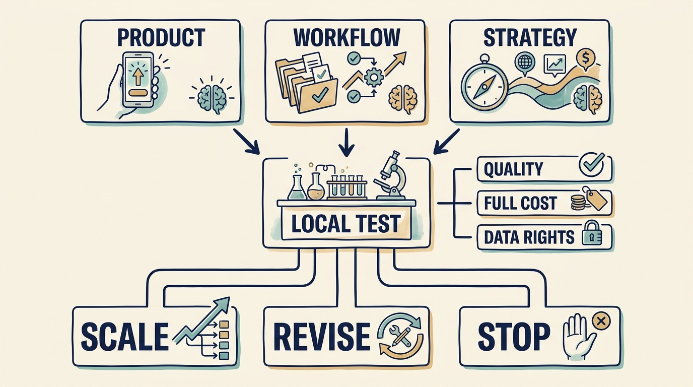

**Artificial intelligence (AI)** is software that classifies, predicts or generates content from learned patterns. When an investor asks for an “AI strategy”, the request hides **three investment questions**: a product customers will pay for, internal work that improves enough to change spending, and a substitute for the product customers already buy. Each needs its own evidence, cost, dated gate and decision. In the fictional Larkspur scenario the growth investor’s thesis assumes all three at once: a paid AI feature before the next round, lower cost per customer, and no displacement by a general-purpose assistant.

**Figure 1:** *Test the complete use case before committing to an AI benefit.*

Settle **who coordinates** first. At Larkspur, Priya holds the three questions together, Alex the shared platform and data permissions, Sam the expenditure tests. Only the two or three functions with the largest routine workflows join at first (implementation, support, finance); others when a question reaches them. A champion with protected time and authority is an option, not a seat for every function.

For the **product question**, estimate the cost per successful outcome across the complete workflow; check data rights (NIST’s generative AI profile gives a risk structure); keep a funding demonstration separate from a product commitment. [S18: NIST generative AI profile](https://nvlpubs.nist.gov/nistpubs/ai/NIST.AI.600-1.pdf) Larkspur’s paid three-customer classification pilot (€45,000, six engineer-weeks, €300 a month per customer) starts 5 October 2026, stops on 6 November if review effort is not below the four-hour baseline, and passes its 11 December release gate only with 95% sample accuracy, no missed safety-relevant document, review below 1.5 hours a week and two of three prices confirmed.

For the **internal-work question**, run an experiment that can change a decision: defined tasks, a comparison group, recorded tool versions and dates, review counted, stopping rules agreed first. **The coding evidence is mixed**: a 2022 GitHub Copilot experiment found 55.8% shorter completion times on a bounded JavaScript task; METR’s early-2025 study found experienced open-source developers 19% slower with AI allowed; METR’s February 2026 update described selection and measurement problems that make later estimates a weak guide. [S19: Peng et al., Copilot experiment](https://arxiv.org/abs/2302.06590) [S20: METR early-2025 experiment](https://metr.org/blog/2025-07-10-early-2025-ai-experienced-os-dev-study/) [S21: METR 2026 update](https://metr.org/blog/2026-02-24-uplift-update/) Saved time is capacity, not cash. Larkspur’s eight-week support pilot (€6,000, decision 27 November) rolls the tool out only if complete handling time falls 20% with the reopen rate held. Three agents 20% faster supply 6.75 agents’ capacity, not seven; the seventh hire moves from April to October 2027 only if a January rollout check holds and monthly tickets stay under 1,400, avoiding €32,000 gross and about €22,000 net of licenses, review and rollout.

For the **substitution question**, name one customer task a substitute could perform, the switching constraint, and the evidence for defending, partnering, repricing or stopping. A general assistant in a recorded configuration can draft Larkspur’s weekly maintenance schedule but has no route to dispatch it or keep the regulator’s records; five customers test it in October 2026 (€15,000), and on 15 January 2027 the paused €120,000 suggestions feature resumes or stops.

The three decisions commit €66,000 and nine engineer-weeks in the fourth quarter from the team carrying the roadmap; record tools, versions and dates so later readers know which evidence still applies.
