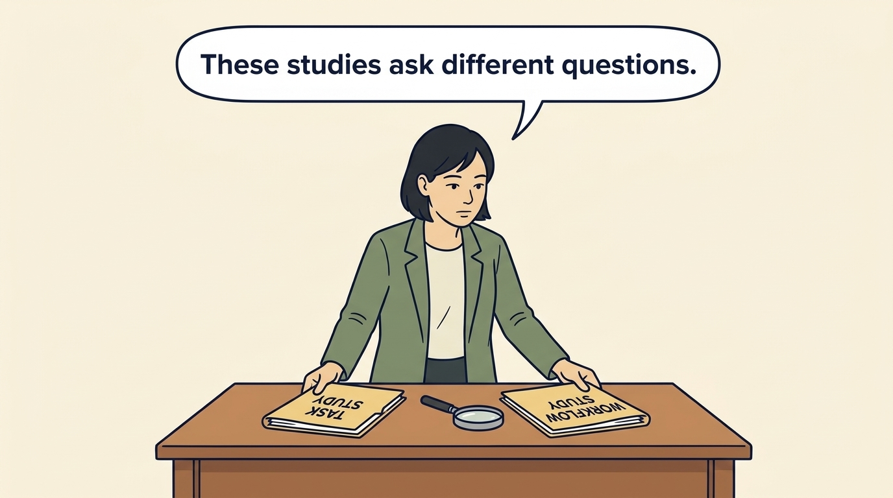
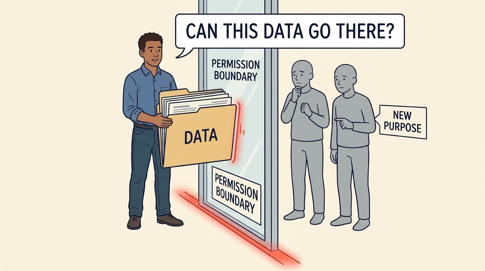

<!-- comic-style
{
  "cast": "MORGAN: a thoughtful investor technology adviser with short dark hair and a green jacket, used in the fund scenarios. ALEX: a practical CTO with curly hair and blue rolled-up sleeves. SAM: a CFO with round glasses and an amber cardigan. PRIYA: a product leader with straight dark hair and plum sleeves. INES: a CEO with short grey hair and a navy jacket. All are fictional; none represents a person in a real case.",
  "style": "Clean editorial explainer comic, dark ink outlines, restrained green, blue, and amber accents on warm white, generous space, readable short speech bubbles, expressive people and simple physical metaphors. No photorealism, logos, dense charts, or title text. Keep the same character appearances throughout the journal."
}
-->

**Comic.** Morgan is an investor’s adviser in the fund scenarios; Alex leads technology, Priya leads product, and Sam leads finance. All are fictional. Comparative scenarios use separate assumptions. Historical cases are discussed through documents; the scenes do not reenact real events.

<!-- comic-panel
{
  "id": "01-scene",
  "status": "generated",
  "asset": "assets/images/12-data-and-ai/comic-01-scene.jpeg",
  "aspect_ratio": "16:9",
  "prompt": "Panel 1 of an explainer comic. Alex receives an AI tool beside three different work problems. Use one speech bubble with the exact words: \"Which outcome are we buying?\" Convey: Artificial intelligence, or AI, can classify, predict or generate from learned patterns. Separate customer uses, internal work and possible competitive threats.",
  "alt": "Comic panel: Alex receives an AI tool beside three different work problems.",
  "caption": "Artificial intelligence, or AI, can classify, predict or generate from learned patterns. Separate customer uses, internal work and possible competitive threats.",
  "generation": {
    "model": "gemini-3-pro-image-preview",
    "reference_id": "owned-cast-20260913",
    "sha256": "e28a229e407e9f52bbcd6d477da95fb5cedb25f3cef09f420b79997c2c2b7f30"
  }
}
-->

**Panel 1:** Artificial intelligence, or AI, can classify, predict or generate from learned patterns. Separate customer uses, internal work and possible competitive threats.

*Dialogue:* “Which outcome are we buying?”

<!-- comic-panel
{
  "id": "02-scene",
  "status": "generated",
  "asset": "assets/images/12-data-and-ai/comic-02-scene.jpeg",
  "aspect_ratio": "16:9",
  "prompt": "Panel 2 of an explainer comic. Morgan compares two experiments in visibly different settings. Use one speech bubble with the exact words: \"These studies ask different questions.\" Convey: A productivity experiment describes particular people, tasks and tools. Its result is not a universal staffing rule.",
  "alt": "Comic panel: Morgan compares folders labeled task study and workflow study, with a magnifying glass between them.",
  "caption": "A productivity experiment describes particular people, tasks and tools. Its result is not a universal staffing rule.",
  "generation": {
    "model": "gemini-3-pro-image-preview",
    "reference_id": "owned-cast-20260913",
    "sha256": "8ba4c85d72259d6d399c258daf41e55afef7a157d92fce6b53f057ab52698f5d"
  }
}
-->

**Panel 2:** A productivity experiment describes particular people, tasks and tools. Its result is not a universal staffing rule.

*Dialogue:* “These studies ask different questions.”

<!-- comic-panel
{
  "id": "03-scene",
  "status": "generated",
  "asset": "assets/images/12-data-and-ai/comic-03-scene.jpeg",
  "aspect_ratio": "16:9",
  "prompt": "Panel 3 of an explainer comic. Sam checks a calendar beside an updated research note. Use one speech bubble with the exact words: \"The evidence has a date.\" Convey: Check the dates and participation conditions. Changing tools or participants can change what a study tells us.",
  "alt": "Comic panel: Sam checks a calendar beside an updated research note.",
  "caption": "Check the dates and participation conditions. Changing tools or participants can change what a study tells us.",
  "generation": {
    "model": "gemini-3-pro-image-preview",
    "reference_id": "owned-cast-20260913",
    "sha256": "b12d0903c8a663ec69b8ad6e96a95cbb6ca597c3edca0b6b91f303d3cfed4158"
  }
}
-->

**Panel 3:** Check the dates and participation conditions. Changing tools or participants can change what a study tells us.

*Dialogue:* “The evidence has a date.”

<!-- comic-panel
{
  "id": "04-scene",
  "status": "generated",
  "asset": "assets/images/12-data-and-ai/comic-04-scene.jpeg",
  "aspect_ratio": "16:9",
  "prompt": "Panel 4 of an explainer comic. Alex reviews a plausible output containing a subtle error. Use one speech bubble with the exact words: \"Review is part of the work.\" Convey: Include checking, correcting and using the output when measuring time, cost and quality.",
  "alt": "Comic panel: Alex reviews a plausible output containing a subtle error.",
  "caption": "Include checking, correcting and using the output when measuring time, cost and quality.",
  "generation": {
    "model": "gemini-3-pro-image-preview",
    "reference_id": "owned-cast-20260913",
    "sha256": "7ef2b0f01dc0d47e7334e741d8a220b03f066034967ba10095b1d12005d97205"
  }
}
-->

**Panel 4:** Include checking, correcting and using the output when measuring time, cost and quality.

*Dialogue:* “Review is part of the work.”

<!-- comic-panel
{
  "id": "05-scene",
  "status": "generated",
  "asset": "assets/images/12-data-and-ai/comic-05-scene.jpeg",
  "aspect_ratio": "16:9",
  "prompt": "Panel 5 of an explainer comic. A data folder stops at a permission boundary. Use one speech bubble with the exact words: \"Can this data go there?\" Convey: Being technically able to access data does not establish permission to use it for a new purpose.",
  "alt": "Comic panel: A data folder stops at a permission boundary.",
  "caption": "Being technically able to access data does not establish permission to use it for a new purpose.",
  "generation": {
    "model": "gemini-3-pro-image-preview",
    "reference_id": "owned-cast-20260913",
    "sha256": "414b8889551f7364db8a2c09b87ae55e9746be32cbe7050bed531694462b0d91"
  }
}
-->

**Panel 5:** Being technically able to access data does not establish permission to use it for a new purpose.

*Dialogue:* “Can this data go there?”

<!-- comic-panel
{
  "id": "06-scene",
  "status": "generated",
  "asset": "assets/images/12-data-and-ai/comic-06-scene.jpeg",
  "aspect_ratio": "16:9",
  "prompt": "Panel 6 of an explainer comic. Priya and Alex separate a demonstration card from a customer launch checklist. Use one speech bubble with the exact words: \"What have we actually demonstrated?\" Convey: A demonstration for a funding meeting does not establish a production-ready product. Agree the customer, reliability, data and cost evidence needed before committing to launch.",
  "alt": "Comic panel: Priya and Alex separate a demonstration card from a customer launch checklist.",
  "caption": "A demonstration for a funding meeting does not establish a production-ready product. Agree the customer, reliability, data and cost evidence needed before committing to launch.",
  "generation": {
    "model": "gemini-3-pro-image-preview",
    "reference_id": "owned-cast-20260913",
    "sha256": "a54991b2aee50434c9ebd7539845287f2f731e5b295c0e19d9f8be6870f1bdb1"
  }
}
-->

**Panel 6:** A demonstration for a funding meeting does not establish a production-ready product. Agree the customer, reliability, data and cost evidence needed before committing to launch.

*Dialogue:* “What have we actually demonstrated?”
