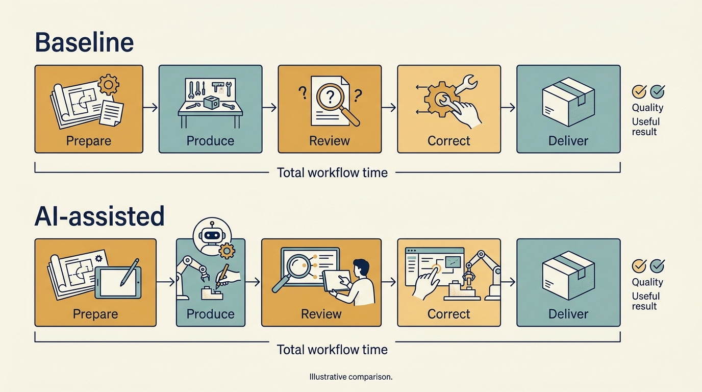

> **KEY POINTS:**
>
> * Separate **product opportunity, operating improvement and competitive threat**. Each asks a different investment question and needs its own evidence.
> * Measure the **complete workflow**. Include review, correction, data preparation and ongoing operation, so that using a tool is not mistaken for getting a useful result.
> * Keep **experimental results attached to their conditions**. Tools, tasks and participants change. Test the local effect before turning estimated time savings into a financial commitment.

 
An investor asks for an “AI strategy.” The product team sees a new customer feature, the finance team expects lower costs, and the CEO worries about a competitor replacing the product. These are three different investment questions, each needing its own evidence.

**Artificial intelligence (AI)** refers here to software that performs tasks such as classifying information, making predictions or generating content from learned patterns. **Generative AI** produces outputs such as text, images or code. An **AI model** is the component that learns patterns from data and uses them to produce predictions or other outputs. Its output needs evaluation in the task where it will be used.

The investor’s request has reasons that go beyond the product. AI can change what the company is worth, what a buyer will pay for it, and whether the investment case still holds if a competitor’s product replaces it. Product and engineering leaders are therefore being asked a valuation question dressed as a technology question, and a headline commitment can be made on the company’s behalf before the work has been examined.

Combining the three questions into a single adoption target obscures the economics. A company can use AI extensively without creating value, create value through a narrow use case, or face disruption even if its own experiments work well.

We will examine customer uses first, then the data they require, evidence about internal productivity, and possible threats to the existing product. The value chain from [[product-value]] and the uncertainty discussed in [[security-and-resilience]] remain useful throughout.

Product and engineering leaders should separate the questions and attach each to evidence, cost and a decision. An investor’s adviser can help, with the role and information boundaries explained in [[technology-principal]]. The analysis in this chapter is dated September 2026; the cited experiments describe particular earlier tools and populations.

## Start With the Customer's Work

Suppose customers spend hours classifying incoming documents before scheduling maintenance. An AI-assisted workflow could save time, but the product value depends on error costs, review effort, and how the output enters the customer's process.

The evaluation should compare the complete workflow with the current alternative. How many cases need correction? Which errors are difficult to detect? Does the customer trust the output enough to act? Is the new workflow faster after review and exception handling? Would the customer pay for it, and what would it cost to serve them?

Model cost per successful outcome rather than cost per model request alone. Include evaluation, human review, data preparation, monitoring, support, and fallback operations. **Inference** means running a trained AI model to produce an output. A low bill for those requests can coexist with expensive review, mistakes and little customer benefit.

**Figure 1:** *Separate the investment questions before choosing an experiment or making a commitment.*

## Data Can Be an Asset, a Constraint or a Liability

A large dataset does not automatically give the company an advantage that competitors will struggle to copy. Ask whether the company has rights to use it for the proposed purpose, whether it represents the relevant population, and whether its quality and update process support the task. Customer trust and contractual restrictions can matter as much as technical availability.

Separate access from ownership and training rights from other processing rights. A company that can display information to a user may not have every right needed to reuse it in a different AI service. Specialist review should resolve actual contractual and legal questions.

In its 2024 Generative AI Profile, the US National Institute of Standards and Technology (**NIST**) identifies risks and suggested management actions across the AI lifecycle. It is a voluntary framework reference, not evidence that a particular product is compliant or effective. [S18: NIST generative AI profile](https://nvlpubs.nist.gov/nistpubs/ai/NIST.AI.600-1.pdf) Its practical contribution here is to make evaluation and risk management part of the product investment rather than an afterthought.

## Productivity Evidence Comes With Its Conditions

A **controlled experiment** compares outcomes under different conditions, such as doing a task with and without a tool. An experiment conducted in 2022 and published by Peng and colleagues in 2023 asked developers to build a small **server**, software that receives and answers web requests, in the JavaScript programming language. Among participants who completed the task, those given access to GitHub Copilot, an AI coding assistant, took 55.8% less time on average. The result supports a claim about that experimental task; it does not establish an equivalent reduction in a company's engineering budget. [S19: Peng et al., Copilot experiment](https://arxiv.org/abs/2302.06590)

**METR**, an AI evaluation research organization, conducted an early-2025 **randomized study**, assigning tasks to conditions by chance. It examined experienced developers working on their own **open-source projects**, software whose licenses allow others to use, change and share the code. Tasks took 19% longer when AI was allowed. That result concerns a different population, setting, and tool period. [S20: METR early-2025 experiment](https://metr.org/blog/2025-07-10-early-2025-ai-experienced-os-dev-study/)

In February 2026, METR reported that its later experiment had serious selection and measurement problems: developers and tasks likely to benefit from AI were increasingly excluded, and using several AI agents at once—systems carrying out tasks on a user’s behalf—complicated time measurement. The researchers considered the new data a weak guide to the size of current productivity effects. [S21: METR 2026 update](https://metr.org/blog/2026-02-24-uplift-update/)

These studies are not competing universal laws. Their differences show why context, task selection, tool version, and outcome definition belong in an investment decision. A favorable coding result is also only one part of delivery: product decisions, review, testing, integration, release, and customer adoption can become the limiting steps.

## Separate a Funding Demonstration From a Product Commitment

In a fictional Larkspur funding round, an investor wants an AI demonstration before the next meeting. Priya and Alex can agree a bounded demonstration while recording what it does not yet establish: customer demand, reliable performance, permission to use production data and the full cost of serving customers. The financing conversation should not silently convert the demonstration into a promised launch.

Under an expansion plan, the test changes to whether the use case works repeatedly across customers and their different data. A corporate investor may offer a valuable dataset while also seeking access to the company’s customer information. Treat each direction of access as a separate decision with a defined purpose, authority and operating responsibility.

The leader’s commitment should state which question the experiment answers and **which decision follows a positive, negative or uncertain result**. If the investor expects a staffing reduction, test the complete workflow and **the feasible change in expenditure** before including a saving. A funding narrative cannot supply the evidence missing from the operating case.

## Run an Experiment That Can Change a Decision

Define the proposed economic mechanism before buying licenses or promising savings. Perhaps the company wants to reduce time spent on routine support responses, accelerate a specific migration, or improve the quality of product discovery. Different goals need different measures.

Choose a clearly defined group of tasks and participants, and a credible comparison. Record task type, experience, tool and model version, time period, and quality criteria. Include the cost of reviewing output and correcting errors. Track whether the experiment changes what work people choose, because task substitution can make a simple before-and-after comparison misleading.

Predetermine what would justify continuation, expansion, redesign, or stopping. If quality falls below the product's requirements, a faster completion time is insufficient. If the team produces more useful work at the same cost, the result may be valuable even without reducing the number of employees.

A pilot should also reveal the operating burden. Who updates evaluations when the model changes? Who handles **regressions**, cases where an update makes previously acceptable behavior worse? What happens when the provider is unavailable or changes commercial terms? A product capability needs an owner beyond the enthusiastic initial demonstration.

**Figure 2:** *Measure the complete local workflow and its output before converting a task result into a financial promise.*

## Explain How Saved Time Will Be Used

Suppose, fictionally, an intervention saves 1,000 hours of recurring work a quarter. The company still pays the same employees. The result is capacity, subject to the quality of the measurement. It becomes cash savings only through a further operating change, such as reducing external spending or avoiding planned hiring. It becomes revenue only if the capacity enables work customers buy.

The investment case should state which route is intended. Announcing an engineering reduction before demonstrating the mechanism can remove the expertise needed to capture any benefit and evaluate the output. That is an execution risk to test, not a claim that staffing can never change.

## Assess the Threat to the Product You Already Sell

AI might make a feature easier for competitors to reproduce, reduce the customer's need for a workflow, or shift value toward a different interface. These are scenario hypotheses. They require customer evidence and a view of **switching costs**, the money and effort needed to move to another product, as well as access to customers, trust and the full task being performed.

A product's advantage may lie in reliable execution, specialized knowledge, regulatory integration, customer relationships, or embedded workflow rather than the difficulty of generating code. Conversely, an existing customer base does not guarantee that a new interface will preserve the company's role.

The product leader’s market work, supported by the investor’s adviser where useful, should therefore test both opportunity and substitution. What would a new entrant need to replace the product's useful outcome? What would customers lose or gain? Which experiments can the company run before a threat becomes an urgent revenue problem?

Assess an AI investment through the complete task: what improves, how quality is checked, what the workflow costs and who maintains it as the technology changes. Record the tools and dates so that later readers know which evidence still applies.

Even a useful tool depends on people who can evaluate, operate and improve it. The next chapter examines the organization needed to sustain technology work: [[people-and-operating-models]].
