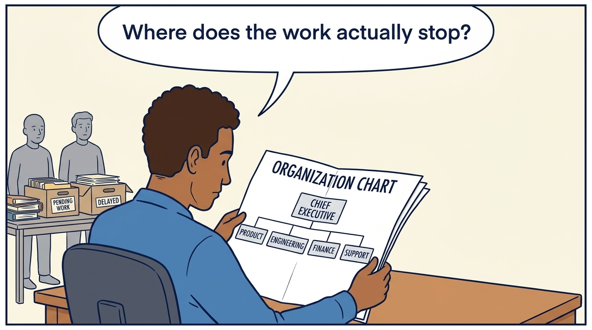
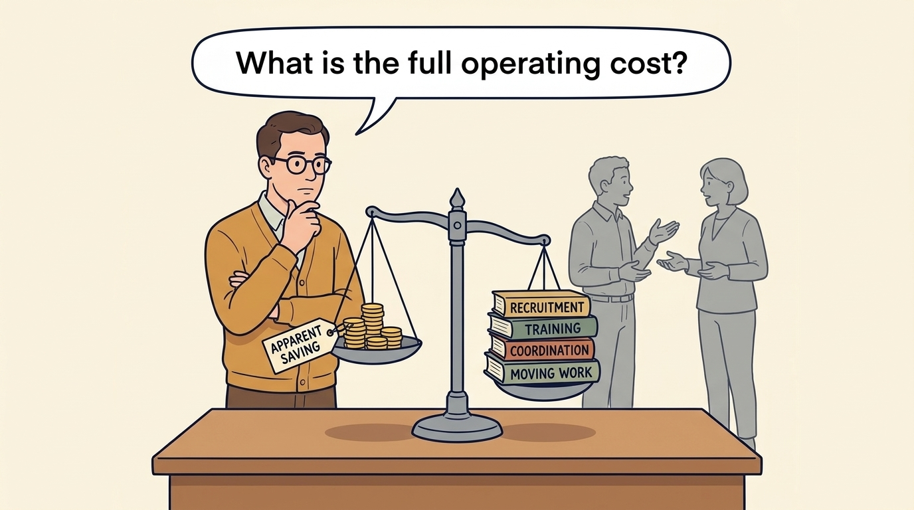
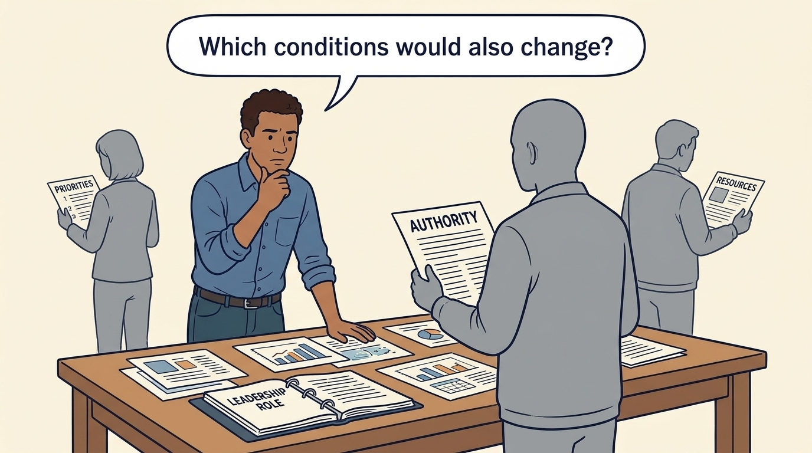
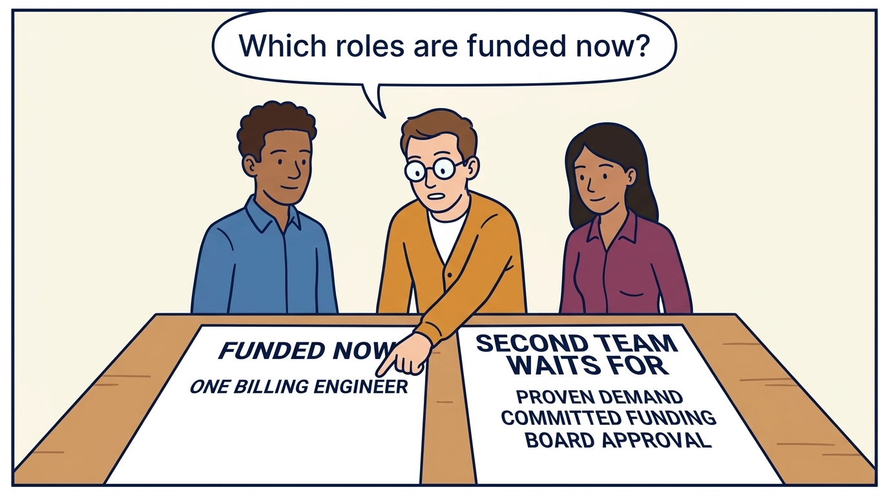

<!-- comic-style
{
  "cast": "MORGAN: a thoughtful investor technology adviser with short dark hair and a green jacket, used in the fund scenarios. ALEX: a practical CTO with curly hair and blue rolled-up sleeves. SAM: a CFO with round glasses and an amber cardigan. PRIYA: a product leader with straight dark hair and plum sleeves. INES: a CEO with short grey hair and a navy jacket. All are fictional; none represents a person in a real case.",
  "style": "Clean editorial explainer comic, dark ink outlines, restrained green, blue, and amber accents on warm white, generous space, readable short speech bubbles, expressive people and simple physical metaphors. No photorealism, logos, dense charts, or title text. Keep the same character appearances throughout the journal."
}
-->

**Comic.** A plan can fund new resources, such as tools or a cheaper location, and propose a second team, without funding the management time and decision changes needed to use them. The panels follow Larkspur, a fictional company that sells scheduling software, as it traces one piece of work through its queue and lets that diagnosis decide what hiring the plan needs. Its board, the directors who oversee the company, has proposed a second product team. Nothing about that team is funded yet.

At Larkspur, Alex leads technology, Priya leads product and Sam leads finance. Morgan advises Larkspur’s investor on technology and does not make the company’s decisions. All are fictional.

<!-- comic-panel
{
  "id": "01-scene",
  "status": "generated",
  "asset": "assets/images/12-fix-decisions-before-hiring/comic-01-scene.jpeg",
  "aspect_ratio": "16:9",
  "prompt": "Panel 1 of an explainer comic. Alex sits at a desk studying a large sheet headed with the exact words ORGANIZATION CHART. The chart has only five boxes joined by lines: the top box reads CHIEF EXECUTIVE and the four boxes below it read PRODUCT, ENGINEERING, FINANCE and SUPPORT, all in large, correctly spelled capitals. No other writing, small print or scribbles on the chart or desk. Nearby, two unnamed colleagues in grey wait beside a table stacked with folders and two boxes labelled PENDING WORK and DELAYED. Alex is the speaker: the tail of the speech bubble points down to Alex’s head, not to the colleagues. Use one speech bubble with the exact words: \"Where does the work actually stop?\" Convey: An operating model describes how teams, responsibilities and decisions are arranged. Follow actual work to see where that arrangement causes delays.",
  "alt": "Comic panel: Alex studies an organization chart with five labelled boxes while two colleagues wait beside piles of pending and delayed work.",
  "caption": "An operating model describes how teams, responsibilities and decisions are arranged. Follow actual work to see where that arrangement causes delays.",
  "generation": {
    "model": "gemini-3-pro-image-preview",
    "reference_id": "owned-cast-20260913",
    "sha256": "c866b2dcb70041b56e773ae02052f88a1001580eb59515576e0c312e1e33ff96"
  }
}
-->

**Panel 1:** An operating model describes how teams, responsibilities and decisions are arranged. Follow actual work to see where that arrangement causes delays.

*Dialogue:* “Where does the work actually stop?”

<!-- comic-panel
{
  "id": "02-scene",
  "status": "generated",
  "asset": "assets/images/12-fix-decisions-before-hiring/comic-02-scene.jpeg",
  "aspect_ratio": "16:9",
  "prompt": "Panel 2 of an explainer comic. Morgan follows a request to one overloaded expert. Use one speech bubble with the exact words: \"Knowledge has become a dependency.\" Convey: Capacity includes knowledge and context. If every difficult question needs one expert, adding people may not remove the delay.",
  "alt": "Comic panel: Morgan follows a request to one overloaded expert.",
  "caption": "Capacity includes knowledge and context. If every difficult question needs one expert, adding people may not remove the delay.",
  "generation": {
    "model": "gemini-3-pro-image-preview",
    "reference_id": "owned-cast-20260913",
    "sha256": "a0ad4de7ea1bb34da01aacd203f8b6d7cff764f9fe0e67de57e36d022c4179b7"
  }
}
-->

**Panel 2:** Capacity includes knowledge and context. If every difficult question needs one expert, adding people may not remove the delay.

*Dialogue:* “Knowledge has become a dependency.”

<!-- comic-panel
{
  "id": "03-scene",
  "status": "generated",
  "asset": "assets/images/12-fix-decisions-before-hiring/comic-03-scene.jpeg",
  "aspect_ratio": "16:9",
  "prompt": "Panel 3 of an explainer comic. Sam, a man with short close-cropped brown hair, round glasses and an amber cardigan, stands behind a desk on which a balance scale rests. The left pan carries a small stack of coins with a tag reading exactly APPARENT SAVING. The right pan hangs lower and carries four stacked books whose spines read exactly RECRUITMENT, TRAINING, COORDINATION and MOVING WORK. Two unnamed colleagues in grey talk in the background. No other writing anywhere. Use one speech bubble with the exact words: \"What is the full operating cost?\" Convey: A team that appears cheaper than the current supplier may bring recruitment, coordination, training and transition costs that offset the saving.",
  "alt": "Comic panel: Sam studies a balance scale on which a few coins tagged “Apparent saving” are outweighed by books labelled Recruitment, Training, Coordination and Moving work.",
  "caption": "A team that appears cheaper than the current supplier may bring recruitment, coordination, training and transition costs that offset the saving.",
  "generation": {
    "model": "gemini-3-pro-image-preview",
    "reference_id": "owned-cast-20260913",
    "sha256": "f529f521d773b138ac1b62653b831a8077446d11887424be076358e87337d7a5"
  }
}
-->

**Panel 3:** A team that appears cheaper than the current supplier may bring recruitment, coordination, training and transition costs that offset the saving.

*Dialogue:* “What is the full operating cost?”

<!-- comic-panel
{
  "id": "04-scene",
  "status": "generated",
  "asset": "assets/images/12-fix-decisions-before-hiring/comic-04-scene.jpeg",
  "aspect_ratio": "16:9",
  "prompt": "Panel 4 of an explainer comic. Alex considers a leadership change beside unclear authority. Use one speech bubble with the exact words: \"Which conditions would also change?\" Convey: Before replacing a leader, state a testable hypothesis: what new leadership must enable, and what evidence shows the company cannot do that today. If the conditions are changed and the leader does not use them, the evidence supports added leadership with authority, or replacement. The same test decides whether an investor-proposed appointment is the answer.",
  "alt": "Comic panel: Alex considers a leadership change beside unclear authority.",
  "caption": "Before replacing a leader, state a testable hypothesis: what new leadership must enable, and what evidence shows the company cannot do that today. If the conditions are changed and the leader does not use them, the evidence supports added leadership with authority, or replacement. The same test decides whether an investor-proposed appointment is the answer.",
  "generation": {
    "model": "gemini-3-pro-image-preview",
    "reference_id": "owned-cast-20260913",
    "sha256": "ee5580114d59ead5ec157fd0e9134629e6b58083c82e731c80cfbfb31936b067"
  }
}
-->

**Panel 4:** Before replacing a leader, state a testable hypothesis: what new leadership must enable, and what evidence shows the company cannot do that today. If the conditions are changed and the leader does not use them, the evidence supports added leadership with authority, or replacement. The same test decides whether an investor-proposed appointment is the answer.

*Dialogue:* “Which conditions would also change?”

<!-- comic-panel
{
  "id": "05-scene",
  "status": "generated",
  "asset": "assets/images/12-fix-decisions-before-hiring/comic-05-scene.jpeg",
  "aspect_ratio": "16:9",
  "prompt": "Panel 5 of an explainer comic. Employees point out a recurring handoff failure. Use one speech bubble with the exact words: \"Listen where the work happens.\" Convey: Ask employees about repeated delays and lost information. Their observations may explain what a report misses.",
  "alt": "Comic panel: Employees point out a recurring handoff failure.",
  "caption": "Ask employees about repeated delays and lost information. Their observations may explain what a report misses.",
  "generation": {
    "model": "gemini-3-pro-image-preview",
    "reference_id": "owned-cast-20260913",
    "sha256": "839d762a4fdb8a439c029add7cdf90eea8e29271a07cd6b232e467f4262cbaad"
  }
}
-->

**Panel 5:** Ask employees about repeated delays and lost information. Their observations may explain what a report misses.

*Dialogue:* “Listen where the work happens.”

<!-- comic-panel
{
  "id": "06-scene",
  "status": "generated",
  "asset": "assets/images/12-fix-decisions-before-hiring/comic-06-scene.jpeg",
  "aspect_ratio": "16:9",
  "prompt": "Panel 6 of an explainer comic. Alex, Sam and Priya stand behind a table, looking down at two large sheets of paper that lie side by side facing the viewer. The left sheet has the heading FUNDED NOW and one line below it: ONE BILLING ENGINEER. The right sheet has the heading SECOND TEAM WAITS FOR and three lines below it: PROVEN DEMAND, COMMITTED FUNDING, BOARD APPROVAL. Sam points at the left sheet. These are the only words on any prop, in large, correctly spelled capitals. Nobody holds a labelled paper and there are no background people. Use one speech bubble with the exact words: \"Which roles are funded now?\" Convey: The hire changes shape. One billing engineer is funded now. The proposed second team waits for three things: proven demand in the second country, committed funding from the next round (the next time Larkspur raises money from investors) and the board’s approval of the roles. Committed means investors have signed an agreement to provide the money, subject to its terms; the money itself has not yet arrived. Explain the same conditions to investors and teams.",
  "alt": "Comic panel: Alex, Sam and Priya look at two sheets. One reads “Funded now: one billing engineer”. The other reads “Second team waits for: proven demand, committed funding, board approval”.",
  "caption": "The hire changes shape. One billing engineer is funded now. The proposed second team waits for three things: proven demand in the second country, committed funding from the next round (the next time Larkspur raises money from investors) and the board’s approval of the roles. Committed means investors have signed an agreement to provide the money, subject to its terms; the money itself has not yet arrived. Explain the same conditions to investors and teams.",
  "generation": {
    "model": "gemini-3-pro-image-preview",
    "reference_id": "owned-cast-20260913",
    "sha256": "cb053af5f8564283ba910a1b78be650fae066c000169773fe8c8a701879cd67d"
  }
}
-->

**Panel 6:** The hire changes shape. One billing engineer is funded now. The proposed second team waits for three things: proven demand in the second country, committed funding from the next round (the next time Larkspur raises money from investors) and the board’s approval of the roles. Committed means investors have signed an agreement to provide the money, subject to its terms; the money itself has not yet arrived. Explain the same conditions to investors and teams.

*Dialogue:* “Which roles are funded now?”
