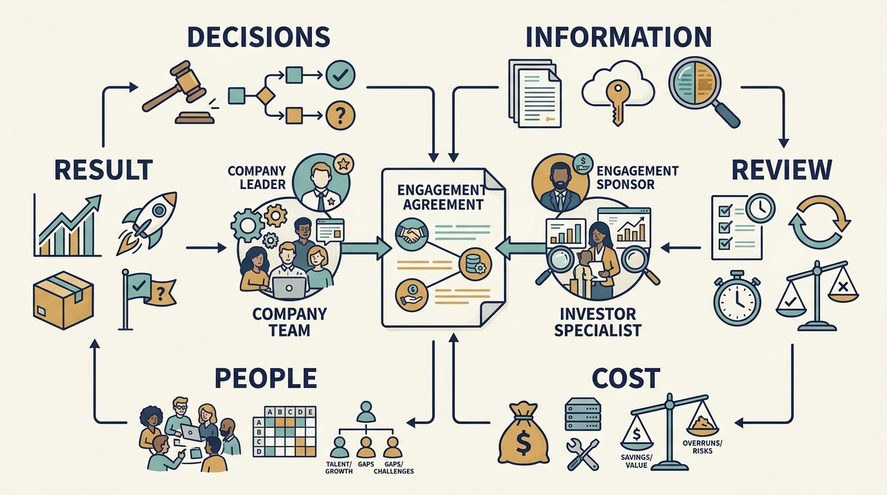
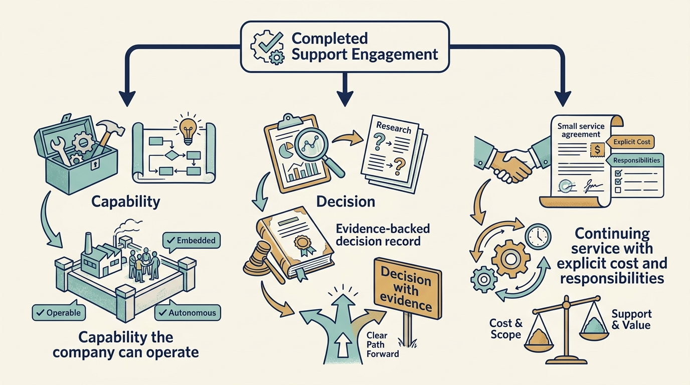

> **IN THIS SECTION, YOU WILL:** Learn to turn a request for help into a charter with resources, authority, evidence and a review date, then carry it through a scope change to a tested handover.

> **WHY INVESTORS CARE:** Investor specialists are scarce, and their time is shared across a **portfolio**: all the companies the investment firm has money in. A completed charter focuses their time on the one constraint holding a company back, and it leaves evidence the investor can use to decide on funding, staffing or exit.

> **WHY YOU SHOULD CARE:** Without a written charter, specialists repeat the same interviews, give competing advice and deliver nothing the company can use. A completed charter names the result, the owner and the review date, so when the evidence points to a different problem, the team can redirect the remaining days instead of finishing work that no longer matters.

> **KEY POINTS:**
>
> * Agree **what the help should change** and write it down: the result, the accountable company leader, the investor-side sponsor, resources on both sides, who directs the work, what the findings are for, the review date and the handover test.
> * **External help consumes internal time.** Ten specialist days, capped at €15,000, need six engineering days, two customer-team sessions and the product leader’s review; without those, the specialist’s availability does not make the engagement feasible.
> * **Let the review change the work.** When evidence shows a different constraint, the charter says who may redirect the remaining days, which work stops and whether the budget still fits. The engagement ends with a capability, a decision or an understood continuing service.

> **[DYSFUNCTIONS THIS SECTION ADDRESSES](where-investment-goes-wrong.html):**
>
> * **Borrowed Brains** — Builds learning and a tested handover, or an understood continuing service, into the assignment.
> * **The Accidental Gatekeeper** — Records who directs the work and who may authorize a change in its scope.
> * **The Ratchet Roadmap** — Budgets the company’s own time and names the work that stops when the engagement changes.

 
The previous chapter, [[choose-right-help]], ended with Rotaline's one-sentence request for help. That request chose **where the help comes from**, but it left four things open: **which days** the implementation specialist works, what customer and company **information they may see**, **who directs** their work, and how the **engagement ends**. Unsettled, these let the engagement drift, so this chapter settles each one.

Rotaline, the fictional software company this book follows, sells scheduling software. Every new customer must be **onboarded**: set up on the software and made ready to use. Today one employee, Rotaline's **implementation specialist**, does most of that work, configuring each new customer by hand. If that person is away or leaves, no new customer can be set up, so new customers wait and Rotaline's revenue from them is delayed. (Two later chapters, [[assess-capability]] and [[scale-the-team-up]], show how to find and measure such a dependence; this chapter takes it as given.)

The help Rotaline chose is an **outside specialist**: a person from the investment firm's own team, lent to Rotaline for a few weeks to turn its hand-built customer setup into a repeatable process. If the setup stays repeatable, onboarding no longer stops when one employee is away or leaves. This chapter introduces two specialists. The *implementation specialist* is Rotaline's own employee, the single point of dependence the company wants to reduce. The *outside specialist* is the temporary help brought in to reduce it.

But suppose Rotaline brought the specialist in with **nothing agreed**. Two weeks later, the outside specialist might have interviewed the same engineers three times. The customer team would still not know what would change or who was paying for the work. The request named a person but never defined the work, so nobody could say what the specialist was there to do, or when it was done.

This chapter follows what Rotaline does instead: it **agrees the work before the specialist's first day**. The agreed work is called an **engagement**, meaning the specialist's purpose, who takes part, and what is in and out of scope. Rotaline writes it down in an **engagement charter**, a short document that everyone can check. With it, the specialist knows what to do and when the work is finished, and the customer team knows what will change and who is paying.

The outside specialist is employed by the investment firm and reports to it, not to Rotaline. Before work starts, agree **who can direct the assignment** and how the firm's reporting line fits Rotaline's priorities. Without that agreement, the specialist could get **conflicting instructions** from the firm and from Rotaline's own leaders, and no one would know which to follow. Unclear authority is not unique to investors: work sponsored inside a company can also suffer from **conflicting executive sponsors**. But an investor adds a second reporting line, and its suggestions carry extra weight. That is why the charter names who directs the work and what the specialist's findings are for.

## Setting Up the Example: Request, Dates and Budget

The example starts from that request:

> “Ask for a specialist to work alongside our engineer for six weeks and help our customer team turn one setup path into a repeatable process, one that works on actual customer setups. Priya will judge success by customer outcomes.”

Priya is Rotaline’s product leader, and she will judge the success of the request. Three conventions make the example easier to follow: how the chapter counts **dates**, **money**, and **engineering time**. Each is defined below, so you can read every figure the same way.

**Dates.** The chapter uses **two clocks**. The first counts the days from the board meeting. **Closing** is the day the investment legally completes. Within days of closing, the **board** (the directors who oversee the company and approve its major spending) met and adopted a plan for the first hundred days. That meeting is **day 0**. The second clock counts **engagement weeks**. It starts on day 21, when the outside specialist arrives, so week 1 begins then. Every date in the chapter appears on both clocks, so you can place each event whichever way you count.

**Money.** Each euro moves through three stages, and the same spending is counted differently at each one:

- It is **committed** when the board authorizes it. The board authorized €180,000 for the onboarding pilot. This is a spending ceiling: nobody may spend beyond it without returning to the board.
- A cost is **incurred** when the work has been delivered, whether or not the bill has been paid. By day 100, the pilot has received roughly €90,000 of work, so about half of the committed amount is now a real obligation.
- Cash is **paid** when the money leaves the bank, which may be later still. Money can be committed and even incurred without having been paid yet.

The €15,000 of specialist fees in this chapter is already counted in the roughly €90,000 of work received by day 100. Do not add it on top: doing so would count the same money twice and overstate the pilot's spending against its €180,000 budget.

**Engineering time.** The board also approved **12 engineer-weeks** for the pilot, the most engineering effort it may use without going back to the board. An engineer-week is one engineer working for one week. An **engineer-day** is one engineer working for one day, so five engineer-days make one engineer-week, and 12 engineer-weeks equal 60 engineer-days. These units measure working time, not calendar time: two engineers working for half a week also make one engineer-week.

The pilot's tracking code in the plan is **ONB-1**, and this chapter uses it as the pilot's short name. The example is fictional and uses the same Rotaline figures as the rest of the book.

## Start From the Request

The request already names what the company must do differently: run one setup path without Rotaline's implementation specialist. State which of the four kinds of assignment this is: **diagnose** the problem, **recommend** options, **implement** a change, or **teach** the company to do the work. This one implements and teaches. A diagnostic review would end with a decision, but an implementation needs resources to deliver and test the change, so the charter must name those resources.

Agree on what the assignment will **not cover**. Making one setup path repeatable doesn't authorize redesigning the company's wider onboarding process or assessing individual performance. If the useful scope changes, the charter names who agrees to the new purpose and resources. Whoever happens to be in the room doesn't get to decide.

## The Charter for the Onboarding Pilot Support

The fields are the same for any engagement; the entries are Rotaline's. **Priya** leads product and is accountable for the pilot's result. **Alex**, Rotaline's chief technology officer, is the senior leader for technology and controls the engineers' time. **Sam** leads finance. **Ines** is the chief executive. The outside specialist is the visitor. Rotaline's implementation specialist is the employee whose manual onboarding work the pilot aims to make unnecessary, and the pilot does not assess that person's performance.

| Field | Agreed for the ONB-1 pilot support |
| --- | --- |
| Company need | Onboarding one new customer depends on Rotaline’s implementation specialist working by hand. This was written up before the investment as **diligence finding D-3** — *diligence* is the investigation an investor runs before putting money in, and D-3 is just the reference number of one thing it found. Each onboarding takes about 80 hours in the sampled cases. That 80 hours is the whole job, not the typing: **manual configuration** (entering one customer’s settings by hand — their sites, shift patterns, pay rules and user accounts) plus cleaning up the customer’s data, running sessions with them and redoing whatever comes back wrong. The operating plan assumes the company will onboard **1.5× the current volume** — half as many customers again, for example 150 a year in place of 100 — with the same implementation team. Those two round numbers are the planning model’s illustration of the multiplier in the chapter [[test-revenue-assumptions]], not Rotaline’s measured workload; the measured records cover twelve onboardings in the previous six months. |
| Useful result | One standard **setup path** — a written, repeatable sequence of steps for one defined type of customer — that a Rotaline engineer and the customer team can run without the implementation specialist, tested on new customers in the pilot **cohort**, the named group of customers the trial follows. |
| Accountable company leader | Priya, product leader. She directs the outside specialist’s day-to-day work and assesses customer outcomes. |
| Investor-side sponsor | The **partner** — a senior person at the investment firm — responsible for the firm’s investment in Rotaline, who secures the specialist’s days and resolves availability problems. Morgan, the firm’s technology adviser, introduced the specialist and is not the sponsor. |
| Support and resources | Ten outside-specialist days over six weeks, from day 21 to about day 63. Six days of one Rotaline engineer, one day a week, recorded against ONB-1’s own twelve engineer-weeks as 1.2 of them. The engineer is the one who would otherwise have been on the customer-portal research; that research keeps its separate two engineer-weeks and starts later in the period instead. Two customer-team sessions. Two hours a week of Priya’s time. |
| Funding | Specialist days charged to Rotaline at a capped €1,500 a day: ten days, €15,000 at most, paid from the ONB-1 budget (€180,000 committed) and counted inside the pilot’s spending, not added to it. Sam confirms the fit and that no **reserve** is touched — the reserve is the part of the board’s money and engineering time held back for problems nobody has found yet, and only the board can release it. No implementation spending beyond the engineer’s time is assumed. |
| Authority | The outside specialist recommends. Priya decides what the path includes. Alex approves changes to the **product code**, the software itself. A change of scope needs Priya and the investor-side sponsor; a change of budget goes to the board; disagreement goes to Ines, the chief executive. |
| Information | Access to the pilot cohort’s customer records under Rotaline’s data obligations. Interviews are scheduled once, with the engineer present, and their purpose is stated. Findings go to Priya, Alex and the sponsor as pilot evidence, not as assessments of individuals. |
| Initial evidence | A **baseline** — the starting measurement everything later is compared against — taken from actual customer records by day 20, the day before the outside specialist starts: hours per setup, customer waiting time, errors and support requests, reconstructed from the twelve onboardings of the previous two **quarters**, a quarter being a three-month reporting period, so the previous six months. |
| Scope boundary | One setup path, one country, the pilot cohort of new customers. Reusable settings for the less common variations *within* that customer type — a customer with several sites on different shift patterns, say — are inside the path and inside this assignment. What is outside it: a second setup path for a genuinely different customer type, a company-wide process redesign, an assessment of individual performance. |
| Review | Engagement week six, about day 63. Priya, Alex and the sponsor decide to end, extend or change the engagement on early cohort effort, customer waiting time and the handover test. The full cohort of eight customers is measured at day 90 and read at the day-100 board review. |
| Handover test | The Rotaline engineer and one customer-team member complete a new customer’s setup on the path with the outside specialist observing only. |

The **investor-side sponsor** is the person at the investment firm who backs the engagement. In this charter, that is the partner. The sponsor secures the agreed support, such as the specialist's days, and resolves availability problems. The **accountable company leader** is the person at the company who answers for the operating result. Here, that is Priya, and she stays responsible unless the company formally assigns someone else. Keeping the two labels separate means a reader adapting the charter for a company sponsor or a corporate parent knows which role each field refers to, and does not have to guess.

The specialist's access to customer records is listed, each interview has a stated purpose and an engineer present, and the customer team knows on day one what will change and who is paying. [Tool 4](toolkit.html#tool-4) in the [[toolkit]] provides a reusable version. Its value comes from **settling these questions before the work starts**, not from filling in every field. Unsettled, they surface mid-engagement as delays, mistrust, or cost disputes.

**Figure 1:** *Make the practical conditions of the help concrete before the engagement consumes time.*

## Give the Company Time to Use the Help

**External expertise consumes internal time.** Consultants need staff to explain the situation, supply evidence, review options and take responsibility for what changes. That work has a cost: the charter's six engineer-days are time the engineer will not spend on other work. The plan must say which work gives up those days, or the same days will be promised twice.

The engineer is the one Alex had assigned to the **customer-portal research**, a small study of what a customer-facing website should offer, funded so the company could decide later whether to build one. The first-hundred-days plan gave that research two engineer-weeks and €20,000, and gave the pilot twelve engineer-weeks. The six days are pilot work, so they count against the pilot: 1.2 of ONB-1's twelve engineer-weeks, leaving 10.8. The research keeps its own two weeks and its day-100 decision date. What it loses is priority: it starts later and reports closer to the deadline. Nothing is counted twice, and the plan adds no engineering capacity. That is the honest version. The dishonest version leaves both allocations looking untouched, then discovers in week five that one engineer was promised to two things.

Agree specialist fees and implementation funding separately where they differ. "The specialist is included" doesn't say who pays for a supplier, new software or the company's extra work. Rotaline's charter charges the six engineer-days to ONB-1, the pilot. That makes the cost visible against the pilot budget and comparable with the **fallback**: the route the company would take if the preferred one failed, here an independent specialist hired on the open market. The costs below are the fictional caps from the sourcing comparison in [[choose-right-help]], repeated so you can check the charter against the choice:

| Route | Fictional cost | Charged to | Company effort |
| --- | --- | --- | --- |
| Peer conversation | None beyond time | — | Half a day of preparation |
| Investor’s outside specialist | Capped at €1,500 a day; ten days = €15,000 at most | ONB-1 (€180,000 committed); sits inside the roughly €90,000 of work the pilot has received by day 100 | Six engineer-days and two customer-team sessions. At the planning rate of €75 an hour — pay plus the other costs of employing someone — over eight-hour days, that values the six days at about €3,600 of staff time the company is already paying for: capacity, not extra cash |
| Independent specialist | Rate and availability not yet quoted; both are confirmed with the provider. **References** — conversations with previous clients about the quality of the work — are checked separately and cannot confirm the price. For comparison only, the same €15,000 cap for ten days, plus selection time | ONB-1 | The same, plus selection |
| Permanent implementation specialist | About €150,000 a year for each one, every year, on the cost basis in [[test-revenue-assumptions]]; the diligence response costed two such hires at €300,000 a year | The **operating budget** — the plan for the company’s ongoing running costs — not ONB-1 | Recruiting them, introducing them to the work and managing them |

Cutting days is fine only if the assignment still delivers something usable. Say the investor's specialist drops from ten days to five. If the promised outcome stays the same, the agreement becomes less credible, not cheaper, because nobody believes the work can be done in half the time. The **cut only counts if the scope shrinks with it**, and the agreement says what the smaller assignment will deliver.

## Week Three: the Evidence Changes the Problem

The baseline arrives on day 20 as agreed, the day before the outside specialist starts. It is reconstructed from the implementation specialist's own time records for the twelve onboardings over the previous six months. It already shows configuration taking under half of the 80-hour setup, with data cleaning as the largest remaining share. The charter still targets the setup step because this split comes from old records, not from anyone watching onboardings as they happened. Until **live work confirms it**, we can't yet treat data cleaning as the real bottleneck.

By engagement week three, about day 40, the engineer's log of the first cohort setups on the new path confirms the baseline in live work: configuration takes less than half the hours, and much of the rest goes to work that comes before it, cleaning and reconciling the customer's records so configuration can start. A new customer might send a staff list in which forty people have no site recorded, two sites appear under three spellings, and the shift codes match no pattern the software recognizes. None of that can be configured until someone, usually with the customer, decides the right answer. So for customers with imperfect data, the quality of their data, not the configuration step, determines how long setup takes. This supports Alex's explanation in the diligence disagreement, and the pilot cohort was chosen to test it.

**Who changes the scope.** Priya proposes any change to the scope, the investor-side sponsor approves it, and Alex confirms the engineering effort it requires. The board doesn't need to approve, because the budget stays the same.

**Which work stops, and what keeps running?** The outside specialist's remaining five days were planned for templating, which means building reusable settings for the less common variations inside the agreed path. For example, a cohort customer with several sites on different shift patterns could then be set up from a template instead of from scratch. The days also covered a second session coaching the team on how to use the templates. Both stop, so the specialist's last five days will not be spent on templates or coaching. This work was within the original scope, not an expansion of it. The boundary excludes a second path for a different customer type, and these templates sit on the one path the charter already names.

Only those five days of the outside specialist's time stop. The company's wider commitment to templates does not. The first-hundred-days plan set aside about €90,000 of ONB-1's €180,000, payable over the two quarters after day 100, for templates covering all customer types. That programme is funded separately and owned by Priya, and it reaches beyond this engagement's one path. The specialist was never meant to deliver it, and none of it falls due within the engagement's six weeks. The scope change moves five specialist days. It neither releases nor re-commits the €90,000, so the templates budget and schedule stay as they were. If the day-100 board review decides the templates should follow the data-quality work rather than precede it, the board will decide that then, on the cohort evidence.

The five days go instead to defining a **data-intake check**: a short list of tests the customer team runs on a new customer's staff records before setup begins. The engineer's remaining days go to building automatic checks in the software for the three most common data defects: a staff record with no site, the same site spelled more than one way, and a shift code the software doesn't recognize. Each defect is then flagged when the data arrives, not discovered halfway through a setup, when fixing it means redoing work. The second customer-team session now teaches the intake check instead of template use.

**Whether the budget still fits.** Yes. The change adds no cost and needs no board approval. The engagement keeps its ten specialist days and six engineer-days. The €15,000 cap and the €180,000 ONB-1 commitment are unchanged, and that commitment still includes about €90,000 payable for the wider template programme. No extra cash is needed, and the week-six review, about day 63, stands. Because nothing changes, the board is not asked.

**Alternatives rejected.** Three options were considered and set aside. Continuing as chartered would leave customer waiting time unchanged. Extending by four weeks and eight specialist days to build a full data-quality step is premature: there is no evidence yet that the intake check works, and the extension would draw on the board's reserve. Stopping and hiring is ruled out because the board deferred hiring until the pilot reports.

**Evidence that would change it.** If the intake check shows that data defects are concentrated in a few customers rather than spread across the whole group, the remaining specialist days go back to building the setup templates. Fixing those few customers' data is then cheaper than building a data-quality step for everyone. If defects are widespread, a funded data-quality step is a board decision for the day-100 review. The board would decide on the effort split Priya measures across the full cohort at day 90 (see the chapter [[first-hundred-days]]).

## Keep the Assignment Inside the Company’s Plan

**Who may direct the work?** Direct access to engineers helps during diligence or a scoped assignment. It becomes destructive when the outside specialist, Alex (the chief technology officer), and the investment team each set their own priorities for engineers. That creates a **second line of instruction** that nobody formally authorized, and engineers end up with competing work lists and no way to know which to follow. The charter therefore names the accountable company leader, the specialist's role, and the decision boundaries, and says who revisits them if the role changes. The same applies to two helpful relationships, such as advisers from two investors: define the company's question once so that engineers maintain a single list. Some services are provided elsewhere within the owner's wider group of companies, and the company must use them and cannot simply stop using them. For these, record who has authority and which agreed route to use when the service performs poorly, costs too much, or is hard to access. The decision map is in the chapter [[clarify-authority]].

**Role and information use.** The outside specialist interviews engineers and sees customer records. The charter says those conversations are pilot evidence, not assessments of anyone. The firm may form its own view of the engineering team from what its **reporting and information rights** already give it, without asking. These are the contractual entitlements to reports and information written into the investment agreement. What the firm cannot take from this engagement is new access for that purpose. If it wants a company-sponsored assessment of the engineers, with interviews arranged for it or the specialist's pilot material used, that is a separate request, agreed with Ines and announced by the company. Otherwise engineers could find that what they said to help the pilot was used to judge them, and they would stop speaking openly. That is Rotaline's agreed arrangement, not a rule every investor is bound by. The chapter [[clarify-adviser-role]] sets out how to read those rights. People explain weaknesses more clearly when they know what the conversation is for.

**Measurement.** Fewer hours per setup frees staff time for other work; it does not save money, because Rotaline still pays the implementation specialist the same salary. The pilot covers only eight customers in one country, so its result doesn't show the effect across all customer types. Even a clear improvement can't be credited to the outside specialist alone, since the engineer's work and simpler contracts in the group may also explain it. The charter therefore records waiting time and errors alongside hours. At the day-100 board review, the day-90 cohort is compared with the baseline, not with the plan's assumption, so the board sees what actually changed. The reasoning is in the chapter [[test-revenue-assumptions]].

## Week Six Review: Hand Over the Capability, Decide, or Explain the Service

At the review, in engagement week six (about day 63), Priya, Alex and the sponsor look at three things.
**The handover test.** The Rotaline engineer and a customer-team member complete two new customers' setups on the path while the outside specialist only observes. Two setups show that this path can be handed over. They don't show that the less common variations still to be templated can be handed over, and they say nothing about how long customers wait.
**The intake check.** The customer team is running the intake check on new contracts, and its automatic checks catch the three targeted defects.
**The measures.** Hours per setup for the first-cohort customers are falling, but customer waiting time hasn't yet moved. All eight customers in the group are measured at day 90 and read at the day-100 board review.

**The decision**: the engagement ends on schedule, with no continuing specialist service. The company can now run the setup path itself. The data-quality finding goes to the day-100 board review as evidence for a funded data-quality step, and hiring stays deferred. All ten specialist days are used, and the firm sends an **invoice** (a bill asking for payment) for €15,000, within the agreed cap. Nothing else in the budget changes. The €180,000 ONB-1 commitment stands, and the roughly €90,000 for the wider template program remains payable over the two quarters following day 100. The €15,000 fee falls within the roughly €90,000 of work the pilot has received by day 100, so it adds no new cost. The board therefore faces a better decision than the plan assumed: whether to fund the data-quality step.

The calendar the two chapters share, with day 0 as the board meeting that adopted the plan, held within days of closing:

| Day | Event |
| --- | --- |
| 0 | Board adopts the plan; ONB-1 committed: €180,000 and 12 engineer-weeks |
| About 7 | Priya and Alex compare the four routes; Priya writes the request ([[choose-right-help]]) |
| By 14 | Peer conversation |
| 20 | Baseline measured from actual records: the twelve onboardings of the previous six months, about 80 hours each |
| 21 | Outside specialist starts; engagement week one |
| About 40 | Engagement week three: scope change, no cash change |
| About 63 | Engagement week six: review, handover test, engagement ends |
| 90 | Priya measures the cohort of eight |
| 100 | Board review reads the cohort; about €90,000 of ONB-1’s €180,000 received as work by then, the €15,000 among it; the other €90,000 still payable for the wider template programme |

A **handover** is the point at which the company, not the specialist, takes over the work. It passes on what the company needs to carry on alone: the remaining tasks, the operating costs, the evidence gathered and any conditions that need review later. If any of these is missing, the company inherits work it cannot finish or costs nobody budgeted for. Test the handover by having the company's own people use the result, as the charter did, rather than by sitting through a presentation.

Every engagement should end in one of three acceptable ways. The first is a **capability**: the company can now do the work itself, without outside help. The second is a **decision**: the company can now choose better, even if the choice is that the original assignment targeted the wrong constraint. The third is a **continuing service** that the company has deliberately chosen: it keeps scarce specialist help, with its cost, availability and responsibilities agreed in advance. No engagement should end with a critical dependency that nobody planned or budgeted for. If the company relies on the specialist and no one has agreed to pay for that, the work will stall when the money or the specialist is gone.

**Figure 2:** *Agree what remains useful after the initial assignment and who will sustain it.*

The charter fixes the work, resources, and handover for Rotaline's six-week assignment, but it does not cover Morgan. Morgan is the firm's technology adviser who introduced the specialist. Morgan works with Rotaline continuously and also reports to the investor. No single charter governs that role, so it is unclear whose interests Morgan serves, especially when coaching turns into assessment. The next chapter examines the adviser's assignment, influence, and reporting line: [[clarify-adviser-role]].

## Questions to Consider

1. *For the support engagement closest to you, can you fill in the charter’s twelve fields, including the investor-side sponsor and the accountable company leader, without guessing?*
2. *Where do the internal days come from, and what work has been stopped to release them?*
3. *If the first evidence showed a different constraint, who could redirect the remaining days, and would the budget still fit?*
4. *At the last review you held, did the engagement end with a demonstrated capability, a changed decision or a continuing service someone agreed to fund?*

## To Probe Further

- **[Consulting Is More Than Giving Advice](https://hbr.org/1982/09/consulting-is-more-than-giving-advice)** — Arthur N. Turner, Harvard Business Review, 1982. *Its eight purposes of a consulting assignment are the shortest way to sharpen the post's choice between diagnosing, recommending, implementing and teaching.*
- **[Flawless Consulting: A Guide to Getting Your Expertise Used](https://www.wiley.com/en-us/Flawless+Consulting:+A+Guide+to+Getting+Your+Expertise+Used,+4th+Edition-p-9781394177301)** — Peter Block, Wiley, 4th edition, 2023. *Its contracting chapters show what a competent adviser expects to agree before starting, which is the post's engagement charter of wants, roles, deliverables and success criteria seen from the specialist's side.*
- **[Helping: How to Offer, Give, and Receive Help](https://books.google.com/books/about/Helping.html?id=uqin8fGXfJIC)** — Edgar H. Schein, Berrett-Koehler, 2009. *It explains why offered help fails when nobody has said what kind of help is wanted, the gap the post's engagement charter is meant to close.*
- **[The Secrets of Consulting: A Guide to Giving and Getting Advice Successfully](https://www.dorsethouse.com/books/soc.html)** — Gerald M. Weinberg, Dorset House, 1985. *Its rules on why advice is resisted and when to stop bear directly on the post's review step and on changing or ending help that does not fit.*
