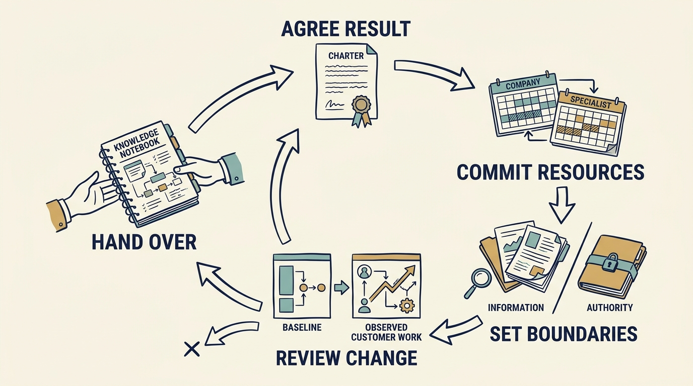

An **engagement** is an agreed piece of support with a purpose, participants and boundaries. An **engagement charter** records that agreement, before work starts.

**Figure 1:** *Make support feasible, reviewable and sustainable after the engagement.*

**The problem.** Larkspur, a fictional software company, depends on one employee — its implementation specialist — to set up each new customer by hand, about 80 hours per customer of data cleaning, configuration, customer sessions and rework. Its investor offers a different person: an **outside specialist**, lent from the firm for a few weeks. The offer names someone but not the work. Accepted unchanged, it could waste two weeks on repeated interviews. Larkspur agrees the work first.

**The agreement: who is responsible.** The result: one repeatable setup path that a Larkspur engineer and the customer team can run without the implementation specialist. Priya, who leads product, directs the work and is accountable for the outcome. A **partner** — a senior person at the investment firm — sponsors it from the investor side and secures the days. Alex, the technology leader who runs the engineers, approves any change to the software. Larger money decisions go to the **board**, the directors who oversee the company and approve its major spending.

**The agreement: resources and evidence.** Ten outside-specialist days over six weeks, six days of a Larkspur engineer, two customer-team sessions and two hours a week of Priya’s time. The fee is capped at €1,500 a day, €15,000 in total, paid from money already set aside for the customer-setup trial, not added to it. The engineer’s six days come from the trial’s engineering time; the engineer’s earlier task starts later. Days count from day 0, when the board adopted the company’s plan; the specialist starts on day 21, and the six weeks count from then. Before work starts, a **baseline** is taken from real records: the starting measurement later results are judged against.

**The scope change.** Three weeks in, live work confirms what the baseline had already suggested: for customers with messy records, cleaning the data, not the setup step, decides when a setup finishes. Priya proposes a change, the sponsor agrees it, Alex confirms the effort. The outside specialist’s remaining five days move from reusable settings for unusual cases on that path to a check the customer team runs on a customer’s records before setup. Priya still owns the separately funded wider template work — reusable settings for every customer type; its remaining payments fall in the six months after the day-100 review. No money moves, so the board is not asked.

**The result.** At week six the engineer and a customer-team member complete two setups with the outside specialist watching only. Hours per setup are falling; customer waiting time has not yet changed. Freed staff hours are not cash saved: the same people are paid the same. The engagement ends on schedule, within its cap, leaving a capability the company can run and a better decision for the board. It should never leave a dependency nobody planned to fund.
