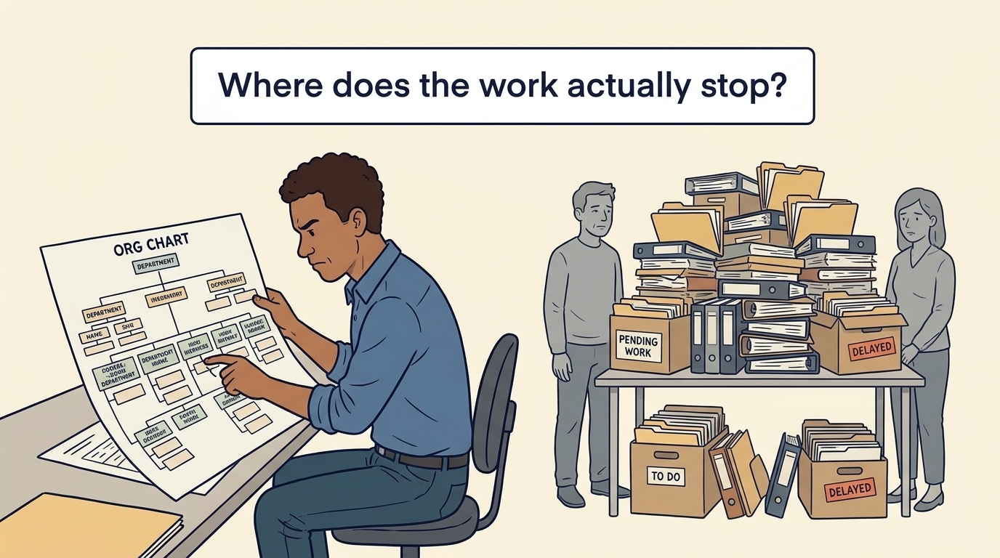
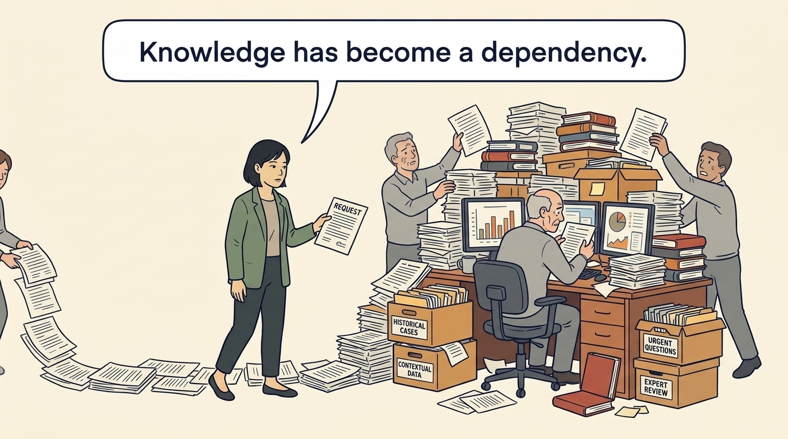
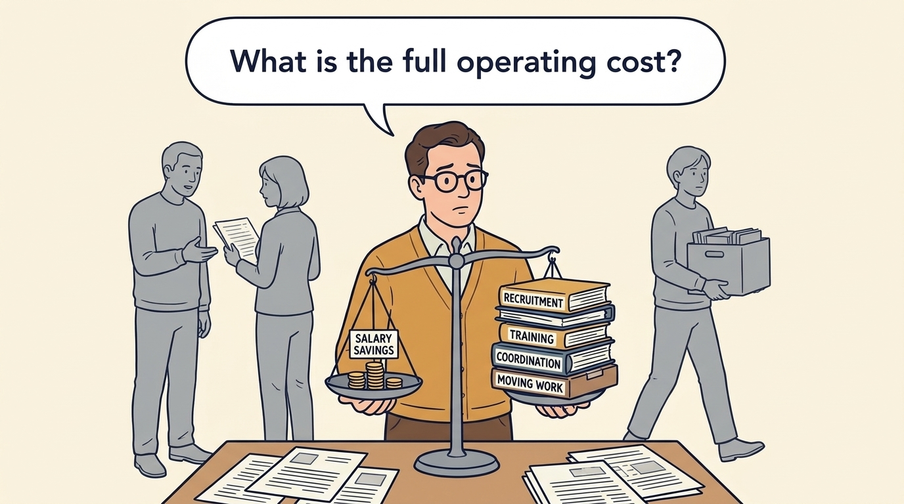
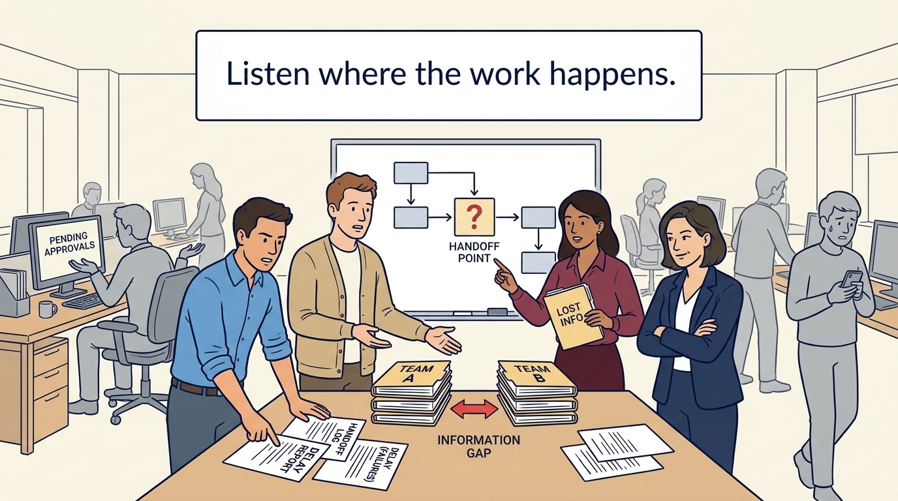
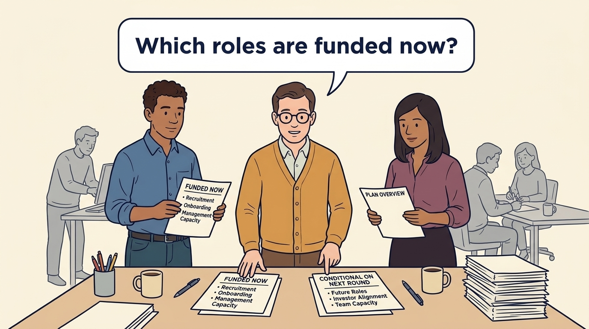

<!-- comic-style
{
  "cast": "MORGAN: a thoughtful investor technology adviser with short dark hair and a green jacket, used in the fund scenarios. ALEX: a practical CTO with curly hair and blue rolled-up sleeves. SAM: a CFO with round glasses and an amber cardigan. PRIYA: a product leader with straight dark hair and plum sleeves. INES: a CEO with short grey hair and a navy jacket. All are fictional; none represents a person in a real case.",
  "style": "Clean editorial explainer comic, dark ink outlines, restrained green, blue, and amber accents on warm white, generous space, readable short speech bubbles, expressive people and simple physical metaphors. No photorealism, logos, dense charts, or title text. Keep the same character appearances throughout the journal."
}
-->

**Comic.** A plan has funded new resources, tools, a cheaper location, a second team, without funding the management time and decision changes needed to use them. The panels follow fictional Larkspur tracing one piece of work through its queue and letting that diagnosis decide what hiring the plan needs.

Morgan is an investor’s adviser in the fund scenarios; Alex leads technology, Priya leads product, and Sam leads finance. All are fictional. Comparative scenarios use separate assumptions. Historical cases are discussed through documents; the scenes do not reenact real events.

<!-- comic-panel
{
  "id": "01-scene",
  "status": "generated",
  "asset": "assets/images/13-fix-decisions-before-hiring/comic-01-scene.jpeg",
  "aspect_ratio": "16:9",
  "prompt": "Panel 1 of an explainer comic. Alex studies an organization chart while work waits nearby. Use one speech bubble with the exact words: \"Where does the work actually stop?\" Convey: An operating model describes how teams, responsibilities and decisions are arranged. Follow actual work to see where that arrangement causes delays.",
  "alt": "Comic panel: Alex studies an organization chart while work waits nearby.",
  "caption": "An operating model describes how teams, responsibilities and decisions are arranged. Follow actual work to see where that arrangement causes delays.",
  "generation": {
    "model": "gemini-3-pro-image-preview",
    "reference_id": "owned-cast-20260913",
    "sha256": "bd7b9abd86a55267601bc1daa65977d00fd7a2a3a9df97e86ba13fb4903a337d"
  }
}
-->

**Panel 1:** An operating model describes how teams, responsibilities and decisions are arranged. Follow actual work to see where that arrangement causes delays.

*Dialogue:* “Where does the work actually stop?”

<!-- comic-panel
{
  "id": "02-scene",
  "status": "generated",
  "asset": "assets/images/13-fix-decisions-before-hiring/comic-02-scene.jpeg",
  "aspect_ratio": "16:9",
  "prompt": "Panel 2 of an explainer comic. Morgan follows a request to one overloaded expert. Use one speech bubble with the exact words: \"Knowledge has become a dependency.\" Convey: Capacity includes knowledge and context. If every difficult question needs one expert, adding people may not remove the delay.",
  "alt": "Comic panel: Morgan follows a request to one overloaded expert.",
  "caption": "Capacity includes knowledge and context. If every difficult question needs one expert, adding people may not remove the delay.",
  "generation": {
    "model": "gemini-3-pro-image-preview",
    "reference_id": "owned-cast-20260913",
    "sha256": "a0ad4de7ea1bb34da01aacd203f8b6d7cff764f9fe0e67de57e36d022c4179b7"
  }
}
-->

**Panel 2:** Capacity includes knowledge and context. If every difficult question needs one expert, adding people may not remove the delay.

*Dialogue:* “Knowledge has become a dependency.”

<!-- comic-panel
{
  "id": "03-scene",
  "status": "generated",
  "asset": "assets/images/13-fix-decisions-before-hiring/comic-03-scene.jpeg",
  "aspect_ratio": "16:9",
  "prompt": "Panel 3 of an explainer comic. Sam compares salary savings with transition obligations. Use one speech bubble with the exact words: \"What is the full operating cost?\" Convey: A cheaper team than the current external development spend can be offset by recruitment, coordination, training and the cost of moving work between teams.",
  "alt": "Comic panel: Sam compares a cheaper team’s cost with transition obligations.",
  "caption": "A cheaper team than the current external development spend can be offset by recruitment, coordination, training and the cost of moving work between teams.",
  "generation": {
    "model": "gemini-3-pro-image-preview",
    "reference_id": "owned-cast-20260913",
    "sha256": "22fa0ebd50d582f26dcee4bacfc4503c764860c0533a11a2a5aea1aee6dc3ade"
  }
}
-->

**Panel 3:** A cheaper team than the current external development spend can be offset by recruitment, coordination, training and the cost of moving work between teams.

*Dialogue:* “What is the full operating cost?”

<!-- comic-panel
{
  "id": "04-scene",
  "status": "generated",
  "asset": "assets/images/13-fix-decisions-before-hiring/comic-04-scene.jpeg",
  "aspect_ratio": "16:9",
  "prompt": "Panel 4 of an explainer comic. Alex considers a leadership change beside unclear authority. Use one speech bubble with the exact words: \"Which conditions would also change?\" Convey: Before replacing a leader, state a testable hypothesis: what new leadership must enable, and what evidence shows the capability is missing. If the conditions are changed and the leader does not use them, the evidence supports added leadership with authority, or replacement. The same test decides whether an investor-proposed appointment is the answer.",
  "alt": "Comic panel: Alex considers a leadership change beside unclear authority.",
  "caption": "Before replacing a leader, state a testable hypothesis: what new leadership must enable, and what evidence shows the capability is missing. If the conditions are changed and the leader does not use them, the evidence supports added leadership with authority, or replacement. The same test decides whether an investor-proposed appointment is the answer.",
  "generation": {
    "model": "gemini-3-pro-image-preview",
    "reference_id": "owned-cast-20260913",
    "sha256": "ee5580114d59ead5ec157fd0e9134629e6b58083c82e731c80cfbfb31936b067"
  }
}
-->

**Panel 4:** Before replacing a leader, state a testable hypothesis: what new leadership must enable, and what evidence shows the capability is missing. If the conditions are changed and the leader does not use them, the evidence supports added leadership with authority, or replacement. The same test decides whether an investor-proposed appointment is the answer.

*Dialogue:* “Which conditions would also change?”

<!-- comic-panel
{
  "id": "05-scene",
  "status": "generated",
  "asset": "assets/images/13-fix-decisions-before-hiring/comic-05-scene.jpeg",
  "aspect_ratio": "16:9",
  "prompt": "Panel 5 of an explainer comic. Employees point out a recurring handoff failure. Use one speech bubble with the exact words: \"Listen where the work happens.\" Convey: Ask employees about repeated delays and lost information. Their observations may explain what a report misses.",
  "alt": "Comic panel: Employees point out a recurring handoff failure.",
  "caption": "Ask employees about repeated delays and lost information. Their observations may explain what a report misses.",
  "generation": {
    "model": "gemini-3-pro-image-preview",
    "reference_id": "owned-cast-20260913",
    "sha256": "839d762a4fdb8a439c029add7cdf90eea8e29271a07cd6b232e467f4262cbaad"
  }
}
-->

**Panel 5:** Ask employees about repeated delays and lost information. Their observations may explain what a report misses.

*Dialogue:* “Listen where the work happens.”

<!-- comic-panel
{
  "id": "06-scene",
  "status": "generated",
  "asset": "assets/images/13-fix-decisions-before-hiring/comic-06-scene.jpeg",
  "aspect_ratio": "16:9",
  "prompt": "Panel 6 of an explainer comic. Alex and Priya review two clearly labelled groups of roles with Sam before speaking to the team. Use one speech bubble with the exact words: \"Which roles are funded now?\" Convey: The hire changes shape: one billing engineer funded now; the second team waits for demand evidence and for the next round to be committed and approved. Explain the same conditions to investors and teams.",
  "alt": "Comic panel: Alex and Priya review two clearly labelled groups of roles with Sam before speaking to the team.",
  "caption": "The hire changes shape: one billing engineer funded now; the second team waits for demand evidence and for the next round to be committed and approved. Explain the same conditions to investors and teams.",
  "generation": {
    "model": "gemini-3-pro-image-preview",
    "reference_id": "owned-cast-20260913",
    "sha256": "a037bbbe7775d3adf36eaf98a751b50ecd73deb927a34063b2a7641135ad67e7"
  }
}
-->

**Panel 6:** The hire changes shape: one billing engineer funded now; the second team waits for demand evidence and for the next round to be committed and approved. Explain the same conditions to investors and teams.

*Dialogue:* “Which roles are funded now?”
