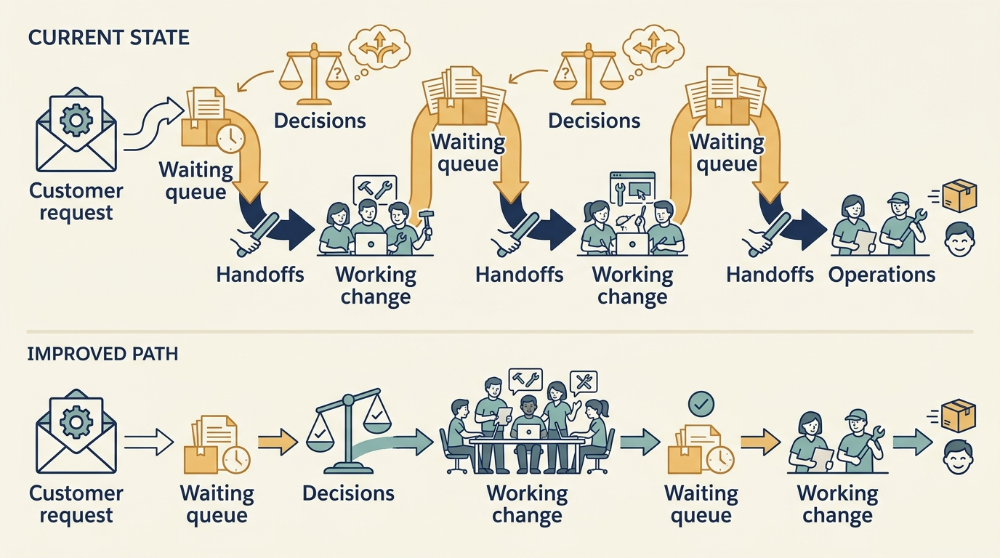
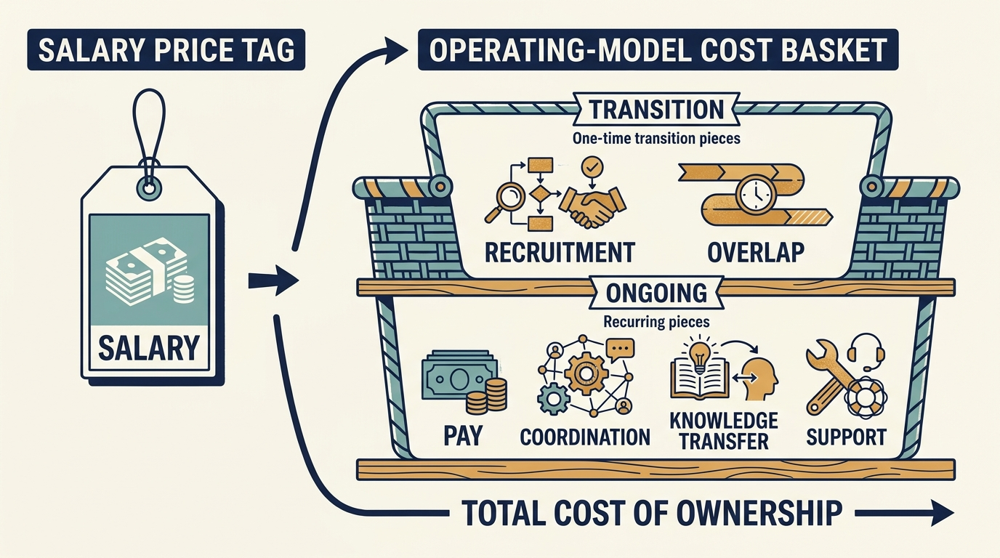

> **KEY POINTS:**
>
> * Technology capability includes **how people decide and coordinate**. New tools or locations will not solve unclear priorities and concentrated knowledge by themselves.
> * People changes have **transition costs**. Compare the full delivery model, including recruitment, overlap, knowledge transfer and management effort.
> * **Organizational health affects the investment plan**. Watch whether the company can keep learning, supporting customers and changing safely after the intervention.

 
A company buys a new delivery tool, adopts a new architecture, and recruits engineers in a lower-cost location. Six months later, decisions still wait for the founder, priorities still change every week, and the same two people resolve every production problem.

The company has changed its resources while leaving the delays in decisions unresolved. An **operating model** is the arrangement of responsibilities, teams and processes through which work gets done. **Capability** means what that arrangement enables people to do reliably.

The preceding chapters examined investments in systems, infrastructure, risk reduction and AI. Delivering those investments also depends on people with the time, knowledge and authority to do the work. An investment case that funds the work without funding the capacity to do it has not been completed.

Investment plans usually fund what can be counted: tools, licences, headcount in a cheaper location. They rarely fund the slower change in how decisions are made, and the timetable that comes with the investment leaves little room for it. Investors and their advisers may also propose organizational changes directly. Product and engineering leaders need to show what the operating model can absorb, and what changing it costs, before the plan assumes the capacity.

## Follow One Piece of Work Through the Company

Start with the customer and operating work the company needs to perform. Who learns about customer needs? Who decides priorities? Who can release a change? Who supports it? Who resolves conflicts across product boundaries?

An organization chart can show reporting lines while concealing these dependencies. Trace several real pieces of work from request to outcome. Record where they wait, where information is lost, and which people must repeatedly intervene. The purpose is diagnosis, not a time-and-motion exercise that assumes every pause is waste.

A deliberate review step may prevent expensive mistakes. **An unclear decision boundary** may cause avoidable delay. Distinguishing the two is more useful than announcing that the organization needs more autonomy or more control.

**Figure 1:** *Follow actual work to find the coordination problem before changing the organization chart.*

## Assess the Job Before You Assess the Leader

A leader who built an early product may need support to lead a larger organization. A leader with large-company experience may introduce processes a small business cannot afford. Neither background establishes fit by itself.

Describe the required work: product judgment, technical direction, operational reliability, people leadership, commercial communication, or integration. Assess evidence in each area and the system around the person. A weak product function should not automatically become a negative verdict on the CTO. Equally, technical expertise does not excuse an inability to develop people or make difficult decisions.

The supplied role brief emphasizes technical credibility, commercial understanding, people planning, and influence where resources are outside the role's direct control. [P01: supplied role brief](bibliography.html) For the Principal, this means helping design leadership conditions as well as assessing individuals.

## Cheaper Locations Do Not Automatically Save Money

Nearshoring and offshoring refer to locating work in other countries, with “near” generally describing some geographic, time-zone, or cultural proximity. Those labels do not determine the delivery model. A company can hire employees, use a supplier, establish its own development office, or combine arrangements.

A wage comparison is only one input. Include recruitment, management, onboarding, travel, knowledge transfer, supplier margin, legal and employment arrangements, employee departures, work that must be redone, and the period of overlapping teams. Also consider the time needed before a new team can own useful outcomes.

In a fictional case, replacing €1 million of annual external development with a €650,000 team appears to save €350,000. If the transition costs €250,000 and recurring coordination and specialist support cost another €150,000 a year, annual savings after the transition fall to €200,000 before any quality or delivery effects. Even with a full year at that lower operating cost, adding the €250,000 transition payment makes first-year spending €1.05 million—€50,000 above the original annual cost. The numbers illustrate the model, not a benchmark for a location.

A more important question is **whether the work can be transferred coherently**. If every decision depends on a small group elsewhere, lower hourly cost may come with more waiting and rework. A bounded product or service responsibility, adequate context, and a clear escalation path can matter more than geography.

**Figure 2:** *Compare the complete delivery model over time, including the cost of reaching it.*

## Preserve the Knowledge Only a Few People Hold

Knowledge is not fully captured in code or documentation. It includes why a customer behaves differently, which migration failed before, and which operational symptoms precede a problem. Restructuring can remove this knowledge before a replacement team knows it is missing.

Make transition obligations explicit. Which business capabilities must continue? Who can independently operate and change them? How will the receiving team demonstrate readiness? What overlap is necessary? What evidence will show that the handoff is complete?

A document delivered is not the same as capability transferred. The receiving team should perform the work under realistic conditions. The outgoing team should not be released solely because a calendar milestone has been reached if critical operational dependencies remain unresolved.

## Organizational Health Is an Operating Signal

Overload, persistent vacancies, loss of key people, and repeated priority changes can weaken the company's ability to deliver. These are not merely cultural preferences to discuss after financial targets have been met. They can affect the feasibility of the targets themselves.

**DORA**, a research program studying software delivery and organizational performance, associates unstable priorities with poorer productivity and greater burnout in its 2024 survey analysis. [S15: DORA 2024 report](https://dora.dev/research/2024/dora-report/) The practical implication is to investigate the source of instability and its consequences, not to infer a precise financial loss from a survey relationship.

Choose measures that help management act: dependence on particular individuals, unplanned work, sustained overload from on-call duties, time to fill material roles, and the team's understanding of priorities. Use qualitative evidence alongside counts. A company can meet a hiring target while failing to retain the knowledge or trust needed for effective work.

## Standardization and Autonomy Both Need Boundaries

**Autonomy** gives teams room to make their own decisions. Without clear outcomes and boundaries, it can fragment the company. Standardization without a value case can suppress local knowledge and create a central queue. The right design depends on where coordination creates value.

A group selling separate niche products may benefit from shared finance definitions, recruiting access, and security expectations while retaining local product decisions. A company promising one integrated workflow may need stronger product and technical coordination. The operating model should follow that promise.

The Principal can facilitate this design but should avoid becoming the permanent coordinator of every dependency. If the company requires the Principal at every planning meeting, the intervention may have created reliance rather than capability.

## Make Hiring and Restructuring Conditional on a Feasible Plan

In fictional Larkspur, the board wants a second product team before the next funding round. Hiring creates commitments before the new team can contribute at full capacity: recruitment, notice periods, onboarding and management time all matter. Alex and Priya should distinguish funded roles from roles conditional on new money, and agree when those conditions must be resolved.

A growth investor may ask the company to add leadership capacity while preserving speed. A buyout plan may require lower costs. A corporate parent may require reporting lines or shared services. For each proposed change, trace a real customer decision through the future organization and identify who will have the knowledge and authority to make it. A target number of employees does not answer that question.

Explain the plan consistently to investors and teams. Do not promise employees durable roles while privately treating their funding as provisional, or describe a capability as indispensable while approving its removal without a replacement. Where the chosen course creates a risk or burden, name it, fund the transition and establish a review that can still change the outcome.

## The People Plan Belongs in the Value Plan

For every material initiative, identify the skills, leadership time, and operating capacity required. Distinguish hiring from capability: a vacancy filled does not mean a new team can perform independently. Include the period of learning in the economic and delivery plan.

When cost reduction is necessary, state what work will stop and which risks remain. When growth requires more capacity, explain the customer demand and constraints that justify it. When a leader needs development, define the support and evidence of progress.

Evaluate an organizational change through the work people can now carry out: decisions made, responsibilities understood and knowledge transferred. Include the cost of transition and the treatment of people affected by it.

Acquisitions and separations put these organizational and technical requirements under pressure together. The next chapter examines how to plan those changes: [[acquisition-adds-work-first]].

## Questions to Consider

1. *Trace one real piece of work through your company from request to outcome. Where does it wait, and who has to intervene repeatedly?*
2. *Which knowledge in your organization sits with only one or two people, and what would the company lose if they left next month?*
3. *If a location or supplier change is proposed, does the comparison include transition, coordination, rework and the period before the new team can own outcomes?*
4. *Which decisions in your company are made centrally that should be local, and which are fragmented that should be shared?*
5. *Which planned hires are funded, which are conditional on money not yet received, and do the teams know the difference?*
6. *What signals of organizational health would tell you the plan has become infeasible before the financial targets show it?*

## To Probe Further

- **[How Do Committees Invent?](https://www.melconway.com/research/committees.html)** — Melvin Conway, Datamation, 1968; full text on the author's site. *The paper behind Conway's law, which explains why following a piece of work through the company, as this chapter recommends, reveals the shape of the software too.*
- **[Team Topologies](https://teamtopologies.com/book)** — Matthew Skelton and Manuel Pais, IT Revolution Press, 2019; second edition 2025. *Gives the standardization-versus-autonomy question a vocabulary, showing how a platform or enabling team can support local product decisions without creating a central queue.*
- **[The Mythical Man-Month: Essays on Software Engineering, Anniversary Edition](https://www.pearson.com/en-us/subject-catalog/p/mythical-man-month-the-essays-on-software-engineering-anniversary-edition/P200000000149/9780201835953)** — Frederick Brooks, Addison-Wesley, 1995 edition. *The source of the observation that adding people to a late project makes it later, and the classic argument for treating a headcount target as a transition cost.*
- **[A Novel Approach for Estimating Truck Factors](https://arxiv.org/abs/1604.06766)** — Guilherme Avelino, Leonardo Passos, Andre Hora and Marco Tulio Valente, International Conference on Program Comprehension, 2016. *A measurable check on this chapter's warning about knowledge held by a few people, with two thirds of 133 open-source projects at a truck factor of two or fewer.*
- **[Offshoring Information Technology: Sourcing and Outsourcing to a Global Workforce](https://www.cambridge.org/core/books/offshoring-information-technology/0DE2B333FCFBC951A79177BA5B5736B4)** — Erran Carmel and Paul Tjia, Cambridge University Press, 2005. *Older than current wage levels, but its cost categories for moving software work abroad are the ones the chapter's fictional location example asks you to include.*
