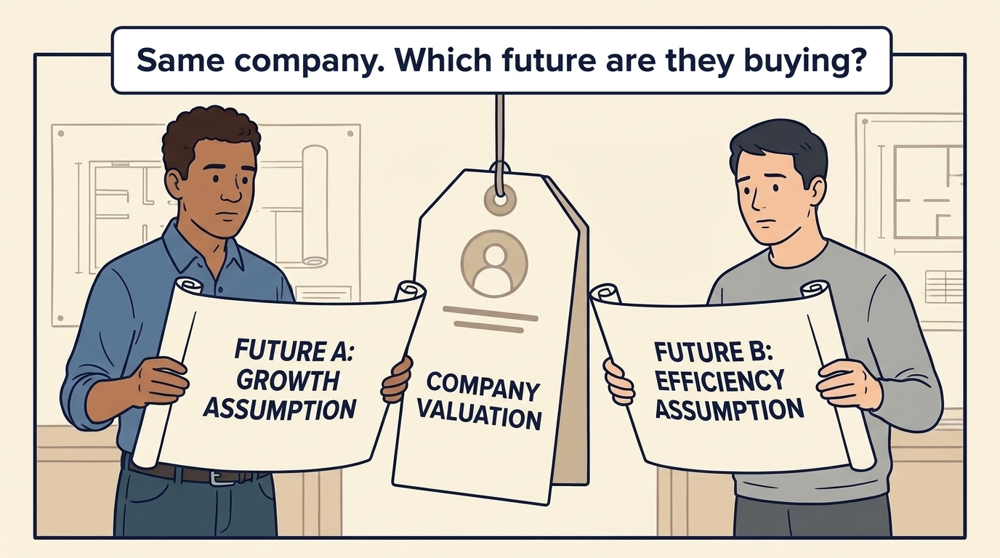
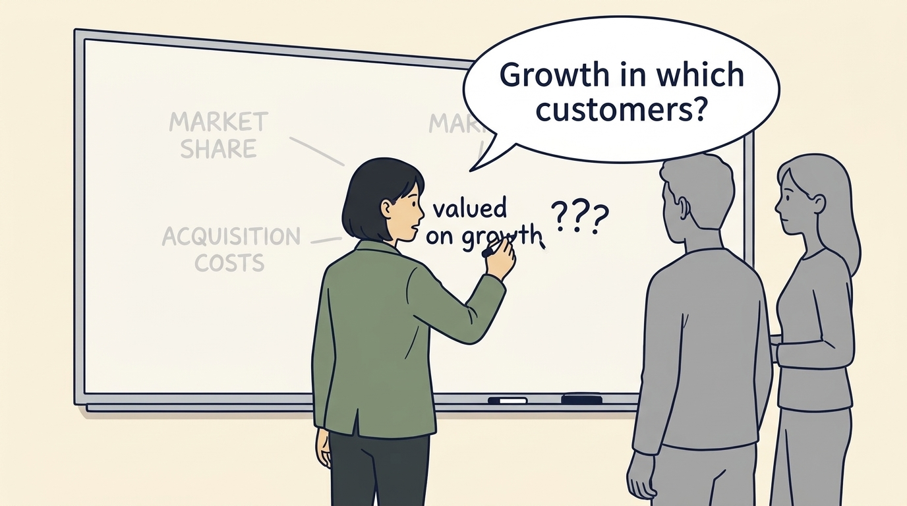
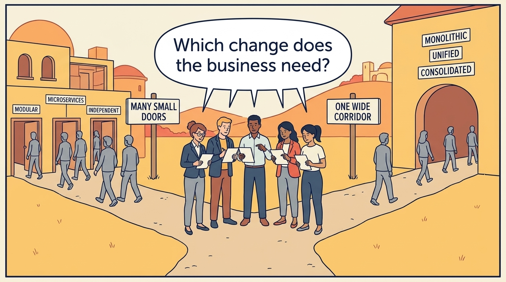
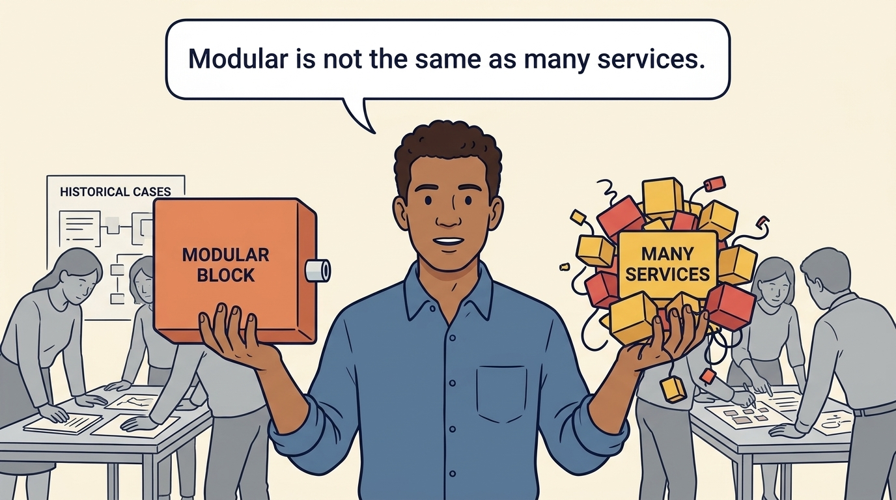
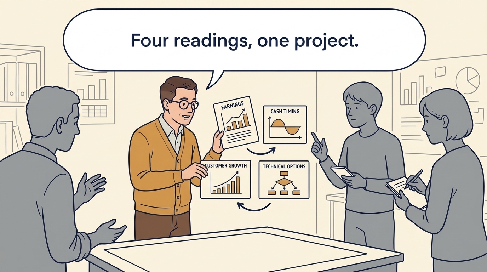
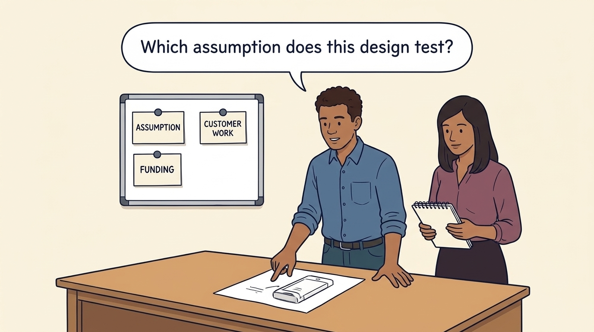

<!-- comic-style
{
  "cast": "MORGAN: a thoughtful investor technology adviser with short dark hair and a green jacket, used in the fund scenarios. ALEX: a practical CTO with curly hair and blue rolled-up sleeves. SAM: a CFO with round glasses and an amber cardigan. PRIYA: a product leader with straight dark hair and plum sleeves. INES: a CEO with short grey hair and a navy jacket. All are fictional; none represents a person in a real case.",
  "style": "Clean editorial explainer comic, dark ink outlines, restrained green, blue, and amber accents on warm white, generous space, readable short speech bubbles, expressive people and simple physical metaphors. No photorealism, logos, dense charts, or title text. Keep the same character appearances throughout the journal."
}
-->

**Comic.** An investor’s growth assumption has reached the team as a request for flexibility, with the reasoning left behind. The panels show fictional Larkspur recovering the business requirement, comparing three designs against the same need, date and cash limit on one cost basis, first-year cash and recurring fees, and choosing one with a priced fallback.

Morgan is an investor’s adviser in the fund scenarios; Alex leads technology, Priya leads product, and Sam leads finance. All are fictional. Comparative scenarios use separate assumptions. Historical cases are discussed through documents; the scenes do not reenact real events.

<!-- comic-panel
{
  "id": "01-scene",
  "status": "generated",
  "asset": "assets/images/13-growth-into-design/comic-01-scene.jpeg",
  "aspect_ratio": "16:9",
  "prompt": "Panel 1 of an explainer comic. Alex and a product leader hold two different blueprints in front of one price tag. Use one speech bubble with the exact words: \"Same company. Which future are they buying?\" Convey: A valuation estimates business value using assumptions about the future. Identify which assumption matters to the proposed work.",
  "alt": "Comic panel: Alex and a product leader hold two different blueprints in front of one price tag.",
  "caption": "A valuation estimates business value using assumptions about the future. Identify which assumption matters to the proposed work.",
  "generation": {
    "model": "gemini-3-pro-image-preview",
    "reference_id": "owned-cast-20260913",
    "sha256": "d2a15e7a415b6915bb1aa26e6b2f46325d4fd81d4631b5281487e60c19da85e2"
  }
}
-->

**Panel 1:** A valuation estimates business value using assumptions about the future. Identify which assumption matters to the proposed work.

*Dialogue:* “Same company. Which future are they buying?”

<!-- comic-panel
{
  "id": "02-scene",
  "status": "generated",
  "asset": "assets/images/13-growth-into-design/comic-02-scene.jpeg",
  "aspect_ratio": "16:9",
  "caption": "A growth expectation needs detail: which customers, what they need and what it will cost to serve them.",
  "prompt": "Panel 2 of an explainer comic. Morgan writes \"valued on growth\" on a board, then adds three question marks beside it. Use one speech bubble with the exact words: \"Growth in which customers?\" Convey: A growth expectation needs detail: which customers, what they need and what it will cost to serve them.",
  "alt": "Comic panel: Morgan writes \"valued on growth\" on a board, then adds three question marks beside it.",
  "generation": {
    "model": "gemini-3-pro-image-preview",
    "reference_id": "owned-cast-20260913",
    "sha256": "532a7b3a64c0a5c40981915738c3f1b0ef9769f77770c5ef5b0c075f3093502c"
  }
}
-->

**Panel 2:** A growth expectation needs detail: which customers, what they need and what it will cost to serve them.

*Dialogue:* “Growth in which customers?”

<!-- comic-panel
{
  "id": "03-scene",
  "status": "generated",
  "asset": "assets/images/13-growth-into-design/comic-03-scene.jpeg",
  "aspect_ratio": "16:9",
  "prompt": "Panel 3 of an explainer comic. Two paths diverge: one signposted toward many small doors, the other toward one wide corridor. Use one speech bubble with the exact words: \"Which change does the business need?\" Convey: Compare the designs that meet the same requirement by the delivery date on one cost basis, first-year cash and recurring fees, and ask who maintains and funds each afterwards.",
  "alt": "Comic panel: Two paths diverge: one signposted toward many small doors, the other toward one wide corridor.",
  "caption": "Compare the designs that meet the same requirement by the delivery date on one cost basis, first-year cash and recurring fees, and ask who maintains and funds each afterwards.",
  "generation": {
    "model": "gemini-3-pro-image-preview",
    "reference_id": "owned-cast-20260913",
    "sha256": "cd86034240136a4e43915a794f5077ada0877f24fa086f7fd2928a4db0f34e0e"
  }
}
-->

**Panel 3:** Compare the designs that meet the same requirement by the delivery date on one cost basis, first-year cash and recurring fees, and ask who maintains and funds each afterwards.

*Dialogue:* “Which change does the business need?”

<!-- comic-panel
{
  "id": "04-scene",
  "status": "generated",
  "asset": "assets/images/13-growth-into-design/comic-04-scene.jpeg",
  "aspect_ratio": "16:9",
  "prompt": "Panel 4 of an explainer comic. Alex holds a modular block in one hand and a scattered cluster of small blocks in the other. Use one speech bubble with the exact words: \"Modular is not the same as many services.\" Convey: Modularity gives parts clear responsibilities. It can help without splitting the software into many separately operated services.",
  "alt": "Comic panel: Alex holds a modular block in one hand and a scattered cluster of small blocks in the other.",
  "caption": "Modularity gives parts clear responsibilities. It can help without splitting the software into many separately operated services.",
  "generation": {
    "model": "gemini-3-pro-image-preview",
    "reference_id": "owned-cast-20260913",
    "sha256": "f997f52895194997bf18e5af13c536e46e304ceebeda770b039a7bc95cb1e3a6"
  }
}
-->

**Panel 4:** Modularity gives parts clear responsibilities. It can help without splitting the software into many separately operated services.

*Dialogue:* “Modular is not the same as many services.”

<!-- comic-panel
{
  "id": "05-scene",
  "status": "generated",
  "asset": "assets/images/13-growth-into-design/comic-05-scene.jpeg",
  "aspect_ratio": "16:9",
  "prompt": "Panel 5 of an explainer comic. Sam turns one proposal card around four times; each face shows a different figure. Use one speech bubble with the exact words: \"Four readings, one project.\" Convey: A separate payback illustration: review one saving through earnings, cash timing, customer growth and technical options. A future saving still needs funding before it arrives.",
  "alt": "Comic panel: Sam turns one proposal card around four times; each face shows a different figure.",
  "caption": "A separate payback illustration: review one saving through earnings, cash timing, customer growth and technical options. A future saving still needs funding before it arrives.",
  "generation": {
    "model": "gemini-3-pro-image-preview",
    "reference_id": "owned-cast-20260913",
    "sha256": "19d1e30cbd0c8e27ed54e55a5461eb7b0c43f32c12746ca4d9526c674aecc2d0"
  }
}
-->

**Panel 5:** A separate payback illustration: review one saving through earnings, cash timing, customer growth and technical options. A future saving still needs funding before it arrives.

*Dialogue:* “Four readings, one project.”

<!-- comic-panel
{
  "id": "06-scene",
  "status": "generated",
  "asset": "assets/images/13-growth-into-design/comic-06-scene.jpeg",
  "aspect_ratio": "16:9",
  "prompt": "Panel 6 of an explainer comic. Priya and Alex connect one owner expectation to a customer task, required capability and funding decision. Use one speech bubble with the exact words: \"Which assumption does this design test?\" Convey: The record is complete: the growth assumption, the second-country requirement, the chosen boundary Larkspur owns, its funding, the supplier fallback priced with its subscription, and the evidence that would reverse it.",
  "alt": "Comic panel: Alex and Priya examine a design sketch beside question cards for the assumption, customer work and funding.",
  "caption": "The record is complete: the growth assumption, the second-country requirement, the chosen boundary Larkspur owns, its funding, the supplier fallback priced with its subscription, and the evidence that would reverse it.",
  "generation": {
    "model": "gemini-3-pro-image-preview",
    "reference_id": "owned-cast-20260913",
    "sha256": "acce193fee9fa72feeddb361c45e7e41c62421fdb731bd04336bce5beab2e4f2"
  }
}
-->

**Panel 6:** The record is complete: the growth assumption, the second-country requirement, the chosen boundary Larkspur owns, its funding, the supplier fallback priced with its subscription, and the evidence that would reverse it.

*Dialogue:* “Which assumption does this design test?”
