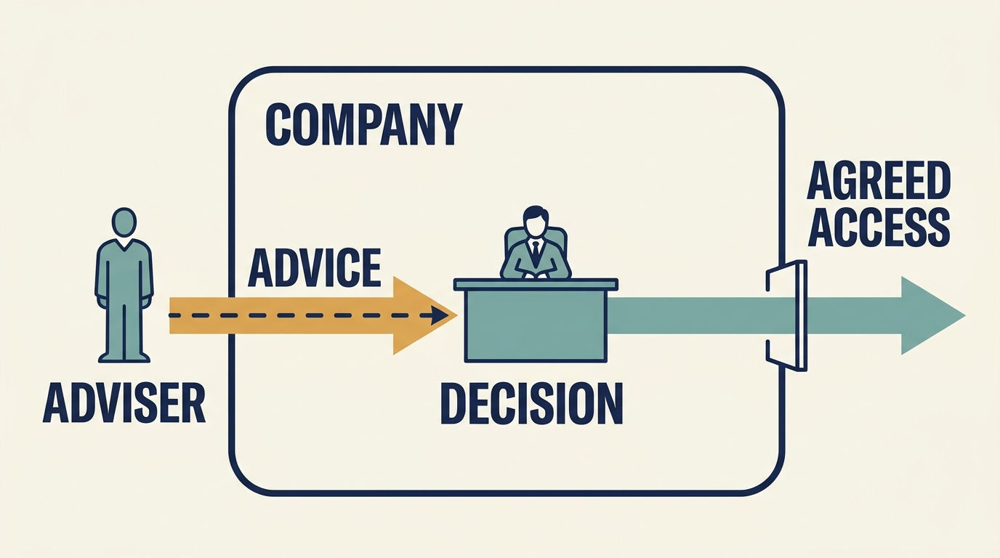

> **IN THIS SECTION, YOU WILL:** Learn to establish the investor adviser’s assignment and reporting relationship, separate influence from authority, and handle a change of role before sharing sensitive information.

> **WHY INVESTORS CARE:** An investor is someone who has put money into the company expecting a financial gain from it, and its **information rights** are whatever the company has agreed it may see and ask about. The adviser is one of the investor’s main channels for using those rights and forming the views behind its decisions; the investor needs the role to be clear so that its findings are trusted and its advice is not mistaken for instruction.

> **WHY YOU SHOULD CARE:** An adviser who reports to the investment firm can help, assess and, without an explicit assignment, appear to decide; what you share and how it is used depends on knowing which role is in play.

> **KEY POINTS:**
>
> * Establish the **assignment and the reporting relationship**. The adviser reports to the investment firm, so the company needs to understand both the operating assignment and how findings may inform the investor’s decisions.
> * Separate **influence from authority**. Proximity to the investor gives a suggestion weight; it does not give the right to decide. That right comes from four sources: an executive role, the board of directors that oversees company leadership, rights agreed with the shareholders who own the company, or an explicit assignment. An adviser holds only what those sources grant.
> * Treat a **change of role as a new agreement**. When coaching becomes assessment, or advice becomes delivery, ask what the information is for, what the investor’s existing rights already cover, who authorized anything new and what employees will be told.

 
A technology specialist employed by the investor joins your planning meeting. They understand the product and offer useful ideas. Your engineers want to know whether the ideas are suggestions, a new assessment or instructions they should act on.

An **investor’s technology adviser** is a person the investment firm employs or engages to form its own view of a company’s technology and, often, to help improve it. In this book the supplied example of that role is the **Technology Principal**, and Morgan holds it in the fictional Larkspur scenarios. A **chief technology officer (CTO)** leads technology inside the company; at Larkspur that is Alex. The adviser can test assumptions and improve company work. The company leader carries the continuing operating responsibility.

What distinguishes this adviser from other outside experts is not privileged access or multiple responsibilities; a board-appointed consultant can have both. This adviser reports to the investment firm, so the company needs to understand both the operating assignment and how findings may inform the investor’s decisions. Working that out is the company technology leader’s job, and it starts before sensitive information is shared.

The earlier Part III chapters established the working arrangement, the choice of help and the written agreement that records what a piece of advisory work covers. We now examine the person who may connect those needs to the investor’s resources. This chapter establishes the adviser’s assignment, separates influence from authority, works through what happens when the role changes and ends by returning to the planning meeting. Sourcing help is the subject of the chapter [[help-that-changes-capability]]; the mechanics of an engagement belong to the chapter [[useful-engagement]].

## Establish the Assignment and the Reporting Relationship

The supplied investment-firm role brief gives a detailed example of an adviser working across investments. It doesn’t establish a position every investor has, or confer authority over a company’s CTO or product leader. [P01: supplied role brief](bibliography.html)

Investors differ in what they can offer. A **venture investor** backs young companies that might grow very large but might also fail; its useful contact is often a **partner** — one of the firm’s senior people, who decide which companies it invests in — or a hiring specialist, or someone introduced for a single problem. A **growth investor** funds the expansion of a company that already has customers and money coming in from sales, and may offer advisers who have run that kind of expansion before. A **corporate owner** is another operating company that owns this one, and may supply its own specialists in how systems across the group fit together, or in protecting systems and data; those people usually also enforce the parent company’s internal policy. Some investors provide no operating support at all.

Four questions settle most of the ambiguity: Who does the person work for? What is their assignment with this company? How much time can they give? Which decisions, if any, are they authorized to make? The last question matters most. Deciding is not one more kind of help; it is authority that may or may not attach to an assignment, and it has to be granted by someone entitled to grant it.

Behind the four questions sits whatever the company has already promised its owners in writing. A **shareholder** owns part of the company, and the **shareholder agreement** or **investors’ rights agreement** is the contract setting out what those owners may do.

What such a contract typically grants is access. Qualifying investors — those owning at least the share of the company the contract names — and the people they authorize to act for them, such as an adviser like Morgan, commonly get the right to inspect records and to discuss the company’s affairs with its senior executives, for the purpose of monitoring and deciding on their investment.

Those rights stop at stated limits. A **trade secret** is valuable information the company keeps confidential, such as a method competitors do not have. **Legal privilege** protects certain lawyer–client communications from compelled disclosure, subject to the rules that apply.

One filed example is [S76: section 3.2 (Inspection Rights) of Avalyn Pharma’s amended and restated investors’ rights agreement of April 2025](https://www.sec.gov/Archives/edgar/data/1540171/000119312526147573/ck0001540171-ex4_2.htm), which grants those rights to each major investor and its authorized representatives. It does not establish what Larkspur’s investor may do; it shows why the company’s own agreement has to be read before anyone assumes the company decides what the adviser may see or ask.

## Understand Which Job the Adviser Is Doing

The adviser may contribute to several different decisions. **Due diligence** is the investigation that informs an investment decision. **Coaching** helps a person develop their own judgment and practice. **Operating support** helps the company improve how work gets done. A specific assignment may also give the adviser formal oversight or temporary delivery responsibilities.

These purposes can overlap, but everyone involved should know which apply. The last column says what the people doing the work should hear when the adviser speaks: an assessment finding, a recommendation or an authorized instruction. If employees cannot say which of the three they are hearing, the assignment has not been explained.

| Assignment | What company leaders may need | Boundary to establish | What employees should hear |
| --- | --- | --- | --- |
| Investigation before an investment | A fair account of strengths, constraints and required funding | Evidence scope, access and how findings will inform the plan | An **assessment finding**, reported to the investor |
| Advice on an operating decision | Relevant options, experience and specialist judgment | Who is authorized to decide, which assumptions matter and what remains uncertain | A **recommendation** the accountable leader may accept or reject |
| Help delivering a change | People and practical work that resolve a constraint | Resources, company accountability and what happens after the assignment | A recommendation, unless the written assignment gives the adviser day-to-day direction of the work |
| Coaching or leadership development | Help learning and improving judgment | What may be shared, with whom and any connection to formal assessment | Nothing; a coaching conversation is not addressed to the team |
| Formal oversight | Review of results and risks on behalf of the board or the investor | The scope of the review, whether it rests on existing information rights or a new assignment, and where findings go | An **assessment finding**, reported to whoever commissioned the review; an instruction only where a decision has been explicitly delegated |
| Interim leadership | Temporary direction of a team or a delivery | The explicit assignment, the decisions it delegates, its duration, resources and who an unresolved question goes to next | An **authorized instruction**, announced by the company, for the delegated decisions; everything else still comes from the accountable leader |

Ask the adviser to explain their responsibilities to both the company and the investment firm. Their role may include prospective investments and other companies, which affects availability; treat that as a planning input for the chapter [[useful-engagement]], not as a judgment about the relationship.

**Figure 1:** *Identify the job before agreeing access, authority and the result the company expects. Coaching develops the leader’s own judgment; it is not advice about which way to go.*

## Separate Influence From Authority

**Authority** is permission to make a particular decision. It comes from an executive role, board responsibilities, rights the shareholders have agreed or an explicit assignment; the sources and the map that records them are the subject of the chapter [[decide-who-decides]]. A job title and proximity to the owner don’t settle any decision boundary, and neither does an advisory assignment: the adviser holds exactly the authority those sources grant, which is usually none.

The investor’s adviser can carry substantial influence even when the service is described as optional. Direct access to engineers is useful during diligence or a scoped support assignment. It becomes destructive when engineers receive competing priorities from the adviser, the CTO and the investment team: a second chain of command then exists, one nobody authorized and nobody answers for. The team stops asking “what should we build?” and starts asking “whose instruction wins?”

The remedy is the decision map from that chapter, applied to the adviser by name. State which questions Morgan can recommend on, which the accountable company leader decides and which need board approval. Then tell the people doing the work. An engineer who hears a suggestion from Morgan should be able to answer “Who is authorized to decide?” without asking a manager.

Hands-on work isn’t the same as taking over. Morgan might help work out why a new version of the software broke when it went live, alongside the engineers, and then hand the improvement plan back to Alex. The test is whether company capability strengthens and responsibility stays understandable after the intervention ends.

**Figure 2:** *Influence, access and formal decision authority need separate agreements.*

## When a Coaching Conversation Becomes an Assessment

The hardest case is a change of role that nobody announces. It is fictional here, but the shape is common.

For three months Morgan has met Alex monthly to help him develop as a leader: how he runs the engineering managers, where he avoids conflict, which decisions he delays. Alex has been candid, because candor is what makes coaching useful. Then the investment firm’s **deal team** — the people at the firm who handle this particular investment — asks Morgan for a written view of whether Larkspur’s technology leadership can carry the plan. They are preparing the paper the directors will read before deciding whether the company should expand into a second country. Morgan knows more about Alex than any assessment interview would reveal.

Nothing improper has yet happened. Morgan reports to the firm, and the firm is entitled to ask its adviser for a view. What matters is what happens next.

**What Alex can ask before sharing anything sensitive.** These questions belong at the start of any coaching arrangement, and Alex can ask them again the moment the role changes: What is this conversation for? Who will receive what I say, in what form? Does it feed a formal assessment, now or later? What are you already entitled to see and ask under the investment agreements, and what are you obliged to report regardless of what we agree? Will you tell me if the purpose changes?

**What Morgan must explain.** That the request has been made and by whom. What will be shared with the firm and in what form: a view of leadership capability against the plan, not a transcript of coaching sessions.

**What the coaching agreement already says.** Confidentiality is not a general principle here; it is whatever Alex and Morgan wrote down at the first session, and it should have been written down. In this fictional arrangement the rule is one sentence: *what Alex says in a coaching session is not reported to the investment firm, and Morgan will raise any concern that affects the company with Alex first and then, if it is unresolved, with Ines, Larkspur’s **chief executive officer** — the executive who leads the whole company.* A concern Morgan judges important enough to affect the company does not by itself make a coaching conversation reportable — the agreed rule decides, and a promise of confidentiality beyond it is not Morgan’s to make. A professional coaching code can guide how such a rule is written, but it binds only an adviser who has adopted it.

**Why that rule matters now.** It means the coaching sessions are not available as material for the assessment. Morgan may report what Morgan can establish some other way — from the diligence record, from work Morgan has seen Alex do, from interviews the company agrees to — but the three months of candid conversation are out of bounds unless Alex releases them.

Nobody else can release them on his behalf. Alex is the person the rule protects, so the permission to lift it is his; Ines can commission an assessment and the board can commission one, but approving the work is not the same as lifting the confidentiality attached to it. What a private agreement cannot do is displace a disclosure the law actually requires — it settles what Morgan may volunteer, not what Morgan could be compelled to produce.

If Morgan wants to use what coaching revealed, there are three honest routes and no fourth: ask Alex to agree in writing, write the assessment from independently obtained evidence and say so, or tell the firm that the coaching relationship makes Morgan the wrong person to assess Alex and let it appoint someone else.

**Who can authorize the changed assignment.** Start with what already exists. The firm is entitled to ask its adviser for an opinion. The investment agreements may already give it, and the people it authorizes, rights to information and to discussion with senior company executives for monitoring its investment. Morgan can form a view from those sources without anyone’s new permission.

What the firm cannot do on its own is turn that view into an assessment commissioned by the company: new access to staff and records for the purpose, or interviews with Alex’s managers. In Larkspur’s agreed arrangement those need Ines to agree the scope, the evidence Morgan may use and the form of the report. Where the assessment informs a decision the directors will take, the board agrees it instead.

Two different permissions are in play, and it is worth keeping them apart. Ines or the board can authorize the *work*. Only Alex can release the *coaching material*, because the agreement protects what he said and he is the one it protects. Morgan therefore checks what the existing information rights already cover, then puts the new purpose and any additional access to Ines — and puts the question of the coaching sessions to Alex, separately.

The same discipline applies in the other direction. Suppose the firm proposes that Morgan take over running the **onboarding** work — getting newly signed customers set up and running on the product — for three months because Alex is stretched. Directing company work needs authority the company has actually granted. The board authorizes such a temporary assignment, with its duration, its resources and who Morgan reports to, or it does not happen. Neither side should discover the change from a meeting invitation.

**How employees are informed.** Ines tells the engineering managers, in writing, what Morgan is now doing and until when: “Morgan is preparing a leadership assessment for the board’s expansion decision; conversations for that purpose will be announced as such; day-to-day priorities continue to come from Alex.” If the assignment is interim delivery leadership, the note says which decisions Morgan is authorized to make and which still go to Alex or Ines.

Alex does not need to like the assessment. He needs to know it is happening, what it draws on and who authorized it. Coaching that continues afterward is a fresh agreement, with the boundary restated.

## Build a Shared Account of the Situation

A productive relationship needs consistent facts. Explain customer commitments, existing constraints and why the team made earlier choices. Ask the adviser which investment assumptions depend on those capabilities and what evidence could change their view.

Disagreement improves that account when both sides state what would overturn their position. Take the example developed in the chapter [[diligence-corrects-the-plan]]. Morgan sampled five recent onboarding implementations; across those five, onboarding averaged about eighty hours each. In three of the five, the setup needed one particular specialist’s manual work. Morgan and Alex accept both of those observations and disagree about what they mean.

Morgan’s concern is a hypothesis about capacity, not a measured rule: if that dependency on one person is built into how the work is organised, then selling twice as much would take roughly twice the hours, and the company would not have the people to supply them. That conclusion follows only if effort per customer stays where it is — which is precisely what nobody has established yet. Alex’s counter is an estimate, not a finding: he puts roughly 40% of the hours on cleaning up messy customer data, which he argues says nothing about whether the process itself can scale. The two explanations are not incompatible, and nobody yet knows how much of the work each one accounts for.

Neither is asked to concede. Both explanations are written down, and one measurement is agreed in advance. For the next group of customers, record how the hours actually divide between three kinds of work: fixing customer data, working around what the product cannot yet do, and the rest of the setup work — the customer sessions and rework that also sit inside that eighty-hour average.

Recording the rest matters. Forcing every hour that is not data cleaning into “product limitation” would invent a finding rather than measure one. The measurement does not declare either person right. It shows how much work each explanation accounts for, and that decides where the next money should go.

An adviser should be able to revise an assessment, and a company leader should be able to reconsider a familiar practice, without either treating the revision as a personal defeat.

The company shouldn’t need one confident story for the investor and another account of the real constraints for engineers. **Preserve the same facts** and adjust only the level of detail to the audience.

## Back to the Planning Meeting

The opening scene resolves with a short agreement reached before the plan is discussed. Four statements are enough.

- **Why Morgan is here.** Morgan attends as the investment firm’s technology adviser. What Morgan says about the plan is a recommendation.
- **Who decides.** Alex decides the technical plan, up to the spending already approved. Ines and the board decide anything above it.
- **What happens if that changes.** If the firm wants a formal assessment of the plan or the team, it will say so rather than collect one informally.
- **What needs agreeing first.** Any access to people or company time beyond the investor’s existing information rights is agreed with Ines or the board, and the company tells the team about it.

Alex says this to the engineers before the meeting, not after. Morgan confirms it in the room. From then on, an idea from Morgan is weighed on its merits, which is what makes the ideas useful.

The adviser is one person within a wider group at the investment firm whose job is practical help rather than investment decisions. The next chapter examines how that group supports companies, how it works with product and technology leaders, and what hiring and **artificial intelligence** — software that generates content, recognises patterns or makes predictions — add to its responsibilities: [[tech-operating-partner]].

## Questions to Consider

1. *Who from your investor is involved in your technology decisions, what is their assignment, and which decisions, if any, are they authorized to make?*
2. *Which job is the adviser doing with you now: diligence, advice, delivery, coaching, oversight or interim leadership? Would your engineers give the same answer?*
3. *Before your last candid conversation with the adviser, did you know who would receive what you said and what they were obliged to report?*
4. *If the adviser’s role changed tomorrow, what could the investor do under its existing rights, who would have to authorize anything more, and how would the team be told?*

## To Probe Further

- **[Corporate Governance and Value Creation: Evidence from Private Equity](https://academic.oup.com/rfs/article-abstract/26/2/368/1582364)** — Viral Acharya, Oliver Gottschalg, Moritz Hahn and Conor Kehoe, The Review of Financial Studies, 2013. *Private equity is investment in companies whose shares are not traded on a stock exchange, often by buying the whole company; corporate governance is how a company is directed, overseen and held to account. This is a study of individual private-equity investments — rather than whole funds, the pools of money an investment firm manages on behalf of its own investors — which reports an association, not a cause: deals overseen by partners who had been consultants or industry managers did better when the value came from improving the business itself, while deals overseen by ex-bankers and ex-accountants did better when the value came from buying and merging companies. The study is about the senior people who ran those transactions, not about technology advisers, and it cannot predict how any individual adviser behaves; reading it as one reason investment firms field operating specialists at all is the author's inference.*
- **[Flawless Consulting: A Guide to Getting Your Expertise Used](https://www.wiley.com/en-us/flawless-consulting-a-guide-to-getting-your-expertise-used-4th-edition-p-9781394177301)** — Peter Block, Wiley, fourth edition, 2023. *Written for advisers, this guide also helps clients understand what a well-run advisory relationship asks of them.*
- **[Humble Consulting](https://bkconnection.com/products/9781626567214_humble-consulting)** — Edgar Schein, Berrett-Koehler, 2016. *Argues that useful help starts with asking rather than telling, which supports the chapter's call to build consistent facts with the adviser before accepting a diagnosis.*
- **[ICF Code of Ethics](https://coachingfederation.org/credentialing/coaching-ethics/icf-code-of-ethics/)** — International Coaching Federation, in force from April 2025. *A professional code that asks coaches to agree confidentiality and information sharing with both the client, the person being coached, and the sponsor, whoever pays for or arranges the coaching; it binds only coaches who have adopted it, but its checklist of what to agree is a useful model for the conversation this chapter describes.*
