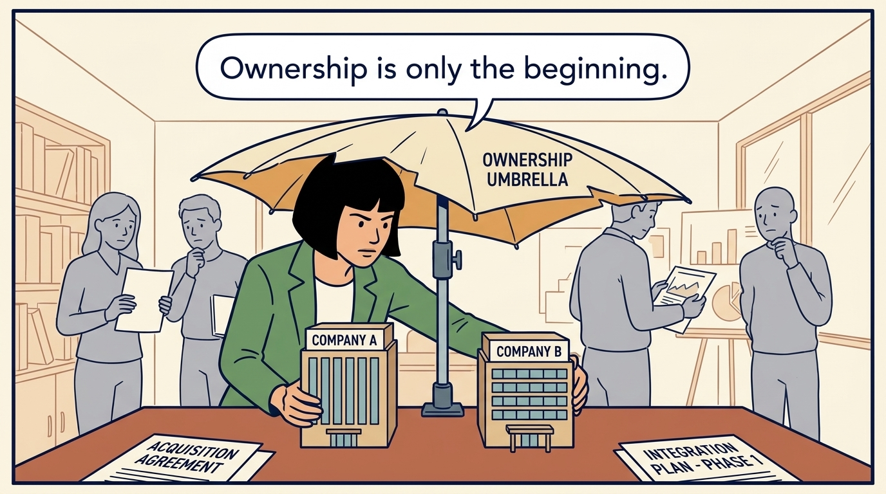
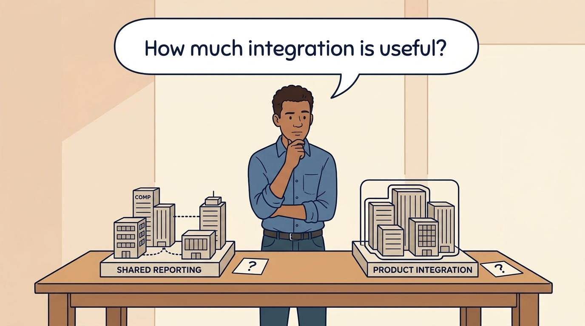
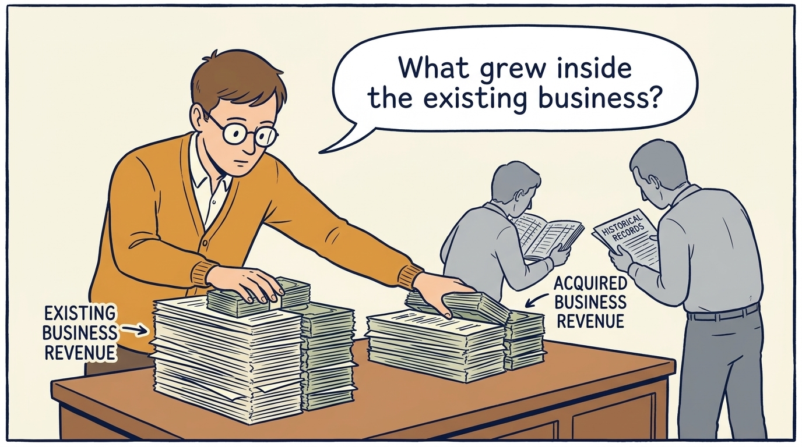
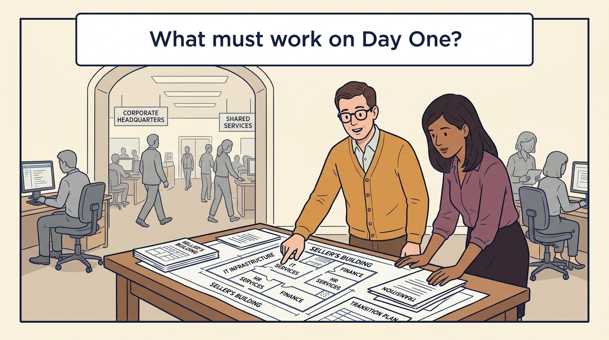
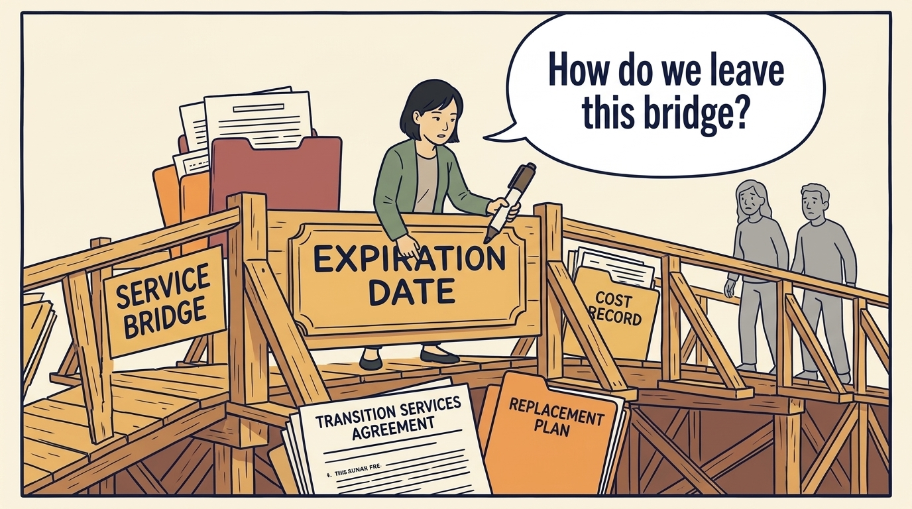
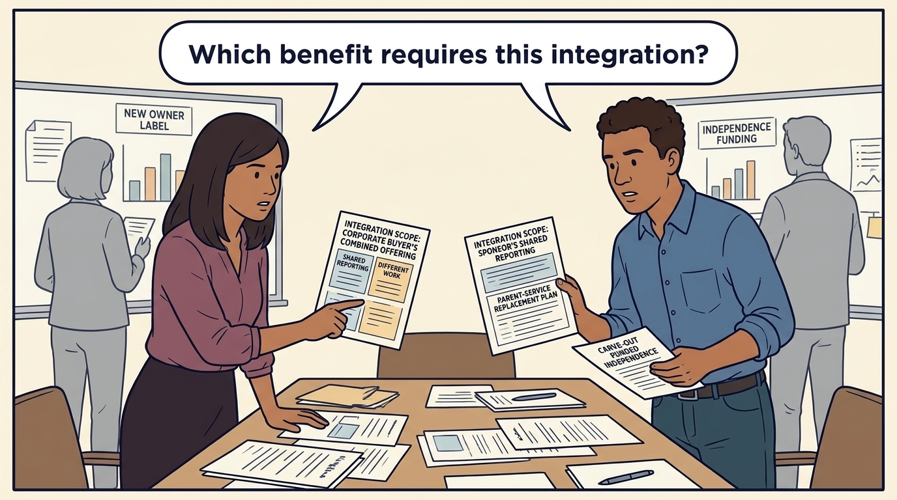

<!-- comic-style
{
  "cast": "MORGAN: a thoughtful investor technology adviser with short dark hair and a green jacket, used in the fund scenarios. ALEX: a practical CTO with curly hair and blue rolled-up sleeves. SAM: a CFO with round glasses and an amber cardigan. PRIYA: a product leader with straight dark hair and plum sleeves. INES: a CEO with short grey hair and a navy jacket. All are fictional; none represents a person in a real case.",
  "style": "Clean editorial explainer comic, dark ink outlines, restrained green, blue, and amber accents on warm white, generous space, readable short speech bubbles, expressive people and simple physical metaphors. No photorealism, logos, dense charts, or title text. Keep the same character appearances throughout the journal."
}
-->

**Comic.** Acquisitions and carve-outs are usually investor decisions, agreed on the investor’s timetable and priced on assumptions the operating team may not have been asked about. The panels follow what happens after the transaction date, when those assumptions become operating obligations.

Morgan is an investor’s adviser in the fund scenarios; Alex leads technology, Priya leads product, and Sam leads finance. All are fictional. Comparative scenarios use separate assumptions. Historical cases are discussed through documents; the scenes do not reenact real events.

<!-- comic-panel
{
  "id": "01-scene",
  "status": "generated",
  "asset": "assets/images/14-acquisition-adds-work-first/comic-01-scene.jpeg",
  "aspect_ratio": "16:9",
  "prompt": "Panel 1 of an explainer comic. Morgan places two companies under one ownership umbrella. Use one speech bubble with the exact words: \"Ownership is only the beginning.\" Convey: An acquisition purchases a business. It does not automatically make the two businesses operate together.",
  "alt": "Comic panel: Morgan places two companies under one ownership umbrella.",
  "caption": "An acquisition purchases a business. It does not automatically make the two businesses operate together.",
  "generation": {
    "model": "gemini-3-pro-image-preview",
    "reference_id": "owned-cast-20260913",
    "sha256": "f20d69014c96900f0053597d3d386ad818e8a252d92326f58e9a1841925d7cae"
  }
}
-->

**Panel 1:** An acquisition purchases a business. It does not automatically make the two businesses operate together.

*Dialogue:* “Ownership is only the beginning.”

<!-- comic-panel
{
  "id": "02-scene",
  "status": "generated",
  "asset": "assets/images/14-acquisition-adds-work-first/comic-02-scene.jpeg",
  "aspect_ratio": "16:9",
  "prompt": "Panel 2 of an explainer comic. Alex compares shared reporting with a full product merger. Use one speech bubble with the exact words: \"How much integration is useful?\" Convey: Integration makes selected activities work together. Choose how much to combine by identifying the customer or cost benefit.",
  "alt": "Comic panel: Alex compares shared-reporting and product-integration models, each accompanied by a question mark.",
  "caption": "Integration makes selected activities work together. Choose how much to combine by identifying the customer or cost benefit.",
  "generation": {
    "model": "gemini-3-pro-image-preview",
    "reference_id": "owned-cast-20260913",
    "sha256": "5ab5fe001db304870e09385eea235395412aa3d6dbb8493c57503198673c5639"
  }
}
-->

**Panel 2:** Integration makes selected activities work together. Choose how much to combine by identifying the customer or cost benefit.

*Dialogue:* “How much integration is useful?”

<!-- comic-panel
{
  "id": "03-scene",
  "status": "generated",
  "asset": "assets/images/14-acquisition-adds-work-first/comic-03-scene.jpeg",
  "aspect_ratio": "16:9",
  "prompt": "Panel 3 of an explainer comic. Sam separates acquired revenue from the existing business. Use one speech bubble with the exact words: \"What grew inside the existing business?\" Convey: Buying another business adds its revenue. Organic growth concerns changes within an existing business under a stated comparison.",
  "alt": "Comic panel: Sam separates acquired revenue from the existing business.",
  "caption": "Buying another business adds its revenue. Organic growth concerns changes within an existing business under a stated comparison.",
  "generation": {
    "model": "gemini-3-pro-image-preview",
    "reference_id": "owned-cast-20260913",
    "sha256": "991ed680b2e688c13f22167480eb3e1e678a60f42ecb7145fb0cb4755d5a1620"
  }
}
-->

**Panel 3:** Buying another business adds its revenue. Organic growth concerns changes within an existing business under a stated comparison.

*Dialogue:* “What grew inside the existing business?”

<!-- comic-panel
{
  "id": "04-scene",
  "status": "generated",
  "asset": "assets/images/14-acquisition-adds-work-first/comic-04-scene.jpeg",
  "aspect_ratio": "16:9",
  "prompt": "Panel 4 of an explainer comic. A carved-out team discovers services still in the seller's building. Use one speech bubble with the exact words: \"What must work on Day One?\" Convey: A carve-out separates a business from a larger owner. Keep services working on the first day while planning independent operations.",
  "alt": "Comic panel: A carved-out team discovers services still in the seller's building.",
  "caption": "A carve-out separates a business from a larger owner. Keep services working on the first day while planning independent operations.",
  "generation": {
    "model": "gemini-3-pro-image-preview",
    "reference_id": "owned-cast-20260913",
    "sha256": "12c0facb5434e818fa5fd3e6cf9533792f8d02b36cbcc5320948d67cafbc4d98"
  }
}
-->

**Panel 4:** A carve-out separates a business from a larger owner. Keep services working on the first day while planning independent operations.

*Dialogue:* “What must work on Day One?”

<!-- comic-panel
{
  "id": "05-scene",
  "status": "generated",
  "asset": "assets/images/14-acquisition-adds-work-first/comic-05-scene.jpeg",
  "aspect_ratio": "16:9",
  "prompt": "Panel 5 of an explainer comic. Morgan marks an expiration date on a service bridge. Use one speech bubble with the exact words: \"How do we leave this bridge?\" Convey: A transition services agreement supplies temporary support, often from the seller. Record its cost, end date and how the company will replace it.",
  "alt": "Comic panel: Morgan marks an expiration date on a service bridge.",
  "caption": "A transition services agreement supplies temporary support, often from the seller. Record its cost, end date and how the company will replace it.",
  "generation": {
    "model": "gemini-3-pro-image-preview",
    "reference_id": "owned-cast-20260913",
    "sha256": "f033dea7ca9f66d4108337b588d8b8e0f3f926db1cd6430a54cb9c070735a8b0"
  }
}
-->

**Panel 5:** A transition services agreement supplies temporary support, often from the seller. Record its cost, end date and how the company will replace it.

*Dialogue:* “How do we leave this bridge?”

<!-- comic-panel
{
  "id": "06-scene",
  "status": "generated",
  "asset": "assets/images/14-acquisition-adds-work-first/comic-06-scene.jpeg",
  "aspect_ratio": "16:9",
  "prompt": "Panel 6 of an explainer comic. Priya and Alex compare two integration scopes and a separate parent-service replacement plan. Use one speech bubble with the exact words: \"Which benefit requires this integration?\" Convey: A corporate buyer’s combined offering can need different work from a sponsor’s shared reporting. A carve-out needs funded independence whatever the new owner’s label.",
  "alt": "Comic panel: Priya and Alex compare two integration scopes and a separate parent-service replacement plan.",
  "caption": "A corporate buyer’s combined offering can need different work from a sponsor’s shared reporting. A carve-out needs funded independence whatever the new owner’s label.",
  "generation": {
    "model": "gemini-3-pro-image-preview",
    "reference_id": "owned-cast-20260913",
    "sha256": "9ac1c2110c14df646ac1a93453ee0d68163fda2ddea54f7a74e3ee7b4ef3f813"
  }
}
-->

**Panel 6:** A corporate buyer’s combined offering can need different work from a sponsor’s shared reporting. A carve-out needs funded independence whatever the new owner’s label.

*Dialogue:* “Which benefit requires this integration?”
