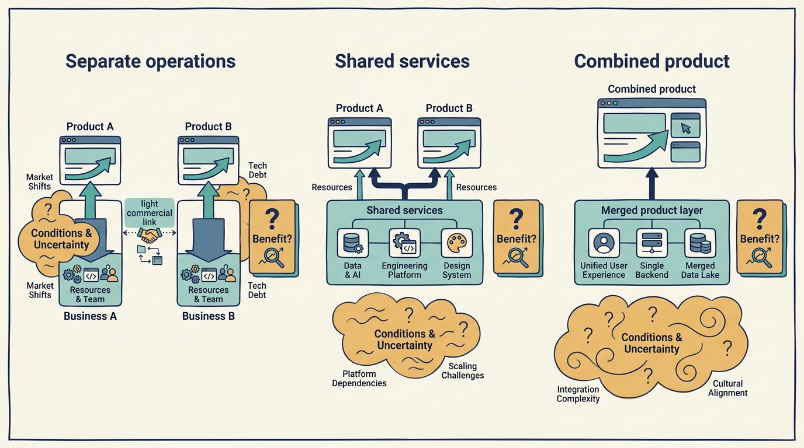
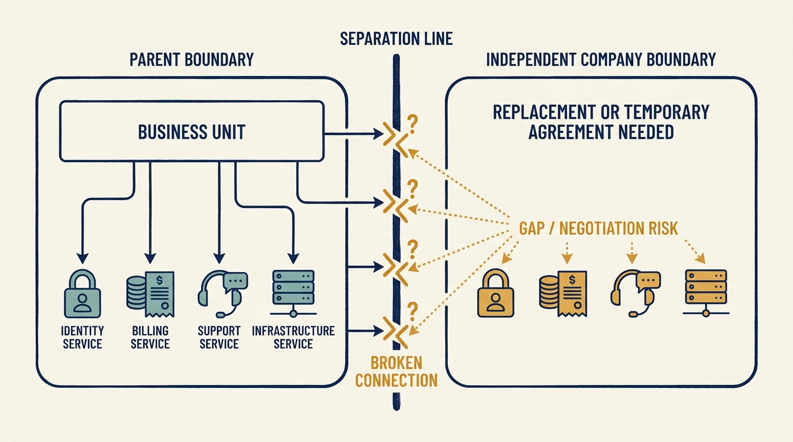

> **IN THIS SECTION, YOU WILL:** Learn how combining businesses and separating one differ, how to fund the transition and decide what waits, and how to test that a new boundary works.

> **WHY IS THIS IMPORTANT:** Synergies and independence are assumed in the transaction plan before anyone has scheduled the work; the same specialists who carry the roadmap will carry the integration, and something will wait.

> **KEY POINTS:**
>
> * The transaction plan can **assume savings or independence before the operating teams have validated the work**. Bring those dependencies into the discussion while scope, price and timing can still change.
> * Combining businesses and separating one are **different processes under one principle**: a new boundary and a continuing customer promise. Choose the depth of integration for a specific benefit; fund independence before the parent’s services end.
> * Integration and separation **use the same specialists as the roadmap**. Decide what waits, who approves the delay and what happens to the date the plan assumed, then test that the boundary works before counting the benefit.

 
An **acquisition** is the purchase of a business or an ownership interest in it. It can add customers and products to a group immediately. **Integration**, the work of making selected activities operate together, still has to be planned and done. A **carve-out**, the separation of a business from a larger parent, can transfer ownership legally while leaving essential operating dependencies behind.

The transaction plan can assume savings or independence before the operating teams have validated the work. It is priced on assumptions about combined savings and separation costs that product and engineering leaders may not have been asked about. Bring those dependencies into the discussion while scope, price and timing can still change. Who proposes and approves a transaction varies: in the fictional Larkspur scenarios in this chapter, the buyout fund’s deal team proposes an add-on purchase, the fund’s investment committee approves the transaction terms, the Larkspur board approves the integration plan and its budget, and the seller and a regulator’s waiting period affect the timing. The operating obligations begin when the assumptions become the company’s plan.

This chapter closes Part III by bringing its questions together. An acquisition or separation tests product logic, architecture, costs, security and organization against a transaction timetable with little room for delay. [[teamsystem]] shows what accumulates when that happens repeatedly.

## One Principle: A New Boundary, a Continuing Customer Promise

Combining and separating look like opposites, but they pose the same challenge. A transaction draws a new boundary around a business. Customers on both sides of it expect the product to keep working, contracts to be honored and support to answer. The work is to define which capabilities must operate across the new boundary, who is accountable for each, and what transition makes that possible. The transaction date changes ownership; operational readiness is a separate condition with its own evidence.

Each process has its own completion test, stated here and developed below. **Combining** is complete when a customer can buy and use the combined offering, one team is accountable for supporting it, and the duplicated cost the plan counted has actually been retired. **Separating** is complete when the business has run for a defined period with no service from the parent, under its own accountable leaders, at a cost the operating plan recognizes.

## Combining Businesses

### Write the Thesis as What Changes

A **buy-and-build** strategy uses a company as a base for further acquisitions. The base is often called the **platform company** and each later purchase an **add-on acquisition**; “platform” here describes the business’s role in the strategy, not a software system. The proposed value may come from distribution, product breadth, capabilities, purchasing, overhead or consolidation of a fragmented market. It can also depend partly on valuation differences between the platform and the smaller companies it buys. That financial mechanism is distinct from **operating synergy**, a benefit created by combining activities, such as a lower shared cost or a better customer offering.

**Organic growth** means development within an existing business under a stated comparison, not revenue added by buying another business. A larger consolidated revenue number doesn’t establish it. The TeamSystem case shows how acquisition dates and constructed full-year comparisons can change the apparent growth rate: [[teamsystem]]. A combined product catalogue isn’t necessarily a more useful customer proposition, and a lower group cost ratio isn’t evidence that every acquired business improved.

Write the thesis in terms of what customers or the company will do differently. If the thesis is cross-selling, identify overlapping customer needs and a practical way for the sales team to offer and support the additional products. If it’s product integration, identify the shared workflow and data boundaries. If it’s cost reduction, identify the actual assets, contracts and roles that can change.

### Choose the Depth of Integration

| Model | Potential value | Main question |
| --- | --- | --- |
| Preserve separate products | Retain focus and domain expertise | Which group capabilities justify common ownership? |
| Share selected services | Reduce repeated work or improve scarce capabilities | Does the service improve outcomes after transition and coordination costs? |
| Connect customer workflows | Make complementary products more useful | Can identity, data, contracts, support, and experience work together? |
| Consolidate products or platforms | Remove duplication and create one coherent offering | Can customers migrate without losing essential value? |

These are design options, not maturity levels. A company can sensibly choose different depths in different areas. The intended benefit and the authority behind it decide the depth: a buyout fund that wants shared reporting across separate products needs the first or second row; a corporate buyer that expects the company to serve its channel through a common offering needs the third or fourth. A minority investment can fund a commercial partnership without authorizing the deeper rows; [[decide-who-decides]] covers what each arrangement authorizes.

The same boundary question governs group standards. Common security expectations, incident definitions or financial reporting can make coordination easier; requiring unrelated businesses to build and run their applications on the same technologies needs a much stronger case. Products serving different customers can need different structures, and an acquired business can carry useful local knowledge in the way it works. A proposed standard should state the problem it solves, the cost of compliance, the exceptions process and the person who funds the transition; if no one can explain the customer or operating benefit, uniformity is being treated as an end in itself. [[growth-into-design]] applies the same test to the company’s own system boundaries.

The Skype case in [[hilton-and-skype]] shows why ownership of essential technology can be a transaction issue. **Intellectual property (IP)** means legal rights over assets such as software and inventions. Skype’s filings before the sale describe settling a dispute and acquiring core technology rights, alongside investment in the product and its supporting systems. [S27: Skype registration filing](https://www.sec.gov/Archives/edgar/data/1498209/000119312511096544/ds1a.htm) The bounded lesson is to inspect the capability boundary, not just the source code.

**Figure 1:** *Choose the depth of integration needed for the expected benefit and fund its transition.*

### Decide What Waits: A Capacity Decision

The same engineers may be needed to deliver the current roadmap, keep the service running, support due diligence for the next acquisition and integrate the last one. A value-creation plan that allocates their time to every initiative independently creates fictional capacity. Build a single dependency and capacity view, identify the people who can’t be duplicated, and test the acquisition cadence against it. An attractive target can still be hard to absorb right now.

**Larkspur example (fictional).** Larkspur, owned in this scenario by a buyout fund, buys a smaller field-dispatch company with forty employees. The priced thesis is the third row of the table: connect the two products’ identity and customer data so Larkspur’s scheduling customers can buy the add-on’s dispatch, with the combined offering on sale nine months after closing and cross-sell revenue in the plan from month ten. The identity and data work needs sixteen engineer-weeks from the two engineers who understand Larkspur’s scheduling engine. The same two engineers are the critical path for the customer portal on the roadmap (ten of their weeks this half-year, promised to customers for the third quarter) and for the fund’s next diligence request, a second target the deal team wants examined in month two (three weeks). That is twenty-nine weeks of their time against twenty-six available in the half-year, before any service incident.

Chosen: the integration goes first because it is the priced thesis; the portal moves one quarter and the customers who were promised it are told before the plan is approved; the second-target diligence moves six weeks later, after the identity work is designed. The synergy date stays at month nine. Rejected: doing all three at once, which is fictional capacity; giving the integration to contractors, who do not know the engine and would add a fourth person to a two-person dependency without removing it; and delaying the integration instead, which would move the synergy date to month twelve and the cross-sell revenue with it, a change to the case the transaction was priced on. Funding: the integration’s €150,000 is in the transaction model; the portal delay costs no cash but a customer commitment slips. Scarce capacity: the two scheduling-engine engineers. Authorized: the Larkspur board approves the roadmap change; Ines tells the fund’s deal team the diligence timing, and the investment committee is told that the second target waits. Evidence that would change the decision: identity work running past sixteen weeks, at which point Sam re-runs the cross-sell revenue with a later synergy date, or a portal customer signalling non-renewal, at which point the board revisits the order.

Integration estimates should include data cleanup, customer communication, training, running old and new systems together, contract changes, helping customers move and retiring the old systems. A platform isn’t retired when its replacement launches. It’s retired when the remaining customer and operating obligations have been resolved; that is the completion test for combining, and the point at which the duplicated cost can be counted as saved.

## Separating a Business

### The Independence Bill

A division can rely on its parent for identity, networks, finance systems, procurement, licenses, customer contracts, support, security and employment services. Its historical accounts may carry allocations that don’t reflect the cost of operating alone.

A **transition services agreement**, or TSA, provides temporary access to services after separation. Examine its scope, price, duration, service levels and exit conditions. A TSA buys time; it doesn’t perform the separation.

The technology plan should distinguish three stages: **Day 1 continuity**, keeping services working on the first day of separate ownership; establishing independent operations; and making later improvements. Trying to optimize every system before separation can put continuity at risk. Reproducing the parent’s setup without questioning its cost can create a permanently expensive business. Whatever the future owner, someone must fund the replacement of the parent’s services before those services end; bring that budget into the transaction discussion while there is still time to change the scope, price or timetable.

**Larkspur example (fictional, separate assumptions).** In this scenario Larkspur is a division being separated from a larger parent. Its allocated **information technology (IT)** cost is €400,000 a year. Standalone operations need €700,000, plus €300,000 of separation work. The acquisition model must account for the €300,000 recurring difference and the one-time investment. Describing the division’s historical margin without that bridge would overstate the resources available to the new company.

### Complete the Bridge: Dates, Milestones and an Independence Test

The cost bridge is not a plan until it has dates and an accountable leader. In the scenario, the separation closes on 1 July 2026 and the TSA ends on 30 June 2027, with one extension of three months available at 150% of the monthly price, so a missed date costs money as well as time. Replacement milestones: identity, email and device management on Larkspur’s own systems by 31 October 2026; the finance and procurement systems by 31 January 2027; network, security monitoring and the remaining licenses by 30 April 2027. Alex is the accountable company leader for the technology services, Sam for the finance system, and each milestone has two months of parallel running before the parent’s service is switched off.

The **independent-service test** is May 2027: a full month in which every parent service is disconnected in a controlled way while the business closes its month-end, onboards a new customer, releases software and completes a restore against the recovery objective from [[prove-you-can-restore]], with no access to the parent. If the month passes, the TSA is allowed to expire; if it fails, the extension is triggered and the failed milestone is redone before the second attempt in August.

Chosen: the staged replacement with the May test. Rejected: relying on TSA extensions without an end, which the parent will not offer and which leaves the €300,000 recurring gap unexplained; and replicating the parent’s setup service for service, which would lock in a cost the standalone business does not need. Funding: €300,000 one-time in the transaction model and €300,000 a year recurring in the operating plan from year one. Scarce capacity: the operations lead, who runs both the migrations and the restore test. Authorized: the board of the separated company approves the plan; the parent approves only the TSA terms. Evidence that would change the decision: the April milestone slipping, which brings the extension forward, or the independence test showing a service the plan did not list, which reopens the recurring cost.

**Figure 2:** *Independence requires working capabilities, rights and funding beyond the ownership transfer.*

## Investigate Rights and Dependencies Before the Purchase

**Due diligence** is the investigation that informs the investment decision. For a transaction, it should include evidence of who holds and can use the code, data, trademarks, licenses and contracts. Identify services that continue only with a supplier’s or parent’s agreement. Test whether customer data can be separated accurately and whether the business can run if a parent-provided service ends.

Use qualified specialists for legal rights, employment arrangements, privacy and transaction restrictions. Before closing, planning and information sharing must follow the applicable permissions and legal constraints. Operational enthusiasm isn’t authority to combine systems or direct the target’s business early.

A material separation or integration risk can change the price, financing, conditions or feasibility of the investment. It shouldn’t be buried in a technical appendix because the deal team already likes the company.

## Measure the Customer and Cash Results

An integration scorecard should track the specific mechanism. For cross-selling, measure qualified demand and incremental financial contribution, not accounts contacted. For product consolidation, track migration completion, retained functionality, customer loss, service quality and retired costs. For a carve-out, track the replacement milestones, the independence test and stranded obligations.

Finance should reconcile acquired earnings, organic change, one-time costs and realized synergies. A recurring cost reduction that appears in both companies’ plans counts once. A revenue opportunity isn’t realized because the products are now under common ownership.

Company leaders need to make the transition feasible and its claimed benefits verifiable. An investor’s adviser can bring patterns and specialists from other acquisitions; the company still needs **an accountable leader for each part** of the operating plan. Completing a transaction changes ownership. Completing the operating transition requires the evidence in the two completion tests above: customers can still use the product, responsibilities are clear and the expected costs or dependencies have actually gone. The two milestones can be far apart, and the obligations that remain open at an ownership change are the subject of [[handover-of-obligations]].

Both Larkspur examples used specialists the company did not have, from the fund’s deal team, the parent and outside advisers, and both depended on two engineers the company could not duplicate. Part IV asks where that additional capability comes from, on what terms, and how to keep the authority to decide inside the company: [[part-4]] begins with the investor’s own adviser, [[investors-adviser]].

## Questions to Consider

1. *For the acquisition or separation closest to your company, what specific benefit is expected, which depth of integration does it need, and what will customers or the company do differently to realize it?*
2. *Which roadmap item or diligence request waits while the same specialists do the integration, who approved that order, and what happens to the date the plan assumed?*
3. *If your business were separated from its parent tomorrow, which services would stop, when does each replacement land, and what test would show the business runs without the parent?*
4. *What rights to code, data, licences and contracts does your company actually hold, and which depend on someone else’s continued agreement?*

## To Probe Further

- **[The Big Idea: The New M&A Playbook](https://hbr.org/2011/03/the-big-idea-the-new-ma-playbook)** — Clayton Christensen, Richard Alton, Curtis Rising and Andrew Waldeck, Harvard Business Review, 2011. *Distinguishes acquisitions that improve current performance from those that change the business model, a direct complement to this chapter's advice to write the thesis as what changes.*
- **[Pricing and value creation in private equity-backed buy-and-build strategies](https://doi.org/10.1016/j.jcorpfin.2022.102285)** — Benjamin Hammer, Nikolaus Marcotty-Dehm, Denis Schweizer and Bernhard Schwetzler, Journal of Corporate Finance, 2022. *Evidence from 3,399 buyouts on where buy-and-build returns come from, including the valuation-multiple mechanism this chapter separates from operating synergy, with only the abstract open.*
- **[The Art of Transition Service Agreement Negotiations](https://www.deloitte.com/us/en/what-we-do/capabilities/mergers-acquisitions/articles/recommendations-for-transition-service-agreement-negotiations.html)** — Deloitte, 2024. *An adviser's guidance on scoping, pricing and exit conditions for a transition services agreement, useful for the questions to ask before a carve-out's independence bill is fixed.*
- **[Open Source Audits in Merger and Acquisition Transactions](https://www.linuxfoundation.org/blog/blog/open-source-audits-merger-acquisition-transactions-get-free-ebook)** — Ibrahim Haddad, The Linux Foundation, 2018; free ebook. *Explains how a code audit establishes which open-source components a target uses under which licences, turning this chapter's who-can-use-the-code question into a concrete diligence step.*
- **[Premerger Notification and the Merger Review Process](https://www.ftc.gov/advice-guidance/competition-guidance/guide-antitrust-laws/mergers/premerger-notification-merger-review-process)** — United States Federal Trade Commission, living page. *The regulator's plain-language guide to the pre-closing waiting period, which explains why integration planning has legal limits, the point this chapter makes about enthusiasm not being authority.*
