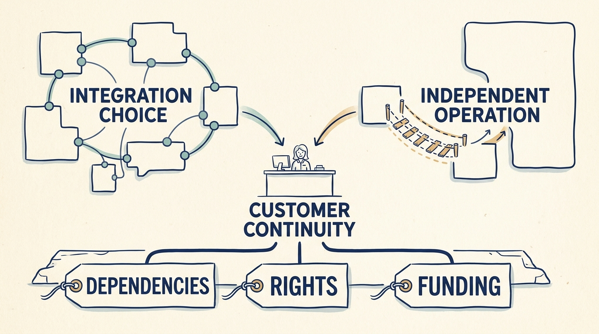

An **acquisition** purchases a business; **integration** makes chosen activities work together. A **carve-out** separates a business from a larger owner. The transaction plan can assume savings or independence before the operating teams have validated the work, so bring those dependencies into the discussion while scope, price and timing can still change. In the fictional Larkspur scenarios a fund’s deal team proposes, its investment committee approves the terms and the company board approves the plan and budget.

**Figure 1:** *Choose the operating boundary and fund the dependencies through transition.*

Combining and separating are **different processes under one principle**: a transaction draws a new boundary, and customers on both sides expect the product, contracts and support to continue. Each process has a completion test that follows the chosen depth: combining is complete when the chosen integration works for customers, the thesis’s benefit is evidenced and any duplicated cost counted as a saving has ended; separating is complete when the business has run for a defined period with no temporary parent service. A priced service deliberately kept from the former parent is a supplier relationship, not a failed separation.

**Combining businesses.** Write the thesis as what customers or the company will do differently, and separate **organic growth** from purchased revenue and valuation-multiple effects. Choose the depth of integration for the intended benefit; separate products, shared services, connected workflows or consolidation are design options, not maturity levels. In the fictional add-on purchase, the two engineers who understand Larkspur’s scheduling engine have twenty-six project engineer-weeks in the half-year after leave and operating support, against sixteen of integration, ten of a promised customer portal and three of diligence on the next target. The board puts the priced integration first, moves the portal one quarter with customers told, and delays the diligence six weeks; the synergy date stays at month nine.

**Separating a business.** A **transition services agreement** provides temporary parent services; it buys time, not the separation. A €400,000 allocated technology cost becomes €700,000 of annual standalone spending plus €300,000 of separation work; the model must carry both. In the separate carve-out scenario the TSA runs from 1 July 2026 to 30 June 2027 at €35,000 a month for three service bundles, each charge ending at switch-off. Each replacement runs two months beside the parent’s service before that is switched off: identity by 31 October 2026, finance and payroll by 31 December, network and licences by 28 February 2027, the last off on 30 April, so the TSA costs €320,000, not €420,000. May 2027 is the independence test: every parent service off for a month with a month-end close, a customer onboarding, a release and a restore, while the TSA can still reconnect a failed service. If it fails, a three-month extension at 150%, €157,500, funds a second attempt in August.

Confirm rights to code, data, licenses and contracts before moving data or consolidating platforms, within pre-closing limits on planning. Track the specific mechanism and count a shared saving once. Ownership changes on the transaction date; the operating transition is complete only when the completion tests pass.
