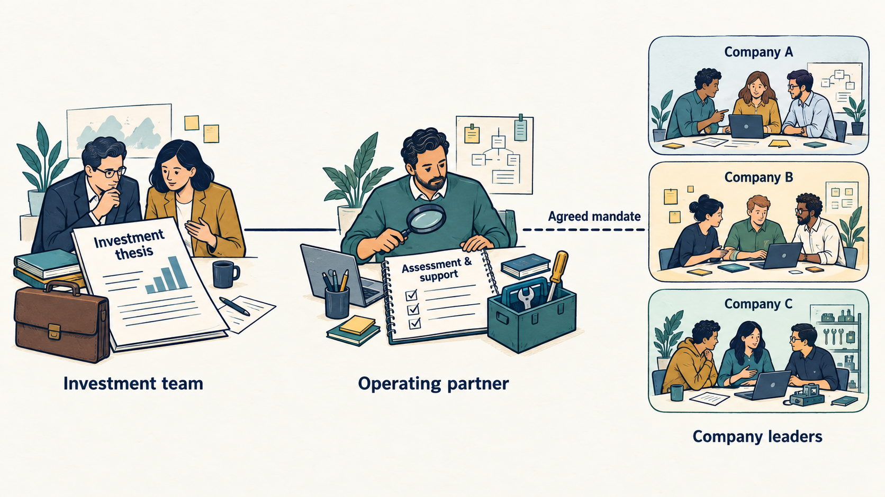

A **technology operating partner** brings technical and operating judgment to an investment firm and its portfolio companies—the businesses it invests in. The evidence comes mainly from **private equity**: a firm pools investors’ money in a **fund** to buy into companies whose shares are not publicly traded. Judge the partner by better decisions, funded improvements and capability the company retains.

An investor’s **investment thesis** explains why an investment should succeed—for example, doubling the company’s customers.

**Figure 1:** *The mandate sets each assignment’s agreed work and decision authority; company leaders keep their continuing responsibilities.*

The need arises when investment plans depend on software, data, buying other businesses or **artificial intelligence (AI)**: software that can draft text or find patterns in data. Someone must test those assumptions during **due diligence**, the checks before investing, and follow findings afterward. Sources describe a **widening remit** ([[bibliography]]), without showing how fast firms hire for it or that it raises investment returns.

Useful work runs from investment assessment through delivery, hiring and acquisitions to preparing a sale. Each contribution needs a concrete output: a funded fix, an accountable leader or evidence of a result. Staff it internally, externally or both.

**Company leaders keep their continuing responsibilities**: the chief product officer for product direction, the chief technology officer and engineering leaders for delivery, information and architecture leaders for business systems and design. The partner adds assessment, challenge, support and any explicitly assigned authority. A partner who becomes a temporary executive needs a reporting line, delegated budget and end date.

For hiring, **define the capability gap before opening a search**: what the company must do but cannot yet do well. Consider staff development, coaching or temporary help first. The partner can shape the role, introduce candidates and help assess them. Agree outcomes, budget, criteria and who approves the appointment with the company’s hiring manager. Then help the new hire settle in and review the result ([[fix-decisions-before-hiring]]).

AI affects the investment assumptions—will customers still buy and pay?—plus company work and the partner’s own analysis. Test demand, quality, data permissions, human review and running cost. Keep source evidence behind AI summaries.

In the **fictional example**, three software companies are offered one AI support tool that drafts customer-service replies from past records for staff to check. The company with reliable records designs a **pilot**, a small, time-limited trial; the second first confirms which records it is permitted to use; the third fixes its unstable service. Each uses its own approval route and records postponed work, supported by shared evaluation methods.

Review solved problems, waiting time, human effort and total running cost. **Released hours are capacity, not cash.** A cash saving needs spending to fall against an agreed comparison after the tool’s own costs: more work on unchanged pay saves nothing; cutting paid overtime may. A successful pilot still cannot isolate the partner’s contribution. Agree availability, charges, supplier interests and the next review through [[useful-engagement]].
