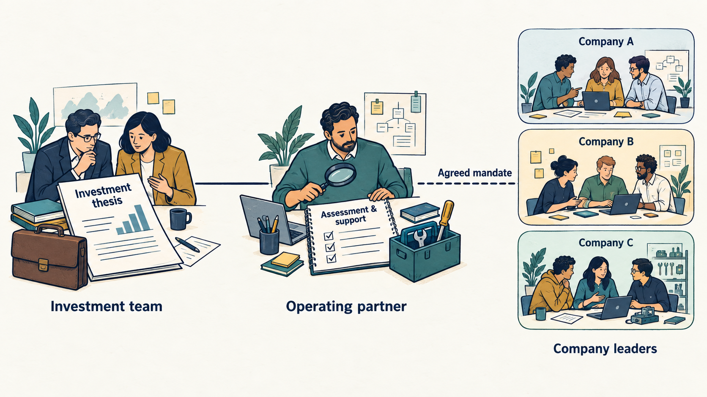
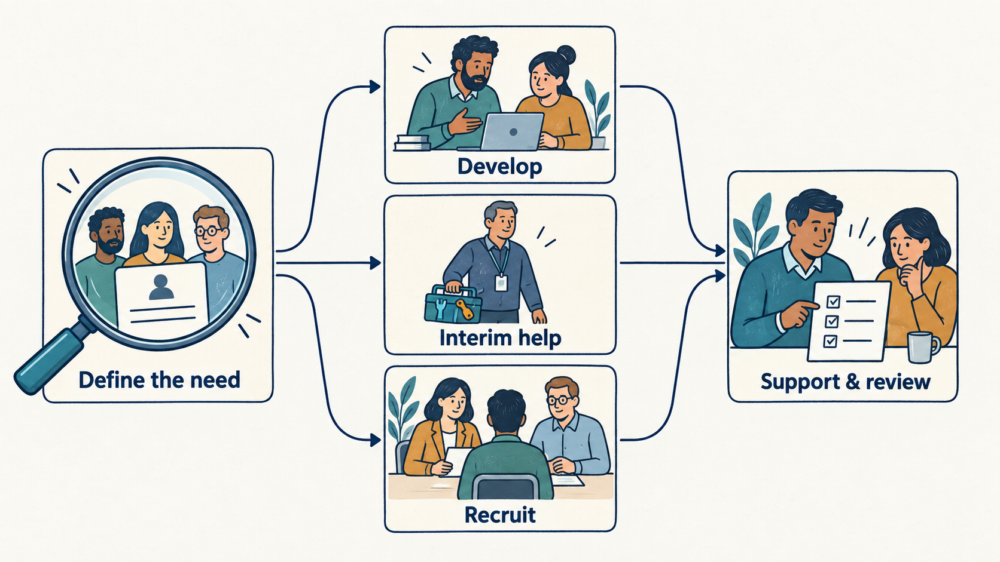
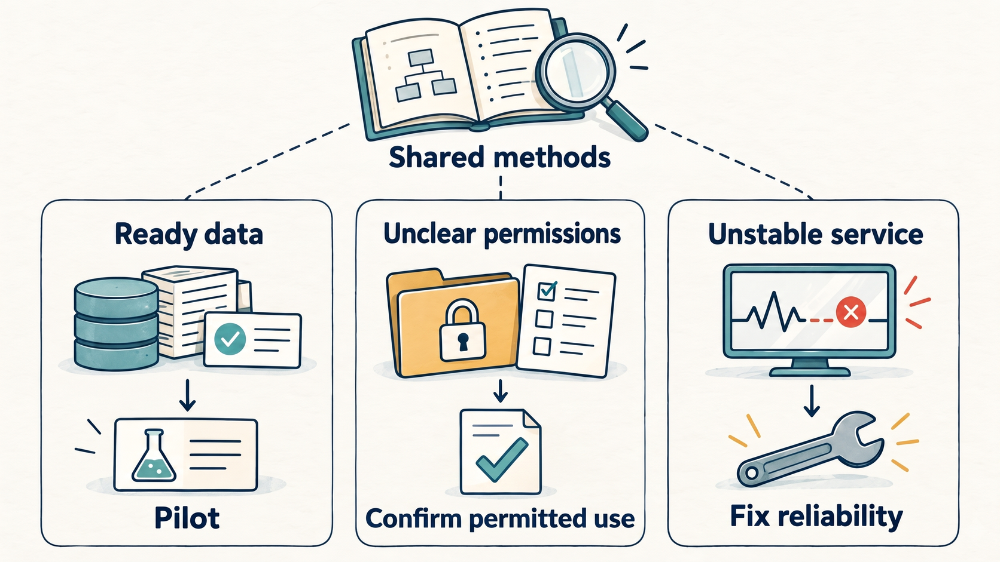

> **IN THIS SECTION, YOU WILL:** Learn what a technology operating partner is, why investment firms increasingly rely on them, how they differ from a portfolio company's own product and technology leaders, and how they help portfolio companies with hiring and operations.

> **WHY INVESTORS CARE:** Investors now earn more of their expected gain from software, data and delivery. That means growing the product, merging acquired businesses onto one platform, and judging whether AI helps or threatens the plan. If those assumptions are wrong, the investor loses money, so someone with technology judgment must test them before the investment and track them afterward. Many investment firms use technology operating partners to provide that judgment across the companies they own.

> **WHY YOU SHOULD CARE:** A technology operating partner, an investor's in-house technology adviser to the companies it owns, can give you experience, contacts and a second opinion your team lacks. The role can also add requests and expectations nobody has agreed on. Know what the role is for and which company decisions stay with you, and you can use the help without handing those decisions over.

> **KEY POINTS:**
>
> * **Investors now need technology judgment built into their plan.** When expected growth, profit or acquisitions depend on software, data and delivery, someone qualified must test those expectations before the investment and track the results afterward.
> * **The role spans the whole investment.** It can cover checks before a purchase, the projects the company funds, leadership and hiring, specialist help, lessons shared across portfolio companies and preparation for a sale. No single person has all the expertise this requires.
> * **Judge the role by company results and better decisions.** For each assignment, agree in writing who decides, how much time the partner has, what it costs and what evidence will show it worked. A senior title settles none of these.

> **[DYSFUNCTIONS THIS SECTION ADDRESSES](where-investment-goes-wrong.html):**
>
> * **The Dusty Address Book** — The company never uses the operating partner's network. This section shows where the partner can introduce peers, specialists and people with hiring experience.
> * **The Accidental Gatekeeper** — Portfolio support turns into a layer of approval over company leadership. The result is slower decisions and unclear ownership. This section separates the two and sets out who decides what for each assignment.
> * **All Bulk, No Muscle** — The company adds headcount and AI projects that look busy but build no real capability. This section tests each hiring and AI proposal against the work and skills the company needs.

 

Imagine an investment plan that assumes a software company can serve twice as many customers, absorb an acquired business, and launch a product built on **artificial intelligence (AI)**, software that can, for example, draft text or find patterns in data. Each ambition feeds the **financial forecast**, the investor's estimate of future sales, costs, and profit. If no one checks whether the company's systems and staff can handle that growth, the forecast rests on guesses. Someone must work out what the company's systems and people can actually support, what needs funding, and what to change when the evidence contradicts the forecast. Otherwise, the company may miss its targets or overspend trying to reach them.

That role is the **technology operating partner**, sometimes called a **technical operating partner**. This senior practitioner works with an investment firm and its **portfolio companies**, the businesses it has invested in. The partner judges the technical and operational side of investment decisions, then helps company leaders deliver the improvements those decisions depend on. In practice, the partner checks whether the company's systems and people can support the plan, and flags early when they can't. EE Solutions describes this link between assessing and delivering as central to the role. [S80: EE Solutions, technology operating partner](https://www.eesolutions.io/insights/technology-operating-partner-private-capital/) A firm may employ one partner, build a specialist team or bring in outside support.

Two planning documents shape that work. An **investment thesis** is the investor's written case for why an investment should earn a return, such as "this company can double its customers." A **value creation plan** turns that case into specific improvements with owners and deadlines, such as upgrading systems, integrating an acquisition or launching an AI product. When those improvements depend on a company's technology and its ability to deliver, product and engineering leaders find themselves working with the operating partner, who tests whether the plan is realistic and helps them carry it out.

The preceding chapter, [[clarify-adviser-role]], explains how to work with one adviser, such as Morgan, the role this book calls the Technology Principal. This chapter looks at the technology operating partner function that supplies such advisers. It covers why the function matters, how a firm can organize it (one partner, a specialist team or outside support) and what a good contribution looks like. Knowing this helps you judge what to expect from the adviser you meet. The practical agreements for any piece of help are in [[choose-right-help]] and [[set-terms-of-help]].

## Setting Up the Example: One AI Tool, Three Companies

One fictional case runs through the chapter. An investment firm wants three of the software companies it owns to adopt the same **AI support tool**. The tool drafts replies to customer questions using past support records, and staff review each draft before it is sent. The firm's aim is a shared tool across all three companies. The consequence is that each company's readiness, not the tool itself, decides how much help it needs from the firm's technology operating partner function.

The tool is the same for all three companies, but each starts from a different position, and that decides whether the tool can help:

- **The first** has reliable support records, so it can test whether the tool actually helps. It can compare the tool's drafts with past answers and measure the result.
- **The second** has the records but cannot yet show that its customers' permissions allow them to be used this way. Being able to open a record is not the same as being allowed to feed it into the tool. Until it checks its contracts, using the records risks breaching customer agreements.
- **The third** receives most of its complaints because its core service keeps failing. Faster replies would not fix the cause, so the tool would only answer the same complaints faster while customers kept hitting the same failures.

## Why the Function Is Becoming More Important

Korn Ferry describes a progression in some firms from **external advisers** to **internal technology leaders** to **teams with specialist capabilities**. It links this shift to deeper operational involvement and to the growing business importance of technology and AI. Redgrave's June 2024 article likewise describes the role as spanning investment assessment, company strategy, operational improvement and technology leadership. Both sources are executive search firms that recruit for senior roles and profit from the demand for such roles. Their accounts show how the role is described, not how widespread it is. [S79: Korn Ferry, Tech Titans in Private Equity](https://www.kornferry.com/institute/tech-titans-in-private-equity) [S81: Redgrave, technology operating partners](https://redgravesearch.com/insights/technology-operating-partner-in-private-equity/)

The evidence shows the role's remit widening, but not how common it is. The sources reviewed here give no time series: no counts of these roles across firms, repeated year after year.

**The investment case contains technical assumptions.** A revenue or cost forecast often rests on a technical change: onboarding new customers faster, launching a new product or cutting delivery costs. If delivering that change means rewriting software or changing how teams work, the plan is only as reliable as the engineering behind it. So the investment discussion should test whether the change is feasible. If a constraint surfaces only after the company has committed to the target, the fix costs more and the target may have to be cut. See [[assess-capability]] and [[test-revenue-assumptions]].

**Diligence** has a short shelf life. The people, products, and dependencies examined before an investment keep changing, so findings from the sale process may no longer describe the business a year later. Vaultinum argues for revisiting technology findings during ownership, including the assumptions behind growth and integration. Its monitoring service is one commercial response. The useful principle is to record each finding, its business consequence, and the evidence needed to close or revise it. Otherwise, the owner may act on a risk that has already been fixed, or miss one that has grown. [S84: Vaultinum, operating partners during ownership](https://vaultinum.com/blog/operating-partners-tech-due-diligence)

**Acquisitions** make **technical decisions interdependent**. Merging two businesses can mean moving customers to a single system, reconciling customer records that differ between the companies, and continuing to support older products. A specialist working across both companies can find dependencies that neither company's own plan shows. For example, one team's plan to retire a system may break a service the other company relies on. Each choice to integrate a system, share a service, or leave a product independent then becomes an explicit business decision, with its cost and customer impact visible before the company commits. [[plan-acquisitions-separations]] examines the work and customer obligations behind that choice.

**Repeated problems** create a reason to **share learning**. Several portfolio companies may be assessing the same kinds of suppliers or competing to hire the same specialist. EE Solutions lists shared methods, expertise, and supplier knowledge as part of the portfolio function. My inference is that the benefit depends on how often the problem repeats. If companies face the same supplier question, one company's findings can save the others from having to start over. Even when they need different tools, they can reuse a sound evaluation method. [S80: EE Solutions](https://www.eesolutions.io/insights/technology-operating-partner-private-capital/)

**AI** puts more **assumptions up for review**. It forces a company to ask whether customers will continue paying for its existing products and opens possibilities for new ones. The company must decide which work to change, which AI claims to test, and which capabilities to keep in-house. Informed judgment is needed before targets become commitments. That does not mean every proposed AI investment is worth making.

## What Investment Firms Say Their Technology Operating Teams Do

KKR Capstone is KKR's **in-house operating team**, which works with the firm's portfolio companies. It says it helps assess investments, design and carry out improvement plans, and run programs shared across companies. Its technology remit covers AI, data, cybersecurity (protecting systems and information), infrastructure (the computing and network foundation), and new products. AI is therefore one technology topic among several, handled by a team that sits inside a broader operating organization, not a standalone unit. [S85: KKR Capstone](https://www.kkr.com/approach/capstone)

In a May 2026 interview, Blackstone's chief technology officer and the global head of its operating team describe a dedicated team that helps portfolio companies adopt AI. The team sorts companies by how central AI is to their business, so a company where AI drives the product gets different support from one that uses it only for back-office tasks. The leaders stress three things: **executives are accountable** for AI results, projects must show a **measurable economic return**, and the work must reach **actual implementation**, not stop at planning. The example shows a specialist AI capability working inside a wider operating team, not as a separate unit. [S86: Blackstone, AI at Scale](https://www.blackstone.com/insights/article/ai-at-scale-a-conversation-with-blackstones-cto-and-global-head-of-the-operating-team/)

Both descriptions come from the firms themselves. They show what the function looks like and how far it reaches, but they are not independently measured results, nor are they a staffing model every investor should copy. A smaller firm may need only one experienced coordinator who can call on specialists. A portfolio company may already have most of the expertise it needs, so it needs no outside team.

## What Operating Partners Do: From Acquisition to Exit

The operating partner's recurring task is to turn an **investor's assumption** about a company into work the company **can realistically do**, then show whether that work produced the **expected result**. For example, if the investment case assumes the product can scale, the operating partner tests that assumption, helps the company plan and fund the fixes, and checks whether they worked. The table below is a proposed way to apply this across the life of an investment. It combines the lifecycle coverage described by EE Solutions and Vertex CIO with the continuing review discussed by Vaultinum. The outputs and the limits on what the operating partner does inside the company are the book's recommendations. [S80: EE Solutions](https://www.eesolutions.io/insights/technology-operating-partner-private-capital/) [S82: Vertex CIO Advisory](https://vertexcio.com/pe-technology-operating-partner/) [S84: Vaultinum](https://vaultinum.com/blog/operating-partners-tech-due-diligence)

| Work | Useful contribution | What the company should be able to see |
| --- | --- | --- |
| Before investment | Test the important assumptions about the product, how its systems fit together, security, cost and the team; bring specialists into uncertain areas. | Findings linked to the proposed plan, with the work needed to fix problems, the uncertainty and the consequences for timing or funding. |
| Early ownership | Help translate findings into a feasible sequence of work. | An agreed starting measurement (baseline), funded priorities, named company leaders and a review date. |
| Product and engineering improvement | Help remove constraints on delivery, customer adoption, reliability or operating cost. | A specific change to the work and a measure tied to its intended customer or business result. |
| Leadership, hiring and organization | Help define roles, assess candidates, support appointments and help new employees settle in; support their development and plan for successors. | A funded need, clear selection criteria and appointment authority; an explicit distinction between advising, assessing and managing a leader. |
| Acquisitions and separations | Examine systems, data, contracts and service dependencies when a business is bought, or split off to run on its own. | A transition plan with its costs, continuing service obligations and an accountable company executive. |
| Learning across companies | Organize peer learning, reusable methods and access to specialists or suppliers; [[learn-through-investors-network]] develops the learning formats and follow-through. | Relevant access, company time and scope to explore, with assumptions and later outcomes kept distinct. |
| Preparation for a sale | Help assemble a defensible account of the technology and remaining work. | Current evidence, known limitations and obligations the next owner must understand. |

The operating partner's written findings, plans, and owners should stay with the company if the adviser leaves. If a diligence concern is raised only in a presentation, or a recommendation has no funded person assigned to act on it, nobody carries it forward, and the problem stays unsolved. What matters is that a **successor can pick up** the record, the budget and the named owner, not that the same person attends every meeting.

The **investment team** decides whether to invest and on what terms, within the firm's arrangements. **Company executives** run the business within their own authority. The **operating function** provides assessment and support and takes on oversight or delivery only when that duty is explicitly assigned to it. One partner may hold more than one role, but everyone involved must know which role applies to each decision. Otherwise, people may assume an adviser's recommendation is a decision, or that no one owns it. In the support-tool case, the investment team proposed rolling out the same tool across all three companies. Each company's executives decide whether and when to adopt it. The operating partner assesses the three companies' situations and supports those decisions, but does not make them.

**Figure 1:** *The operating function connects investment assumptions with company work. Each assignment must specify its authority alongside the company leaders’ continuing responsibilities.*

## Build the Function Around the Work

The options below describe how a firm can organize its operating function. They are **design choices**, not stages of growth, so a firm can pick the one that fits its portfolio without first building the others.

An **internal operating partner** keeps context across investment discussions and company reviews because one person sees both. The limit is **personal capacity**: time spent on a new transaction is time taken from a portfolio company in crisis. Company leaders need a firm commitment on when the partner will be available, and access to backup experts when the partner is unavailable.

A **team of specialists** can supply deeper product, engineering, data, security, and AI skills. The difficulty is **coordination**: the specialists and the company must agree on one set of priorities. If each specialist sets tasks independently, the same engineers may receive competing assignments, which can slow things down. One person should own the combined priority list.

An **external operating capability** is an outside firm that supplies technology expertise on contract, so the investment firm doesn't need specialists in every discipline on staff. Vertex CIO describes such an outsourced model. It distinguishes the model from a **fractional executive**, a part-time executive who holds a defined leadership role inside one company, such as its technology chief two days a week. This shows the arrangement exists. It doesn't show that outsourcing is better. A useful agreement names the people who will do the work, explains how knowledge will carry over between assignments, and gives the company a way to challenge the recommendations. Without these terms, the company can't tell who is accountable, must re-explain its situation each time, and has to accept advice it cannot question. [S82: Vertex CIO Advisory](https://vertexcio.com/pe-technology-operating-partner/)

A **hybrid** model keeps the relationship with the company and the setting of priorities inside the investment firm. The firm brings in external specialists **only for particular problems**, such as a security review or a data migration. The practical test is whether a named person at the firm can secure outside help and remain accountable until the recommendations are implemented. Without that person, advice gets delivered and then ignored.

Redgrave stresses matching the technology leader's background and broader operating experience to the portfolio company's needs. A title such as "CTO" or "technology operating partner" says little about whether the person has delivered the specific change the company needs, such as a cloud migration or a post-acquisition systems merger. Check for direct experience of that kind before you hire. [S81: Redgrave](https://redgravesearch.com/insights/technology-operating-partner-in-private-equity/)

Korn Ferry also notes that firms **allocate the cost of operating support** differently. Work out who pays in your arrangement: the investment firm itself, the fund (and so its investors' pooled money), or the portfolio company from its own budget. Then add the company time and implementation spending the assignment will need, such as staff hours and the cost of new systems or outside help. A specialist who is available helps only if the company can supply the people, access, and funding to act on their advice; without them, the advice stays on paper. [S79: Korn Ferry](https://www.kornferry.com/institute/tech-titans-in-private-equity)

## How Operating Partners Differ From a Company's Technology and Product Executives

Companies usually spread this leadership across several executives: a **chief information officer (CIO)**, a **chief technology officer (CTO)**, a **chief product officer (CPO)**, a **chief architect** and a **vice president (VP) or head of engineering**. The main distinction is **who stays accountable over time**. A company leader owns a business or technical function day to day and keeps that ownership through changes of management and of company ownership. An operating partner works for the investment firm, often across several portfolio companies, and steps in only for specific assessments and interventions. When the engagement ends, the partner leaves, and the company leader still owns the results. Both roles need commercial judgment, technical understanding and the ability to influence others.

IBM’s 2021 CIO study ties differences between CIO and CTO remits to what each organization needs, so the split of duties varies by company. GitLab’s published CPO description covers product direction, prioritization and collaboration with engineering. The UK government’s digital standard assigns accountability for technology to a senior officer, often a CTO, who may have a Chief Architect in support. Each is one workable arrangement, and none sets a universal hierarchy. Your company's titles and reporting lines may therefore differ from these examples without being wrong. [S88: IBM, The CIO Revolution](https://www.ibm.com/thought-leadership/institute-business-value/en-us/report/cio) [S87: GitLab, Chief Product Officer](https://handbook.gitlab.com/job-description-library/product/chief-product-officer/) [S89: GovS 005, section 4.5.6](https://www.gov.uk/government/publications/government-functional-standard-govs-005-digital/government-functional-standard-govs-005-digital-html#governance)

Use this comparison as a starting point and adapt it to your company. Its success measures are examples of what each role might be judged on, not a standard scorecard. Roles, titles and responsibilities differ between companies, so check each row against who actually owns what in yours.

| Role and usual scope | Continuing accountability and evidence of success | Authority to establish | Working relationship with the operating partner |
| --- | --- | --- | --- |
| **Technology operating partner:** investment firm and selected portfolio assignments | Quality of technical investment judgments; useful improvements and capabilities left with companies. | Rights to recommend, assess, approve or direct must be specified for each assignment. | Coordinates investor expectations, expertise and company needs; helps remove obstacles that span several assignments. |
| **CIO — Chief Information Officer:** the company’s internal business systems, such as finance, payroll and customer records, and how the business uses them | Business processes that work, dependable services, access to the data people need and sustainable running costs. | Delegated authority over the information technology (IT) team, service priorities, suppliers and budget. | Tests plans to replace business systems or connect them; the CIO keeps responsibility for running them afterward. |
| **CTO — Chief Technology Officer:** technology strategy and, in many software businesses, engineering and the shared technical base its products run on | Technical capability to deliver the business plan; quality, reliability, the ability to keep changing the software and relevant innovation. | Delegated technology and engineering decisions; staffing and spending within the agreed remit. | Challenges technical assumptions, brings peers or specialists and agrees where investor support helps. |
| **CPO — Chief Product Officer:** product direction, customer problems and product investment choices | Products customers adopt and continue to value, with credible sales and customer-retention results. | Choices about which product improvements to deliver first, within the company’s strategy and funding limits. | Tests the product assumptions in the investment thesis and helps secure resources for justified opportunities. |
| **Chief Architect:** how the company’s systems fit together, including the connections between them, their data and major technical choices | Designs that meet business constraints and can still be changed; known dependencies between systems and manageable technical risk. | Advisory or design-approval authority as assigned; the title alone gives no budget or authority to manage employees. | Examines design options and what depends on what in an acquisition; the company’s own design-review process governs implementation choices. |
| **VP (Vice President) or Head of Engineering:** the engineering teams and how they deliver | A capable team building and running software sustainably, with credible delivery estimates and learning from failures. | Delegated team, staffing and delivery decisions, often within the CTO’s remit. | Makes delivery constraints visible and turns agreed support into work the teams can absorb. |

Titles do not reliably show what a person is responsible for. A CIO may lead customer-facing innovation, a CTO may manage internal enterprise systems, and one person may hold both the CPO and CTO roles. A fund's own CIO or CTO may run the investment firm's internal systems, which is a different job from supporting portfolio companies. Before comparing roles, confirm what each person actually owns, decides and answers for. Otherwise you may assign work to the wrong person or leave it with no owner.

In an acquisition, each executive assesses one part of the combination. The CPO decides which **customer needs** the combined products should serve. The CTO assesses the required **engineering work.** The CIO plans the move to **shared business systems**, such as finance and customer records. The Chief Architect maps which systems depend on one another and outlines **design options**. The operating partner helps the investor understand the resulting cost, timing, and feasibility and can bring in specialist support. The **chief executive officer (CEO)** and the **board**, the group that oversees the company on behalf of its owners, decide on anything beyond these delegated powers. This division of work is an example. Agree on it for each deal rather than inferring it from the organization chart, or two executives may each assume the other owns a decision, or both may act on it.

If the operating partner steps in as **interim CTO**, record four things in writing: the **appointment**, the **reporting** line, the **delegated budget**, and the **end condition** for the role. From then on, company staff take instructions from that person as an executive rather than an adviser. Without this record, an advisory role can quietly become a second management hierarchy, and staff will not know whose direction to follow.

## Hiring and Building Leadership at Portfolio Companies

A technology operating partner can help a portfolio company **hire and develop the senior leaders** and specialists its plan requires. In practice, that means helping **define roles**, find and assess **candidates**, develop **existing staff**, and shape the **team structure**. Redgrave includes recruitment guidance, staff development, and organizational design in the role; KKR Capstone lists recruitment, development, and retention within its wider operating remit. These sources show that talent work is a recognized part of the job. They do not describe the detailed division of work below, which is the book's own proposal. The consequence is that the operating partner's talent role is well supported, but who does what in a given hire should be agreed upon on a case-by-case basis. [S81: Redgrave](https://redgravesearch.com/insights/technology-operating-partner-in-private-equity/) [S85: KKR Capstone](https://www.kkr.com/approach/capstone)

**Define the need and the role.** Before recommending a new executive or replacement, the operating partner works with the CEO and the relevant company leader to pin down what is missing: technical direction, product judgment, execution capacity, specialist knowledge or clearer decisions. The partner assesses the existing team in its operating context and considers alternatives: internal promotion, coaching, a narrower hire, or temporary support. For a permanent role, the partner and CEO agree on the outcomes, reporting line, authority, team, and budget before the search starts. This diagnosis is the partner's first contribution to a hire, because it stops the company from paying for a senior role that does not fit its problem. Take the support-tool case, where one proposal is to hire an AI leader in each of the three companies. That should wait until each company knows its gap. The first may need help running a **pilot**, a small, time-limited trial before wider use. The second may need advice on data permissions. The third may need reliability engineering, not AI expertise. Hiring an AI leader for all three before diagnosing these gaps risks paying for a senior role that solves none of those problems. [[scale-the-team-up]] works through that choice in detail.

**Help reach suitable candidates.** The partner can introduce leaders from other portfolio companies, identify relevant **executive-search firms** (agencies that recruit senior leaders), and help the company explain the opportunity. The partner should coordinate with the company's hiring manager, human resources (HR) team, and any investor talent team so that candidates hear a consistent message and are not approached twice. The partner provides the technical and commercial context; recruiters run the agreed-upon search. Tell candidates plainly what state the company is in, what is expected of the role, and what resources come with it. A link to the investor can open a conversation, but it does not replace the company's own assessment of whether the candidate fits the role.

**Bring informed judgment to selection.** Help define consistent, job-related assessment criteria and participate in interviews where specialist judgment is useful. For a CTO, examine decisions about delivery, reliability and technical change alongside people leadership. For a CPO, examine customer judgment and product investment choices. For an AI leader, examine experience in checking AI output, preparing data and running a live AI service. Ask for examples from services in everyday use as well as demonstrations. Discuss a realistic company problem and the candidate’s past trade-offs; have the company obtain references relevant to the intended work. Declare prior relationships or recruitment fees that could affect a recommendation. Assess an investor-introduced candidate against the same criteria as the rest of the shortlist.

**Make appointment authority explicit.** Before the search starts, write down who can approve the role and budget, choose the candidate, agree pay and benefits, and make the appointment. These decisions follow the company's delegations, its written record of who may decide what, and any decisions the investment agreements reserve for the board or the investor. The operating partner may recommend, take part in a decision, or hold an explicitly assigned approval role. Closeness to the investor does not settle which. If this is left unclear, a candidate may be told they have the job by someone who cannot approve it, or an offer may stall late. Resolve disagreement through the agreed decision route, and confirm whom the appointee will report to. [[clarify-authority]] and [[clarify-adviser-role]] provide the underlying distinctions.

**Help the new leader succeed in the role.** Agree the first outcomes and a review date with the new leader and their company manager. The partner can explain the investment assumptions, introduce peers, arrange specialist support and help identify constraints the new hire cannot remove alone, such as budget limits or unresolved dependencies on other teams. Keep coaching, performance assessment and formal management separate, and say who holds each. Without that, the new leader may not know whether the partner is a coach or a judge of their work. Keep developing internal successors so the company does not depend on one person. Judge the partner's contribution by the capability the company gains and the outcomes agreed for the role, then by retention and time to fill the vacancy.

**Figure 2:** *The partner helps identify the missing capability and an appropriate route to it. Hiring follows agreed role, budget and appointment decisions; every route needs support and review.*

## How AI Changes the Technology Operating Partner's Role

### Testing the Investment Thesis

The partner must ask how AI could change the business being financed. Three questions matter. What will **customers pay** for once AI is available? Which capabilities can **competitors now reproduce quickly**? Does the company **hold useful data** it can legitimately use? If customers stop paying for what the company sells today, or rivals can copy its edge, the investment case weakens. Blackstone's May 2026 account raises these questions in software diligence and also describes its use of AI in investment workflows. It shows Blackstone's stated approach, not proof of a durable advantage for any particular business. [S86: Blackstone](https://www.blackstone.com/insights/article/ai-at-scale-a-conversation-with-blackstones-cto-and-global-head-of-the-operating-team/)

On the company side, test the assumption behind the forecast. If the plan depends on an AI feature commanding a higher price, the CPO needs evidence that customers want it and will pay for it, and the CTO and specialists need evidence that the feature can reach acceptable quality at an acceptable cost. If automation could weaken demand for an existing product, faster developer output does not address that risk. The company then risks missing its forecast, because its revenue plan rests on an assumption no one has tested.

### Helping Companies Use AI

The operating function can help in several ways: choose a **use case** (a specific, limited task for AI, such as drafting support replies), find **expertise**, and compare what worked in another company. It should also help with the work a demonstration leaves unfinished: **preparing data**, connecting the tool to **existing systems**, testing its results, and running it day-to-day. Without that help, a demonstration that works in a pilot may never become a dependable part of the business. The following allocation of responsibilities is a proposal for each company to agree on locally.

The **CPO** ties a customer-facing use case to the product and its commercial purpose. The **CIO or relevant business leader** owns changes to internal ways of working. The **CTO and engineering leaders** own delivery and day-to-day operation. The **Chief Architect** checks how the tool connects to existing systems, what depends on it and whether the company could switch suppliers later. Data, security and legal specialists answer the questions within their remits. The operating partner supplies challenge, coordination and scarce expertise. The company names one executive accountable for the result, so that no single outcome is left without an owner.

Evaluate the whole workflow, not just the AI tool: useful results, errors and how they are corrected, human review, adoption, running costs and the work the tool displaces. Faster code generation does not by itself mean faster delivery to customers, and it does not justify cutting staff. Before changing the staffing plan, show which work has actually disappeared and which new review or operating duties remain. See [[clarify-ai-strategy]] and [[scale-the-team-up]].

### Using AI in the Operating Partner’s Own Work

Possible uses include comparing **diligence documents**, flagging claims that contradict each other, **drafting questions** for management, and preparing **portfolio reports**. Treat each as a hypothesis to test, not a proven gain. Keep links to the original source documents so every point can be traced. Have a qualified person check any conclusion that affects a decision. When using shared AI tools, keep each company's confidential information separate from the others. A generated summary only restates what the sources say, so it does not confirm that a claim is true. Someone must still check the claim against the evidence.

This could change how the Operating Partner's team spends its time. AI may cut the effort spent on first-pass synthesis, such as summarizing documents and drafting initial notes. Expert testing, company relationships, and accountability for decisions would stay with people. Whether time is actually saved depends on the workflow and on how much checking the AI's output needs. If reviewers must re-verify every summary, the savings shrink or disappear. As in a portfolio company, time the whole task, from first draft through final review, before claiming a productivity gain.

### When a Dedicated AI Operating Partner Helps

Acertitude describes two models: separate **AI operating partners**, and roles that combine AI with the wider technology remit. It lists the specialist demands as product strategy, data, building or adapting AI models (the trained software that produces predictions or text), rules and oversight for their use, and team capability. This shows how one recruiter frames the assignment. It does not show that every portfolio needs another executive, so a firm should test the need against its own company's work before hiring. [S83: Acertitude, AI and technology operating partners](https://www.acertitude.com/insights/choosing-between-ai-and-tech-operating-partners-what-pe-leaders-need-to-know)

A dedicated AI operating partner makes sense when a portfolio has **repeated, material AI projects** that need specialist skills the current team lacks. If the need is occasional, an external specialist can cover it. A technology operating partner with relevant AI experience may also cover both areas, so a separate hire is unnecessary. Decide based on the volume of work, who is available, and what it costs, and review the choice as the portfolio changes.

Where two specialists are involved, give them one **shared business outcome**, such as a working tool that customers use, and divide the responsibilities in writing. The AI specialist judges the quality of the tool's output and how it is tested. The broader technology lead coordinates integration with existing systems and ensures the tool remains operational. The company executive approves the work within their mandate. One named person must also own the adoption and customer results. Without that owner, each specialist can finish their part, but no one is accountable for whether the tool is used or helps customers.

## What Useful Intervention Looks Like

A useful operating partner helps the first company design its pilot with an agreed budget and review date. The second company confirms which records it may legally and contractually use before committing to implementation; being able to open a record does not mean being allowed to feed it into the tool. The third company prioritizes service reliability and defers the support-tool rollout, accepting that customers will not receive the tool this cycle. Each company's executives and board approve resources through their existing decision routes. Each company also records which planned work its choice delays or replaces, so the trade-off is visible later.

The function can still **share evaluation methods** and supplier knowledge across all three companies. Its contribution is a better sequence of decisions, with lessons that carry from one company to the next. Success is not that every company buys the same tool; that would be a much weaker measure.

**Figure 3:** *In the fictional example, reusable expertise supports different decisions: pilot, confirm permitted data use or restore reliability. Company conditions determine the sequence.*

At review, the first company examines four measures: resolution quality (whether customers' problems were actually solved), customer waiting time, human review effort, and total running cost. The hours the tool frees are a **capacity benefit**: time available for other work, until the company shows how it was used. They become a **cash saving** only when spending falls below an agreed baseline, such as support spending before the pilot, after counting the tool's setup and running costs over the same period. If support staff answer more questions on unchanged pay, the company has gained capacity, not cash. If it cuts paid overtime, cash may be saved, but not if the tool's charges and running costs exceed the overtime avoided. Even a successful pilot cannot show how much of the result came from the operating partner and how much from the company team's own work. [[test-revenue-assumptions]] develops these measurement distinctions.

## Aside: Building Credibility Across Companies

*This aside is for technology executives considering operating-partner work for private equity or venture funds. Company leaders can skip it.*

David Mackey, a partner at Albany, describes a route into the operating-partner role through **interim, fractional and advisory assignments**. In plain terms, a leader takes short-term or part-time work inside companies, such as stepping in as a temporary executive, working a few days a month, or advising. His sequence has four steps:
1. Identify the company sizes, industries and problems where the leader has relevant achievements.
2. Deliver an assignment in that area.
3. Build relationships with the fund's investment and operating teams.
4. Take further engagements. These create a record across different situations and give the leader people who can vouch for the results.
He stresses technical diagnosis, versatility and clear communication with founders, executives and investors. The consequence is that credibility comes from visible results in several settings, not from a title. This is a recruiter's account of his own practice. I consulted a supplied text copy of the post. [S90: David Mackey, becoming a tech operating partner](https://www.linkedin.com/posts/davidatalbany_want-to-become-a-tech-operating-partner-at-activity-7388847857598107648-EAg4/)

For the company roles compared earlier, experience in one company is a starting point. **Portfolio work**, meaning short assignments across a fund's companies, also requires adapting that experience to unfamiliar teams, different constraints and a fixed end date. For the company receiving help, references from comparable engagements are useful evidence, but they don't replace agreement on the current assignment's scope, authority and resources. Nor does this route guarantee a permanent operating-partner appointment: a leader can complete several assignments and still not be offered the role.

## What Company Leaders Should Expect

Ask the company to write a short summary of the assignment. It should cover five points: the decision to be made or the operating constraint to address, the people available to work on it, the cost, who has authority to act, and the date of the next review. If any point is missing, the company has not yet agreed what the assignment is. The charter in [[set-terms-of-help]] supplies the full detail once the assignment starts.

**Keep advice and assessment separate, or say plainly when they overlap.** A person coaching a CTO may also shape the investor's view of that CTO's leadership. Tell the CTO which conversations are private coaching and which feed the investor's assessment, and write down what information the investor receives. **Disclose supplier interests.** If a recommendation earns the adviser implementation revenue, a referral fee or another commercial benefit, state that benefit and weigh it against the alternatives. **Give shared programs a business case for each company**: a comparison of that company's expected benefits, costs and risks. A discount negotiated for all the investor's companies can be outweighed by one company's migration, disruption or continuing service costs, and that company would then pay more than it saves.

The operating function earns its place when it does one of three things: helps the company make a better decision, delivers an improvement the company has funded, or builds a capability the company can sustain on its own. Judge each contribution against customer outcomes, ongoing obligations and team capacity. Counts of assessments completed or technologies deployed show only activity. The leader needs to know what changed, and whether the result justified its cost.

Part IV turns investor expectations into work the company can deliver, starting with the outcomes the work should move: [[part-4]] and [[adopt-outcome-thinking]].

## Questions to Consider

1. *Which assumption in the investor’s plan most needs technical judgment, and who follows it after diligence?*
2. *What expertise can the operating function actually supply, for how long and at whose cost?*
3. *Which decisions can its people make, and how would your team recognize a change from advice to assessment or instruction?*
4. *At the next review, what company result or better-supported decision would justify the engagement?*
5. *For the next leadership hire, who defines the role, assesses candidates and approves the appointment, and what outcome will its first review examine?*

## To Probe Further

- **[Korn Ferry: Tech Titans in Private Equity](https://www.kornferry.com/institute/tech-titans-in-private-equity)** — the changing role and organizational models (S79).
- **[KKR Capstone](https://www.kkr.com/approach/capstone)** — an investment firm’s description of its operating function (S85).
- **[Blackstone: AI at Scale](https://www.blackstone.com/insights/article/ai-at-scale-a-conversation-with-blackstones-cto-and-global-head-of-the-operating-team/)** — a dated account of specialist AI support (S86).

The [[bibliography]] records all twelve consulted sources, their interests and the limits of the evidence.
