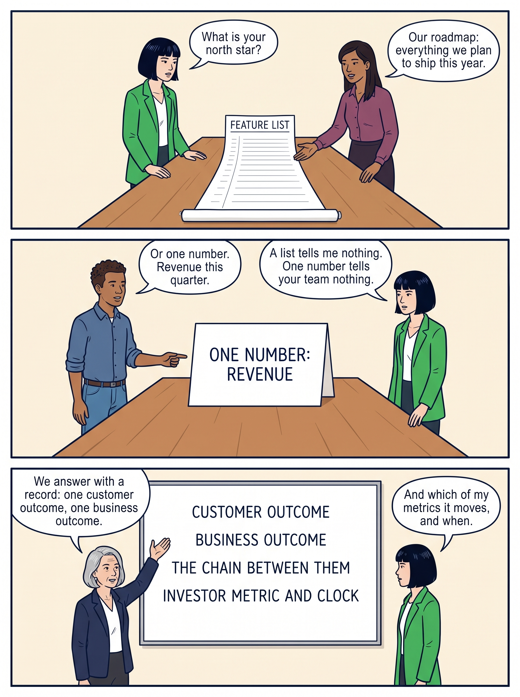
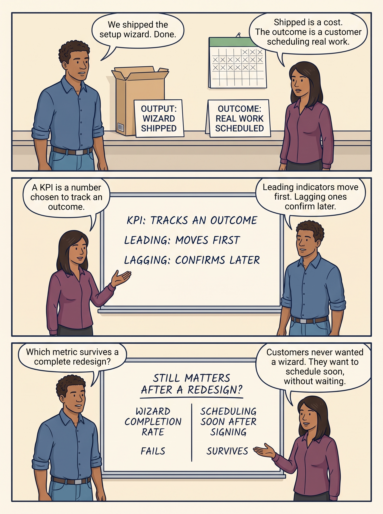
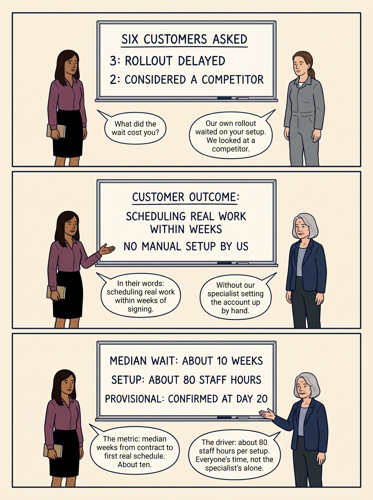
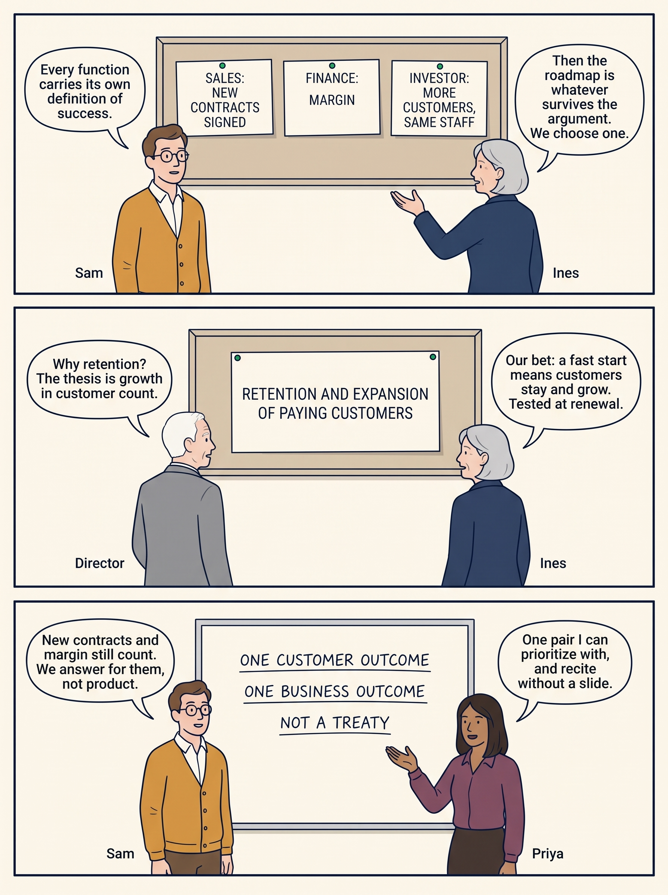
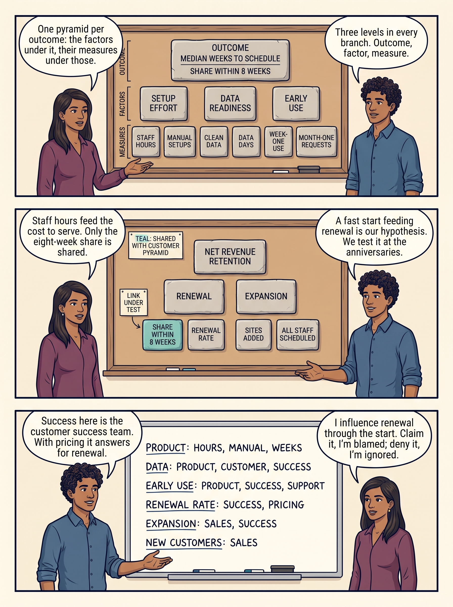
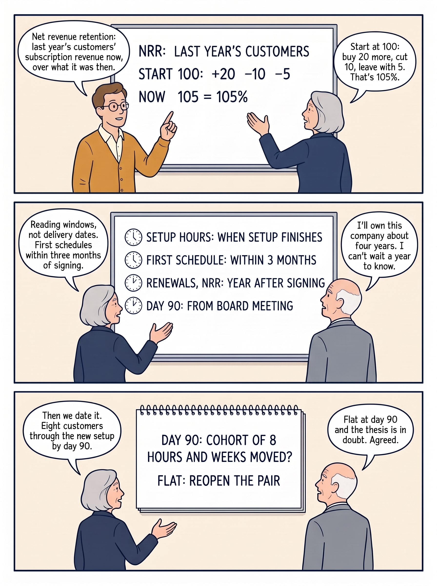
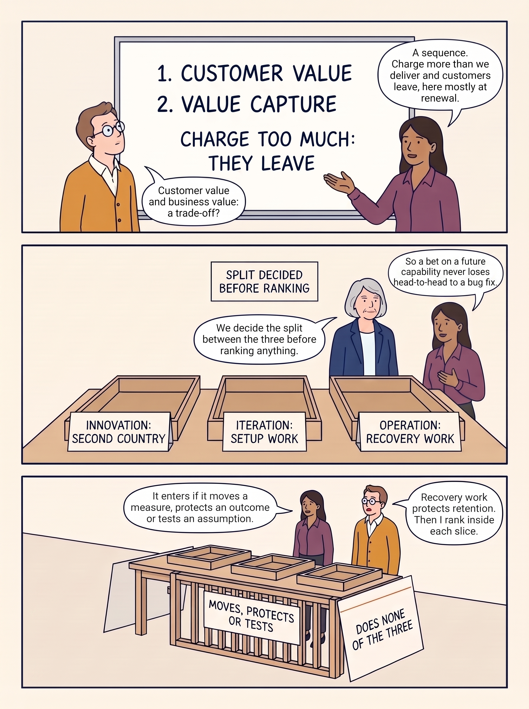
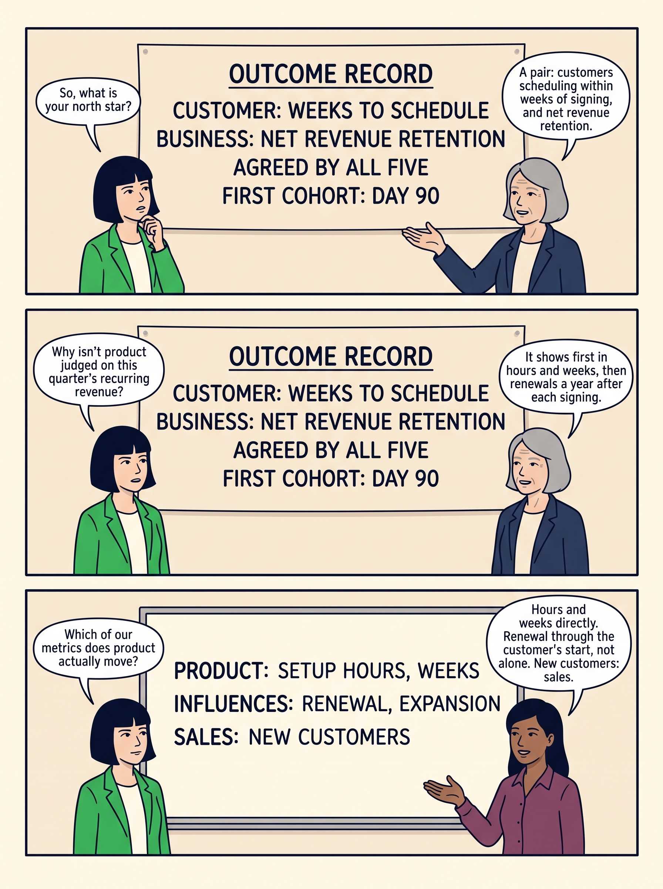

<!-- comic-style
{
  "cast": "MORGAN: a thoughtful investor technology adviser with short dark hair and a green jacket, used in the fund scenarios. ALEX: a practical CTO, a brown-skinned man with short, tight dark curls close to his head and blue rolled-up sleeves. SAM: a CFO, a man with short brown hair, round glasses and an amber cardigan. PRIYA: a product leader with straight dark hair and plum sleeves. INES: a CEO with short grey hair and a navy jacket. All are fictional; none represents a person in a real case.",
  "style": "Clean editorial explainer comic pages, each one image of three stacked full-width strips: navy ink outlines, restrained green, blue and amber accents on warm ivory, generous space, expressive people and simple physical props. Dialogue, short labels and the supplied amounts are lettered in the artwork, exactly as scripted. Money bags, coins and banknotes are plain and undecorated; the euro sign appears only inside supplied text, and arrows, documents and screens carry plain lines, never lettering. No photorealism, logos, titles or unsupplied text. Keep the same character appearances throughout the journal.",
  "reference": "_research/comic-cast-20260913.jpeg",
  "identity": {
    "Morgan": "MORGAN is a light-skinned WOMAN with a short, straight, JET-BLACK bob cut level with her jaw and a straight fringe across her forehead (never brown hair, never a side parting), and a bright green jacket over a white top, first person in the reference; her face must match the reference sheet exactly.",
    "Alex": "ALEX is a medium-brown-skinned MAN with a masculine face, broad shoulders and a straight masculine build, SHORT tight dark curls close to his head (not a large afro), a blue rolled-sleeve shirt and blue jeans, second person in the reference; fill his face, neck and hands with the same brown skin color in every strip.",
    "Sam": "SAM is a light-skinned MAN with a masculine face and SHORT brown hair cropped above his ears (never a bob, never chin-length hair, never a woman), round glasses and an amber cardigan over a white shirt, third person in the reference.",
    "Priya": "PRIYA is a brown-skinned WOMAN with straight shoulder-length dark hair and a plum blouse, fourth person in the reference.",
    "Ines": "INES is a light-skinned OLDER WOMAN with a short GREY bob (grey hair, never dark) and a navy jacket, fifth person in the reference.",
    "Director": "The DIRECTOR is the investor-appointed board director, an unnamed light-skinned OLDER MAN with short white hair, a plain grey suit and no glasses; he is not on the reference sheet and resembles nobody on it.",
    "Customer": "The CUSTOMER is an unnamed light-skinned WOMAN with brown hair tied back, in plain grey work clothes; she is not on the reference sheet and resembles nobody on it."
  },
  "short": {
    "Morgan": "a light-skinned woman with a jet-black jaw-length bob and fringe, in a bright green jacket",
    "Alex": "a brown-skinned man with short tight dark curls, in a blue rolled-sleeve shirt",
    "Sam": "a light-skinned man with short brown hair and round glasses, in an amber cardigan over a collared white shirt",
    "Priya": "a brown-skinned woman with straight shoulder-length dark hair, in a plum blouse",
    "Ines": "an older light-skinned woman with a short grey bob, in a navy jacket",
    "Director": "an unnamed older light-skinned man with short white hair, in a plain grey suit",
    "Customer": "an unnamed light-skinned woman with tied-back brown hair, in plain grey work clothes"
  }
}
-->

**Comic.** Delivering a setup feature does not by itself get a new customer working sooner. Before a company under an investor chooses what to build, it needs an agreed answer to what the work is for. Eight pages follow a fictional company, Larkspur, from the investor’s question, “What is your north star?”, to a written outcome record: one change for customers in their own words, one business result the leadership agrees that change should feed, the measures between them, who answers for each measure, and the date on which each can be read. An outcome is a measurable change in what the customer or the company can do; an output is what was delivered.

Ines is Larkspur’s chief executive officer. Priya leads product, the team that decides what the software should do; Alex leads technology and Sam leads finance. Morgan is the technology adviser to Larkspur’s investor, an investment fund (a pool of many investors’ money) that put money into the company expecting a financial return, and an unnamed director chosen by the investor sits on the board, the group that oversees the company. All are fictional, and so is every figure.

<!-- comic-page
{
  "id": "01-what-is-your-north-star",
  "title": "What is your north star?",
  "cast": [
    "Morgan",
    "Priya",
    "Alex",
    "Ines"
  ],
  "strips": [
    {
      "scene": "Two people stand behind one long table, in this left-to-right order: first Morgan, then Priya. On the table lies one long paper scroll, unrolled toward the reader, with a large heading and plain ruled lines beneath it; the heading reads upright for the reader. The scroll is the only thing on the table.",
      "labels": [
        "FEATURE LIST"
      ],
      "label_notes": "FEATURE LIST is the heading at the top of the scroll.",
      "bubbles": [
        {
          "who": "Morgan",
          "text": "What is your north star?"
        },
        {
          "who": "Priya",
          "text": "Our roadmap: everything we plan to ship this year."
        }
      ]
    },
    {
      "scene": "The same long table, now with one large card standing upright on it, lettered with one line facing the reader; the card is the only thing on the table. Two people stand behind the table, in this left-to-right order: first Alex, then Morgan.",
      "labels": [
        "ONE NUMBER: REVENUE"
      ],
      "label_notes": "ONE NUMBER: REVENUE is the single line on the standing card.",
      "bubbles": [
        {
          "who": "Alex",
          "text": "Or one number. Revenue this quarter."
        },
        {
          "who": "Morgan",
          "text": "A list tells me nothing. One number tells your team nothing."
        }
      ]
    },
    {
      "scene": "A whiteboard hangs high on the wall, above everyone's heads, with four lines of large, neat handwriting, each line fully visible. Two people stand below it, in this left-to-right order: first Ines, gesturing up at the board with an open hand from the side, then Morgan. Everyone stands to the side of the board with hands at their sides, clear of it; no head, hand, marker or speech bubble covers any of its lettering; the floor and wall around the board are bare: no bags, coins, banknotes or extra signs.",
      "labels": [
        "CUSTOMER OUTCOME",
        "BUSINESS OUTCOME",
        "THE CHAIN BETWEEN THEM",
        "INVESTOR METRIC AND CLOCK"
      ],
      "label_notes": "The four labels are the four lines on the whiteboard, top to bottom.",
      "bubbles": [
        {
          "who": "Ines",
          "text": "We answer with a record: one customer outcome, one business outcome."
        },
        {
          "who": "Morgan",
          "text": "And which of my metrics it moves, and when."
        }
      ]
    }
  ],
  "alt": "Comic page 1: Morgan asks for a north star; Priya offers a feature list and Alex one number, revenue; Ines points to a board naming customer outcome, business outcome, the chain between them, and investor metric and clock.",
  "caption": "Every figure in this comic is fictional. Larkspur sells scheduling software to maintenance businesses. It is the week after closing, the day the investment was completed. The investor expects many more customers without the setup team growing at the same rate.\n\nAlex’s answer, revenue this quarter, means the money earned from selling the service in the current three-month period. Morgan asked for a north star, the one measure a company steers by. Ines answers with an outcome record: one change for customers, one business result the leadership agrees it should feed, the measures between them, and the investor’s number at the end of the chain with the date on which it can be read.",
  "asset": "assets/images/15-adopt-outcome-thinking/comic-page-01-what-is-your-north-star.jpeg",
  "aspect_ratio": "3:4",
  "status": "generated",
  "generation": {
    "model": "gemini-3-pro-image-preview",
    "reference": "_research/comic-cast-20260913.jpeg",
    "sha256": "e8ce051fb218cf6f0e4fd1b87c42561744e084bcaae85bf8e6024de47e2f8409"
  }
}
-->

**Page 1: What is your north star?** Every figure in this comic is fictional. Larkspur sells scheduling software to maintenance businesses. It is the week after closing, the day the investment was completed. The investor expects many more customers without the setup team growing at the same rate.

Alex’s answer, revenue this quarter, means the money earned from selling the service in the current three-month period. Morgan asked for a north star, the one measure a company steers by. Ines answers with an outcome record: one change for customers, one business result the leadership agrees it should feed, the measures between them, and the investor’s number at the end of the chain with the date on which it can be read.

- *Strip 1.* **Morgan:** “What is your north star?” **Priya:** “Our roadmap: everything we plan to ship this year.”
- *Strip 2.* **Alex:** “Or one number. Revenue this quarter.” **Morgan:** “A list tells me nothing. One number tells your team nothing.”
- *Strip 3.* **Ines:** “We answer with a record: one customer outcome, one business outcome.” **Morgan:** “And which of my metrics it moves, and when.”

<!-- comic-page
{
  "id": "02-outputs-are-costs-until-an-outcome-moves",
  "title": "Outputs are costs until an outcome moves",
  "cast": [
    "Priya",
    "Alex"
  ],
  "strips": [
    {
      "scene": "One long shelf runs along a plain wall. On its left half stands one closed software box with a printed sign leaning against it; on its right half hangs one wall calendar whose days are filled with plain pencil marks, with a printed sign below it. The two signs are the only lettering. Two people stand in front of the shelf with hands at their sides, in this left-to-right order: first Alex, then Priya; no head or bubble covers the signs.",
      "labels": [
        "OUTPUT: WIZARD SHIPPED",
        "OUTCOME: REAL WORK SCHEDULED"
      ],
      "label_notes": "OUTPUT: WIZARD SHIPPED is the sign by the software box on the left; OUTCOME: REAL WORK SCHEDULED is the sign below the calendar on the right.",
      "bubbles": [
        {
          "who": "Alex",
          "text": "We shipped the setup wizard. Done."
        },
        {
          "who": "Priya",
          "text": "Shipped is a cost. The outcome is a customer scheduling real work."
        }
      ]
    },
    {
      "scene": "A whiteboard hangs high on the wall, above everyone's heads, with three lines of large, neat handwriting, each line fully visible. Two people stand below it, in this left-to-right order: first Priya, gesturing up with an open hand from the side, then Alex. Everyone stands to the side of the board with hands at their sides, clear of it; no head, hand, marker or speech bubble covers any of its lettering; the floor and wall around the board are bare: no bags, coins, banknotes or extra signs.",
      "labels": [
        "KPI: TRACKS AN OUTCOME",
        "LEADING: MOVES FIRST",
        "LAGGING: CONFIRMS LATER"
      ],
      "label_notes": "The three labels are the three lines on the whiteboard, top to bottom.",
      "bubbles": [
        {
          "who": "Priya",
          "text": "A KPI is a number chosen to track an outcome."
        },
        {
          "who": "Alex",
          "text": "Leading indicators move first. Lagging ones confirm later."
        }
      ]
    },
    {
      "scene": "A whiteboard hangs high on the wall, above everyone's heads, with one heading line and, below it, two columns of large, neat handwriting: the left column has two lines, the right column has two lines, every word fully visible. Two people stand below it, in this left-to-right order: first Alex, then Priya, gesturing up with an open hand from the side. Everyone stands to the side of the board with hands at their sides, clear of it; no head, hand, marker or speech bubble covers any of its lettering; the floor and wall around the board are bare: no bags, coins, banknotes or extra signs.",
      "labels": [
        "STILL MATTERS AFTER A REDESIGN?",
        "WIZARD COMPLETION RATE",
        "FAILS",
        "SCHEDULING SOON AFTER SIGNING",
        "SURVIVES"
      ],
      "label_notes": "STILL MATTERS AFTER A REDESIGN? is the heading line; WIZARD COMPLETION RATE and FAILS are the two lines of the left column, top to bottom; SCHEDULING SOON AFTER SIGNING and SURVIVES are the two lines of the right column, top to bottom.",
      "bubbles": [
        {
          "who": "Alex",
          "text": "Which metric survives a complete redesign?"
        },
        {
          "who": "Priya",
          "text": "Customers never wanted a wizard. They want to schedule soon, without waiting."
        }
      ]
    }
  ],
  "alt": "Comic page 2: a shipped wizard labelled output beside real work scheduled labelled outcome; a board defining KPI, leading and lagging; a redesign test that wizard completion rate fails and scheduling soon after signing survives.",
  "caption": "An output is what was delivered; an outcome is a measurable change in what the customer or the company can do, and a delivered feature is a cost until one moves. A key performance indicator (KPI) is a number chosen to track an outcome; a leading indicator moves first, while the work is still going on, and a lagging one confirms the result later. A vanity metric rises for reasons unrelated to customer success, such as logins. A setup wizard is a guided sequence of setup screens; the test for a strong customer metric is that it would still matter if the product changed completely, and customers confirm they would pay, renew or buy more to get it.",
  "asset": "assets/images/15-adopt-outcome-thinking/comic-page-02-outputs-are-costs-until-an-outcome-moves.jpeg",
  "aspect_ratio": "3:4",
  "status": "generated",
  "generation": {
    "model": "gemini-3-pro-image-preview",
    "reference": "_research/comic-cast-20260913.jpeg",
    "sha256": "5b0483ee020b5dec122684af8664a32de0b306ed460778a6556129f69fd563f8"
  }
}
-->

**Page 2: Outputs are costs until an outcome moves.** An output is what was delivered; an outcome is a measurable change in what the customer or the company can do, and a delivered feature is a cost until one moves. A key performance indicator (KPI) is a number chosen to track an outcome; a leading indicator moves first, while the work is still going on, and a lagging one confirms the result later. A vanity metric rises for reasons unrelated to customer success, such as logins. A setup wizard is a guided sequence of setup screens; the test for a strong customer metric is that it would still matter if the product changed completely, and customers confirm they would pay, renew or buy more to get it.

- *Strip 1.* **Alex:** “We shipped the setup wizard. Done.” **Priya:** “Shipped is a cost. The outcome is a customer scheduling real work.”
- *Strip 2.* **Priya:** “A KPI is a number chosen to track an outcome.” **Alex:** “Leading indicators move first. Lagging ones confirm later.”
- *Strip 3.* **Alex:** “Which metric survives a complete redesign?” **Priya:** “Customers never wanted a wizard. They want to schedule soon, without waiting.”

<!-- comic-page
{
  "id": "03-the-customer-outcome-in-the-customers-words",
  "title": "The customer outcome, in the customer’s words",
  "cast": [
    "Priya",
    "Customer",
    "Ines"
  ],
  "strips": [
    {
      "scene": "A tally board hangs high on the wall, above everyone's heads, with three lines of large, neat handwriting, each line fully visible. Below it stand, in this left-to-right order: first Priya, holding a small closed notebook at her side, then the Customer, exactly one person, standing beside her. Everyone stands to the side of the board with hands at their sides, clear of it; no head, hand, marker or speech bubble covers any of its lettering; the floor and wall around the board are bare: no bags, coins, banknotes or extra signs.",
      "labels": [
        "SIX CUSTOMERS ASKED",
        "3: ROLLOUT DELAYED",
        "2: CONSIDERED A COMPETITOR"
      ],
      "label_notes": "The three labels are the three lines on the tally board, top to bottom.",
      "bubbles": [
        {
          "who": "Priya",
          "text": "What did the wait cost you?"
        },
        {
          "who": "Customer",
          "text": "Our own rollout waited on your setup. We looked at a competitor."
        }
      ]
    },
    {
      "scene": "A whiteboard hangs high on the wall, above everyone's heads, with three lines of large, neat handwriting, each line fully visible. Two people stand below it, in this left-to-right order: first Priya, gesturing up with an open hand from the side, then Ines. Everyone stands to the side of the board with hands at their sides, clear of it; no head, hand, marker or speech bubble covers any of its lettering; the floor and wall around the board are bare: no bags, coins, banknotes or extra signs.",
      "labels": [
        "CUSTOMER OUTCOME:",
        "SCHEDULING REAL WORK WITHIN WEEKS",
        "NO MANUAL SETUP BY US"
      ],
      "label_notes": "The three labels are the three lines on the whiteboard, top to bottom.",
      "bubbles": [
        {
          "who": "Priya",
          "text": "In their words: scheduling real work within weeks of signing."
        },
        {
          "who": "Ines",
          "text": "Without our specialist setting the account up by hand."
        }
      ]
    },
    {
      "scene": "A whiteboard hangs high on the wall, above everyone's heads, with three lines of large, neat handwriting, each line fully visible. Two people stand below it, in this left-to-right order: first Priya, then Ines, gesturing up with an open hand from the side. Everyone stands to the side of the board with hands at their sides, clear of it; no head, hand, marker or speech bubble covers any of its lettering; the floor and wall around the board are bare: no bags, coins, banknotes or extra signs.",
      "labels": [
        "MEDIAN WAIT: ABOUT 10 WEEKS",
        "SETUP: ABOUT 80 STAFF HOURS",
        "PROVISIONAL: CONFIRMED AT DAY 20"
      ],
      "label_notes": "The three labels are the three lines on the whiteboard, top to bottom.",
      "bubbles": [
        {
          "who": "Priya",
          "text": "The metric: median weeks from contract to first real schedule. About ten."
        },
        {
          "who": "Ines",
          "text": "The driver: about 80 staff hours per setup. Everyone's time, not the specialist's alone."
        }
      ]
    }
  ],
  "alt": "Comic page 3: six customers asked, three with delayed rollouts and two who considered a competitor; the customer outcome in their words; its metric, a median wait of about 10 weeks and about 80 staff hours per setup, confirmed at day 20.",
  "caption": "Priya writes the customer outcome in the customer’s language after asking six customers. Three said the wait had delayed their own rollout, the point at which their staff start using the software, and two had considered a competitor. That is evidence that the delay matters, not proof of what fixing it will earn.\n\nThe metric is the median weeks from signed contract to the first real schedule, about ten. The median is the middle wait when customers are lined up from fastest to slowest; with an even number of customers, it is the average of the two middle waits, so waits of 6, 8, 10 and 14 weeks give a median of 9. The driver is staff hours per customer setup, about 80, counting everyone’s time on that setup; the specialist’s manual configuration is only part of it but holds the queue.\n\nBoth figures are provisional in the week after closing, taken from the five setups examined in diligence, the investigation before the deal. Within days of closing, the board, the group that oversees the company, met and adopted the plan; that meeting is day 0. A baseline built on day 20 from all twelve setups of the previous six months confirms both figures.",
  "asset": "assets/images/15-adopt-outcome-thinking/comic-page-03-the-customer-outcome-in-the-customers-words.jpeg",
  "aspect_ratio": "3:4",
  "status": "generated",
  "generation": {
    "model": "gemini-3-pro-image-preview",
    "reference": "_research/comic-cast-20260913.jpeg",
    "sha256": "21db5dc693ee0f9b945c1c12da9c1d6b495431a558c719345a16516e05986ae1"
  }
}
-->

**Page 3: The customer outcome, in the customer’s words.** Priya writes the customer outcome in the customer’s language after asking six customers. Three said the wait had delayed their own rollout, the point at which their staff start using the software, and two had considered a competitor. That is evidence that the delay matters, not proof of what fixing it will earn.

The metric is the median weeks from signed contract to the first real schedule, about ten. The median is the middle wait when customers are lined up from fastest to slowest; with an even number of customers, it is the average of the two middle waits, so waits of 6, 8, 10 and 14 weeks give a median of 9. The driver is staff hours per customer setup, about 80, counting everyone’s time on that setup; the specialist’s manual configuration is only part of it but holds the queue.

Both figures are provisional in the week after closing, taken from the five setups examined in diligence, the investigation before the deal. Within days of closing, the board, the group that oversees the company, met and adopted the plan; that meeting is day 0. A baseline built on day 20 from all twelve setups of the previous six months confirms both figures.

- *Strip 1.* **Priya:** “What did the wait cost you?” **Customer:** “Our own rollout waited on your setup. We looked at a competitor.”
- *Strip 2.* **Priya:** “In their words: scheduling real work within weeks of signing.” **Ines:** “Without our specialist setting the account up by hand.”
- *Strip 3.* **Priya:** “The metric: median weeks from contract to first real schedule. About ten.” **Ines:** “The driver: about 80 staff hours per setup. Everyone's time, not the specialist's alone.”

<!-- comic-page
{
  "id": "04-one-business-outcome-agreed",
  "title": "One business outcome, agreed",
  "cast": [
    "Ines",
    "Sam",
    "Director",
    "Priya"
  ],
  "strips": [
    {
      "scene": "A pinboard hangs high on the wall, above everyone's heads, with exactly three large index cards pinned side by side in one row, with clear gaps between them, every word fully visible. Two people stand below it, in this left-to-right order: first Sam, then Ines, gesturing up with an open hand from the side. Everyone stands to the side of the board with hands at their sides, clear of it; no head, hand, marker or speech bubble covers any of its lettering; the floor and wall around the board are bare: no bags, coins, banknotes or extra signs.",
      "labels": [
        "SALES: NEW CONTRACTS SIGNED",
        "FINANCE: MARGIN",
        "INVESTOR: MORE CUSTOMERS, SAME STAFF"
      ],
      "label_notes": "One label per index card, left to right.",
      "bubbles": [
        {
          "who": "Sam",
          "text": "Every function carries its own definition of success."
        },
        {
          "who": "Ines",
          "text": "Then the roadmap is whatever survives the argument. We choose one."
        }
      ]
    },
    {
      "scene": "The same pinboard, now holding exactly one large card in the centre with two lines of lettering, every word fully visible. Two people stand below it, in this left-to-right order: first the Director, then Ines. Everyone stands to the side of the board with hands at their sides, clear of it; no head, hand, marker or speech bubble covers any of its lettering; the floor and wall around the board are bare: no bags, coins, banknotes or extra signs.",
      "labels": [
        "RETENTION AND EXPANSION",
        "OF PAYING CUSTOMERS"
      ],
      "label_notes": "The two labels are the two lines on the single card, top to bottom.",
      "bubbles": [
        {
          "who": "Director",
          "text": "Why retention? The thesis is growth in customer count."
        },
        {
          "who": "Ines",
          "text": "Our bet: a fast start means customers stay and grow. Tested at renewal."
        }
      ]
    },
    {
      "scene": "A whiteboard hangs high on the wall, above everyone's heads, with three lines of large, neat handwriting, each line fully visible. Two people stand below it, in this left-to-right order: first Sam, then Priya, gesturing up with an open hand from the side. Everyone stands to the side of the board with hands at their sides, clear of it; no head, hand, marker or speech bubble covers any of its lettering; the floor and wall around the board are bare: no bags, coins, banknotes or extra signs.",
      "labels": [
        "ONE CUSTOMER OUTCOME",
        "ONE BUSINESS OUTCOME",
        "NOT A TREATY"
      ],
      "label_notes": "The three labels are the three lines on the whiteboard, top to bottom.",
      "bubbles": [
        {
          "who": "Sam",
          "text": "New contracts and margin still count. We answer for them, not product."
        },
        {
          "who": "Priya",
          "text": "One pair I can prioritize with, and recite without a slide."
        }
      ]
    }
  ],
  "alt": "Comic page 4: sales, finance and the investor each bring a different measure; the leadership agrees on retention and expansion of paying customers, one customer outcome and one business outcome, not a treaty.",
  "caption": "Ines asks her executive team and the investor-appointed director, the board member the investor chose, to agree on the one business result product optimizes for. Sales wants bookings, the value of new contracts signed. Finance wants margin, meaning gross margin: the share of revenue (the money earned from selling the service) left after the direct cost of serving customers. If the service earns 100 and costs 60 to deliver, the 40 left over is gross profit and the gross margin is 40%. The investor’s thesis, its explanation of how the investment should pay off, is more customers without proportional staff.\n\nThey agree on retention and expansion of paying customers: keeping the customers Larkspur has, and their payments, and selling them cover for more technicians or business locations. The bet behind it, that a customer who starts fast is more likely to stay and grow, is a hypothesis, tested when those customers come up for renewal.\n\nThe other results still belong to other functions; what the agreement removes is the negotiation in which the plan is whatever survives the argument.",
  "asset": "assets/images/15-adopt-outcome-thinking/comic-page-04-one-business-outcome-agreed.jpeg",
  "aspect_ratio": "3:4",
  "status": "generated",
  "generation": {
    "model": "gemini-3-pro-image-preview",
    "reference": "_research/comic-cast-20260913.jpeg",
    "sha256": "62ed3ea652e6c3a8639116cc1af9250e5348759cdeb7f2d47138ebd17583b3e3"
  }
}
-->

**Page 4: One business outcome, agreed.** Ines asks her executive team and the investor-appointed director, the board member the investor chose, to agree on the one business result product optimizes for. Sales wants bookings, the value of new contracts signed. Finance wants margin, meaning gross margin: the share of revenue (the money earned from selling the service) left after the direct cost of serving customers. If the service earns 100 and costs 60 to deliver, the 40 left over is gross profit and the gross margin is 40%. The investor’s thesis, its explanation of how the investment should pay off, is more customers without proportional staff.

They agree on retention and expansion of paying customers: keeping the customers Larkspur has, and their payments, and selling them cover for more technicians or business locations. The bet behind it, that a customer who starts fast is more likely to stay and grow, is a hypothesis, tested when those customers come up for renewal.

The other results still belong to other functions; what the agreement removes is the negotiation in which the plan is whatever survives the argument.

- *Strip 1.* **Sam:** “Every function carries its own definition of success.” **Ines:** “Then the roadmap is whatever survives the argument. We choose one.”
- *Strip 2.* **Director:** “Why retention? The thesis is growth in customer count.” **Ines:** “Our bet: a fast start means customers stay and grow. Tested at renewal.”
- *Strip 3.* **Sam:** “New contracts and margin still count. We answer for them, not product.” **Priya:** “One pair I can prioritize with, and recite without a slide.”

<!-- comic-page
{
  "id": "05-two-pyramids-joined",
  "title": "Two pyramids, joined",
  "cast": [
    "Priya",
    "Alex"
  ],
  "strips": [
    {
      "scene": "A large board hangs high on the wall, above everyone's heads. Drawn on it is one pyramid of plain stone blocks with exactly three rows: one wide block on top lettered with two short lines, one above the other, then three blocks in the middle row and six small blocks in the bottom row, each lettered with one short line; down the left edge of the board, beside the three rows, stand three small row labels. Two people stand below the board, in this left-to-right order: first Priya, gesturing up with an open hand from the side, then Alex. Everyone stands to the side of the board with hands at their sides, clear of it; no head, hand, marker or speech bubble covers any of its lettering; the floor and wall around the board are bare: no bags, coins, banknotes or extra signs.",
      "labels": [
        "OUTCOME",
        "FACTORS",
        "MEASURES",
        "MEDIAN WEEKS TO SCHEDULE",
        "SHARE WITHIN 8 WEEKS",
        "SETUP EFFORT",
        "DATA READINESS",
        "EARLY USE",
        "STAFF HOURS",
        "MANUAL SETUPS",
        "CLEAN DATA",
        "DATA DAYS",
        "WEEK-ONE USE",
        "MONTH-ONE REQUESTS"
      ],
      "label_notes": "OUTCOME, FACTORS and MEASURES are the three row labels down the left edge, top to bottom. MEDIAN WEEKS TO SCHEDULE and SHARE WITHIN 8 WEEKS are the two lines on the single top block, upper and lower. SETUP EFFORT, DATA READINESS and EARLY USE are the three middle-row blocks, left to right. STAFF HOURS and MANUAL SETUPS are the two bottom blocks under SETUP EFFORT; CLEAN DATA and DATA DAYS the two under DATA READINESS; WEEK-ONE USE and MONTH-ONE REQUESTS the two under EARLY USE.",
      "bubbles": [
        {
          "who": "Priya",
          "text": "One pyramid per outcome: the factors under it, their measures under those."
        },
        {
          "who": "Alex",
          "text": "Three levels in every branch. Outcome, factor, measure."
        }
      ]
    },
    {
      "scene": "The same board, now showing a second pyramid of plain stone blocks with exactly three rows: one wide block on top, two blocks in the middle row and four small blocks in the bottom row, every block lettered with one short line. Two of the bottom blocks are tinted teal and a small sign above the pyramid carries one line; a second small sign hangs beside the teal block on the left. Two people stand below the board, in this left-to-right order: first Priya, then Alex, gesturing up with an open hand from the side. Everyone stands to the side of the board with hands at their sides, clear of it; no head, hand, marker or speech bubble covers any of its lettering; the floor and wall around the board are bare: no bags, coins, banknotes or extra signs.",
      "labels": [
        "NET REVENUE RETENTION",
        "RENEWAL",
        "EXPANSION",
        "SHARE WITHIN 8 WEEKS",
        "RENEWAL RATE",
        "SITES ADDED",
        "ALL STAFF SCHEDULED",
        "TEAL: SHARED WITH CUSTOMER PYRAMID",
        "LINK UNDER TEST"
      ],
      "label_notes": "NET REVENUE RETENTION is on the single top block. RENEWAL and EXPANSION are the two middle-row blocks, left to right. SHARE WITHIN 8 WEEKS and RENEWAL RATE are the two bottom blocks under RENEWAL; SITES ADDED and ALL STAFF SCHEDULED the two under EXPANSION. SHARE WITHIN 8 WEEKS is the teal bottom block; the other blocks are plain stone. TEAL: SHARED WITH CUSTOMER PYRAMID is the small sign above the pyramid; LINK UNDER TEST is the small sign beside the teal block.",
      "bubbles": [
        {
          "who": "Priya",
          "text": "Staff hours feed the cost to serve. Only the eight-week share is shared."
        },
        {
          "who": "Alex",
          "text": "A fast start feeding renewal is our hypothesis. We test it at the anniversaries."
        }
      ]
    },
    {
      "scene": "A whiteboard hangs high on the wall, above everyone's heads, with six lines of large, neat handwriting, each line fully visible. Two people stand below it, in this left-to-right order: first Alex, gesturing up with an open hand from the side, then Priya. Everyone stands to the side of the board with hands at their sides, clear of it; no head, hand, marker or speech bubble covers any of its lettering; the floor and wall around the board are bare: no bags, coins, banknotes or extra signs.",
      "labels": [
        "PRODUCT: HOURS, MANUAL, WEEKS",
        "DATA: PRODUCT, CUSTOMER, SUCCESS",
        "EARLY USE: PRODUCT, SUCCESS, SUPPORT",
        "RENEWAL RATE: SUCCESS, PRICING",
        "EXPANSION: SALES, SUCCESS",
        "NEW CUSTOMERS: SALES"
      ],
      "label_notes": "The six labels are the six lines on the whiteboard, top to bottom.",
      "bubbles": [
        {
          "who": "Alex",
          "text": "Success here is the customer success team. With pricing it answers for renewal."
        },
        {
          "who": "Priya",
          "text": "I influence renewal through the start. Claim it, I'm blamed; deny it, I'm ignored."
        }
      ]
    }
  ],
  "alt": "Comic page 5: the customer and business pyramids, each with outcome, factors and measures, joined at one shared block, the share within 8 weeks, marked link under test; a board assigns each measure’s owners. The caption below names every block and owner.",
  "caption": "The customer pyramid’s factors are setup effort, customer data readiness and early use. Data readiness means the customer’s records arriving complete and consistent enough to load without correction; data days are the days from signing until the customer returns those records. Early use is counted from activation, the day the customer’s account is ready to use, which can be weeks after signing. Week-one use is whether the customer schedules real work in the first week after activation; month-one requests are the setup-related requests for help it makes in the first month after activation.\n\nThe business pyramid’s factors are renewal and expansion, meaning existing customers paying to cover more technicians or locations. Its top is net revenue retention: what last year’s customers pay now in repeat subscription payments, compared with what they paid then.\n\nThe customer outcome is read two ways from the same signing and first-schedule dates: the median weeks, the midpoint of the customers’ waits in order, and the share of customers scheduling within eight weeks. That share is the one measure in both pyramids. It confirms the customer outcome and, if the hypothesis holds, feeds renewal; the link is tested at the customers’ first anniversaries. Staff hours per setup are not shared. The hours and the wait are both measured, but that the hours cause the wait is a suspected link; its first test is the first group of customers through the new setup, reviewed at day 90, ninety days after the board meeting that adopted the plan.\n\nThe hours are also a cost of serving customers, so they feed gross margin, the share of revenue left after direct costs, outside the retention pyramid. New customers signed likewise feed annual recurring revenue, the yearly value of all current subscriptions. The renewal rate counts customers while net revenue retention counts money, so the two are read together.\n\nResponsibility is attached to measures. Product answers for setup hours, manual setups and first-schedule weeks. Data readiness is shared by product, the customer and the customer success team, which helps existing customers get value from the software; early use and month-one support requests by product, customer success and the support team. Customer success and the people who set prices answer for the renewal rate, sales and customer success for expansion, and sales for new customers. Product influences renewal and expansion through the customer’s start, without being solely accountable for either.",
  "asset": "assets/images/15-adopt-outcome-thinking/comic-page-05-two-pyramids-joined.jpeg",
  "aspect_ratio": "3:4",
  "status": "generated",
  "generation": {
    "model": "gemini-3-pro-image-preview",
    "reference": "_research/comic-cast-20260913.jpeg",
    "sha256": "90d25db64bc5eaf126ecf6db34532c6aae8e538cf724afe976e3a4b3ab41ee02"
  }
}
-->

**Page 5: Two pyramids, joined.** The customer pyramid’s factors are setup effort, customer data readiness and early use. Data readiness means the customer’s records arriving complete and consistent enough to load without correction; data days are the days from signing until the customer returns those records. Early use is counted from activation, the day the customer’s account is ready to use, which can be weeks after signing. Week-one use is whether the customer schedules real work in the first week after activation; month-one requests are the setup-related requests for help it makes in the first month after activation.

The business pyramid’s factors are renewal and expansion, meaning existing customers paying to cover more technicians or locations. Its top is net revenue retention: what last year’s customers pay now in repeat subscription payments, compared with what they paid then.

The customer outcome is read two ways from the same signing and first-schedule dates: the median weeks, the midpoint of the customers’ waits in order, and the share of customers scheduling within eight weeks. That share is the one measure in both pyramids. It confirms the customer outcome and, if the hypothesis holds, feeds renewal; the link is tested at the customers’ first anniversaries. Staff hours per setup are not shared. The hours and the wait are both measured, but that the hours cause the wait is a suspected link; its first test is the first group of customers through the new setup, reviewed at day 90, ninety days after the board meeting that adopted the plan.

The hours are also a cost of serving customers, so they feed gross margin, the share of revenue left after direct costs, outside the retention pyramid. New customers signed likewise feed annual recurring revenue, the yearly value of all current subscriptions. The renewal rate counts customers while net revenue retention counts money, so the two are read together.

Responsibility is attached to measures. Product answers for setup hours, manual setups and first-schedule weeks. Data readiness is shared by product, the customer and the customer success team, which helps existing customers get value from the software; early use and month-one support requests by product, customer success and the support team. Customer success and the people who set prices answer for the renewal rate, sales and customer success for expansion, and sales for new customers. Product influences renewal and expansion through the customer’s start, without being solely accountable for either.

- *Strip 1.* **Priya:** “One pyramid per outcome: the factors under it, their measures under those.” **Alex:** “Three levels in every branch. Outcome, factor, measure.”
- *Strip 2.* **Priya:** “Staff hours feed the cost to serve. Only the eight-week share is shared.” **Alex:** “A fast start feeding renewal is our hypothesis. We test it at the anniversaries.”
- *Strip 3.* **Alex:** “Success here is the customer success team. With pricing it answers for renewal.” **Priya:** “I influence renewal through the start. Claim it, I'm blamed; deny it, I'm ignored.”

<!-- comic-page
{
  "id": "06-the-investor-bridge-on-an-honest-clock",
  "title": "The investor bridge, on an honest clock",
  "cast": [
    "Sam",
    "Ines",
    "Director"
  ],
  "strips": [
    {
      "scene": "A whiteboard hangs high on the wall, above everyone's heads, with three lines of large, neat handwriting, each line fully visible. Two people stand below it, in this left-to-right order: first Sam, gesturing up with an open hand from the side, then Ines. Everyone stands to the side of the board with hands at their sides, clear of it; no head, hand, marker or speech bubble covers any of its lettering; the floor and wall around the board are bare: no bags, coins, banknotes or extra signs.",
      "labels": [
        "NRR: LAST YEAR'S CUSTOMERS",
        "START 100: +20 −10 −5",
        "NOW 105 = 105%"
      ],
      "label_notes": "The three labels are the three lines on the whiteboard, top to bottom.",
      "bubbles": [
        {
          "who": "Sam",
          "text": "Net revenue retention: last year's customers' subscription revenue now, over what it was then."
        },
        {
          "who": "Ines",
          "text": "Start at 100: buy 20 more, cut 10, leave with 5. That's 105%."
        }
      ]
    },
    {
      "scene": "A whiteboard hangs high on the wall, above everyone's heads, with four lines of large, neat handwriting, each line fully visible, a small clock face drawn at the start of each line. Two people stand below it, in this left-to-right order: first Ines, gesturing up with an open hand from the side, then the Director. Everyone stands to the side of the board with hands at their sides, clear of it; no head, hand, marker or speech bubble covers any of its lettering; the floor and wall around the board are bare: no bags, coins, banknotes or extra signs.",
      "labels": [
        "SETUP HOURS: WHEN SETUP FINISHES",
        "FIRST SCHEDULE: WITHIN 3 MONTHS",
        "RENEWALS, NRR: YEAR AFTER SIGNING",
        "DAY 90: FROM BOARD MEETING"
      ],
      "label_notes": "The four labels are the four lines on the whiteboard, top to bottom, each with its own small clock face at the left.",
      "bubbles": [
        {
          "who": "Ines",
          "text": "Reading windows, not delivery dates. First schedules within three months of signing."
        },
        {
          "who": "Director",
          "text": "I'll own this company about four years. I can't wait a year to know."
        }
      ]
    },
    {
      "scene": "A large wall calendar page hangs high on the wall, above everyone's heads, with three lines of large printed lettering, each line fully visible. Two people stand below it, in this left-to-right order: first Ines, gesturing up with an open hand from the side, then the Director. Everyone stands to the side of the board with hands at their sides, clear of it; no head, hand, marker or speech bubble covers any of its lettering; the floor and wall around the board are bare: no bags, coins, banknotes or extra signs.",
      "labels": [
        "DAY 90: COHORT OF 8",
        "HOURS AND WEEKS MOVED?",
        "FLAT: REOPEN THE PAIR"
      ],
      "label_notes": "The three labels are the three lines on the calendar page, top to bottom.",
      "bubbles": [
        {
          "who": "Ines",
          "text": "Then we date it. Eight customers through the new setup by day 90."
        },
        {
          "who": "Director",
          "text": "Flat at day 90 and the thesis is in doubt. Agreed."
        }
      ]
    }
  ],
  "alt": "Comic page 6: a worked net revenue retention example, 100 plus 20 minus 10 minus 5 gives 105%; a board of reading windows, with day 90 counted from the board meeting; the director agrees to judge the cohort at day 90.",
  "caption": "Net revenue retention (NRR) takes the customers the company had a year ago and compares their recurring subscription revenue now with what it was then, counting the ones who bought more, cut back or left: from 100, buying 20 more, cutting 10 and leaving with 5 gives 105, so 105%. Above 100% means the existing customers grew more than they shrank; new customers and lower costs do not change it.\n\nEach measure has its own clock, and the board lists the windows in which each can be read, not delivery dates. Setup hours are read when each customer’s setup finishes; first-schedule weeks within three months of that customer’s signing; and the renewals and NRR of the pilot customers, the few customers in the small trial of the changed setup, at their first anniversaries, about a year after each signed, since Larkspur’s subscriptions renew yearly. Numbered days such as day 90 count from day 0, the board meeting held within days of closing that adopted the plan. That is a separate clock from any customer’s signing or setup.\n\nThe investor-appointed director’s objection is fair: the investor plans to own the company about four years and cannot wait a year or more to know whether its thesis holds. The answer is to date the clock. The first cohort, a group of eight customers followed together, goes through the new setup by day 90. If their setup hours and first-schedule weeks are still unchanged at day 90, the leadership reconsiders the outcome pair itself, not just the plan.",
  "asset": "assets/images/15-adopt-outcome-thinking/comic-page-06-the-investor-bridge-on-an-honest-clock.jpeg",
  "aspect_ratio": "3:4",
  "status": "generated",
  "generation": {
    "model": "gemini-3-pro-image-preview",
    "reference": "_research/comic-cast-20260913.jpeg",
    "sha256": "335a22ee3aa5534f7164f8a0e66e77d85203684f9be618b5b84c0487fbe7d107"
  }
}
-->

**Page 6: The investor bridge, on an honest clock.** Net revenue retention (NRR) takes the customers the company had a year ago and compares their recurring subscription revenue now with what it was then, counting the ones who bought more, cut back or left: from 100, buying 20 more, cutting 10 and leaving with 5 gives 105, so 105%. Above 100% means the existing customers grew more than they shrank; new customers and lower costs do not change it.

Each measure has its own clock, and the board lists the windows in which each can be read, not delivery dates. Setup hours are read when each customer’s setup finishes; first-schedule weeks within three months of that customer’s signing; and the renewals and NRR of the pilot customers, the few customers in the small trial of the changed setup, at their first anniversaries, about a year after each signed, since Larkspur’s subscriptions renew yearly. Numbered days such as day 90 count from day 0, the board meeting held within days of closing that adopted the plan. That is a separate clock from any customer’s signing or setup.

The investor-appointed director’s objection is fair: the investor plans to own the company about four years and cannot wait a year or more to know whether its thesis holds. The answer is to date the clock. The first cohort, a group of eight customers followed together, goes through the new setup by day 90. If their setup hours and first-schedule weeks are still unchanged at day 90, the leadership reconsiders the outcome pair itself, not just the plan.

- *Strip 1.* **Sam:** “Net revenue retention: last year's customers' subscription revenue now, over what it was then.” **Ines:** “Start at 100: buy 20 more, cut 10, leave with 5. That's 105%.”
- *Strip 2.* **Ines:** “Reading windows, not delivery dates. First schedules within three months of signing.” **Director:** “I'll own this company about four years. I can't wait a year to know.”
- *Strip 3.* **Ines:** “Then we date it. Eight customers through the new setup by day 90.” **Director:** “Flat at day 90 and the thesis is in doubt. Agreed.”

<!-- comic-page
{
  "id": "07-balance-is-an-allocation",
  "title": "Balance is an allocation",
  "cast": [
    "Sam",
    "Priya",
    "Ines"
  ],
  "strips": [
    {
      "scene": "A whiteboard hangs high on the wall, above everyone's heads, with three lines of large, neat handwriting, each line fully visible. Two people stand below it, in this left-to-right order: first Sam, then Priya, gesturing up with an open hand from the side. Everyone stands to the side of the board with hands at their sides, clear of it; no head, hand, marker or speech bubble covers any of its lettering; the floor and wall around the board are bare: no bags, coins, banknotes or extra signs.",
      "labels": [
        "1. CUSTOMER VALUE",
        "2. VALUE CAPTURE",
        "CHARGE TOO MUCH: THEY LEAVE"
      ],
      "label_notes": "The three labels are the three lines on the whiteboard, top to bottom.",
      "bubbles": [
        {
          "who": "Sam",
          "text": "Customer value and business value: a trade-off?"
        },
        {
          "who": "Priya",
          "text": "A sequence. Charge more than we deliver and customers leave, here mostly at renewal."
        }
      ]
    },
    {
      "scene": "Three plain wooden trays stand in one level row on a table, each with a printed sign standing in front of it facing the reader; a fourth sign hangs on the wall high above the trays. The trays are empty and the signs are the only lettering. Two people stand behind the table with hands at their sides, in this left-to-right order: first Ines, then Priya; no head or bubble covers a sign.",
      "labels": [
        "SPLIT DECIDED BEFORE RANKING",
        "INNOVATION: SECOND COUNTRY",
        "ITERATION: SETUP WORK",
        "OPERATION: RECOVERY WORK"
      ],
      "label_notes": "SPLIT DECIDED BEFORE RANKING is the sign on the wall above the trays; the other three labels are the signs in front of the three trays, left to right.",
      "bubbles": [
        {
          "who": "Ines",
          "text": "We decide the split between the three before ranking anything."
        },
        {
          "who": "Priya",
          "text": "So a bet on a future capability never loses head-to-head to a bug fix."
        }
      ]
    },
    {
      "scene": "The same table with the three empty trays, seen from the side; in front of the table stands one low wooden gate with a sign on it, and one large index card stands upright on the bare floor outside the gate, leaning against the gate's outer side, its one line of lettering facing the reader and reading upright. Two people stand behind the table with hands at their sides, in this left-to-right order: first Priya, then Sam.",
      "labels": [
        "MOVES, PROTECTS OR TESTS",
        "DOES NONE OF THE THREE"
      ],
      "label_notes": "MOVES, PROTECTS OR TESTS is the sign on the gate; DOES NONE OF THE THREE is the line on the upright card leaning against the outside of the gate.",
      "bubbles": [
        {
          "who": "Priya",
          "text": "It enters if it moves a measure, protects an outcome or tests an assumption."
        },
        {
          "who": "Sam",
          "text": "Recovery work protects retention. Then I rank inside each slice."
        }
      ]
    }
  ],
  "alt": "Comic page 7: customer value before value capture; innovation, iteration and operation trays with their examples, split before ranking; a gate that admits only work that moves, protects or tests.",
  "caption": "Customer value, the benefit customers get, comes before value capture, the revenue the company takes for it. Charging more than the company delivers shows up as complaints and customers leaving. At Larkspur, where subscriptions renew yearly, they mostly leave at the anniversaries.\n\nBalance becomes a budget. Every planned item is classed as innovation (work that advances the vision, such as the second country if the board approves it), iteration (improving the existing product, such as the setup work) or operation (running, securing and maintaining it, such as the recovery work). The split between the three is decided before ranking, and items compete only within their category. So a vision bet, an uncertain investment in a future capability, never loses head-to-head to a bug fix, the correction of a software fault.\n\nAn item enters a slice by one of three routes: it moves a measure in either pyramid; it protects an outcome or meets an obligation (the recovery work protects retention, since a company that cannot restore its service will not keep its customers); or it tests an assumption the record depends on. Ranking within each slice, against cash and engineer-weeks (one engineer’s work for one week), is the chapter Cannot Fund Everything.",
  "asset": "assets/images/15-adopt-outcome-thinking/comic-page-07-balance-is-an-allocation.jpeg",
  "aspect_ratio": "3:4",
  "status": "generated",
  "generation": {
    "model": "gemini-3-pro-image-preview",
    "reference": "_research/comic-cast-20260913.jpeg",
    "sha256": "188632cebbc1a81799724ba5e132b8cddf7317478d39c47826c0f5bfbecef8aa"
  }
}
-->

**Page 7: Balance is an allocation.** Customer value, the benefit customers get, comes before value capture, the revenue the company takes for it. Charging more than the company delivers shows up as complaints and customers leaving. At Larkspur, where subscriptions renew yearly, they mostly leave at the anniversaries.

Balance becomes a budget. Every planned item is classed as innovation (work that advances the vision, such as the second country if the board approves it), iteration (improving the existing product, such as the setup work) or operation (running, securing and maintaining it, such as the recovery work). The split between the three is decided before ranking, and items compete only within their category. So a vision bet, an uncertain investment in a future capability, never loses head-to-head to a bug fix, the correction of a software fault.

An item enters a slice by one of three routes: it moves a measure in either pyramid; it protects an outcome or meets an obligation (the recovery work protects retention, since a company that cannot restore its service will not keep its customers); or it tests an assumption the record depends on. Ranking within each slice, against cash and engineer-weeks (one engineer’s work for one week), is the chapter Cannot Fund Everything.

- *Strip 1.* **Sam:** “Customer value and business value: a trade-off?” **Priya:** “A sequence. Charge more than we deliver and customers leave, here mostly at renewal.”
- *Strip 2.* **Ines:** “We decide the split between the three before ranking anything.” **Priya:** “So a bet on a future capability never loses head-to-head to a bug fix.”
- *Strip 3.* **Priya:** “It enters if it moves a measure, protects an outcome or tests an assumption.” **Sam:** “Recovery work protects retention. Then I rank inside each slice.”

<!-- comic-page
{
  "id": "08-the-record-and-three-answers",
  "title": "The record, and three answers",
  "cast": [
    "Morgan",
    "Ines",
    "Priya"
  ],
  "strips": [
    {
      "scene": "A large sheet is pinned high on the wall, above everyone's heads, with one heading line and four lines of large printed lettering under it, every word fully visible. Two people stand below it, in this left-to-right order: first Morgan, then Ines, gesturing up with an open hand from the side. Everyone stands to the side of the board with hands at their sides, clear of it; no head, hand, marker or speech bubble covers any of its lettering; the floor and wall around the board are bare: no bags, coins, banknotes or extra signs.",
      "labels": [
        "OUTCOME RECORD",
        "CUSTOMER: WEEKS TO SCHEDULE",
        "BUSINESS: NET REVENUE RETENTION",
        "AGREED BY ALL FIVE",
        "FIRST COHORT: DAY 90"
      ],
      "label_notes": "OUTCOME RECORD is the heading line; the other four labels are the four lines under it, top to bottom.",
      "bubbles": [
        {
          "who": "Morgan",
          "text": "So, what is your north star?"
        },
        {
          "who": "Ines",
          "text": "A pair: customers scheduling within weeks of signing, and net revenue retention."
        }
      ]
    },
    {
      "scene": "The same pinned sheet high on the wall. Two people stand below it, in this left-to-right order: first Morgan, then Ines, both with hands at their sides. Everyone stands to the side of the board with hands at their sides, clear of it; no head, hand, marker or speech bubble covers any of its lettering; the floor and wall around the board are bare: no bags, coins, banknotes or extra signs.",
      "bubbles": [
        {
          "who": "Morgan",
          "text": "Why isn't product judged on this quarter's recurring revenue?"
        },
        {
          "who": "Ines",
          "text": "It shows first in hours and weeks, then renewals a year after each signing."
        }
      ]
    },
    {
      "scene": "A whiteboard hangs high on the wall, above everyone's heads, with three lines of large, neat handwriting, each line fully visible. Two people stand below it, in this left-to-right order: first Morgan, then Priya, gesturing up with an open hand from the side. Everyone stands to the side of the board with hands at their sides, clear of it; no head, hand, marker or speech bubble covers any of its lettering; the floor and wall around the board are bare: no bags, coins, banknotes or extra signs.",
      "labels": [
        "PRODUCT: SETUP HOURS, WEEKS",
        "INFLUENCES: RENEWAL, EXPANSION",
        "SALES: NEW CUSTOMERS"
      ],
      "label_notes": "The three labels are the three lines on the whiteboard, top to bottom.",
      "bubbles": [
        {
          "who": "Morgan",
          "text": "Which of our metrics does product actually move?"
        },
        {
          "who": "Priya",
          "text": "Hours and weeks directly. Renewal through the customer's start, not alone. New customers: sales."
        }
      ]
    }
  ],
  "alt": "Comic page 8: the pinned outcome record, agreed by all five, first cohort at day 90; Ines answers Morgan’s questions; Priya’s board separates what product moves, what it influences and what sales answers for.",
  "caption": "The outcome record is written down: the customer outcome and its metric, the business outcome measured as net revenue retention, the one shared measure, who answers for each measure, and the investor’s numbers with the date each can be read. Ines, Priya, Alex, Sam and the investor-appointed director agreed to it.\n\nIt also gives the onboarding team, which sets up new customers, two lanes for the next six months: staff hours and the manual share, and customer data readiness. A lane is a standing area of a team’s work aimed at one result. Leading measures are reviewed every three months, and the first cohort at day 90, ninety days after the board meeting that adopted the plan.\n\nThree investor questions point at the record. The north star is a pair, not a number. Product is judged on the leading measures now and on the lagging ones when they arrive. It moves setup hours, the manual share and first-schedule weeks directly and influences renewal and expansion through the customer’s start; customer success, the people who set prices and sales answer for those. Sales answers for new customers signed: the setup experience can affect whether a prospect buys, but the record does not credit the current three months’ signings to the setup work. With the record agreed, Larkspur can choose among its requests, which is where the chapter Cannot Fund Everything begins.",
  "asset": "assets/images/15-adopt-outcome-thinking/comic-page-08-the-record-and-three-answers.jpeg",
  "aspect_ratio": "3:4",
  "status": "generated",
  "generation": {
    "model": "gemini-3-pro-image-preview",
    "reference": "_research/comic-cast-20260913.jpeg",
    "sha256": "e70a10e81d3b4815fb54a5cb686e8e70b76469a02b0fbf6bdb250cd501714caf"
  }
}
-->

**Page 8: The record, and three answers.** The outcome record is written down: the customer outcome and its metric, the business outcome measured as net revenue retention, the one shared measure, who answers for each measure, and the investor’s numbers with the date each can be read. Ines, Priya, Alex, Sam and the investor-appointed director agreed to it.

It also gives the onboarding team, which sets up new customers, two lanes for the next six months: staff hours and the manual share, and customer data readiness. A lane is a standing area of a team’s work aimed at one result. Leading measures are reviewed every three months, and the first cohort at day 90, ninety days after the board meeting that adopted the plan.

Three investor questions point at the record. The north star is a pair, not a number. Product is judged on the leading measures now and on the lagging ones when they arrive. It moves setup hours, the manual share and first-schedule weeks directly and influences renewal and expansion through the customer’s start; customer success, the people who set prices and sales answer for those. Sales answers for new customers signed: the setup experience can affect whether a prospect buys, but the record does not credit the current three months’ signings to the setup work. With the record agreed, Larkspur can choose among its requests, which is where the chapter Cannot Fund Everything begins.

- *Strip 1.* **Morgan:** “So, what is your north star?” **Ines:** “A pair: customers scheduling within weeks of signing, and net revenue retention.”
- *Strip 2.* **Morgan:** “Why isn't product judged on this quarter's recurring revenue?” **Ines:** “It shows first in hours and weeks, then renewals a year after each signing.”
- *Strip 3.* **Morgan:** “Which of our metrics does product actually move?” **Priya:** “Hours and weeks directly. Renewal through the customer's start, not alone. New customers: sales.”
