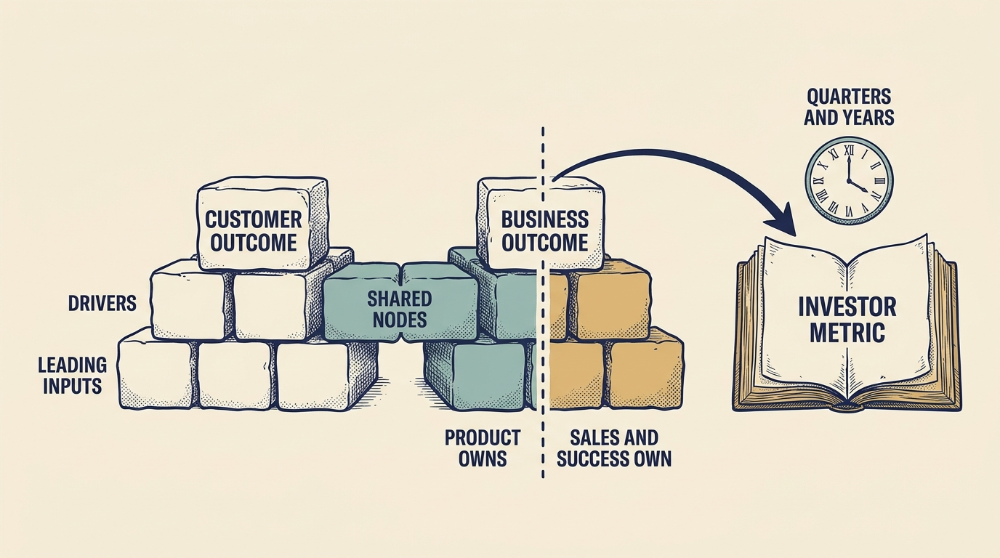

An **outcome** is a measurable change in a customer’s or the company’s situation; an **output** is what was shipped. Before choosing work, write the **outcome record**: one customer outcome in the customer’s words, one business outcome the leadership agrees on, the chain between them, the investor metric each feeds and on what clock, and what product does not own.

**Figure 1:** *One customer outcome and one business outcome, joined where they share drivers, with the boundary of what product owns and the investor metric each feeds on its own horizon.*

Larkspur is a fictional scheduling-software company; every figure is fictional. Morgan, the investor’s adviser, asks Ines, the chief executive: “What is your north star?” A feature list tells the investor nothing; a single number tells the team nothing.

**A shipped feature is a cost until an outcome moves.** A **key performance indicator (KPI)** is a number chosen to track an outcome; leading ones move first, lagging ones confirm later. A strong customer metric would still matter if the product changed completely, and customers would pay or renew to get it.

**One customer outcome.** Priya, who leads product, writes it after asking six customers: a new customer is scheduling real work within weeks of signing, without Larkspur’s specialist setting it up by hand. Metric: median weeks from contract to first real schedule, about ten on twelve implementations. Driver: setup hours per customer, about 80.

**One business outcome.** Ines gets her executive team and the investor-appointed director to agree on retention and expansion of paying customers; a customer who starts fast stays and grows.

**Two pyramids, joined.** Each outcome breaks into drivers, leading inputs and lagging confirmations; the pyramids share nodes: setup hours are a customer driver and a cost driver; a first real schedule within eight weeks is a customer confirmation and a renewal input. Product does not own renewal (customer success and pricing), second-country signings (sales) or expansion (both).

**The investor bridge, on an honest clock.** **Net revenue retention (NRR)** is this year’s recurring revenue from last year’s customers, divided by what they paid then; above 100% means they grew more than they left. Product moves NRR over quarters and years; sales moves this quarter’s bookings. The director objects: a four-year holding period cannot wait two years. The answer is a date: the first cohort of eight customers reports hours and weeks at day 90; flat there reopens the outcome pair.

**Balance is an allocation.** Customer value comes before value capture; over-monetization announces itself as churn. The roadmap is split across innovation, iteration and operation before ranking; an item enters only if it moves a node. Ranking within the slices is [[cannot-fund-everything]].

**The record** holds all of this plus the onboarding team’s two lanes (setup hours and manual share; customer data readiness). Ines, Priya, Alex, Sam and the director agreed it.

**Three answers.** North star: customers scheduling within weeks of signing, and NRR. Why not this quarter’s annual recurring revenue (ARR): the work shows in hours and weeks now and in renewals a year out, judged as each arrives. Which metrics product moves: the leading nodes directly, gross margin and retention through them, not renewal or second-country signings.
