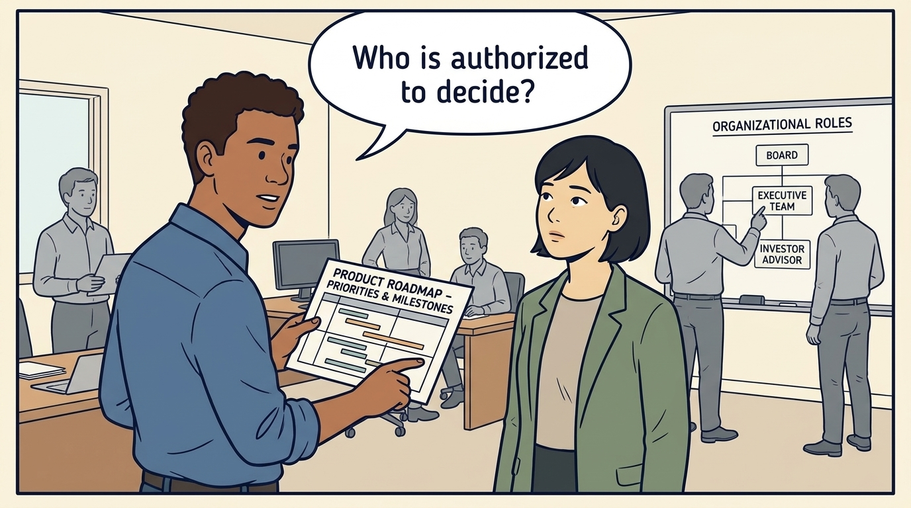
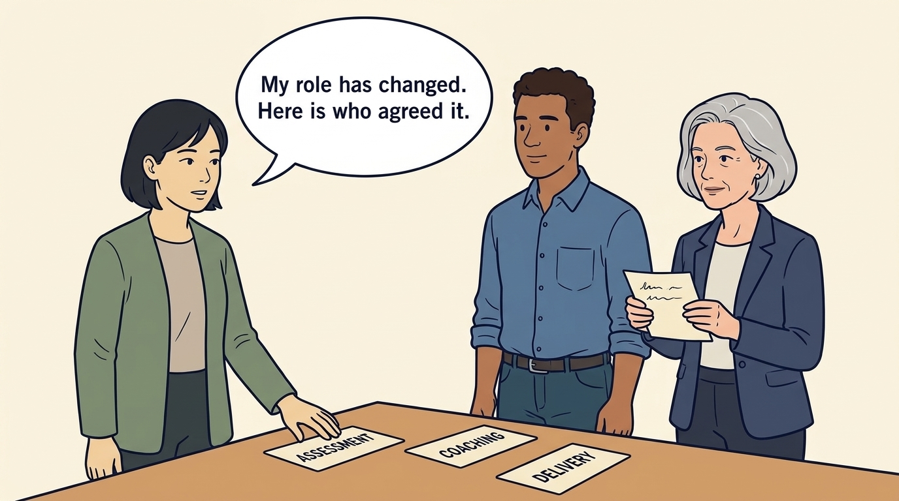

<!-- comic-style
{
  "cast": "MORGAN: a thoughtful investor technology adviser with short dark hair and a green jacket, used in the fund scenarios. ALEX: a practical CTO with curly hair and blue rolled-up sleeves. SAM: a CFO with round glasses and an amber cardigan. PRIYA: a product leader with straight dark hair and plum sleeves. INES: a CEO with short grey hair and a navy jacket. All are fictional; none represents a person in a real case.",
  "style": "Clean editorial explainer comic, dark ink outlines, restrained green, blue, and amber accents on warm white, generous space, readable short speech bubbles, expressive people and simple physical metaphors. No photorealism, logos, dense charts, or title text. Keep the same character appearances throughout the journal."
}
-->

**Comic.** The investor’s technology adviser reports to the investment firm, so the company needs to understand both the operating assignment and how findings may inform the investor’s decisions. The panels show how the company’s technology leader establishes the assignment, separates influence from authority and handles a change of role.

Morgan is an investor’s adviser in the fund scenarios; Alex leads technology, Priya leads product, and Sam leads finance. All are fictional. Comparative scenarios use separate assumptions. Historical cases are discussed through documents; the scenes do not reenact real events.

<!-- comic-panel
{
  "id": "01-scene",
  "status": "generated",
  "asset": "assets/images/15-investors-adviser/comic-01-scene.jpeg",
  "aspect_ratio": "16:9",
  "prompt": "Panel 1 of an explainer comic. Alex asks Morgan to label the purpose of the meeting before they discuss the product plan. Use one speech bubble with the exact words: \"Which job are you doing here?\" Convey: Morgan is the investment firm’s technology adviser, the Technology Principal in this book’s example. Establish whether the assignment is assessment, advice or delivery, and how findings may reach the investor.",
  "alt": "Comic panel: Alex asks Morgan to label the purpose of the meeting before they discuss the product plan.",
  "caption": "Morgan is the investment firm’s technology adviser, the Technology Principal in this book’s example. Establish whether the assignment is assessment, advice or delivery, and how findings may reach the investor.",
  "generation": {
    "model": "gemini-3-pro-image-preview",
    "reference_id": "owned-cast-20260913",
    "sha256": "4566b950d3f2019d356140f195b4c5a63b288e6b44ec2dcf54c82f7a2fa77a0c"
  }
}
-->

**Panel 1:** Morgan is the investment firm’s technology adviser, the Technology Principal in this book’s example. Establish whether the assignment is assessment, advice or delivery, and how findings may reach the investor.

*Dialogue:* “Which job are you doing here?”

<!-- comic-panel
{
  "id": "02-scene",
  "status": "generated",
  "needs_regeneration": true,
  "asset": "assets/images/15-investors-adviser/comic-02-scene.jpeg",
  "aspect_ratio": "16:9",
  "prompt": "Panel 2 of an explainer comic. Alex holds a product roadmap and asks Morgan who has the authority to approve it. Use one speech bubble with the exact words: \"Who is authorized to decide?\" Convey: Working for the investor gives a suggestion influence. Only an explicit assignment agreed by the company gives the adviser authority to approve product priorities or spending.",
  "alt": "Comic panel: Alex holds a product roadmap and asks Morgan who has the authority to approve it.",
  "caption": "Working for the investor gives a suggestion influence. Only an explicit assignment agreed by the company gives the adviser authority to approve product priorities or spending.",
  "generation": {
    "model": "gemini-3-pro-image-preview",
    "reference_id": "owned-cast-20260913",
    "sha256": "e14685bb574889feb7ad15eb1704d15f3ee8ed9f03d31b4c5657eb0ced93490a"
  }
}
-->

**Panel 2:** Working for the investor gives a suggestion influence. Only an explicit assignment agreed by the company gives the adviser authority to approve product priorities or spending.

*Dialogue:* “Who is authorized to decide?”

<!-- comic-panel
{
  "id": "03-scene",
  "status": "generated",
  "asset": "assets/images/15-investors-adviser/comic-03-scene.jpeg",
  "aspect_ratio": "16:9",
  "prompt": "Panel 3 of an explainer comic. Alex lays the company’s own evidence beside Morgan’s investment assumptions on a table. Use one speech bubble with the exact words: \"Here is what our team can demonstrate.\" Convey: Build a shared account of the company’s capabilities and the investor’s assumptions. Each side states the evidence that would change its view.",
  "alt": "Comic panel: Alex lays the company’s own evidence beside Morgan’s investment assumptions on a table.",
  "caption": "Build a shared account of the company’s capabilities and the investor’s assumptions. Each side states the evidence that would change its view.",
  "generation": {
    "model": "gemini-3-pro-image-preview",
    "reference_id": "owned-cast-20260913",
    "sha256": "805733db0ee060943fdb5fb68a7752067b59721f3c8aa2f2d88b1153bb5c654e"
  }
}
-->

**Panel 3:** Build a shared account of the company’s capabilities and the investor’s assumptions. Each side states the evidence that would change its view.

*Dialogue:* “Here is what our team can demonstrate.”

<!-- comic-panel
{
  "id": "04-scene",
  "status": "generated",
  "asset": "assets/images/15-investors-adviser/comic-04-scene.jpeg",
  "aspect_ratio": "16:9",
  "prompt": "Panel 4 of an explainer comic. Sam and Alex compare company capacity with Morgan’s commitments to several investments. Use one speech bubble with the exact words: \"What can we each commit?\" Convey: The adviser’s time is spread across investments and advice does not supply delivery capacity. Availability is a planning input for the engagement, not a judgment about the relationship.",
  "alt": "Comic panel: Sam and Alex compare company capacity with Morgan’s commitments to several investments.",
  "caption": "The adviser’s time is spread across investments and advice does not supply delivery capacity. Availability is a planning input for the engagement, not a judgment about the relationship.",
  "generation": {
    "model": "gemini-3-pro-image-preview",
    "reference_id": "owned-cast-20260913",
    "sha256": "bd8370120e00ec1f7e8d15a607b3ef4b060a471b82b2b9629f01153be0f7dd67"
  }
}
-->

**Panel 4:** The adviser’s time is spread across investments and advice does not supply delivery capacity. Availability is a planning input for the engagement, not a judgment about the relationship.

*Dialogue:* “What can we each commit?”

<!-- comic-panel
{
  "id": "05-scene",
  "status": "generated",
  "asset": "assets/images/15-investors-adviser/comic-05-scene.jpeg",
  "aspect_ratio": "16:9",
  "prompt": "Panel 5 of an explainer comic. Alex and Morgan discuss a working agreement across a desk. Use one speech bubble with the exact words: \"Can we sustain this ourselves?\" Convey: Useful support leaves company leaders better able to decide and carry out the work after the adviser’s involvement ends.",
  "alt": "Comic panel: Alex and Morgan discuss a working agreement across a desk.",
  "caption": "Useful support leaves company leaders better able to decide and carry out the work after the adviser’s involvement ends.",
  "generation": {
    "model": "gemini-3-pro-image-preview",
    "reference_id": "owned-cast-20260913",
    "sha256": "00577e12e1e92a6162992d634c098c4109bd1f92430c4eba565f762a44428635"
  }
}
-->

**Panel 5:** Useful support leaves company leaders better able to decide and carry out the work after the adviser’s involvement ends.

*Dialogue:* “Can we sustain this ourselves?”

<!-- comic-panel
{
  "id": "06-scene",
  "status": "generated",
  "needs_regeneration": true,
  "asset": "assets/images/15-investors-adviser/comic-06-scene.jpeg",
  "aspect_ratio": "16:9",
  "prompt": "Panel 6 of an explainer comic. Morgan tells Alex that the investment firm has asked for a written assessment of technology leadership, and Ines stands beside them holding a short written note for the team. Three cards on the table read coaching, assessment and delivery, with Morgan’s hand moving from the coaching card to the assessment card. Use one speech bubble with the exact words: \"My role has changed. Here is who agreed it.\" Convey: A change of role is a new agreement. The firm may ask its adviser for a view; only the company can authorize an assessment of its executive, and employees are told what the new conversations are for.",
  "alt": "Comic panel: Morgan moves a card from coaching to assessment while Ines holds a written note for the team.",
  "caption": "A change of role is a new agreement. The firm may ask its adviser for a view; only the company can authorize an assessment of its executive, and employees are told what the new conversations are for.",
  "generation": {
    "model": "gemini-3-pro-image-preview",
    "reference_id": "owned-cast-20260913",
    "sha256": "fa8a4767ff0e534ea33c837b895457722a7cb929929796de7a826b29bbae8f3d"
  }
}
-->

**Panel 6:** A change of role is a new agreement. The firm may ask its adviser for a view; only the company can authorize an assessment of its executive, and employees are told what the new conversations are for.

*Dialogue:* “My role has changed. Here is who agreed it.”
