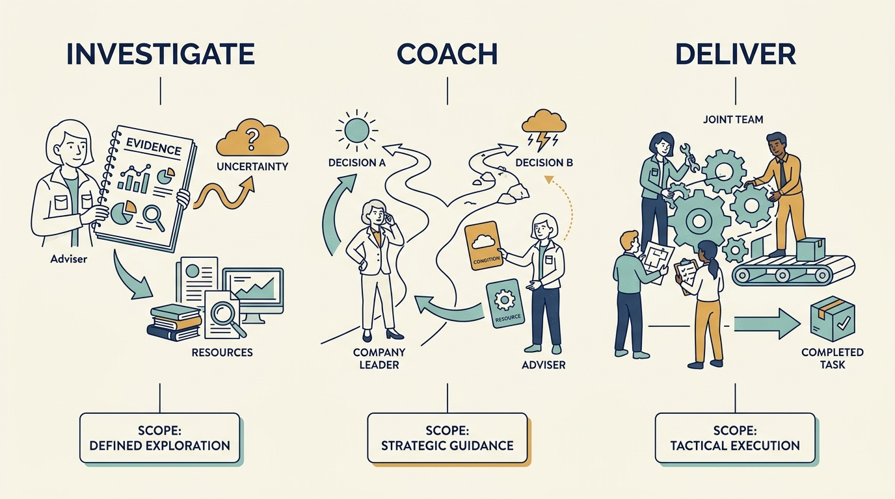
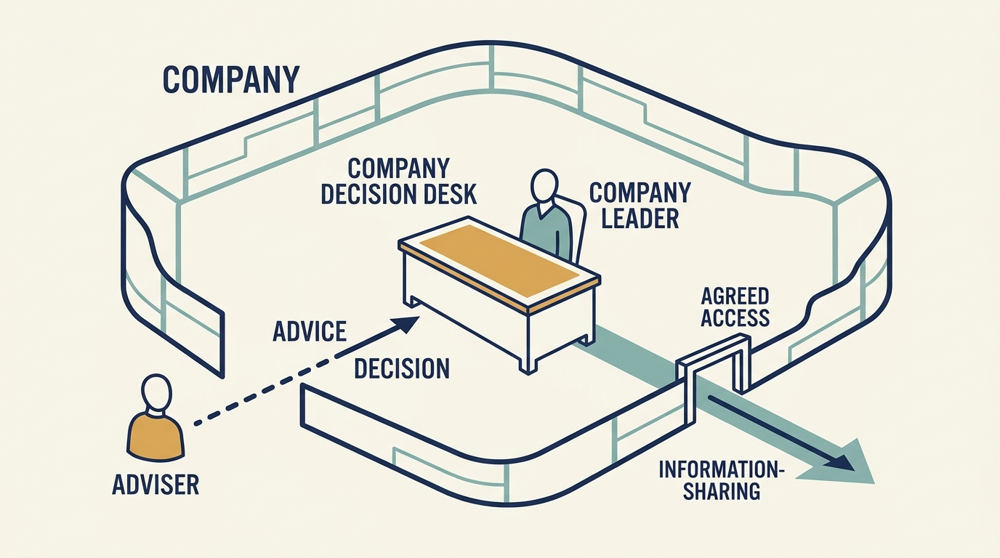

> **KEY POINTS:**
>
> * Understand the **job your adviser is doing**. Investigating an investment, coaching a leader and helping deliver a change require different agreements.
> * Make **authority and information use** explicit. Working for the investor can give an adviser influence, while company decisions still need clear owners.
> * Judge help through the **company’s decisions and capabilities**. Agree what useful work is needed and what your team will own afterward.

 
A technology specialist employed by the investor joins your planning meeting. They understand the product and offer useful ideas. Your engineers want to know whether the ideas are suggestions, a new assessment or instructions they should act on.

In this book, a **Technology Principal** is an adviser working for an investment firm who assesses technology and helps companies improve how they operate. A **chief technology officer (CTO)** leads technology inside the company. The adviser can test assumptions and improve company work; the company leader normally carries the continuing operating responsibility.

No such person exists in a company without an outside investor. Their presence follows from ownership: the investor wants its own view of the technology and a channel for improving it. That gives the adviser information and influence a supplier or consultant wouldn’t have, and leaves the company’s technology leader to work out how the adviser’s assessment relates to their own authority.

Part III examined the investments and capabilities your company needs. Part IV begins with the person who may connect those needs to the investor’s resources. This chapter first distinguishes their possible assignments, then turns to how to work together.

## Establish What Kind of Help Exists in Your Arrangement

The supplied investment-firm role brief gives a detailed example of an adviser working across investments. It doesn’t establish a position every investor has, or confer authority over a company’s CTO or product leader. [P01: supplied role brief](bibliography.html)

With a venture investor, the useful contact might instead be a partner, a talent specialist or someone introduced for one problem. A growth investor might offer experienced expansion advisers. A corporate owner might provide group architecture or security specialists who also carry internal policy responsibilities. Some investors provide no operating support at all.

Start by asking who the person works for, what their assignment is, how much time they can give and which decisions they can make. The answers separate an offer of advice from a delivery assignment and from a requirement to follow group policy. The rest of this chapter uses the fund adviser as its detailed example; ask the role questions before transferring the arrangement.

## Understand Which Job the Adviser Is Doing

The adviser may contribute to several different decisions. **Due diligence** is the investigation that informs an investment decision. **Coaching** helps a person develop their own judgment and practice. **Operating support** helps the company improve how work gets done. A specific assignment may also give the adviser formal oversight or temporary delivery responsibilities.

These purposes can overlap, but everyone involved should know which apply. A confidential conversation about developing your leadership differs from evidence gathered for a formal assessment. Advice about a system differs from responsibility for changing it.

| Assignment | What company leaders may need | Boundary to establish |
| --- | --- | --- |
| Investigation before investment | A fair account of strengths, constraints and required funding | Evidence scope, access and how findings will inform the plan |
| Advice on an operating decision | Relevant options, experience and specialist judgment | Who decides, which assumptions matter and what remains uncertain |
| Help delivering a change | People and practical work that resolve a constraint | Resources, company accountability and what happens after the assignment |
| Coaching or leadership development | Help learning and improving judgment | Confidentiality and any connection to formal performance assessment |
| Ongoing oversight | Useful review of results, risks and changed assumptions | Reporting expectations and the route for decisions needing escalation |

Ask the adviser to explain their responsibilities to both the company and the investment firm. Their role may include prospective investments and other companies, which affects availability. Working together is easier when those demands are visible.

**Figure 1:** *Identify the job before agreeing access, authority and the result the company expects.*

## Agree What Each Person Can Decide

**Authority** means permission to make a particular decision. It can come from an executive role, board responsibilities or an explicit assignment. A job title and proximity to the owner don’t settle every decision boundary.

State which questions the adviser can recommend on, which they can decide and which need company or board approval. If the adviser is asked to lead delivery or act as a temporary executive, set up that assignment with the resources and accountability it needs.

The investor’s adviser can carry substantial influence even when the service is described as optional. Employees may treat a suggestion as an instruction. Explain the agreed arrangement to the people doing the work, using the decision map from [[decide-who-decides]].

For a product or architecture choice, start from the business need, the options and their consequences. The adviser may help test the options. The agreed company decision-maker then owns the choice and its delivery conditions.

**Figure 2:** *Influence, access and formal decision authority need separate agreements.*

## Build a Shared Account of the Situation

A productive relationship needs consistent facts. Explain customer commitments, existing constraints and why the team made earlier choices. Ask the adviser which investment assumptions depend on those capabilities and what evidence could change their view.

For the fictional company Larkspur, “we need a better platform” is vague. “Pricing changes take three weeks because only two people understand the billing code” exposes a real constraint. The next question is whether the plan needs faster pricing experiments, more people who can maintain the code or a different technical design.

The company shouldn’t need one confident story for the investor and another account of the real constraints for engineers. **Preserve the same facts** and adjust only the level of detail to the audience. A short explanation can still include uncertainty and feasible alternatives.

Disagreement can improve that account. Ask which observation supports a conclusion and what would overturn it. An adviser should be able to revise an assessment, and company leaders should be able to reconsider a familiar practice, without either treating the revision as a personal defeat.

## Distinguish Advice from Delivery Help

An adviser may identify a problem, connect a specialist, review a plan or carry out a bounded piece of work. Agree which contribution the company needs before assuming the adviser will deliver the whole improvement.

If Larkspur needs a reusable setup process for new customers, advice might establish the options. Implementation also needs engineering time, product decisions and people who will operate the result. Each commitment belongs in the plan.

Some situations justify temporary dependence on an adviser or specialist: a leadership departure, a service crisis or a difficult transition. The company should know who has authority, how long the arrangement can last and **what will sustain the capability afterward**.

The detailed agreement belongs in [[useful-engagement]]. Here, the first task is to establish the type of help and the responsibility that stays inside the company.

## Check Availability and Competing Demands

The adviser may have responsibilities across several investments. A useful conversation can still lead to a plan they don’t have time to support. Ask who can take part, when they can start, what specialist budget exists and what happens if another urgent assignment arrives.

If the support isn’t available, consider another specialist, a smaller first step or a revised timetable. **Availability is a planning input**, not a judgment about whether either side values the relationship.

Also agree how possible conflicts will be handled. An adviser who helps develop your team may also inform the investor’s view of leadership. Clarifying that role and the use of information is part of making the relationship workable.

## Judge What the Company Can Do Better

Useful support can leave a better decision, a tested assumption, a resolved constraint or a capability the company can sustain. Meeting counts describe activity, not benefit.

Review the company’s result and the effort required from both sides. Be clear about the adviser’s contribution alongside the work of the product, engineering, customer and finance teams. A shared success doesn’t need to be assigned to one person.

The adviser is one possible connection into a wider set of resources. The next chapter maps the expertise, peer companies, hiring support and introductions that may help your company: [[help-that-changes-capability]].

## Questions to Consider

1. *Who from your investor is involved in your technology decisions, what assignment do they have, how much time can they give and which decisions can they make?*
2. *Which job is the adviser doing with you now: diligence, advice, delivery, coaching or oversight? Do both of you agree on the answer?*
3. *Do your engineers know whether the adviser’s suggestions are ideas or instructions? Who told them?*
4. *Do you give the investor one confident story and your engineers another? What would it take to use the same facts in both?*
5. *What evidence would change the adviser’s view of your technology, and what evidence would change yours?*
6. *After the adviser’s current involvement ends, what will the company be able to do that it could not do before?*

## To Probe Further

- **[Corporate Governance and Value Creation: Evidence from Private Equity](https://academic.oup.com/rfs/article-abstract/26/2/368/1582364)** — Viral Acharya, Oliver Gottschalg, Moritz Hahn and Conor Kehoe, The Review of Financial Studies, 2013. *Deal-level evidence that an investor partner's background shapes the deal, which explains why investors field operating specialists and what each adviser is likely to look for.*
- **[Flawless Consulting: A Guide to Getting Your Expertise Used](https://www.wiley.com/en-us/flawless-consulting-a-guide-to-getting-your-expertise-used-4th-edition-p-9781394177301)** — Peter Block, Wiley, fourth edition, 2023. *A guide written for the person giving advice, which read from the receiving side shows what a well-run adviser relationship should ask of you.*
- **[Humble Consulting](https://bkconnection.com/products/9781626567214_humble-consulting)** — Edgar Schein, Berrett-Koehler, 2016. *Argues that useful help starts with asking rather than telling, which supports the chapter's call to build consistent facts with the adviser before accepting a diagnosis.*
- **[ICF Code of Ethics](https://coachingfederation.org/credentialing/coaching-ethics/icf-code-of-ethics/)** — International Coaching Federation, in force from April 2025. *The professional code requiring coaches to agree confidentiality and information sharing with client and sponsor, relevant when an adviser who coaches you also informs the investor's view.*
