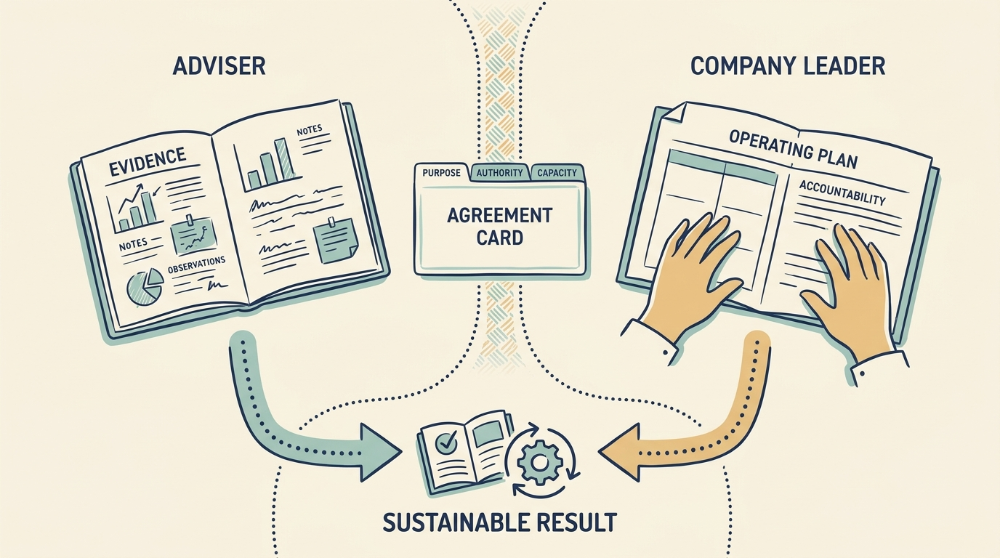

An **investor’s technology adviser** is a person the investment firm employs or engages to form its own view of a company’s technology and, often, to help improve it. This book’s supplied example of the role is the **Technology Principal**, held by Morgan in the fictional Larkspur scenarios. A **chief technology officer (CTO)** leads technology inside the company. The adviser may test investment assumptions, improve decisions or deliver a defined piece of support, while company leaders carry the continuing operating responsibility. What distinguishes this adviser is not privileged access, which a board-appointed consultant can also have. This adviser reports to the investment firm, so the company needs to understand both the operating assignment and how findings may inform the investor’s decisions.

**Figure 1:** *Agree the adviser’s assignment without obscuring company responsibility.*

The description draws on a supplied private role brief. It is one arrangement, not a universal definition or an automatic grant of authority over company staff and budgets. [P01: supplied role brief](bibliography.html) Ask who employs the person, what their assignment is, how much time they have and which decisions they are authorized to make.

Begin by establishing **which job the adviser is doing**. **Due diligence** investigates a business before an investment decision. **Coaching** develops a person’s judgment. **Operating support** improves company work. Deciding is not a sixth kind of help; it is authority that may attach to an assignment. Employees should be able to say whether they are hearing an assessment finding, a recommendation or an authorized instruction.

**Separate influence from authority.** Proximity to the investor gives a suggestion weight. Engineers receiving priorities from the adviser, the CTO and the investment team are working under a parallel reporting line with no mandate. Use the company’s decision map, name what the adviser may recommend on and what the accountable leader decides, and tell the team. The question to keep asking is “Who is authorized to decide?”

The hardest case is a change of role. In a fictional scene, Morgan has been coaching Alex for three months when the investment firm asks Morgan for a written view of Larkspur’s technology leadership. Before sharing anything sensitive, Alex can ask what a conversation is for, who receives what he says, whether it feeds an assessment and what Morgan is already obliged to report. Morgan must explain the request, what will be shared and that confidentiality cannot exceed the obligations already agreed. The firm may ask for an opinion, but only the company, through Ines or the board, can make Morgan an assessor of a company executive or an interim delivery leader. Employees are then told in writing what the new assignment is, for how long and which instructions still come from Alex.

Build a **shared account** of the situation: the same facts for investor and engineers, with each side stating the evidence that would change its view. The planning meeting then opens with two agreed sentences: Morgan’s contribution is a recommendation, and Alex is authorized to decide the technical plan within the approved budget.
