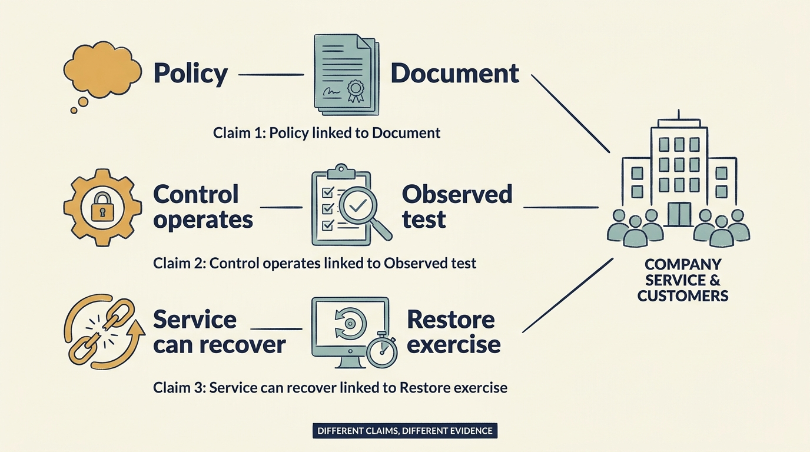
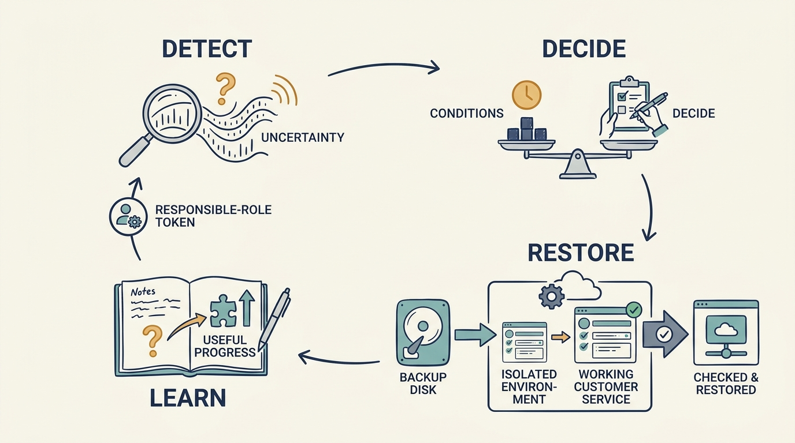

> **IN THIS SECTION, YOU WILL:** Learn to state a recovery objective in ordinary language, judge a restore test against it, fund the corrective work, retest and record the exposure that remains.

> **WHY INVESTORS CARE:** A service that cannot be restored is an unpriced liability in the investor’s holding; evidence of a tested recovery is what lets the risk be accepted knowingly rather than discovered in a crisis or a sale process.

> **WHY YOU SHOULD CARE:** A completed backup is not evidence that dispatch can resume within four hours; the difference is usually discovered on the morning the company can least afford it.

> **KEY POINTS:**
>
> * Start with the **business function that must keep working** and state the recovery objective in ordinary language: how soon service must resume and how much recent work may be lost.
> * **Evidence of a backup is not evidence of an operating service**. A restore test is judged against the objective, and a failed test is a finding to fund, not a slide to defer.
> * After the retest, **record what remains exposed and who accepted it**. A modelled reduction in future losses supports that decision; it is not a booked profit.

 
At six in the morning a dispatcher at one of Larkspur’s customers, a maintenance business, opens the scheduling service to assign the day’s jobs. It doesn’t load. Twenty engineers are in vans waiting to be told where to go, and the customers of that business were promised arrival windows the previous afternoon. Every hour the service stays down, the dispatcher is working from memory and a phone. This is a fictional scenario, and it is what the rest of this chapter is about.

**Cybersecurity** protects systems and information against threats such as unauthorized access, theft or damage. **Resilience** is the ability to continue or restore essential work through disruption. **Recovery** is the work of restoring service after something goes wrong. The dispatcher doesn’t care which of the three failed. The question for Larkspur is what evidence it has that dispatch would resume, how soon, and what it would cost to obtain that evidence before a real morning like this one.

A company has to fund these capabilities before suffering the loss they’re meant to prevent. That creates two temptations: invent a precise amount of “risk avoided,” or retreat into a checklist that says little about business exposure. Larkspur’s ownership arrangement changes the conditions of the decision rather than the decision itself. Recovery work competes for the same board-approved cash and engineer-weeks as the onboarding pilot and the customer portal in the chapter [[cannot-fund-everything]]: one envelope of €500,000 and 24 engineer-weeks for the first hundred days, with a reserve inside it that only the board can release. The technical diligence before the investment recorded a finding, D-6, that there was no evidence the service could be restored completely. The company decision-maker for that work is the Larkspur board, which approves the plan and its funding; Ines, the CEO, authorizes within it; Alex, the CTO, is accountable for the result. Morgan, the investor’s technology adviser, can help obtain specialist judgment and explain the finding to the investor, but doesn’t decide what Larkspur funds.

The cloud chapter examined observed spending and service quality. Recovery also needs evidence, but part of its benefit is a lower chance or severity of future harm. We follow one restore from a stated objective through a failed test, funded corrective work, a retest and a decision about what remains.

The US **National Institute of Standards and Technology (NIST)** publishes Cybersecurity Framework 2.0. Released in February 2024, it groups security outcomes under six headings: Govern, Identify, Protect, Detect, Respond and Recover. It explicitly avoids prescribing one implementation for every organization. [S17: NIST CSF 2.0](https://nvlpubs.nist.gov/nistpubs/CSWP/NIST.CSWP.29.pdf) That makes it a useful source of consistent questions while leaving room for company-specific answers. This chapter stays inside Recover, with Govern and Respond where the case needs them.

## State the Objective in Ordinary Language

The security discussion starts with the consequence at 6am: the business function customers depend on, and the people affected when it fails. For that function, ask what interruption, corruption or unauthorized access would mean. How long can the business continue without it? Which customers face material harm? Which contracts, laws or insurance conditions need specialist interpretation? What manual alternatives exist, and have they been tested?

The answers become a **recovery objective**, a plain statement of how soon service must resume and how much recent work may be lost. Larkspur’s, agreed between Priya, the customer team and Alex and approved by Ines, is:

> *Dispatch must resume within four hours of a failure, with no more than fifteen minutes of lost schedule updates.*

Four hours is the longest a customer’s morning dispatch can slip before the day is lost. Fifteen minutes is the amount of schedule change a dispatcher can re-enter from memory. This is an agreed fictional objective, not a legal standard; a company with regulated obligations will have some set for it. What matters is that the objective is written in terms a dispatcher would recognize, because that is what the restore test will be judged against.

An asset inventory is useful when it supports those questions. One that counts systems without identifying their role in critical work can look complete while missing **the most consequential dependency**.

## Match Each Claim to the Evidence That Supports It

A policy describes intended behavior. A **configuration record** shows how a system was set up at a point in time. A test shows what happened under particular conditions. An independent assessment adds another perspective but has a defined scope. None alone proves the company will withstand every incident.

A **backup** is a stored copy of data used to recover from loss or damage. A **restore** puts that data back into use. The diligence before the investment found that Larkspur’s backups had run without error for three years. No one had attempted a full restore in that time. That became finding D-6, and in the first-hundred-days plan it became a funded item, REC-1: a restore test against the recovery objective, with Alex accountable together with the operations lead (see the chapter [[first-hundred-days]]). The plan gave it €80,000 and four engineer-weeks, chosen ahead of the customer portal because the recovery requirement was an agreed customer commitment and the portal’s benefit was still uncertain. The money and the weeks bought a restore environment, the work to reach the backup store, backups of schedule data every fifteen minutes instead of nightly, and the test itself.

The day-45 test took eleven hours and stopped twice. The first obstacle was a missing **credential**, information needed to prove someone may access a system: the account that could read the backup store belonged to an engineer who had left. The second was an unavailable version of the database software that organizes and stores the application’s data: the backup could only be loaded into the version it was taken from, the new restore environment ran a later one, and the version the backup needed was no longer available for a new environment. When the service finally came up, the data was as of the previous night’s full backup; the fifteen-minute backups were running by then, but nobody had written down the step that applies them.

Against the objective, the test failed twice over. Eleven hours against four. A night of lost schedule updates against fifteen minutes. Backups running is evidence about backups. Restoring the service is evidence about the business. Test the operating outcome, not the presence of a control.

That is also what a restore test has to demonstrate: not that data came back, but that it is complete and consistent, that the right people can reach it, that the application and the services it depends on start against it, and that a dispatcher can assign a job end to end within the objective. A **certification**, a formal statement that specified requirements were met under a particular assessment process, is read the same way: which organization, systems, requirements and period it covers. It isn’t a guarantee that every part of the company is secure today.

**Figure 1:** *Match the evidence to the capability you say the company has.*

## Fund the Corrective Work

A failed test is a finding with a price, and by day 45 the price in the plan had already been paid. The €80,000 and four engineer-weeks REC-1 was given in the chapter [[cannot-fund-everything]] had gone on the restore environment, the backup-store access work, the fifteen-minute backups and the eleven-hour test. That is **sunk cost**, spending that cannot be recovered; it belongs in the record, but it buys nothing further, and the customer commitment it was meant to prove has not gone away.

What the correction has to buy, in this fictional scenario: a restore environment kept at the same database version as production; credentials for the backup store held in a managed service with a documented emergency procedure that two named people can execute; and a written rehearsal the operations lead can run without Alex, including the step that applies the fifteen-minute backups so the data-loss half of the objective is met. Alex costed it at €20,000 and two engineer-weeks, with a retest by day 85.

Two alternatives were considered and rejected. Deferring the correction until the next financing round was rejected because the objective is an agreed customer commitment, and “deferred until funding” doesn’t say who accepted a night of lost dispatch in the meantime. A redesign that runs the service in two regions at once was rejected because its cost sits well outside the envelope and a four-hour objective doesn’t require it. Alex proposed. Sam confirmed that the plan’s own allocation was spent and that the €20,000 and two weeks could come only from the envelope’s uncommitted reserve of €220,000 and six engineer-weeks. Because a reserve draw changes what the envelope funds, it was not Ines’s to approve: she took it to the board, which approved it at about day 47 (the chapter [[decide-who-decides]] describes that rule). Committed spending rose from €280,000 to €300,000 and from 18 to 20 engineer-weeks; the reserve fell to €200,000 and four weeks. The decision would change if the retest failed again, which would send the remaining reserve to recovery before anything else; if the retest showed the objective could not be met without the larger redesign; or if customer contracts changed the objective.

### Inset: Put a Number on Risk Without Faking a Profit

The arithmetic that often accompanies such a request is worth showing once, and bounding. Suppose a prolonged Larkspur outage would cost €4 million in contractual credits, remediation and lost customers, and the team estimates a 5% annual chance of one. The **expected annual loss** is the probability multiplied by the assumed loss: 5% × €4 million = €200,000. It’s an average implied by the assumptions, not a prediction that the company loses that amount each year. If REC-1 is estimated to cut the probability to 2%, the expected loss becomes €80,000, a €120,000 difference against REC-1’s €100,000 total cost, €80,000 planned and €20,000 corrective.

The result depends on both the probability estimate and the assumed loss, and the 2% is an illustrative assumption about a control, not measured effectiveness. If the probabilities are weak, so is the answer; state them as ranges and say what evidence would narrow them. The average alone is also insufficient when one event could cause several failures together or threaten the company’s survival: **a 2% chance of not surviving is not made acceptable by an affordable-looking average.** Above all, don’t add the €120,000 to recorded operating earnings. It’s a modelled change in risk exposure, **not a booked operating gain**. In Larkspur’s case the arithmetic supports the decision; the agreed objective is the reason for it.

## Retest, Then Record What Remains

The corrected restore was rerun at day 85. Dispatch resumed within the four-hour objective with under fifteen minutes of lost schedule updates, and a dispatcher from the customer team assigned a job on the restored service. The retest demonstrates the agreed objective for one defined failure: loss of the application environment in this region, the servers, database and configuration the service runs on, rebuilt from backups in the same cloud region. It does not demonstrate recovery after an outage of the region itself. REC-1 closed as passed at the day-100 review with that scope written into the record, at a total cost of €100,000 and six engineer-weeks.

A passed test doesn’t make the exposure zero; it changes what the exposure is. Larkspur’s day-100 record lists what the test did not cover: a failure of the cloud provider’s region itself, which the single restore environment cannot survive; a rehearsal run only on a weekday outside the dispatch window; and the dependence of the emergency credential procedure on two people. **Residual risk**, the risk remaining after the chosen protections, is written down with those limits, and Ines accepts it on the board’s behalf with a quarterly repeat of the test. The regional exposure is recorded as a separate item with its own decision date: the quarterly review at about day 190, when the second-country expansion is reconsidered and a second region would have a business reason beyond recovery.

Documented acceptance has a limit of its own. It records who decided to live with a known gap; it cannot make an unmet mandatory obligation disappear. If a customer contract, a law or an insurance condition requires something the company hasn’t met, a signed acceptance is evidence of a decision, not compliance. Specialist interpretation governs that question, and it should be sought before the acceptance is signed.

## Incident Response Is an Operating Capability

Restoring from a clean failure is one scenario. An incident can require simultaneous technical work, customer communication, legal judgment, financial decisions and coordination with the investor. A response plan should name the decision process before urgency compresses it.

A practical exercise tests a plausible scenario. Larkspur’s: the scheduling service is returning wrong engineer assignments, nobody yet knows why, the largest customer wants an answer within the hour, and restoring from backup may destroy the evidence needed to find the cause. The exercise should reveal who can decide, which specialists are available and how the team communicates uncertainty. It shouldn’t be staged merely to show that a plan exists.

Legal notification deadlines, sector requirements and contractual duties vary and can change. In a live incident, the organization needs current advice for its jurisdictions and facts. This chapter supplies the operating questions, not a universal deadline.

**Figure 2:** *Restoration is a capability to practice and verify, with clear responsibility throughout.*

## Every Finding Needs an Accountable Leader

An investigation finding such as “identity controls are inadequate” is incomplete. **Identity controls** determine how users prove who they are and what they may access. Which systems and people are exposed? What is the material scenario? What action is feasible now, and what needs a funded follow-up? Who has the authority and capacity to carry out each action?

The investor’s technology adviser can help obtain specialist judgment and communicate the implication to the investor. The company needs an accountable leader for each finding, and the board needs to understand the residual risk and whether it’s large enough to affect a company decision. A consultant’s recommendation doesn’t transfer responsibility for the business to the consultant. During a transaction, some findings may affect conditions, price, insurance or whether the deal proceeds, and others may be accepted with an action plan; the chapter [[diligence-corrects-the-plan]] covers that distinction, which should follow materiality and evidence rather than the desire to keep all findings the same color.

## Shared Support and Changing Owners

A corporate investor may offer a shared security platform; a minority investor may ask for customer data to help assess a risk; an investor’s network may supply scarce specialists. Each can make the company more capable, and each can create a common point of failure or an access boundary the company hasn’t agreed. Establish the purpose, permitted access and responsibility for an incident before moving information or systems, and verify that the company can still **detect, communicate and recover** if the service or the investor changes. The chapter [[useful-engagement]] in Part IV sets out how to agree that support.

The same evidence should survive a change of owner. A restore that passed against a stated objective, with its residual risks written down, is worth more to the next owner than an orderly **data room**, a controlled collection of documents shared with a prospective buyer. The chapter [[handover-of-obligations]] covers carrying that evidence across the transaction.

A sound recovery decision connects a harmful scenario to a stated objective, a test that failed or passed against it, the funded work in between, and someone authorized to accept what remains. Evidence of a backup is evidence about a backup. Evidence of an operating service is what the dispatcher at 6am needs, and it is what the board should be asked to fund. At Larkspur that evidence now has a date on it: the operations lead runs the next restore in the first quarter after day 100, against the same four hours and fifteen minutes, for the same loss of the application environment, and the region question comes back to the board at about day 190.

Larkspur could judge its recovery spending by a test it could run and watch. The next chapter turns to spending whose benefit is harder to observe and easier to assert: an AI strategy, which hides three separate investment questions behind one word. Continue with the chapter [[ai-strategy-three-questions]].

## Questions to Consider

1. *Which business function must keep working for your customers, and what is your recovery objective for it in words a customer would recognize?*
2. *When did your team last restore that service under realistic conditions, and how did the result compare with the objective?*
3. *For your largest security or recovery proposal, what scenario does it address, what test shows it works, and who is authorized to accept the risk that remains?*
4. *Has a modelled reduction in expected loss ever been presented in your company as if it were an operating gain?*

## To Probe Further

- **[Contingency Planning Guide for Federal Information Systems (SP 800-34 Rev. 1)](https://csrc.nist.gov/pubs/sp/800/34/r1/upd1/final)** — National Institute of Standards and Technology, 2010. *The standard method for this chapter's first step, a business impact analysis that names the functions that must keep working and how long each can be down.*
- **[Ransomware-resistant backups](https://www.ncsc.gov.uk/collection/ransomware-resistant-backups)** — UK National Cyber Security Centre, 2024. *Principles for backups that survive an attacker who targets them first, and the point behind this chapter's restore story that a backup is only evidence once tested.*
- **[Incident Response Recommendations and Considerations for Cybersecurity Risk Management (SP 800-61 Rev. 3)](https://csrc.nist.gov/pubs/sp/800/61/r3/final)** — National Institute of Standards and Technology, 2025. *The current incident response guidance, mapped onto the Cybersecurity Framework headings this chapter uses and treating response as a capability rather than a document.*
- **[CISA Tabletop Exercise Packages](https://www.cisa.gov/resources-tools/services/cisa-tabletop-exercise-packages)** — US Cybersecurity and Infrastructure Security Agency, living page. *Ready-made ransomware scenarios and templates for the kind of exercise this chapter describes, where the point is to find out who can decide.*
- **[How to Measure Anything in Cybersecurity Risk, 2nd edition](https://www.wiley.com/en-us/How+to+Measure+Anything+in+Cybersecurity+Risk,+2nd+Edition-p-9781119892304)** — Douglas Hubbard and Richard Seiersen, Wiley, 2023. *Extends this chapter's expected-loss arithmetic into a workable method of ranges, calibrated judgement and simple simulation, from authors who also sell consulting on it.*
- **[The Open FAIR Body of Knowledge](https://www.opengroup.org/open-fair)** — The Open Group, living page. *The standard taxonomy for quantified security risk, so the company's own estimate can be compared with an investor's adviser or insurer on the same definitions.*
