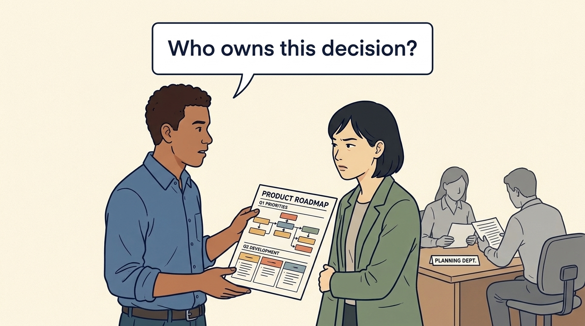
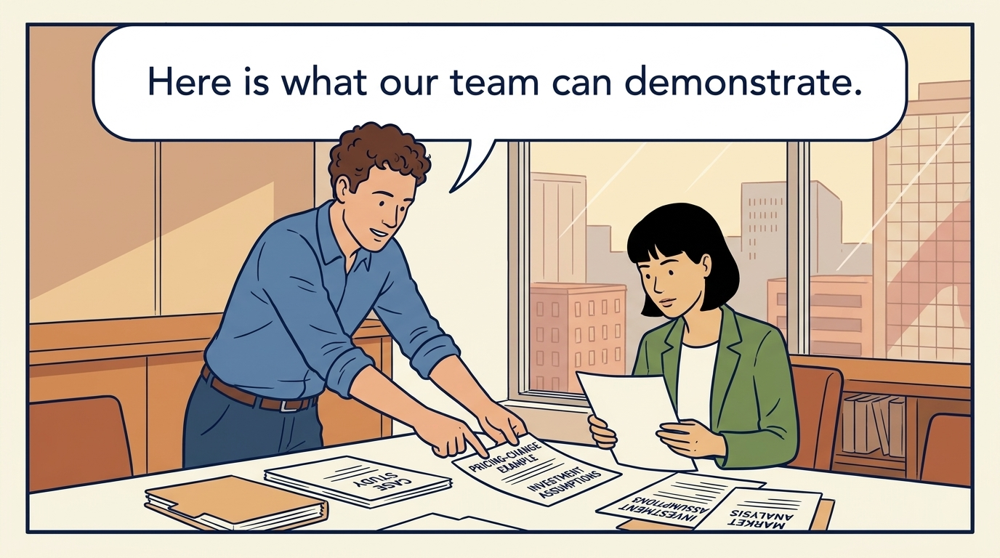
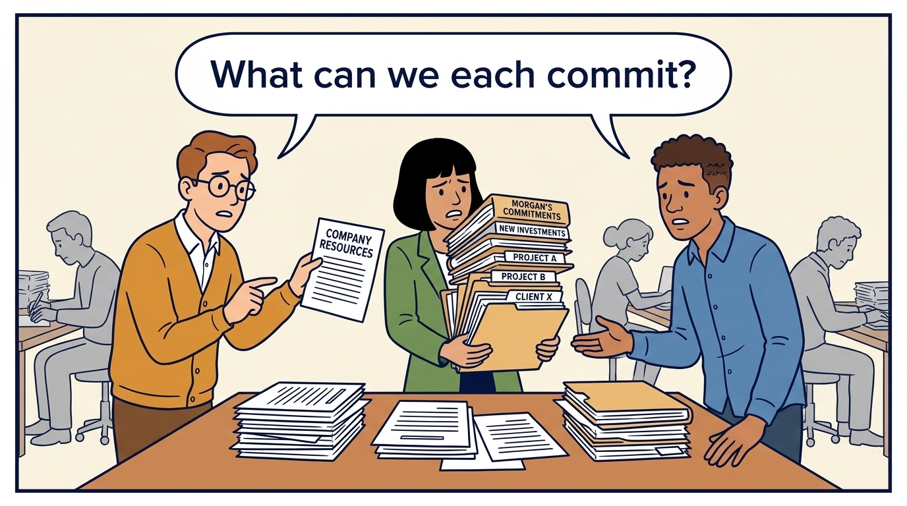
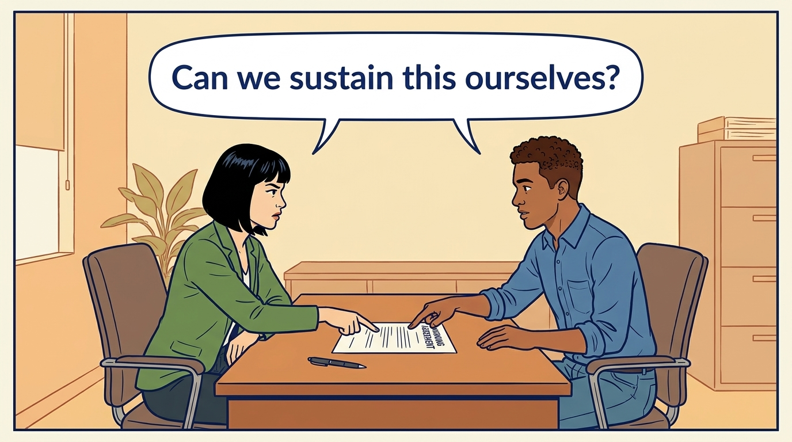

<!-- comic-style
{
  "cast": "MORGAN: a thoughtful investor technology adviser with short dark hair and a green jacket, used in the fund scenarios. ALEX: a practical CTO with curly hair and blue rolled-up sleeves. SAM: a CFO with round glasses and an amber cardigan. PRIYA: a product leader with straight dark hair and plum sleeves. INES: a CEO with short grey hair and a navy jacket. All are fictional; none represents a person in a real case.",
  "style": "Clean editorial explainer comic, dark ink outlines, restrained green, blue, and amber accents on warm white, generous space, readable short speech bubbles, expressive people and simple physical metaphors. No photorealism, logos, dense charts, or title text. Keep the same character appearances throughout the journal."
}
-->

**Comic.** No adviser of this kind exists without an outside investor. The panels show what the role gives the adviser, information and influence a consultant would not have, and how the company’s technology leader keeps their own authority clear alongside it.

Morgan is an investor’s adviser in the fund scenarios; Alex leads technology, Priya leads product, and Sam leads finance. All are fictional. Comparative scenarios use separate assumptions. Historical cases are discussed through documents; the scenes do not reenact real events.

<!-- comic-panel
{
  "id": "01-scene",
  "status": "generated",
  "asset": "assets/images/15-technology-principal/comic-01-scene.jpeg",
  "aspect_ratio": "16:9",
  "prompt": "Panel 1 of an explainer comic. Alex asks Morgan to label the purpose of the meeting before they discuss the product plan. Use one speech bubble with the exact words: \"Which job are you doing here?\" Convey: The Technology Principal is the investment firm’s technology adviser in this book. Company leaders should establish whether the assignment concerns assessment, advice or delivery.",
  "alt": "Comic panel: Alex asks Morgan to label the purpose of the meeting before they discuss the product plan.",
  "caption": "The Technology Principal is the investment firm’s technology adviser in this book. Company leaders should establish whether the assignment concerns assessment, advice or delivery.",
  "generation": {
    "model": "gemini-3-pro-image-preview",
    "reference_id": "owned-cast-20260913",
    "sha256": "4566b950d3f2019d356140f195b4c5a63b288e6b44ec2dcf54c82f7a2fa77a0c"
  }
}
-->

**Panel 1:** The Technology Principal is the investment firm’s technology adviser in this book. Company leaders should establish whether the assignment concerns assessment, advice or delivery.

*Dialogue:* “Which job are you doing here?”

<!-- comic-panel
{
  "id": "02-scene",
  "status": "generated",
  "asset": "assets/images/15-technology-principal/comic-02-scene.jpeg",
  "aspect_ratio": "16:9",
  "prompt": "Panel 2 of an explainer comic. Alex asks Morgan to approve a product roadmap. Use one speech bubble with the exact words: \"Who owns this decision?\" Convey: Working for the owner does not automatically authorize the adviser to approve a company’s product priorities or spending.",
  "alt": "Comic panel: Alex asks Morgan to approve a product roadmap.",
  "caption": "Working for the owner does not automatically authorize the adviser to approve a company’s product priorities or spending.",
  "generation": {
    "model": "gemini-3-pro-image-preview",
    "reference_id": "owned-cast-20260913",
    "sha256": "e14685bb574889feb7ad15eb1704d15f3ee8ed9f03d31b4c5657eb0ced93490a"
  }
}
-->

**Panel 2:** Working for the owner does not automatically authorize the adviser to approve a company’s product priorities or spending.

*Dialogue:* “Who owns this decision?”

<!-- comic-panel
{
  "id": "03-scene",
  "status": "generated",
  "asset": "assets/images/15-technology-principal/comic-03-scene.jpeg",
  "aspect_ratio": "16:9",
  "prompt": "Panel 3 of an explainer comic. Alex places a three-week pricing-change example beside Morgan’s investment assumptions. Use one speech bubble with the exact words: \"Here is what our team can demonstrate.\" Convey: Build a shared account of the company’s capabilities and the investor’s assumptions. Explain the evidence, constraints and feasible alternatives.",
  "alt": "Comic panel: Alex places a three-week pricing-change example beside Morgan’s investment assumptions.",
  "caption": "Build a shared account of the company’s capabilities and the investor’s assumptions. Explain the evidence, constraints and feasible alternatives.",
  "generation": {
    "model": "gemini-3-pro-image-preview",
    "reference_id": "owned-cast-20260913",
    "sha256": "805733db0ee060943fdb5fb68a7752067b59721f3c8aa2f2d88b1153bb5c654e"
  }
}
-->

**Panel 3:** Build a shared account of the company’s capabilities and the investor’s assumptions. Explain the evidence, constraints and feasible alternatives.

*Dialogue:* “Here is what our team can demonstrate.”

<!-- comic-panel
{
  "id": "04-scene",
  "status": "generated",
  "asset": "assets/images/15-technology-principal/comic-04-scene.jpeg",
  "aspect_ratio": "16:9",
  "prompt": "Panel 4 of an explainer comic. Sam and Alex compare company capacity with Morgan’s commitments to several investments. Use one speech bubble with the exact words: \"What can we each commit?\" Convey: Check the adviser’s availability and the company resources needed. Relevant advice does not automatically supply delivery capacity.",
  "alt": "Comic panel: Sam and Alex compare company capacity with Morgan’s commitments to several investments.",
  "caption": "Check the adviser’s availability and the company resources needed. Relevant advice does not automatically supply delivery capacity.",
  "generation": {
    "model": "gemini-3-pro-image-preview",
    "reference_id": "owned-cast-20260913",
    "sha256": "bd8370120e00ec1f7e8d15a607b3ef4b060a471b82b2b9629f01153be0f7dd67"
  }
}
-->

**Panel 4:** Check the adviser’s availability and the company resources needed. Relevant advice does not automatically supply delivery capacity.

*Dialogue:* “What can we each commit?”

<!-- comic-panel
{
  "id": "05-scene",
  "status": "generated",
  "asset": "assets/images/15-technology-principal/comic-05-scene.jpeg",
  "aspect_ratio": "16:9",
  "prompt": "Panel 5 of an explainer comic. Alex takes ownership of a better decision record. Use one speech bubble with the exact words: \"Can we sustain this ourselves?\" Convey: Useful support leaves company leaders better able to decide and carry out the work.",
  "alt": "Comic panel: Alex and Morgan discuss a working agreement across a desk.",
  "caption": "Useful support leaves company leaders better able to decide and carry out the work.",
  "generation": {
    "model": "gemini-3-pro-image-preview",
    "reference_id": "owned-cast-20260913",
    "sha256": "00577e12e1e92a6162992d634c098c4109bd1f92430c4eba565f762a44428635"
  }
}
-->

**Panel 5:** Useful support leaves company leaders better able to decide and carry out the work.

*Dialogue:* “Can we sustain this ourselves?”

<!-- comic-panel
{
  "id": "06-scene",
  "status": "generated",
  "asset": "assets/images/15-technology-principal/comic-06-scene.jpeg",
  "aspect_ratio": "16:9",
  "prompt": "Panel 6 of an explainer comic. Morgan and Alex compare a fund adviser, an introduced specialist and a corporate function on three cards. Use one speech bubble with the exact words: \"Which role are you doing here?\" Convey: The supplied Technology Principal is one fund-specific role. Other investors may offer a partner, a specialist or no operating team. Establish the actual assignment, time and authority.",
  "alt": "Comic panel: Morgan and Alex compare a fund adviser, an introduced specialist and a corporate function on three cards.",
  "caption": "The supplied Technology Principal is one fund-specific role. Other investors may offer a partner, a specialist or no operating team. Establish the actual assignment, time and authority.",
  "generation": {
    "model": "gemini-3-pro-image-preview",
    "reference_id": "owned-cast-20260913",
    "sha256": "fa8a4767ff0e534ea33c837b895457722a7cb929929796de7a826b29bbae8f3d"
  }
}
-->

**Panel 6:** The supplied Technology Principal is one fund-specific role. Other investors may offer a partner, a specialist or no operating team. Establish the actual assignment, time and authority.

*Dialogue:* “Which role are you doing here?”
