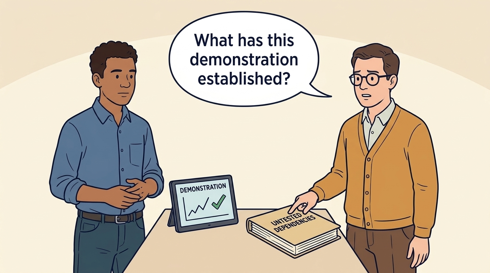
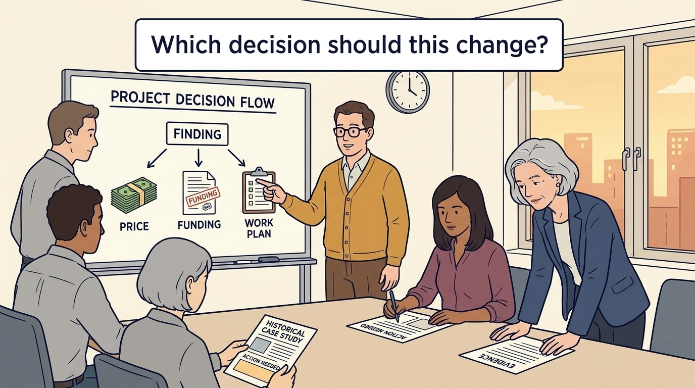
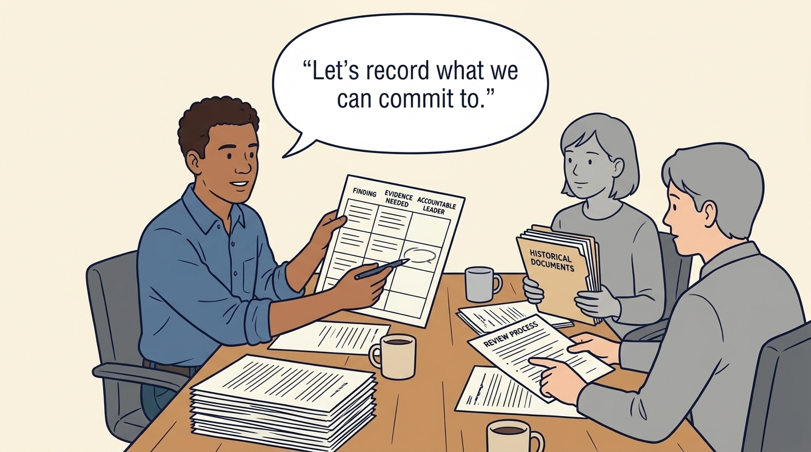
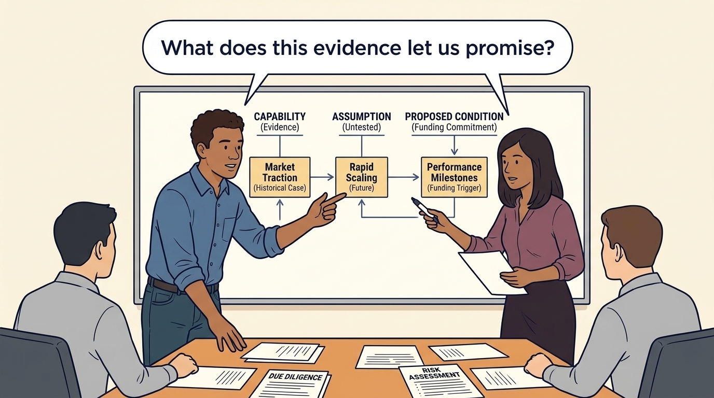

<!-- comic-style
{
  "cast": "MORGAN: a thoughtful investor technology adviser with short dark hair and a green jacket, used in the fund scenarios. ALEX: a practical CTO with curly hair and blue rolled-up sleeves. SAM: a CFO with round glasses and an amber cardigan. PRIYA: a product leader with straight dark hair and plum sleeves. INES: a CEO with short grey hair and a navy jacket. All are fictional; none represents a person in a real case.",
  "style": "Clean editorial explainer comic, dark ink outlines, restrained green, blue, and amber accents on warm white, generous space, readable short speech bubbles, expressive people and simple physical metaphors. No photorealism, logos, dense charts, or title text. Keep the same character appearances throughout the journal."
}
-->

**Comic.** Diligence exists only because an investor is deciding whether, and on what terms, to put money in. The panels show how its findings feed the price, the funding and the plan the company will later be held to, and why treating it as an audit to pass wastes that chance.

Morgan is an investor’s adviser in the fund scenarios; Alex leads technology, Priya leads product, and Sam leads finance. All are fictional. Comparative scenarios use separate assumptions. Historical cases are discussed through documents; the scenes do not reenact real events.

<!-- comic-panel
{
  "id": "01-scene",
  "status": "generated",
  "asset": "assets/images/16-diligence-and-thesis/comic-01-scene.jpeg",
  "aspect_ratio": "16:9",
  "prompt": "Panel 1 of an explainer comic. Alex and Sam ask Morgan which company capabilities the proposed investment depends on. Use one speech bubble with the exact words: \"What are we being asked to support?\" Convey: Due diligence investigates a company before an investment. Company leaders can help make the assumptions explicit and test them against actual work.",
  "alt": "Comic panel: Alex and Sam ask Morgan which company capabilities the proposed investment depends on.",
  "caption": "Due diligence investigates a company before an investment. Company leaders can help make the assumptions explicit and test them against actual work.",
  "generation": {
    "model": "gemini-3-pro-image-preview",
    "reference_id": "owned-cast-20260913",
    "sha256": "b7a0e26cb822d0bb5f171fdca80a1a4a86767d205db1a293d7036c6b61dd28b6"
  }
}
-->

**Panel 1:** Due diligence investigates a company before an investment. Company leaders can help make the assumptions explicit and test them against actual work.

*Dialogue:* “What are we being asked to support?”

<!-- comic-panel
{
  "id": "02-scene",
  "status": "generated",
  "asset": "assets/images/16-diligence-and-thesis/comic-02-scene.jpeg",
  "aspect_ratio": "16:9",
  "prompt": "Panel 2 of an explainer comic. Alex demonstrates a system while Sam notes an untested dependency. Use one speech bubble with the exact words: \"What has this demonstration established?\" Convey: A demonstration shows what worked under those conditions. Record which systems, customers and situations remain untested.",
  "alt": "Comic panel: Alex and Sam compare a demonstration screen with a folder of untested dependencies.",
  "caption": "A demonstration shows what worked under those conditions. Record which systems, customers and situations remain untested.",
  "generation": {
    "model": "gemini-3-pro-image-preview",
    "reference_id": "owned-cast-20260913",
    "sha256": "95d48751c81d91e22ff77cbf4eeb6c0324400f2f2a1ce061dae93a671094196e"
  }
}
-->

**Panel 2:** A demonstration shows what worked under those conditions. Record which systems, customers and situations remain untested.

*Dialogue:* “What has this demonstration established?”

<!-- comic-panel
{
  "id": "03-scene",
  "status": "generated",
  "asset": "assets/images/16-diligence-and-thesis/comic-03-scene.jpeg",
  "aspect_ratio": "16:9",
  "prompt": "Panel 3 of an explainer comic. Morgan labels observation, assertion, and inference separately. Use one speech bubble with the exact words: \"Which claims have supporting evidence?\" Convey: Separate what was observed, what someone reported and what the reviewer inferred. Explain the strength and limits of each finding.",
  "alt": "Comic panel: Morgan labels observation, assertion, and inference separately.",
  "caption": "Separate what was observed, what someone reported and what the reviewer inferred. Explain the strength and limits of each finding.",
  "generation": {
    "model": "gemini-3-pro-image-preview",
    "reference_id": "owned-cast-20260913",
    "sha256": "e76e43903982938913b2be9712736c369f67f5a54752ad1b9a1cde03add1c346"
  }
}
-->

**Panel 3:** Separate what was observed, what someone reported and what the reviewer inferred. Explain the strength and limits of each finding.

*Dialogue:* “Which claims have supporting evidence?”

<!-- comic-panel
{
  "id": "04-scene",
  "status": "generated",
  "asset": "assets/images/16-diligence-and-thesis/comic-04-scene.jpeg",
  "aspect_ratio": "16:9",
  "prompt": "Panel 4 of an explainer comic. A finding moves toward price, funding, or a work plan. Use one speech bubble with the exact words: \"Which decision should this change?\" Convey: Record how each important finding affects a decision. It may support the existing plan or call for different funding, terms or work.",
  "alt": "Comic panel: A finding moves toward price, funding, or a work plan.",
  "caption": "Record how each important finding affects a decision. It may support the existing plan or call for different funding, terms or work.",
  "generation": {
    "model": "gemini-3-pro-image-preview",
    "reference_id": "owned-cast-20260913",
    "sha256": "9faabb4defa50c3dfe73ea68890f8230aa1ce020d64a381658c0db6d6a5a9613"
  }
}
-->

**Panel 4:** Record how each important finding affects a decision. It may support the existing plan or call for different funding, terms or work.

*Dialogue:* “Which decision should this change?”

<!-- comic-panel
{
  "id": "05-scene",
  "status": "generated",
  "asset": "assets/images/16-diligence-and-thesis/comic-05-scene.jpeg",
  "aspect_ratio": "16:9",
  "prompt": "Panel 5 of an explainer comic. Alex annotates a finding with evidence still needed and the name of the accountable company leader. Use one speech bubble with the exact words: \"Let’s record what we can commit to.\" Convey: Review important findings through the agreed process. Record company agreement, disagreement or an early review after completion when access is limited.",
  "alt": "Comic panel: Alex annotates a finding with evidence still needed and the name of the accountable company leader.",
  "caption": "Review important findings through the agreed process. Record company agreement, disagreement or an early review after completion when access is limited.",
  "generation": {
    "model": "gemini-3-pro-image-preview",
    "reference_id": "owned-cast-20260913",
    "sha256": "7c5bb8495058c1ee66e45d7449047ea0804de523f9a45c2b78a1b22e7e0d0fba"
  }
}
-->

**Panel 5:** Review important findings through the agreed process. Record company agreement, disagreement or an early review after completion when access is limited.

*Dialogue:* “Let’s record what we can commit to.”

<!-- comic-panel
{
  "id": "06-scene",
  "status": "generated",
  "asset": "assets/images/16-diligence-and-thesis/comic-06-scene.jpeg",
  "aspect_ratio": "16:9",
  "prompt": "Panel 6 of an explainer comic. Priya and Alex connect a demonstrated capability and an untested assumption to a proposed funding condition. Use one speech bubble with the exact words: \"What does this evidence let us promise?\" Convey: A funding round, buyout and strategic investment need different evidence. Make assumptions, access boundaries and conditions for company commitments clear before the deal is agreed.",
  "alt": "Comic panel: Priya and Alex connect a demonstrated capability and an untested assumption to a proposed funding condition.",
  "caption": "A funding round, buyout and strategic investment need different evidence. Make assumptions, access boundaries and conditions for company commitments clear before the deal is agreed.",
  "generation": {
    "model": "gemini-3-pro-image-preview",
    "reference_id": "owned-cast-20260913",
    "sha256": "2cb66207fc188c73f7f10de5afc7a3119d0ab0aadeac9199212ab5ccc5c40f4c"
  }
}
-->

**Panel 6:** A funding round, buyout and strategic investment need different evidence. Make assumptions, access boundaries and conditions for company commitments clear before the deal is agreed.

*Dialogue:* “What does this evidence let us promise?”
