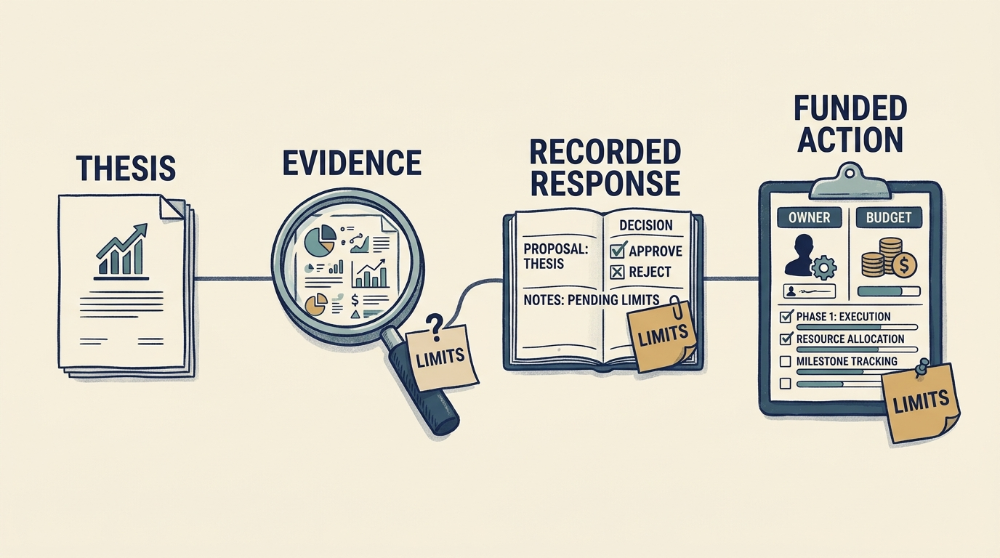

**Technical due diligence** investigates a company’s product, systems, people and risks before an investment. It is useful when it tests an important assumption, including when the evidence supports keeping the existing plan. A long report is not sufficient if material findings disappear between signing and execution. Diligence exists only because an investor is deciding whether, and on what terms, to put money in. Its findings feed the price, the funding and the plan the company will later be held to.

**Figure 1:** *Keep important findings connected to decisions, owners and resources.*

Begin with the **investment thesis**, the explanation of why the investment should succeed. Identify which assumptions about customers, product, delivery, technology, people, or risk must hold for it to work. As a company leader, help the reviewers examine those assumptions using evidence from actual work. Explain the company’s strengths, constraints and feasible alternatives before they become unsupported promises in the investment plan.

The chapter proposes seven assessment dimensions: product, architecture, engineering, data and artificial intelligence, security and resilience, organization, and economics. These are a coverage aid, not an equally weighted maturity ranking. A weakness matters through its effect on this company's thesis, obligations, and feasible choices.

**Every important finding needs a recorded response.** It might change the investment decision, valuation, financing, timetable, contractual protection, or post-close work. Alternatively, it may be an uncertainty consciously accepted by the authorized decision-maker. Label the difference between observed evidence, management assertion, inference, and an untested assumption.

**Sampling and access constrain conclusions**. Access to the stored source code does not establish that customers want the product. A system demonstration does not prove recovery. An interview can reveal an important dependency while remaining a claim requiring corroboration. Record what was inspected, when, and what could not be verified.

The fictional Larkspur example turns a broad scalability thesis into a narrower investigation of implementation capacity and customer onboarding. That change affects the investment plan: growth may require knowledge transfer, product simplification, and funded delivery capacity before additional sales can become revenue.

Ask to review important findings through the agreed process and record agreement, disagreement or **evidence still needed**. The manuscript proposes keeping each finding’s identifier in the plan, decision record and later outcome review. If participation is limited before the deal, make early confirmation after completion explicit. This is a proposed working method, not a proven standard.

Match the evidence to the event. A minority round may test the proposed use of new money; a buyout may test the operating plan under borrowing; a strategic investment may test integration, rights and commercial benefits. State what the company can demonstrate and which promises require further funding, hiring or access. The appropriate transaction process should establish information boundaries, especially where a prospective investor has competing commercial interests.

The test after closing is whether company leaders recognize the problem, have accepted ownership, and can act with **adequate resources**. Diligence should reduce consequential uncertainty and make the remaining uncertainty governable, rather than creating confidence through the volume of its documentation.
