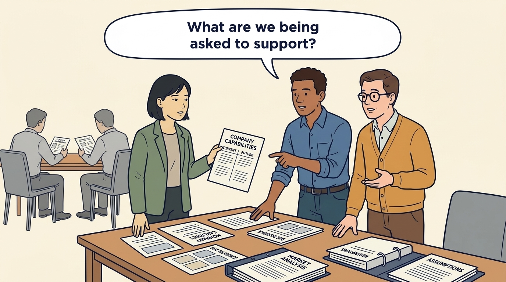
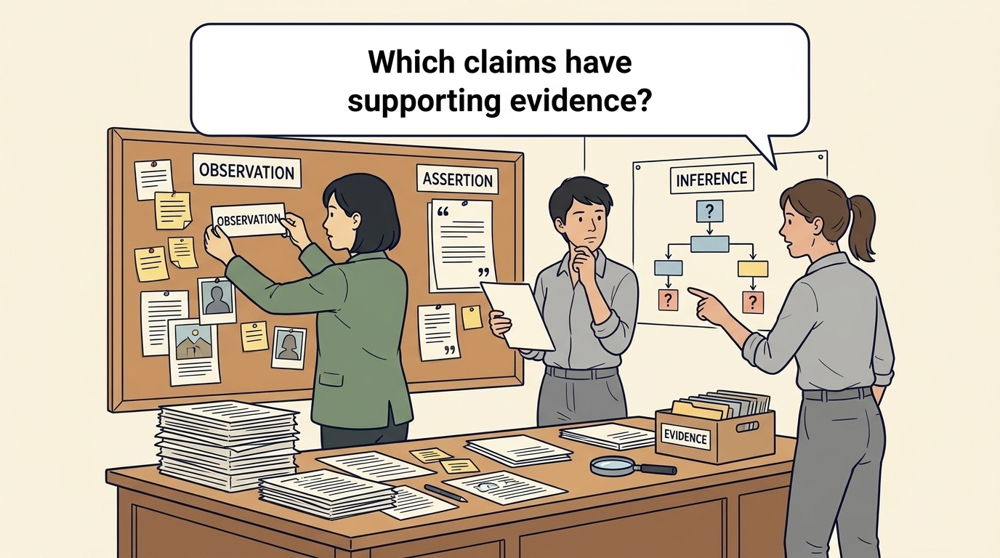

<!-- comic-style
{
  "cast": "MORGAN: a thoughtful investor technology adviser with short dark hair and a green jacket, used in the fund scenarios. ALEX: a practical CTO with curly hair and blue rolled-up sleeves. SAM: a CFO with round glasses and an amber cardigan. PRIYA: a product leader with straight dark hair and plum sleeves. INES: a CEO with short grey hair and a navy jacket. All are fictional; none represents a person in a real case.",
  "style": "Clean editorial explainer comic, dark ink outlines, restrained green, blue, and amber accents on warm white, generous space, readable short speech bubbles, expressive people and simple physical metaphors. No photorealism, logos, dense charts, or title text. Keep the same character appearances throughout the journal."
}
-->

**Comic.** In this transaction, technical diligence tests the product, technology and team assumptions behind the proposed investment. The panels follow one finding, D-3, from a sample of actual implementations to a recorded decision that changes the growth plan, and show why treating diligence as an audit to pass wastes that chance. Every figure is fictional.

Morgan is an investor’s adviser in the fund scenarios; Alex leads technology, Priya leads product, and Sam leads finance. All are fictional. Comparative scenarios use separate assumptions. Historical cases are discussed through documents; the scenes do not reenact real events.

<!-- comic-panel
{
  "id": "01-scene",
  "status": "generated",
  "asset": "assets/images/16-diligence-corrects-the-plan/comic-01-scene.jpeg",
  "aspect_ratio": "16:9",
  "prompt": "Panel 1 of an explainer comic. Alex and Sam ask Morgan which company capabilities the proposed investment depends on. Use one speech bubble with the exact words: \"What are we being asked to support?\" Convey: In this transaction, diligence tests the product, technology and team assumptions behind the proposed investment. Company leaders help make those assumptions explicit and test them against actual work.",
  "alt": "Comic panel: Alex and Sam ask Morgan which company capabilities the proposed investment depends on.",
  "caption": "In this transaction, diligence tests the product, technology and team assumptions behind the proposed investment. Company leaders help make those assumptions explicit and test them against actual work.",
  "generation": {
    "model": "gemini-3-pro-image-preview",
    "reference_id": "owned-cast-20260913",
    "sha256": "b7a0e26cb822d0bb5f171fdca80a1a4a86767d205db1a293d7036c6b61dd28b6"
  }
}
-->

**Panel 1:** In this transaction, diligence tests the product, technology and team assumptions behind the proposed investment. Company leaders help make those assumptions explicit and test them against actual work.

*Dialogue:* “What are we being asked to support?”

<!-- comic-panel
{
  "id": "02-scene",
  "status": "generated",
  "asset": "assets/images/16-diligence-corrects-the-plan/comic-02-scene.jpeg",
  "aspect_ratio": "16:9",
  "prompt": "Panel 2 of an explainer comic. Alex demonstrates a system while Sam notes an untested dependency. Use one speech bubble with the exact words: \"What has this demonstration established?\" Convey: A demonstration shows what worked under those conditions. Morgan samples five of the last twelve implementations instead of relying on the best one; the sample is one country and two quarters, and that limit is recorded.",
  "alt": "Comic panel: Alex and Sam compare a demonstration screen with a folder of untested dependencies.",
  "caption": "A demonstration shows what worked under those conditions. Morgan samples five of the last twelve implementations instead of relying on the best one; the sample is one country and two quarters, and that limit is recorded.",
  "generation": {
    "model": "gemini-3-pro-image-preview",
    "reference_id": "owned-cast-20260913",
    "sha256": "95d48751c81d91e22ff77cbf4eeb6c0324400f2f2a1ce061dae93a671094196e"
  }
}
-->

**Panel 2:** A demonstration shows what worked under those conditions. Morgan samples five of the last twelve implementations instead of relying on the best one; the sample is one country and two quarters, and that limit is recorded.

*Dialogue:* “What has this demonstration established?”

<!-- comic-panel
{
  "id": "03-scene",
  "status": "generated",
  "asset": "assets/images/16-diligence-corrects-the-plan/comic-03-scene.jpeg",
  "aspect_ratio": "16:9",
  "prompt": "Panel 3 of an explainer comic. Morgan labels observation, assertion, and inference separately. Use one speech bubble with the exact words: \"Which claims have supporting evidence?\" Convey: Finding D-3. Observed: five of the last twelve implementations sampled; three needed one specialist’s manual configuration; about 80 hours on average across the five. Reported by Alex: roughly 40% of the effort is poor customer data. Inferred by Morgan: the dependency is structural. Not established: how much each explanation accounts for; both can be true.",
  "alt": "Comic panel: Morgan labels observation, assertion, and inference separately.",
  "caption": "Finding D-3. Observed: five of the last twelve implementations sampled; three needed one specialist’s manual configuration; about 80 hours on average across the five. Reported by Alex: roughly 40% of the effort is poor customer data. Inferred by Morgan: the dependency is structural. Not established: how much each explanation accounts for; both can be true.",
  "generation": {
    "model": "gemini-3-pro-image-preview",
    "reference_id": "owned-cast-20260913",
    "sha256": "e76e43903982938913b2be9712736c369f67f5a54752ad1b9a1cde03add1c346"
  }
}
-->

**Panel 3:** Finding D-3. Observed: five of the last twelve implementations sampled; three needed one specialist’s manual configuration; about 80 hours on average across the five. Reported by Alex: roughly 40% of the effort is poor customer data. Inferred by Morgan: the dependency is structural. Not established: how much each explanation accounts for; both can be true.

*Dialogue:* “Which claims have supporting evidence?”

<!-- comic-panel
{
  "id": "04-scene",
  "status": "generated",
  "asset": "assets/images/16-diligence-corrects-the-plan/comic-04-scene.jpeg",
  "aspect_ratio": "16:9",
  "prompt": "Panel 4 of an explainer comic. A finding moves toward price, funding, or a work plan. Use one speech bubble with the exact words: \"Which decision should this change?\" Convey: D-3 changes the plan, not the deal. The first-year volume assumption falls from 2× to 1.5×, a forecast conditional on pilot evidence; second-country expansion waits for that evidence; a €180,000, 12-engineer-week setup pilot becomes a funded condition. Hiring two specialists at €300,000 a year is deferred.",
  "alt": "Comic panel: A finding moves toward price, funding, or a work plan.",
  "caption": "D-3 changes the plan, not the deal. The first-year volume assumption falls from 2× to 1.5×, a forecast conditional on pilot evidence; second-country expansion waits for that evidence; a €180,000, 12-engineer-week setup pilot becomes a funded condition. Hiring two specialists at €300,000 a year is deferred.",
  "generation": {
    "model": "gemini-3-pro-image-preview",
    "reference_id": "owned-cast-20260913",
    "sha256": "9faabb4defa50c3dfe73ea68890f8230aa1ce020d64a381658c0db6d6a5a9613"
  }
}
-->

**Panel 4:** D-3 changes the plan, not the deal. The first-year volume assumption falls from 2× to 1.5×, a forecast conditional on pilot evidence; second-country expansion waits for that evidence; a €180,000, 12-engineer-week setup pilot becomes a funded condition. Hiring two specialists at €300,000 a year is deferred.

*Dialogue:* “Which decision should this change?”

<!-- comic-panel
{
  "id": "05-scene",
  "status": "generated",
  "asset": "assets/images/16-diligence-corrects-the-plan/comic-05-scene.jpeg",
  "aspect_ratio": "16:9",
  "prompt": "Panel 5 of an explainer comic. Alex annotates a finding with evidence still needed and the name of the accountable company leader. Use one speech bubble with the exact words: \"Let’s record what we can commit to.\" Convey: The investment committee approves the terms; the Larkspur board adopts the plan and funding; Priya is accountable. Alex’s data-quality explanation is recorded as a disagreement compatible with Morgan’s, to be sized by Priya’s day-90 cohort measurement; the next money follows the largest actionable share of remaining effort with a costed step.",
  "alt": "Comic panel: Alex annotates a finding with evidence still needed and the name of the accountable company leader.",
  "caption": "The investment committee approves the terms; the Larkspur board adopts the plan and funding; Priya is accountable. Alex’s data-quality explanation is recorded as a disagreement compatible with Morgan’s, to be sized by Priya’s day-90 cohort measurement; the next money follows the largest actionable share of remaining effort with a costed step.",
  "generation": {
    "model": "gemini-3-pro-image-preview",
    "reference_id": "owned-cast-20260913",
    "sha256": "7c5bb8495058c1ee66e45d7449047ea0804de523f9a45c2b78a1b22e7e0d0fba"
  }
}
-->

**Panel 5:** The investment committee approves the terms; the Larkspur board adopts the plan and funding; Priya is accountable. Alex’s data-quality explanation is recorded as a disagreement compatible with Morgan’s, to be sized by Priya’s day-90 cohort measurement; the next money follows the largest actionable share of remaining effort with a costed step.

*Dialogue:* “Let’s record what we can commit to.”

<!-- comic-panel
{
  "id": "06-scene",
  "status": "generated",
  "asset": "assets/images/16-diligence-corrects-the-plan/comic-06-scene.jpeg",
  "aspect_ratio": "16:9",
  "prompt": "Panel 6 of an explainer comic. Priya and Alex connect a demonstrated capability and an untested assumption to a proposed funding condition. Use one speech bubble with the exact words: \"What does this evidence let us promise?\" Convey: Access differs by stage. Before signing, a finding can still move the price; after closing, management’s immediate levers are the plan and its funding, and any price adjustment depends on the signed terms. Priya records acceptance of D-3 within ten days of closing; her day-90 cohort measurement feeds the board’s day-100 decision.",
  "alt": "Comic panel: Priya and Alex connect a demonstrated capability and an untested assumption to a proposed funding condition.",
  "caption": "Access differs by stage. Before signing, a finding can still move the price; after closing, management’s immediate levers are the plan and its funding, and any price adjustment depends on the signed terms. Priya records acceptance of D-3 within ten days of closing; her day-90 cohort measurement feeds the board’s day-100 decision.",
  "generation": {
    "model": "gemini-3-pro-image-preview",
    "reference_id": "owned-cast-20260913",
    "sha256": "2cb66207fc188c73f7f10de5afc7a3119d0ab0aadeac9199212ab5ccc5c40f4c"
  }
}
-->

**Panel 6:** Access differs by stage. Before signing, a finding can still move the price; after closing, management’s immediate levers are the plan and its funding, and any price adjustment depends on the signed terms. Priya records acceptance of D-3 within ten days of closing; her day-90 cohort measurement feeds the board’s day-100 decision.

*Dialogue:* “What does this evidence let us promise?”
