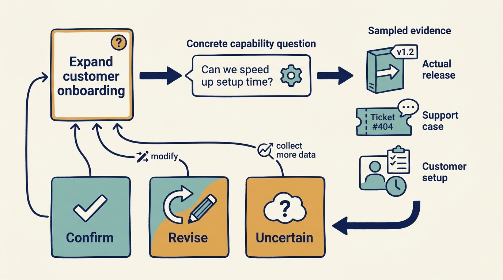
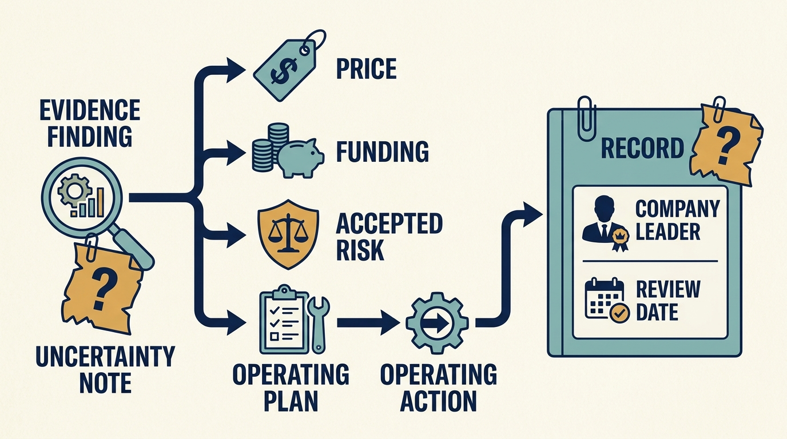

> **KEY POINTS:**
>
> * Help **test the assumptions** supporting the investment. Technology findings matter through price, funding, accepted risk or the operating plan; confirming an assumption can also be useful.
> * Valuation provides **questions, not an architecture score**. Test the ability to deliver assumed growth or sustain assumed earnings with the actual product, people and costs.
> * **Carry the evidence into ownership**. A finding needs an accepted implication, a responsible decision-maker and a record of what remains uncertain.

 
A diligence report identifies an onboarding bottleneck, but the investment plan still assumes rapid expansion with the same team. The report has described a problem without resolving what it means for the deal.

**Technical due diligence** investigates a company’s product and technology capabilities, dependencies, costs and risks before an investment. It exists only because an investor is deciding whether, and on what terms, to put money in, and its findings feed the price, funding, accepted risk, transaction conditions and operating plan the company will later be held to. Product and engineering leaders who treat diligence as an audit to pass miss the chance to shape the commitments they’ll afterwards have to deliver.

That doesn’t mean every diligence must find a reason to change the deal. It can confirm an important assumption. The requirement is to identify which assumption was tested, what evidence supports it and what uncertainty remains.

Part IV explained how to use investor support. Part V follows the company leader through the ownership cycle, beginning before the deal is complete. Your role is to help the investigation understand the actual business, challenge unsupported assumptions and establish which work a credible plan would require. The following chapters carry that evidence into early ownership and later reviews.

A **data room** is a controlled collection of information shared for a transaction. Preparing it is useful, but your contribution starts with the question the investor is trying to answer: what makes the product and technology important to this investment, and which commitments would the company need to support that expectation?

## Match the Evidence to the Transaction Being Considered

Before a minority funding round, the question may be whether the proposed use of new money can produce credible customer and operating evidence. Before a buyout, it may include the cash the plan needs under the proposed financing. Before a strategic investment or corporate acquisition, it may concern interfaces, rights and the work needed to realize the buyer’s intended commercial benefit.

In each case, ask which decision the investor is making and which operating promises management is being asked to support. Then identify the evidence you have, the work still needed to get it and the limits on access. A prospective investor that competes with customers or partners may need a carefully scoped information process. The transaction’s authorized advisers set that process; the engineering team must know what it may share and with whom.

For fictional Larkspur, a demonstration of onboarding can support a discussion of usability. It can’t by itself justify a forecast for international growth or a claim that the system is ready for group integration. Priya and Alex should separate what is working, what the plan assumes and the funded work needed to close the gap.

**Record conditions** before the story becomes an unconditional commitment: “requires two implementation hires,” “depends on agreed data rights,” or “pilot evidence due before expansion funding.” That lets the investor revise the transaction or its expectations while change is still possible.

## Start With an Investment Question

An **investment thesis** explains why an investment should succeed and what must be true for that to happen. A fictional thesis says the software company Larkspur can grow internationally without proportional growth in implementation staff. As a company leader, ask the reviewers to make that proposition explicit and help test it. Which onboarding steps are reusable? Which depend on country-specific requirements? How much effort comes from product limitations rather than poor customer data? Who must change the process?

A generic architecture checklist can still contribute, but it shouldn’t set the agenda independently of the thesis. The same technical condition can be acceptable in a stable cash-generating business and material in a plan that depends on rapid change.

Examining market change also needs a question evidence could support or challenge. “Artificial intelligence is transforming industry-specific software” is too broad. “Customers in this segment can complete the core task using a cheaper substitute without losing necessary controls” can be investigated through customer work, product trials and competitor evidence. It stays a hypothesis until tested.

Valuation tells the reviewer where an unsupported assumption could matter financially. If a revenue-based comparison assumes rapid expansion, investigate whether architecture and implementation capacity permit it. If an earnings-based comparison assumes stable costs, investigate the development, support and reliability spending needed to sustain them. The same codebase can support one plan and constrain another; the difference needs evidence, not a different generic architecture score.

**Figure 1:** *Diligence is useful when evidence can confirm or change an investment assumption.*

## Seven Things to Examine, Each Tied to the Thesis

This book proposes seven areas to examine. They check coverage rather than predict success through a single score. A **material finding** is one important enough to affect the investment decision or plan. Keep each area connected to that decision.

| Dimension | A material question | Evidence beyond an interview |
| --- | --- | --- |
| Product | Does the product solve a valuable, defensible customer problem? | Usage, renewal results for comparable customer groups, customer work, lost-deal evidence |
| Architecture | Can the system support the required changes and scale? | Dependency inspection, representative change, workload evidence |
| Engineering | Can the organization deliver and operate reliably? | Release history, incidents, change flow, operational exercises |
| Data and AI | Are data and AI an advantage, constraint, threat, or liability? | Rights, quality checks, evaluations, costed use cases |
| Security and resilience | Which failures could materially damage the business? | Scoped control evidence, recovery tests, incident history |
| Organization | Does the leadership and team fit the next stage of work? | Decision examples, responsibilities, succession and capacity |
| Economics | What investment does the thesis actually require? | Reconciled spend, staffing, commitments, transition scenarios |

This is a proposed assessment structure, not a validated predictive score. **Missing evidence must remain missing**, not be assigned a neutral value that makes the aggregate look acceptable.

## Sample the Work, Not Just the Presentation

Help the reviewers connect management’s explanation with evidence from actual work. Offer a recent customer implementation, an important software release, an incident and a difficult prioritization decision. Explain how the examples were selected and which situations they represent. Showing only the company’s best work can leave the future plan resting on a misleading picture.

A sample can’t establish everything. Record the population and why the sample was chosen. If the company serves several very different products or customer groups, say which were inspected. Don’t describe a short review of one repository as a complete assessment of engineering.

Confidence should reflect evidence quality and coverage. “High confidence” isn’t an adjective for the assessor's experience. It should mean the conclusion has strong supporting evidence within a stated scope and that material alternatives were examined.

Skype’s registration filing describes settlement of litigation and acquisition of rights to core technology. [S27: Skype registration filing](https://www.sec.gov/Archives/edgar/data/1498209/000119312511096544/ds1a.htm) As the case in [[hilton-and-skype]] explains, a product can depend on a legal and technical boundary that a repository-quality review would miss. Diligence should ask whether the company can use and develop what the thesis assumes it owns.

## Turn Findings Into Decisions

Ask to review important findings through the agreed transaction process. For each, record the question it answers and the evidence behind it. Then explain the business consequence, the possible responses and the recommended decision. Give it a stable identifier so it can be followed into later plans and reviews, and say what remains unknown and how that uncertainty could be resolved.

For Larkspur, a finding might say that engineering performs repeated customer-specific data transformations. The consequence is that the growth plan needs either more implementation capacity or investment in a reusable approach. Options could include limiting the target segment, staging automation or revising the growth assumption. “Technical debt: high” conveys much less.

The authorized investment decision-makers may proceed, change the terms or resources, require a condition, delay for evidence or decline. Company leaders contribute the operating facts and feasible alternatives; they shouldn’t make commercial commitments beyond their authority. Record any disagreement so it stays visible when the plan is agreed.

**Figure 2:** *A finding needs an accepted implication and someone responsible for the next decision.*

## A One-Page Thesis Needs Supporting Evidence

A **Technology Investment Thesis** is a short statement of what the investment depends on from product, technology and people. It connects the investigation to the decision. A useful page states the technology advantage, main constraint, required investment, leadership needs, AI opportunity or threat, expected business outcome and material uncertainties.

Conciseness works only when readers can inspect the basis. Keep links to findings, scenario assumptions, source dates and specialist assessments. A one-page summary shouldn’t replace the evidence any more than a product dashboard replaces customer research.

**Include the downside**. If the main improvement takes twice as long, can the company still operate within its financing? If the new product fails, which investments remain useful? If the current CTO leaves, which assumptions become invalid?

## Hand the Findings to the People Who Will Act

At completion, ask for the material findings to be reviewed with the company leaders who will own the business plan. Some management teams can’t take part fully before closing; record that limit and make post-close confirmation explicit. Ask the responsible company leader to record agreement, disagreement or a need for more evidence. Receiving a report doesn’t mean someone has accepted responsibility or funding for its recommendations.

Carry finding identifiers into the early operating plan and later outcome reviews. When new evidence changes the interpretation, keep the original reasoning and explain the revision. That lets company leaders and the investor learn whether the investigation asked the right questions and whether its recommendations were feasible.

Where you can’t inspect a conclusion or take part before the transaction, record the access limit and request an early review after completion. The purpose is to make changes in understanding visible as better evidence arrives.

Useful diligence either supports an important assumption with evidence or shows why the decision should change. Its value comes from reducing uncertainty about a real investment choice, including when the original plan turns out to be right.

Once the transaction completes, company leaders need to confirm the findings and turn them into a funded plan. The next chapter follows that handoff: [[first-hundred-days]].

## Questions to Consider

1. *What is the investment thesis behind your current or prospective owner’s decision, and which technology assumptions does it depend on?*
2. *Which conditions did you attach to commitments made during diligence, and have they survived into the plan or become unconditional promises?*
3. *For each of the seven dimensions, what evidence beyond interviews can your company offer, and what remains missing?*
4. *Which examples of your company’s work would you show a reviewer, and how were they selected? What would a less flattering sample reveal?*
5. *Does your product depend on rights, contracts or shared services that a review of the code would not examine?*
6. *Which diligence findings did you disagree with, and is that disagreement recorded where the plan will be reviewed?*

## To Probe Further

- **[How Do Venture Capitalists Make Decisions?](https://www.nber.org/papers/w22587)** — Paul Gompers, Will Gornall, Steven N. Kaplan and Ilya A. Strebulaev, NBER Working Paper 22587, 2016 (later published in the Journal of Financial Economics). *A survey of 885 venture investors showing that the team is weighed above product or technology, which tells you what a venture-stage thesis usually rests on before you test it.*
- **[Narrative and Numbers: The Value of Stories in Business](https://cup.columbia.edu/book/narrative-and-numbers/9780231180481/)** — Aswath Damodaran, Columbia University Press, 2017. *It is the working method behind the post's advice that valuation shows where an unsupported assumption matters, turning a growth story into explicit inputs you can test.*
- **[Do Managers Manipulate Earnings Prior to Management Buyouts?](https://research.tilburguniversity.edu/en/publications/do-managers-manipulate-earnings-prior-to-management-buyouts)** — Yaping Mao and Luc Renneboog, Tilburg University CentER Discussion Paper, 2013 (published in the Journal of Corporate Finance, 2015). *UK evidence that earnings are pushed down before management buyouts, a reminder that transaction numbers are shaped by their presenters and why the post asks for samples of actual work.*
- **[IP Due Diligence Readiness](https://www.wipo.int/export/sites/www/sme/en/documents/pdf/due_diligence_readiness.pdf)** — Philip Mendes, published by the World Intellectual Property Organization's small-business programme, undated. *Its IP map of each component, its creator and its current owner answers the post's Skype question of whether the company can use and develop what the thesis assumes it owns.*
