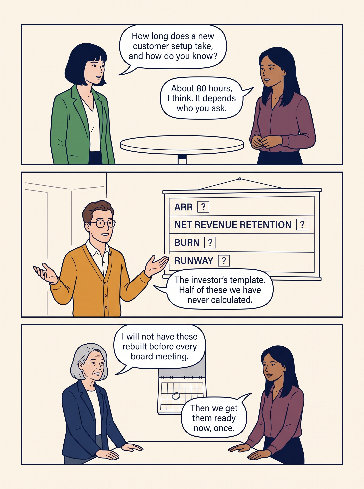
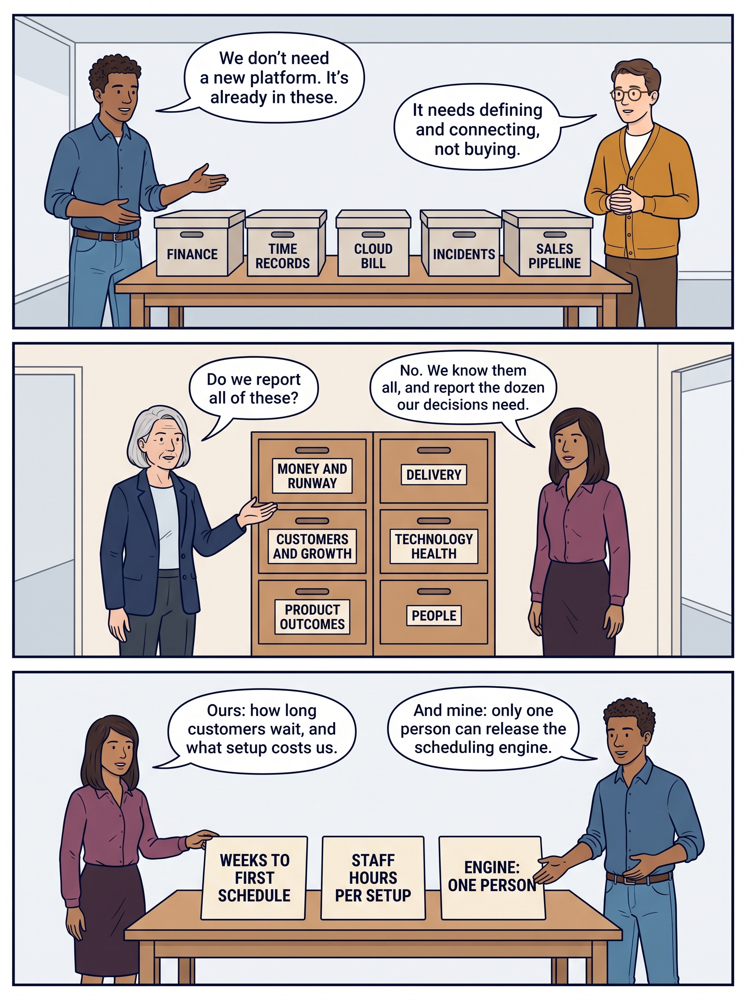
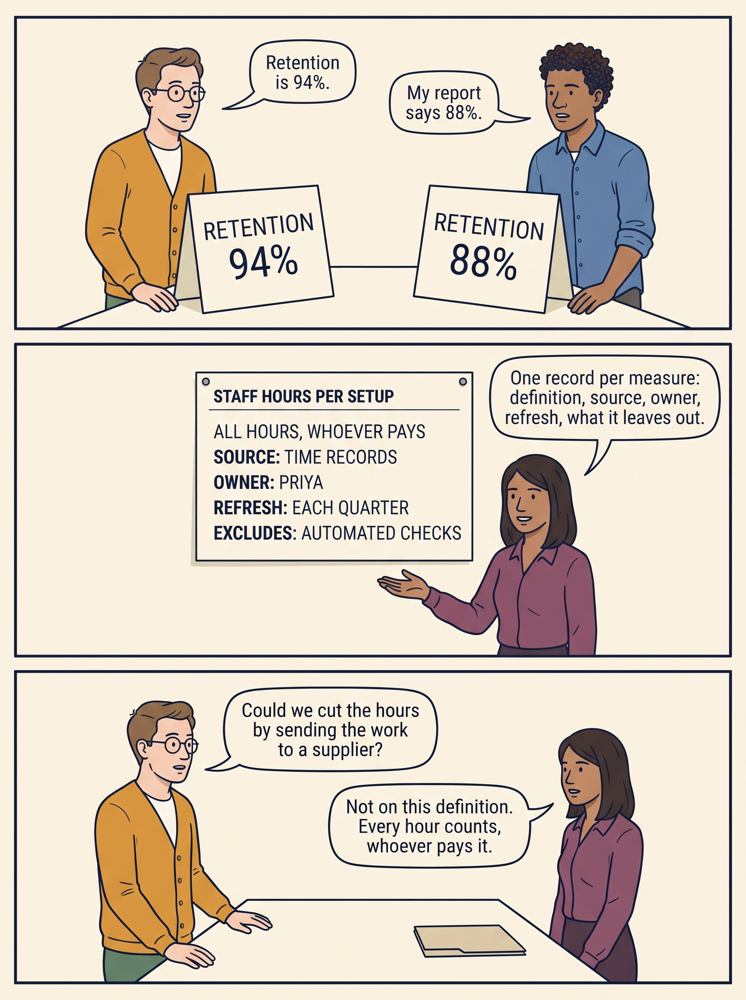
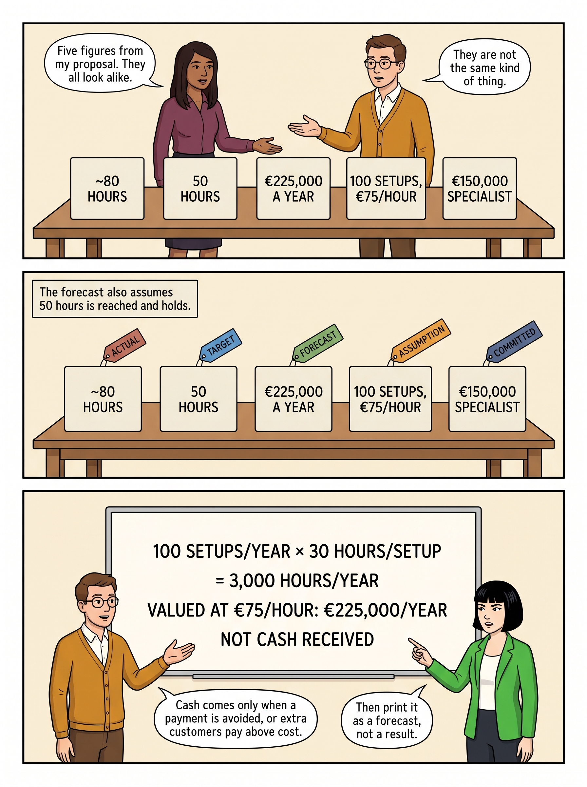
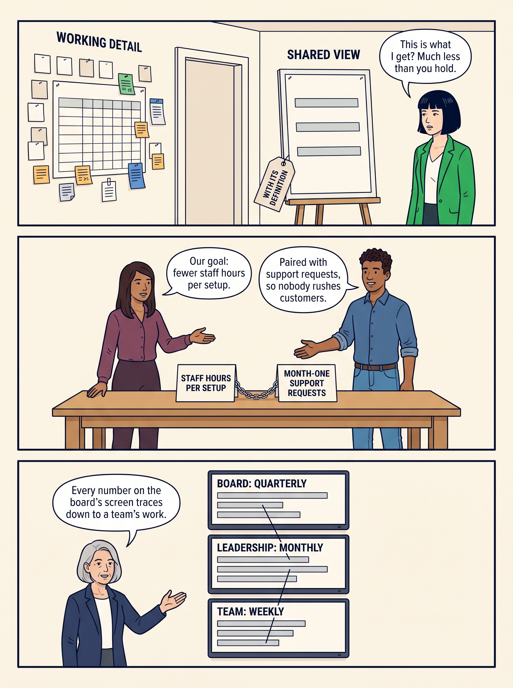
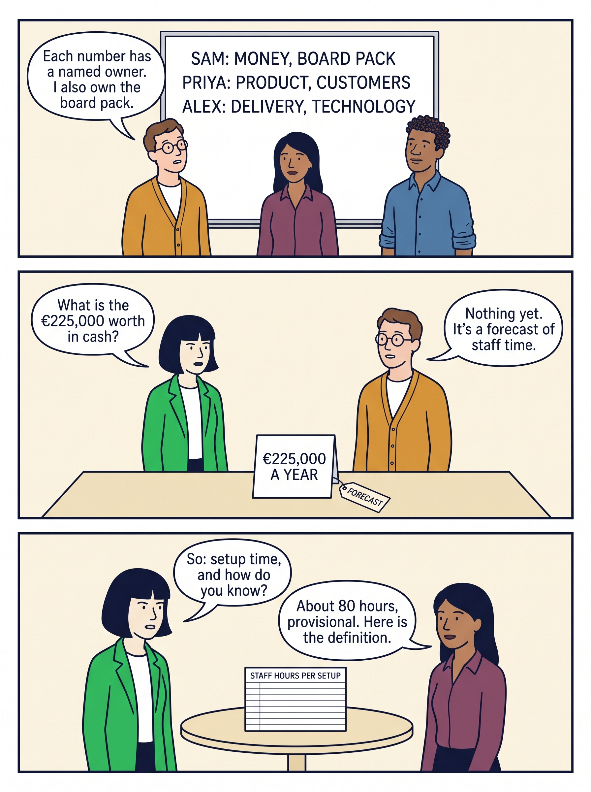

<!-- comic-style
{
  "cast": "MORGAN: a thoughtful investor technology adviser with short dark hair and a green jacket, used in the fund scenarios. ALEX: a practical CTO, a brown-skinned man with short, tight dark curls close to his head and blue rolled-up sleeves. SAM: a CFO, a man with short brown hair, round glasses and an amber cardigan. PRIYA: a product leader with straight dark hair and plum sleeves. INES: a CEO with short grey hair and a navy jacket. All are fictional; none represents a person in a real case.",
  "style": "Clean editorial explainer comic pages, each one image of three stacked full-width strips: navy ink outlines, restrained green, blue and amber accents on warm ivory, generous space, expressive people and simple physical props. Dialogue, short labels and the supplied amounts are lettered in the artwork, exactly as scripted. Money bags, coins and banknotes are plain and undecorated; the euro sign appears only inside supplied text, and arrows, documents and screens carry plain lines, never lettering. No photorealism, logos, titles or unsupplied text. Keep the same character appearances throughout the journal.",
  "reference": "_research/comic-cast-20260913.jpeg",
  "identity": {
    "Morgan": "MORGAN is a light-skinned WOMAN with a short, straight, JET-BLACK bob cut level with her jaw and a straight fringe across her forehead (never brown hair, never a side parting), and a bright green jacket over a white top, first person in the reference; her face must match the reference sheet exactly.",
    "Alex": "ALEX is a medium-brown-skinned MAN with a masculine face, broad shoulders and a straight masculine build, SHORT tight dark curls close to his head (not a large afro), a blue rolled-sleeve shirt and blue jeans, second person in the reference; fill his face, neck and hands with the same brown skin color in every strip.",
    "Sam": "SAM is a light-skinned MAN with a masculine face and SHORT brown hair cropped above his ears (never a bob, never chin-length hair, never a woman), round glasses and an amber cardigan over a white shirt, third person in the reference.",
    "Priya": "PRIYA is a brown-skinned WOMAN with straight shoulder-length dark hair and a plum blouse, fourth person in the reference.",
    "Ines": "INES is a light-skinned OLDER WOMAN with a short GREY bob (grey hair, never dark) and a navy jacket, fifth person in the reference."
  },
  "short": {
    "Morgan": "a light-skinned woman with a jet-black jaw-length bob and fringe, in a bright green jacket",
    "Alex": "a brown-skinned man with short tight dark curls, in a blue rolled-sleeve shirt",
    "Sam": "a light-skinned man with short brown hair and round glasses, in an amber cardigan over a collared white shirt",
    "Priya": "a brown-skinned woman with straight shoulder-length dark hair, in a plum blouse",
    "Ines": "an older light-skinned woman with a short grey bob, in a navy jacket"
  }
}
-->

**Comic.** An investor’s questions arrive before the numbers exist. Seven pages follow the fictional company Larkspur from one plain question — how long does it take to set up a customer, and how do you know? — to numbers held ready: found in records the company already keeps, defined once, owned by name, given their context, labelled by kind, and used for the investor, goals and dashboards.

Ines is Larkspur’s chief executive: she runs the company day to day and approves spending inside its plan. She answers to the board, the directors who oversee the company for its owners, the investor among them; the board approves the plan and any spending outside it. Priya leads product, the team that decides what the software should do; Alex leads technology and Sam leads finance. Morgan is the technology adviser to Larkspur’s investor. All are fictional, and so is every figure.

<!-- comic-page
{
  "id": "01-the-questions-arrive-first",
  "title": "The questions arrive first",
  "asset": "assets/images/16-have-your-numbers-ready/comic-page-01-the-questions-arrive-first.jpeg",
  "aspect_ratio": "3:4",
  "cast": [
    "Morgan",
    "Priya",
    "Sam",
    "Ines"
  ],
  "strips": [
    {
      "scene": "Two people stand at one small round table, in this left-to-right order: first Morgan, then Priya. The table is bare.",
      "bubbles": [
        {
          "who": "Morgan",
          "text": "How long does a new customer setup take, and how do you know?"
        },
        {
          "who": "Priya",
          "text": "About 80 hours, I think. It depends who you ask."
        }
      ]
    },
    {
      "scene": "Sam stands beside a large board hung high on the wall, above his head. The board is a reporting form with four rows, each row a word on the left and an empty box on the right with a large question mark in it. No head, hand, marker or bubble covers any lettering; everyone stands with hands at their sides or gestures with an open hand from the side.",
      "labels": [
        "ARR",
        "NET REVENUE RETENTION",
        "BURN",
        "RUNWAY"
      ],
      "label_notes": "The four labels are the four row words on the board, one per row, top to bottom; each empty box beside them holds only a question mark.",
      "bubbles": [
        {
          "who": "Sam",
          "text": "The investor’s template. Half of these we have never calculated."
        }
      ]
    },
    {
      "scene": "Two people stand behind one long table, in this left-to-right order: first Ines, then Priya. On the table lies one plain wall calendar with one date circled; it is the only thing on the table.",
      "bubbles": [
        {
          "who": "Ines",
          "text": "I will not have these rebuilt before every board meeting."
        },
        {
          "who": "Priya",
          "text": "Then we get them ready now, once."
        }
      ]
    }
  ],
  "alt": "Comic page in three strips: Morgan asks Priya how long a customer setup takes and how she knows; Sam stands at a reporting form with four empty rows; Ines and Priya decide to get the numbers ready once.",
  "caption": "Larkspur is a fictional scheduling-software company; every figure is fictional. The investor’s team sends a reporting template, and its technology adviser asks a simple question nobody can yet answer with a definition.\n\nARR (annual recurring revenue) is the yearly value of current subscriptions. Net revenue retention compares the recurring revenue from last year’s customers now with what the same customers brought then, counting their growth, cutbacks and departures. Burn is the cash spent each month beyond what comes in; runway is how many months the cash lasts.\n\nBoard text, strip 2: a form with four rows — ARR, NET REVENUE RETENTION, BURN, RUNWAY — each with an empty box and a question mark.",
  "status": "generated",
  "generation": {
    "model": "gemini-3-pro-image-preview",
    "reference": "_research/comic-cast-20260913.jpeg",
    "sha256": "31bf16aaa6b5d63a2e4e09c6cf7167b5943d88795e847e0041d06c8b0f4a017c"
  }
}
-->

**Page 1: The questions arrive first.** Larkspur is a fictional scheduling-software company; every figure is fictional. The investor’s team sends a reporting template, and its technology adviser asks a simple question nobody can yet answer with a definition.

ARR (annual recurring revenue) is the yearly value of current subscriptions. Net revenue retention compares the recurring revenue from last year’s customers now with what the same customers brought then, counting their growth, cutbacks and departures. Burn is the cash spent each month beyond what comes in; runway is how many months the cash lasts.

Board text, strip 2: a form with four rows — ARR, NET REVENUE RETENTION, BURN, RUNWAY — each with an empty box and a question mark.

- *Strip 1.* **Morgan:** “How long does a new customer setup take, and how do you know?” **Priya:** “About 80 hours, I think. It depends who you ask.”
- *Strip 2.* **Sam:** “The investor’s template. Half of these we have never calculated.”
- *Strip 3.* **Ines:** “I will not have these rebuilt before every board meeting.” **Priya:** “Then we get them ready now, once.”

<!-- comic-page
{
  "id": "02-the-numbers-are-already-here",
  "title": "The numbers are already here",
  "asset": "assets/images/16-have-your-numbers-ready/comic-page-02-the-numbers-are-already-here.jpeg",
  "aspect_ratio": "3:4",
  "cast": [
    "Alex",
    "Sam",
    "Ines",
    "Priya"
  ],
  "strips": [
    {
      "scene": "Two people stand behind one long table, in this left-to-right order: first Alex, then Sam. On the table stand exactly five closed plain boxes in one row, with clear gaps between them, each with one printed label on its front facing the reader. The boxes are the only things on the table.",
      "labels": [
        "FINANCE",
        "TIME RECORDS",
        "CLOUD BILL",
        "INCIDENTS",
        "SALES PIPELINE"
      ],
      "label_notes": "One label per box, left to right in this order.",
      "bubbles": [
        {
          "who": "Alex",
          "text": "We don’t need a new platform. It’s already in these."
        },
        {
          "who": "Sam",
          "text": "It needs defining and connecting, not buying."
        }
      ]
    },
    {
      "scene": "A tall cabinet with exactly six drawers stands against a plain wall, two columns of three drawers, each drawer with one label on its front. Ines stands to the left of the cabinet and Priya to the right, both with hands at their sides. No head, hand, marker or bubble covers any lettering; everyone stands with hands at their sides or gestures with an open hand from the side.",
      "labels": [
        "MONEY AND RUNWAY",
        "CUSTOMERS AND GROWTH",
        "PRODUCT OUTCOMES",
        "DELIVERY",
        "TECHNOLOGY HEALTH",
        "PEOPLE"
      ],
      "label_notes": "One label per drawer: left column top to bottom MONEY AND RUNWAY, CUSTOMERS AND GROWTH, PRODUCT OUTCOMES; right column top to bottom DELIVERY, TECHNOLOGY HEALTH, PEOPLE.",
      "bubbles": [
        {
          "who": "Ines",
          "text": "Do we report all of these?"
        },
        {
          "who": "Priya",
          "text": "No. We know them all, and report the dozen our decisions need."
        }
      ]
    },
    {
      "scene": "Two people stand behind one long table, in this left-to-right order: first Priya, then Alex. On the table lie exactly three large cards side by side with clear gaps, each with one line of lettering facing the reader. The cards are the only things on the table.",
      "labels": [
        "WEEKS TO FIRST SCHEDULE",
        "STAFF HOURS PER SETUP",
        "ENGINE: ONE PERSON"
      ],
      "label_notes": "One label per card, left to right in this order.",
      "bubbles": [
        {
          "who": "Priya",
          "text": "Ours: how long customers wait, and what setup costs us."
        },
        {
          "who": "Alex",
          "text": "And mine: only one person can release the scheduling engine."
        }
      ]
    }
  ],
  "alt": "Comic page in three strips: five labelled boxes of existing records; a six-drawer cabinet of measure families; three cards Priya and Alex choose for Larkspur.",
  "caption": "The evidence mostly exists already, in systems never meant to be read together. The catalogue has six families of measures; the company knows them all and reports the few its decisions need.\n\nThe cloud bill is the monthly charge for the rented computing the software runs on. Incidents are the records of service failures that reached customers. The sales pipeline is the list of deals in progress. The first real schedule is the day a new customer first schedules real work in the product. The scheduling engine is the part of the software that builds the schedules; to release it is to make a new version available to customers. The one-person dependence was found in diligence, the checks the investor made before investing.\n\nBoard text: boxes FINANCE, TIME RECORDS, CLOUD BILL, INCIDENTS, SALES PIPELINE; drawers MONEY AND RUNWAY, CUSTOMERS AND GROWTH, PRODUCT OUTCOMES, DELIVERY, TECHNOLOGY HEALTH, PEOPLE; cards WEEKS TO FIRST SCHEDULE, STAFF HOURS PER SETUP, ENGINE: ONE PERSON.",
  "status": "generated",
  "generation": {
    "model": "gemini-3-pro-image-preview",
    "reference": "_research/comic-cast-20260913.jpeg",
    "sha256": "88f37252a905e19ae395839f51b25cf06837dfd65564ac1d864b329647ee4a12"
  }
}
-->

**Page 2: The numbers are already here.** The evidence mostly exists already, in systems never meant to be read together. The catalogue has six families of measures; the company knows them all and reports the few its decisions need.

The cloud bill is the monthly charge for the rented computing the software runs on. Incidents are the records of service failures that reached customers. The sales pipeline is the list of deals in progress. The first real schedule is the day a new customer first schedules real work in the product. The scheduling engine is the part of the software that builds the schedules; to release it is to make a new version available to customers. The one-person dependence was found in diligence, the checks the investor made before investing.

Board text: boxes FINANCE, TIME RECORDS, CLOUD BILL, INCIDENTS, SALES PIPELINE; drawers MONEY AND RUNWAY, CUSTOMERS AND GROWTH, PRODUCT OUTCOMES, DELIVERY, TECHNOLOGY HEALTH, PEOPLE; cards WEEKS TO FIRST SCHEDULE, STAFF HOURS PER SETUP, ENGINE: ONE PERSON.

- *Strip 1.* **Alex:** “We don’t need a new platform. It’s already in these.” **Sam:** “It needs defining and connecting, not buying.”
- *Strip 2.* **Ines:** “Do we report all of these?” **Priya:** “No. We know them all, and report the dozen our decisions need.”
- *Strip 3.* **Priya:** “Ours: how long customers wait, and what setup costs us.” **Alex:** “And mine: only one person can release the scheduling engine.”

<!-- comic-page
{
  "id": "03-define-it-once-own-it-by-name",
  "title": "Define it once, own it by name",
  "asset": "assets/images/16-have-your-numbers-ready/comic-page-03-define-it-once-own-it-by-name.jpeg",
  "aspect_ratio": "3:4",
  "cast": [
    "Sam",
    "Alex",
    "Priya"
  ],
  "strips": [
    {
      "scene": "Two people stand at the two ends of one long table, in this left-to-right order: first Sam, then Alex. Each has one large card standing upright on the table in front of him, lettered facing the reader. The two cards are the only things on the table.",
      "labels": [
        "RETENTION 94%",
        "RETENTION 88%"
      ],
      "label_notes": "RETENTION 94% is the card in front of Sam on the left; RETENTION 88% the card in front of Alex on the right.",
      "bubbles": [
        {
          "who": "Sam",
          "text": "Retention is 94%."
        },
        {
          "who": "Alex",
          "text": "My report says 88%."
        }
      ]
    },
    {
      "scene": "One large record card is pinned high on a plain wall, above everyone’s head, with exactly five lines of lettering, one per line, top to bottom. Priya stands to the right of the card, gesturing to it with an open hand from the side. No head, hand, marker or bubble covers any lettering; everyone stands with hands at their sides or gestures with an open hand from the side.",
      "labels": [
        "STAFF HOURS PER SETUP",
        "ALL HOURS, WHOEVER PAYS",
        "SOURCE: TIME RECORDS",
        "OWNER: PRIYA",
        "REFRESH: EACH QUARTER",
        "EXCLUDES: AUTOMATED CHECKS"
      ],
      "label_notes": "The five lines of the record card, top to bottom in this order; above them the small heading STAFF HOURS PER SETUP.",
      "bubbles": [
        {
          "who": "Priya",
          "text": "One record per measure: definition, source, owner, refresh, what it leaves out."
        }
      ]
    },
    {
      "scene": "Two people stand behind one long table, in this left-to-right order: first Sam, then Priya. On the table lies one plain folder; it is the only thing on the table.",
      "bubbles": [
        {
          "who": "Sam",
          "text": "Could we cut the hours by sending the work to a supplier?"
        },
        {
          "who": "Priya",
          "text": "Not on this definition. Every hour counts, whoever pays it."
        }
      ]
    }
  ],
  "alt": "Comic page in three strips: Sam and Alex hold different retention figures; Priya shows a five-line measure record for staff hours per setup; she explains that moving work to a supplier cannot improve the figure.",
  "caption": "Most reporting disputes are definition disputes: one retention figure counts customers kept, the other the revenue they pay, over different periods.\n\nThe record gives each measure one definition, a source, a named owner, a refresh schedule and what it deliberately leaves out. The group figure is an average: total hours for the setups in the group divided by the number of setups.\n\nBoard text: cards RETENTION 94% and RETENTION 88%; record card STAFF HOURS PER SETUP — ALL HOURS, WHOEVER PAYS; SOURCE: TIME RECORDS; OWNER: PRIYA; REFRESH: EACH QUARTER; EXCLUDES: AUTOMATED CHECKS.",
  "status": "generated",
  "generation": {
    "model": "gemini-3-pro-image-preview",
    "reference": "_research/comic-cast-20260913.jpeg",
    "sha256": "5fa3a5c024730bffc9b972050214af947e3e29d121eae8f346367dd18cf2f547"
  }
}
-->

**Page 3: Define it once, own it by name.** Most reporting disputes are definition disputes: one retention figure counts customers kept, the other the revenue they pay, over different periods.

The record gives each measure one definition, a source, a named owner, a refresh schedule and what it deliberately leaves out. The group figure is an average: total hours for the setups in the group divided by the number of setups.

Board text: cards RETENTION 94% and RETENTION 88%; record card STAFF HOURS PER SETUP — ALL HOURS, WHOEVER PAYS; SOURCE: TIME RECORDS; OWNER: PRIYA; REFRESH: EACH QUARTER; EXCLUDES: AUTOMATED CHECKS.

- *Strip 1.* **Sam:** “Retention is 94%.” **Alex:** “My report says 88%.”
- *Strip 2.* **Priya:** “One record per measure: definition, source, owner, refresh, what it leaves out.”
- *Strip 3.* **Sam:** “Could we cut the hours by sending the work to a supplier?” **Priya:** “Not on this definition. Every hour counts, whoever pays it.”

<!-- comic-page
{
  "id": "04-a-number-needs-its-context",
  "title": "A number needs its context",
  "asset": "assets/images/16-have-your-numbers-ready/comic-page-04-a-number-needs-its-context.jpeg",
  "aspect_ratio": "3:4",
  "cast": [
    "Morgan",
    "Priya",
    "Ines"
  ],
  "strips": [
    {
      "scene": "Two people stand behind one long table, in this left-to-right order: first Morgan, then Priya. One large card stands upright on the table with one line of lettering facing the reader; it is the only thing on the table.",
      "labels": [
        "80 HOURS"
      ],
      "label_notes": "80 HOURS is the only lettering on the standing card.",
      "bubbles": [
        {
          "who": "Morgan",
          "text": "80 compared with what? And how many setups?"
        },
        {
          "who": "Priya",
          "text": "Five, from your own diligence sample. It’s provisional."
        }
      ]
    },
    {
      "scene": "One whiteboard hangs high on a plain wall, above everyone’s head, with exactly four large lines of lettering, top to bottom. Priya stands to the right of the board, gesturing with an open hand from the side. No head, hand, marker or bubble covers any lettering; everyone stands with hands at their sides or gestures with an open hand from the side.",
      "labels": [
        "NOW: 5 SETUPS",
        "~80 HOURS PER SETUP, AVERAGE",
        "DAY 20: 12 SETUPS",
        "TARGET: 50 HOURS PER SETUP"
      ],
      "label_notes": "The four lines of the whiteboard, top to bottom in this order.",
      "bubbles": [
        {
          "who": "Priya",
          "text": "By day 20, all twelve setups from the last two quarters."
        }
      ]
    },
    {
      "scene": "A long horizontal band is painted on a plain wall, high above everyone’s heads, divided into exactly three coloured zones side by side: green on the left, amber in the middle, red on the right, each zone with one label inside it, and one heading above the whole band. Two people stand below it, in this left-to-right order: first Ines, then Morgan. No head, hand, marker or bubble covers any lettering; everyone stands with hands at their sides or gestures with an open hand from the side.",
      "labels": [
        "DAY-90 RULE: AVERAGE HOURS",
        "UNDER 60: REQUEST NEXT STAGE",
        "60–70: SMALLER STEP",
        "OVER 70: REOPEN PLAN"
      ],
      "label_notes": "DAY-90 RULE: AVERAGE HOURS is the heading above the band; the other three labels sit inside the green, amber and red zones, left to right.",
      "bubbles": [
        {
          "who": "Ines",
          "text": "We agree the rule now. A new stage is the board’s call, not mine."
        },
        {
          "who": "Morgan",
          "text": "Agreed now, before either of us has a number to defend."
        }
      ]
    }
  ],
  "alt": "Comic page in three strips: a lone card reading 80 hours; a whiteboard giving the five-setup sample, the average of about 80 hours per setup, the day-20 baseline of twelve setups and the 50-hour target; a three-zone band with the day-90 rule for average hours.",
  "caption": "A number needs its baseline, what it was expected to be, how much weight it carries and the decision it informs. Setup effort is an average: total hours divided by the number of setups. Day 0 is the board meeting that adopts the plan. At day 90 the average for eight pilot customers, a small trial of the changed setup, is measured; at day 100 the board reviews it. The diligence sample is the five setups Morgan examined during the investor’s checks before investing.\n\nThe bands say which response each result points to; they guide the board’s decision. Ines, the chief executive, authorizes spending inside the approved plan; a new stage, or spending outside the plan, needs the board’s approval. Exactly 60 or 70 hours falls in the middle band.\n\nBoard text: card 80 HOURS. Whiteboard NOW: 5 SETUPS; ~80 HOURS PER SETUP, AVERAGE; DAY 20: 12 SETUPS; TARGET: 50 HOURS PER SETUP. Band DAY-90 RULE: AVERAGE HOURS — green UNDER 60: REQUEST NEXT STAGE; amber 60–70: SMALLER STEP; red OVER 70: REOPEN PLAN.",
  "status": "generated",
  "generation": {
    "model": "gemini-3-pro-image-preview",
    "reference": "_research/comic-cast-20260913.jpeg",
    "sha256": "c019aac9ee104f790c870e46a579acc7aece559d34e116e300c4b0c3b4757e95"
  }
}
-->

**Page 4: A number needs its context.** A number needs its baseline, what it was expected to be, how much weight it carries and the decision it informs. Setup effort is an average: total hours divided by the number of setups. Day 0 is the board meeting that adopts the plan. At day 90 the average for eight pilot customers, a small trial of the changed setup, is measured; at day 100 the board reviews it. The diligence sample is the five setups Morgan examined during the investor’s checks before investing.

The bands say which response each result points to; they guide the board’s decision. Ines, the chief executive, authorizes spending inside the approved plan; a new stage, or spending outside the plan, needs the board’s approval. Exactly 60 or 70 hours falls in the middle band.

Board text: card 80 HOURS. Whiteboard NOW: 5 SETUPS; ~80 HOURS PER SETUP, AVERAGE; DAY 20: 12 SETUPS; TARGET: 50 HOURS PER SETUP. Band DAY-90 RULE: AVERAGE HOURS — green UNDER 60: REQUEST NEXT STAGE; amber 60–70: SMALLER STEP; red OVER 70: REOPEN PLAN.

- *Strip 1.* **Morgan:** “80 compared with what? And how many setups?” **Priya:** “Five, from your own diligence sample. It’s provisional.”
- *Strip 2.* **Priya:** “By day 20, all twelve setups from the last two quarters.”
- *Strip 3.* **Ines:** “We agree the rule now. A new stage is the board’s call, not mine.” **Morgan:** “Agreed now, before either of us has a number to defend.”

<!-- comic-page
{
  "id": "05-label-what-kind-of-number",
  "title": "Label what kind of number",
  "asset": "assets/images/16-have-your-numbers-ready/comic-page-05-label-what-kind-of-number.jpeg",
  "aspect_ratio": "3:4",
  "cast": [
    "Priya",
    "Sam",
    "Morgan"
  ],
  "strips": [
    {
      "scene": "Two people stand behind one long table, in this left-to-right order: first Priya, then Sam. On the table stand exactly five identical blank cards in one row with clear gaps between them; each card carries one line of lettering and nothing else. The cards are the only things on the table.",
      "labels": [
        "~80 HOURS",
        "50 HOURS",
        "€225,000 A YEAR",
        "100 SETUPS, €75/HOUR",
        "€150,000 SPECIALIST"
      ],
      "label_notes": "One line per card, left to right in this order.",
      "bubbles": [
        {
          "who": "Priya",
          "text": "Five figures from my proposal. They all look alike."
        },
        {
          "who": "Sam",
          "text": "They are not the same kind of thing."
        }
      ]
    },
    {
      "scene": "The same five cards stand on the same table, now each with one coloured paper tag hanging from its top corner. No people in this strip; the five tagged cards are the only things in the strip.",
      "labels": [
        "~80 HOURS",
        "50 HOURS",
        "€225,000 A YEAR",
        "100 SETUPS, €75/HOUR",
        "€150,000 SPECIALIST",
        "ACTUAL",
        "TARGET",
        "FORECAST",
        "ASSUMPTION",
        "COMMITTED"
      ],
      "label_notes": "The five card lines are as before, left to right. The tags, left to right, read ACTUAL, TARGET, FORECAST, ASSUMPTION, COMMITTED, one tag per card.",
      "bubbles": [],
      "narration": "The forecast also assumes 50 hours is reached and holds."
    },
    {
      "scene": "One whiteboard hangs high on a plain wall, above everyone’s head, with exactly four large lines of lettering, top to bottom. Two people stand below it, in this left-to-right order: first Sam, then Morgan. No head, hand, marker or bubble covers any lettering; everyone stands with hands at their sides or gestures with an open hand from the side.",
      "labels": [
        "100 SETUPS/YEAR × 30 HOURS/SETUP",
        "= 3,000 HOURS/YEAR",
        "VALUED AT €75/HOUR: €225,000/YEAR",
        "NOT CASH RECEIVED"
      ],
      "label_notes": "The four lines of the whiteboard, top to bottom in this order.",
      "bubbles": [
        {
          "who": "Sam",
          "text": "Cash comes only when a payment is avoided, or extra customers pay above cost."
        },
        {
          "who": "Morgan",
          "text": "Then print it as a forecast, not a result."
        }
      ]
    }
  ],
  "alt": "Comic page in three strips: five untagged cards from the setup proposal; the same cards tagged actual, target, forecast, assumption and committed; a whiteboard working 3,000 hours a year, valued at €225,000 a year, not cash received.",
  "caption": "About 80 hours per setup, an average, is observed; 50 hours is the aim. €225,000 a year is arithmetic resting on three assumptions: about 100 setups a year, €75 an hour (pay plus the employer’s other employment costs), and setups reaching 50 hours and staying there. The contract specialist’s €150,000 is already authorized.\n\nReleased time becomes cash only on the date a scheduled payment is actually avoided, such as a contract not extended, or when extra customers pay more than serving them costs.\n\nBoard text: cards ~80 HOURS (ACTUAL), 50 HOURS (TARGET), €225,000 A YEAR (FORECAST), 100 SETUPS, €75/HOUR (ASSUMPTION), €150,000 SPECIALIST (COMMITTED). Whiteboard 100 SETUPS/YEAR × 30 HOURS/SETUP = 3,000 HOURS/YEAR; VALUED AT €75/HOUR: €225,000/YEAR; NOT CASH RECEIVED.",
  "status": "generated",
  "generation": {
    "model": "gemini-3-pro-image-preview",
    "reference": "_research/comic-cast-20260913.jpeg",
    "sha256": "00c5f660bcbe68e83d972df7db23d22643b2aaa989dbeac0e9f602819220c37c"
  }
}
-->

**Page 5: Label what kind of number.** About 80 hours per setup, an average, is observed; 50 hours is the aim. €225,000 a year is arithmetic resting on three assumptions: about 100 setups a year, €75 an hour (pay plus the employer’s other employment costs), and setups reaching 50 hours and staying there. The contract specialist’s €150,000 is already authorized.

Released time becomes cash only on the date a scheduled payment is actually avoided, such as a contract not extended, or when extra customers pay more than serving them costs.

Board text: cards ~80 HOURS (ACTUAL), 50 HOURS (TARGET), €225,000 A YEAR (FORECAST), 100 SETUPS, €75/HOUR (ASSUMPTION), €150,000 SPECIALIST (COMMITTED). Whiteboard 100 SETUPS/YEAR × 30 HOURS/SETUP = 3,000 HOURS/YEAR; VALUED AT €75/HOUR: €225,000/YEAR; NOT CASH RECEIVED.

- *Strip 1.* **Priya:** “Five figures from my proposal. They all look alike.” **Sam:** “They are not the same kind of thing.”
- *Strip 2.* *Narration:* The forecast also assumes 50 hours is reached and holds.
- *Strip 3.* **Sam:** “Cash comes only when a payment is avoided, or extra customers pay above cost.” **Morgan:** “Then print it as a forecast, not a result.”

<!-- comic-page
{
  "id": "06-one-set-three-uses",
  "title": "One set, three uses",
  "asset": "assets/images/16-have-your-numbers-ready/comic-page-06-one-set-three-uses.jpeg",
  "aspect_ratio": "3:4",
  "cast": [
    "Morgan",
    "Priya",
    "Alex",
    "Ines"
  ],
  "strips": [
    {
      "scene": "On the left, a wall covered with many small plain cards and one large grid sheet with plain ruled cells; in the middle, an open doorway frame; on the right, one single sheet on an easel with three plain bars and one paper tag hanging from the easel. Morgan stands to the right of the easel, looking at it. No head, hand, marker or bubble covers any lettering; everyone stands with hands at their sides or gestures with an open hand from the side.",
      "labels": [
        "WORKING DETAIL",
        "SHARED VIEW",
        "WITH ITS DEFINITION"
      ],
      "label_notes": "WORKING DETAIL is a heading above the left wall, SHARED VIEW a heading above the easel, WITH ITS DEFINITION the words on the tag.",
      "bubbles": [
        {
          "who": "Morgan",
          "text": "This is what I get? Much less than you hold."
        }
      ]
    },
    {
      "scene": "Two people stand behind one long table, in this left-to-right order: first Priya, then Alex. On the table stand exactly two cards side by side, joined by one short plain chain. The cards and chain are the only things on the table.",
      "labels": [
        "STAFF HOURS PER SETUP",
        "MONTH-ONE SUPPORT REQUESTS"
      ],
      "label_notes": "One label per card, left to right.",
      "bubbles": [
        {
          "who": "Priya",
          "text": "Our goal: fewer staff hours per setup."
        },
        {
          "who": "Alex",
          "text": "Paired with support requests, so nobody rushes customers."
        }
      ]
    },
    {
      "scene": "Three screens are mounted one above the other on a plain wall, stacked vertically, each screen with a short heading and plain bars; one continuous thin line runs from a bar on the top screen down through the middle screen to a bar on the bottom screen. Ines stands to the left of the stack. No head, hand, marker or bubble covers any lettering; everyone stands with hands at their sides or gestures with an open hand from the side.",
      "labels": [
        "BOARD: QUARTERLY",
        "LEADERSHIP: MONTHLY",
        "TEAM: WEEKLY"
      ],
      "label_notes": "One heading per screen, top to bottom in this order.",
      "bubbles": [
        {
          "who": "Ines",
          "text": "Every number on the board’s screen traces down to a team’s work."
        }
      ]
    }
  ],
  "alt": "Comic page in three strips: detailed working records pass through a doorway into one shared sheet tagged with its definition; a goal card chained to a counter-measure card; three stacked dashboards joined by one line from board to team.",
  "caption": "The same numbers serve three uses. The investor receives totals or averages, each with its definition. Team goals pair the main measure with a counter-measure, a second measure that shows harm caused by chasing the first. Dashboards show the measures at board, leadership and team level.\n\nMonth-one support requests are the setup-related requests for help in the first month after a customer’s account is activated, the day it becomes ready to use.\n\nBoard text: WORKING DETAIL; SHARED VIEW; tag WITH ITS DEFINITION. Chained cards STAFF HOURS PER SETUP and MONTH-ONE SUPPORT REQUESTS. Screens BOARD: QUARTERLY; LEADERSHIP: MONTHLY; TEAM: WEEKLY.",
  "status": "generated",
  "generation": {
    "model": "gemini-3-pro-image-preview",
    "reference": "_research/comic-cast-20260913.jpeg",
    "sha256": "0340b893ba92ccd4dcf8c628db774b25f2984f8e7dd36fc07f2c9288fdea8d67"
  }
}
-->

**Page 6: One set, three uses.** The same numbers serve three uses. The investor receives totals or averages, each with its definition. Team goals pair the main measure with a counter-measure, a second measure that shows harm caused by chasing the first. Dashboards show the measures at board, leadership and team level.

Month-one support requests are the setup-related requests for help in the first month after a customer’s account is activated, the day it becomes ready to use.

Board text: WORKING DETAIL; SHARED VIEW; tag WITH ITS DEFINITION. Chained cards STAFF HOURS PER SETUP and MONTH-ONE SUPPORT REQUESTS. Screens BOARD: QUARTERLY; LEADERSHIP: MONTHLY; TEAM: WEEKLY.

- *Strip 1.* **Morgan:** “This is what I get? Much less than you hold.”
- *Strip 2.* **Priya:** “Our goal: fewer staff hours per setup.” **Alex:** “Paired with support requests, so nobody rushes customers.”
- *Strip 3.* **Ines:** “Every number on the board’s screen traces down to a team’s work.”

<!-- comic-page
{
  "id": "07-numbers-ready",
  "title": "Numbers ready",
  "asset": "assets/images/16-have-your-numbers-ready/comic-page-07-numbers-ready.jpeg",
  "aspect_ratio": "3:4",
  "cast": [
    "Sam",
    "Priya",
    "Alex",
    "Morgan"
  ],
  "strips": [
    {
      "scene": "One board hangs high on a plain wall, above everyone’s heads, with exactly three large lines of lettering. Three people stand below it in one row, in this left-to-right order: first Sam, then Priya, then Alex. No head, hand, marker or bubble covers any lettering; everyone stands with hands at their sides or gestures with an open hand from the side.",
      "labels": [
        "SAM: MONEY, BOARD PACK",
        "PRIYA: PRODUCT, CUSTOMERS",
        "ALEX: DELIVERY, TECHNOLOGY"
      ],
      "label_notes": "The three lines of the board, top to bottom in this order.",
      "bubbles": [
        {
          "who": "Sam",
          "text": "Each number has a named owner. I also own the board pack."
        }
      ]
    },
    {
      "scene": "Two people stand behind one long table, in this left-to-right order: first Morgan, then Sam. On the table stands one card with one line of lettering and one paper tag hanging from its corner; it is the only thing on the table.",
      "labels": [
        "€225,000 A YEAR",
        "FORECAST"
      ],
      "label_notes": "€225,000 A YEAR is the line on the card; FORECAST is the word on the tag.",
      "bubbles": [
        {
          "who": "Morgan",
          "text": "What is the €225,000 worth in cash?"
        },
        {
          "who": "Sam",
          "text": "Nothing yet. It’s a forecast of staff time."
        }
      ]
    },
    {
      "scene": "Two people stand at one small round table, in this left-to-right order: first Morgan, then Priya. On the table lies one record card with plain ruled lines, its short heading reading upright for the reader; it is the only thing on the table.",
      "labels": [
        "STAFF HOURS PER SETUP"
      ],
      "label_notes": "STAFF HOURS PER SETUP is the heading of the record card.",
      "bubbles": [
        {
          "who": "Morgan",
          "text": "So: setup time, and how do you know?"
        },
        {
          "who": "Priya",
          "text": "About 80 hours, provisional. Here is the definition."
        }
      ]
    }
  ],
  "alt": "Comic page in three strips: a board naming Sam, Priya and Alex as owners of the number families; Sam answers that the €225,000 forecast is not yet cash; Priya answers Morgan’s first question with the defined measure.",
  "caption": "The board pack is the set of reports the directors receive before each board meeting. In larger companies this work belongs to product operations, a function that keeps evidence and definitions consistent without taking the decisions; a small company names an owner for each number.\n\nWith its numbers ready and labelled, Larkspur can choose what to fund against its cash and team time.\n\nBoard text: SAM: MONEY, BOARD PACK; PRIYA: PRODUCT, CUSTOMERS; ALEX: DELIVERY, TECHNOLOGY. Card €225,000 A YEAR, tagged FORECAST. Record card STAFF HOURS PER SETUP.",
  "status": "generated",
  "generation": {
    "model": "gemini-3-pro-image-preview",
    "reference": "_research/comic-cast-20260913.jpeg",
    "sha256": "62d44b74b57d8d57c06c9714deea076e0f8dda1e53cb524a15e6eec6601a3922"
  }
}
-->

**Page 7: Numbers ready.** The board pack is the set of reports the directors receive before each board meeting. In larger companies this work belongs to product operations, a function that keeps evidence and definitions consistent without taking the decisions; a small company names an owner for each number.

With its numbers ready and labelled, Larkspur can choose what to fund against its cash and team time.

Board text: SAM: MONEY, BOARD PACK; PRIYA: PRODUCT, CUSTOMERS; ALEX: DELIVERY, TECHNOLOGY. Card €225,000 A YEAR, tagged FORECAST. Record card STAFF HOURS PER SETUP.

- *Strip 1.* **Sam:** “Each number has a named owner. I also own the board pack.”
- *Strip 2.* **Morgan:** “What is the €225,000 worth in cash?” **Sam:** “Nothing yet. It’s a forecast of staff time.”
- *Strip 3.* **Morgan:** “So: setup time, and how do you know?” **Priya:** “About 80 hours, provisional. Here is the definition.”
