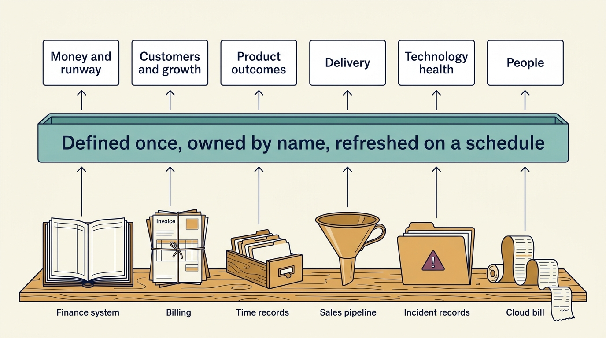

**Ready numbers do not produce agreement; they make disagreement useful.** With the same defined, dated figures, people find where their views part instead of arguing over the facts.

**Figure 1:** *Records the company already keeps feed one layer of defined numbers, which supplies six families of measures.*

**The questions arrive before the numbers exist.** At Larkspur, a fictional scheduling-software company, the investor’s adviser asks how long a customer setup takes. The records exist, but nobody has defined “setup time”.

**Know the catalogue.** Know six families of measures, what each tells and where it misleads; report the dozen you need.

- **Money and runway:** revenue, yearly subscription value, the share of revenue left after serving customers, burn (a month’s cash out minus cash in) and runway (how many months the cash lasts at that burn).
- **Customers and growth:** new contracts, what last year’s customers pay now, customers lost, and the cost of winning one.
- **Product outcomes:** weeks to a customer’s first real use, depth of use (such as the share of technicians scheduled in it), and the cost of serving each customer.
- **Delivery:** commitments against what arrived, and how fast and safely software changes reach customers.
- **Technology health:** reliability, tested recovery, known security weaknesses, technology cost, and systems only one person can run.
- **People:** hiring against plan, and losing people the company wants to keep.

**Hold each number ready.** Record its definition, source, named owner, refresh schedule and exclusions. For a group figure, state how records combine: Larkspur’s setup effort is total hours divided by the number of setups. Give it context: earlier and expected values, its weight and the decision it informs. Agree thresholds before the result; they point to a response. The chief executive runs the company and approves spending within the plan. A new stage, or spending outside it, needs the **board**: the directors overseeing the company for its owners, including the investor.

**Label its kind.** Larkspur’s average of about 80 staff hours per setup is an **actual** (provisional, from five setups). Fifty hours is a **target**. €225,000 a year is a **forecast**: 100 setups a year × 30 fewer hours each = 3,000 hours a year, valued at €75 an hour. It rests on three **assumptions**: the volume, the rate, and setups reaching 50 hours and staying there. A resource the board has authorized is **committed**. Freed time becomes cash only on the date a scheduled payment is avoided, or when extra customers pay more than serving them costs.

**One set, three uses.**

- **The investor** gets them aggregated — detailed records combined into totals or averages — with definitions, within its rights to information.
- **Goals** use early-moving measures, each paired with a counter-measure: a second measure that shows harm caused by chasing the first.
- **Dashboards** show them at board, leadership and team level; every board figure traces to a team’s work.

**Assign the work.** **Product operations**, as Melissa Perri and Denise Tilles describe it, keeps definitions and evidence consistent. A small company names an owner per number and one person for the board pack, the reports the directors receive before each meeting.

[[cannot-fund-everything]] uses the numbers to choose what to fund.
