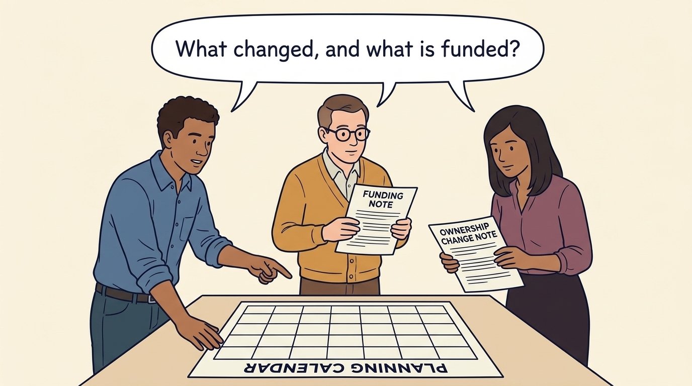
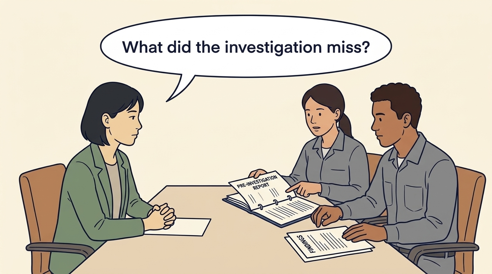
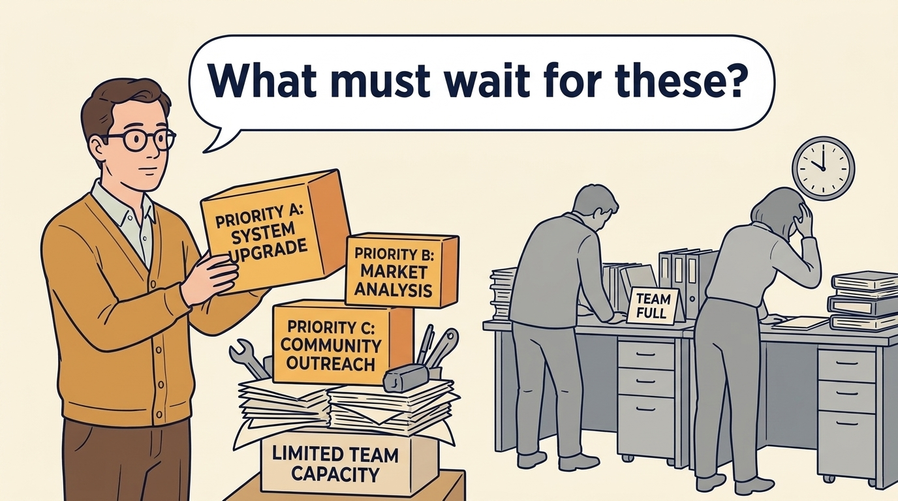
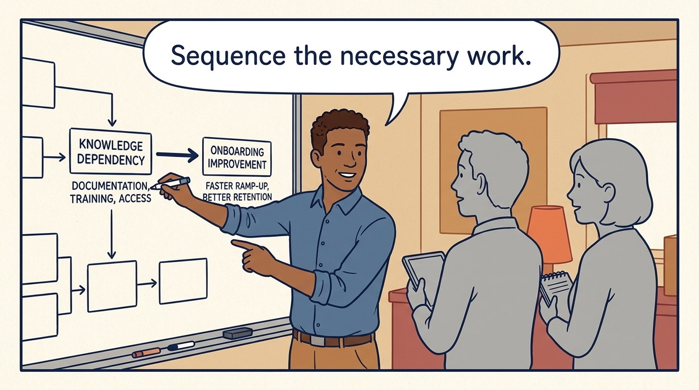
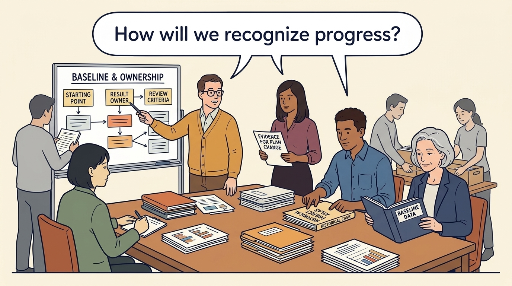
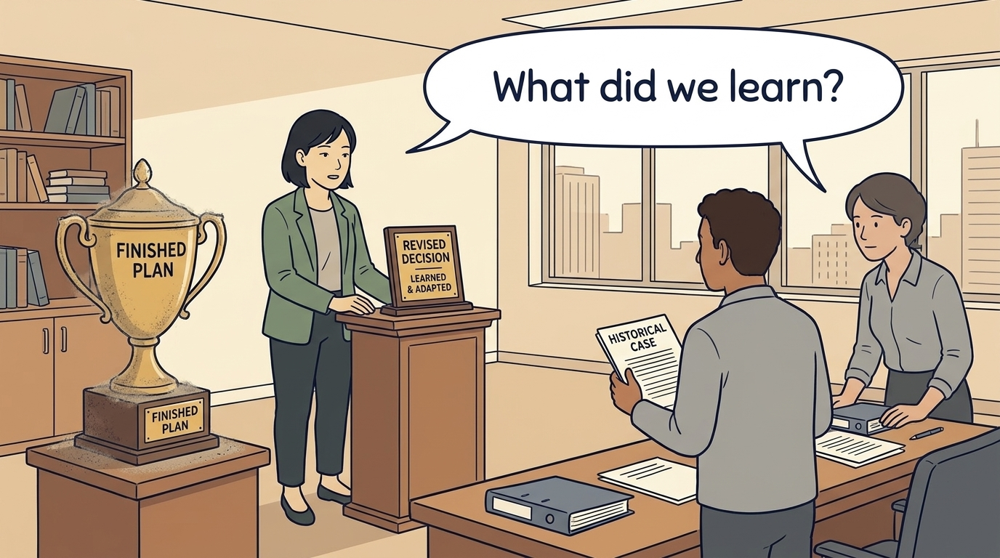

<!-- comic-style
{
  "cast": "MORGAN: a thoughtful investor technology adviser with short dark hair and a green jacket, used in the fund scenarios. ALEX: a practical CTO with curly hair and blue rolled-up sleeves. SAM: a CFO with round glasses and an amber cardigan. PRIYA: a product leader with straight dark hair and plum sleeves. INES: a CEO with short grey hair and a navy jacket. All are fictional; none represents a person in a real case.",
  "style": "Clean editorial explainer comic, dark ink outlines, restrained green, blue, and amber accents on warm white, generous space, readable short speech bubbles, expressive people and simple physical metaphors. No photorealism, logos, dense charts, or title text. Keep the same character appearances throughout the journal."
}
-->

**Comic.** Morgan is an investor’s adviser in the fund scenarios; Alex leads technology, Priya leads product, and Sam leads finance. All are fictional. Comparative scenarios use separate assumptions. Historical cases are discussed through documents; the scenes do not reenact real events.

<!-- comic-panel
{
  "id": "01-scene",
  "status": "generated",
  "asset": "assets/images/17-first-hundred-days/comic-01-scene.jpeg",
  "aspect_ratio": "16:9",
  "prompt": "Panel 1 of an explainer comic. Priya, Alex and Sam distinguish a new funding round from a purchase of control on an early planning calendar. Use one speech bubble with the exact words: \"What changed, and what is funded?\" Convey: The early period after funding or an ownership change establishes a workable operating plan. A hundred days is a planning convention; another round need not replace management.",
  "alt": "Comic panel: Alex, Sam and Priya review a planning calendar alongside separate funding and ownership-change notes.",
  "caption": "The early period after funding or an ownership change establishes a workable operating plan. A hundred days is a planning convention; another round need not replace management.",
  "generation": {
    "model": "gemini-3-pro-image-preview",
    "reference_id": "owned-cast-20260913",
    "sha256": "ce9c1c33f5f1109be577aec53ee5ed89c5e91592974f32f728ccd0b692c3d8c5"
  }
}
-->

**Panel 1:** The early period after funding or an ownership change establishes a workable operating plan. A hundred days is a planning convention; another round need not replace management.

*Dialogue:* “What changed, and what is funded?”

<!-- comic-panel
{
  "id": "02-scene",
  "status": "generated",
  "asset": "assets/images/17-first-hundred-days/comic-02-scene.jpeg",
  "aspect_ratio": "16:9",
  "prompt": "Panel 2 of an explainer comic. Morgan listens to company teams before adding initiatives. Use one speech bubble with the exact words: \"What did the investigation miss?\" Convey: Recheck the findings from the pre-investment investigation with the people who will do the work.",
  "alt": "Comic panel: Morgan listens to company teams before adding initiatives.",
  "caption": "Recheck the findings from the pre-investment investigation with the people who will do the work.",
  "generation": {
    "model": "gemini-3-pro-image-preview",
    "reference_id": "owned-cast-20260913",
    "sha256": "345666fcf03e619a6e5341031d35f00f7b474bac58777ba1e67adf01d3d533b6"
  }
}
-->

**Panel 2:** Recheck the findings from the pre-investment investigation with the people who will do the work.

*Dialogue:* “What did the investigation miss?”

<!-- comic-panel
{
  "id": "03-scene",
  "status": "generated",
  "asset": "assets/images/17-first-hundred-days/comic-03-scene.jpeg",
  "aspect_ratio": "16:9",
  "prompt": "Panel 3 of an explainer comic. Sam places three fictional priorities beside limited team capacity. Use one speech bubble with the exact words: \"What must wait for these?\" Convey: Choose priorities that fit available people and money. Record what other work must wait.",
  "alt": "Comic panel: Sam places three fictional priorities beside limited team capacity.",
  "caption": "Choose priorities that fit available people and money. Record what other work must wait.",
  "generation": {
    "model": "gemini-3-pro-image-preview",
    "reference_id": "owned-cast-20260913",
    "sha256": "07527dd1321b10c98eb236e3b8ddfb24e9a6eb31cae905ab25ac43b72f2c6b67"
  }
}
-->

**Panel 3:** Choose priorities that fit available people and money. Record what other work must wait.

*Dialogue:* “What must wait for these?”

<!-- comic-panel
{
  "id": "04-scene",
  "status": "generated",
  "asset": "assets/images/17-first-hundred-days/comic-04-scene.jpeg",
  "aspect_ratio": "16:9",
  "prompt": "Panel 4 of an explainer comic. Alex connects an onboarding improvement to a knowledge dependency. Use one speech bubble with the exact words: \"Sequence the necessary work.\" Convey: A dependency is something that must happen first. Plan these steps before promising several improvements at once.",
  "alt": "Comic panel: Alex connects an onboarding improvement to a knowledge dependency.",
  "caption": "A dependency is something that must happen first. Plan these steps before promising several improvements at once.",
  "generation": {
    "model": "gemini-3-pro-image-preview",
    "reference_id": "owned-cast-20260913",
    "sha256": "e03d1d4b88bbb452d9c308ebb0663ea8ae8e6f6d662222b84be1195d6d2f763b"
  }
}
-->

**Panel 4:** A dependency is something that must happen first. Plan these steps before promising several improvements at once.

*Dialogue:* “Sequence the necessary work.”

<!-- comic-panel
{
  "id": "05-scene",
  "status": "generated",
  "asset": "assets/images/17-first-hundred-days/comic-05-scene.jpeg",
  "aspect_ratio": "16:9",
  "prompt": "Panel 5 of an explainer comic. The team records a baseline, owner, and review condition. Use one speech bubble with the exact words: \"How will we recognize progress?\" Convey: A baseline records the starting situation. Agree who owns each result and what evidence would justify changing the plan.",
  "alt": "Comic panel: The team records a baseline, owner, and review condition.",
  "caption": "A baseline records the starting situation. Agree who owns each result and what evidence would justify changing the plan.",
  "generation": {
    "model": "gemini-3-pro-image-preview",
    "reference_id": "owned-cast-20260913",
    "sha256": "c6a88d6e0ee945cc9c5b3453f5a40d82a63247b9c29dfc8ac7473878abf0cece"
  }
}
-->

**Panel 5:** A baseline records the starting situation. Agree who owns each result and what evidence would justify changing the plan.

*Dialogue:* “How will we recognize progress?”

<!-- comic-panel
{
  "id": "06-scene",
  "status": "generated",
  "asset": "assets/images/17-first-hundred-days/comic-06-scene.jpeg",
  "aspect_ratio": "16:9",
  "prompt": "Panel 6 of an explainer comic. Morgan replaces a finished-plan trophy with a revised decision. Use one speech bubble with the exact words: \"What did we learn?\" Convey: The early period should leave a funded plan that company leaders understand and can adapt as they learn.",
  "alt": "Comic panel: Morgan replaces a finished-plan trophy with a revised decision.",
  "caption": "The early period should leave a funded plan that company leaders understand and can adapt as they learn.",
  "generation": {
    "model": "gemini-3-pro-image-preview",
    "reference_id": "owned-cast-20260913",
    "sha256": "215e9a7ed141f2af983179c72aaed568b1ea7295d7cea8cd2798036e44361717"
  }
}
-->

**Panel 6:** The early period should leave a funded plan that company leaders understand and can adapt as they learn.

*Dialogue:* “What did we learn?”
