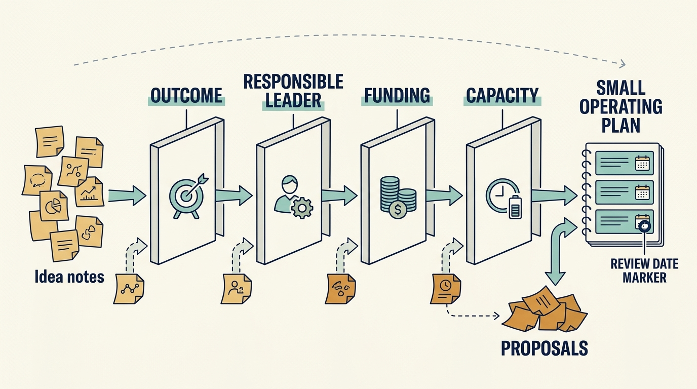
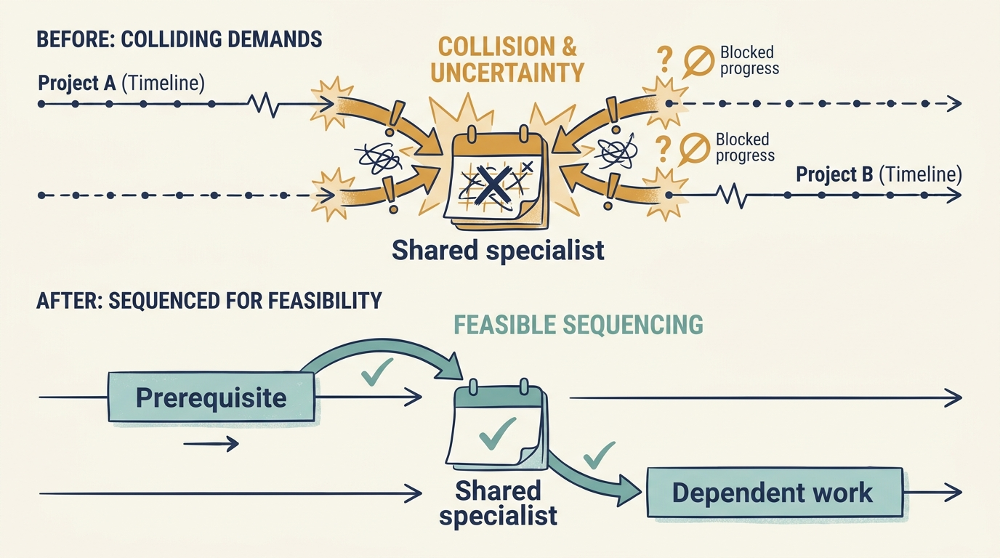

> **KEY POINTS:**
>
> * Use the early period to **establish a funded plan**. The first hundred days help leaders organize early work; major changes may take longer.
> * Recheck assumptions with the **people doing the work**. The transaction process leaves gaps; company knowledge and new evidence should change priorities when necessary.
> * **Sequence dependencies** before adding projects. Agree on capacity, baselines and review decisions so that apparent progress does not conceal an infeasible plan.

 
New funding or an ownership change opens an early period in which expectations must become an agreed **operating plan**: what the business will do, who will do it and what resources it needs. A hundred days is a useful planning horizon. It is neither enough to transform most businesses nor the right deadline for every commitment.

A leader running a business under stable ownership plans on the company’s own rhythm. A new investor replaces that rhythm with its own: an investment case with stated assumptions, an early review, and expectations formed during diligence rather than inside the company. This is when those expectations either become a plan the company can fund and staff, or harden into commitments nobody tested.

[[diligence-corrects-the-plan]] produced findings before a funding round, purchase or other ownership decision. This chapter explains how those findings become the company’s own plan: confirm the assumptions, select a manageable set of priorities, check their dependencies and establish how progress will be judged.

## The First Priorities Depend on What Changed

| Fictional Larkspur situation | Early leadership work |
| --- | --- |
| A minority round funds further learning | Confirm cash received and conditions, agree the evidence needed next, and authorize hiring against the actual runway |
| Growth money funds entry into another market | Connect sales ambition to onboarding, product changes, support and management capacity before expanding commitments |
| A buyout changes control and financing | Confirm delegated authority, required cash payments and funding for the operating plan |
| A corporate acquisition creates a parent relationship | Agree which decisions remain local, which integrations are required and which group teams and budgets will deliver them |

A further round doesn’t necessarily replace the founder or management. A buyout doesn’t make every existing practice wrong. A corporate acquisition doesn’t make every system immediately interchangeable. Begin with the changes in money, rights, dependencies and expectations.

Identify decisions that must happen before the hundredth day and commitments that extend well beyond it. If funding arrives in stages, each stage needs understood release conditions and a plan for delay. The common objective is an executable agreement between the company and those who authorize its resources.

## Confirm the Plan With the People Who Will Deliver It

**Due diligence**, the investigation supporting an investment decision, takes place with incomplete information and a transaction timetable. After **closing**, when the transaction legally completes, management can test assumptions more directly and involve people who were absent from the deal process. Some findings will strengthen; others will change.

Begin by reviewing the investment thesis and material findings with company leadership. Which outcomes matter? What was assumed about customers, technology, leadership and funding? What new evidence changes those assumptions? The purpose is shared understanding, not a ceremony in which management endorses an already fixed plan.

If a required investment was left out of **underwriting**, the financial and risk assessment used to justify the deal, make the funding issue explicit. Don’t pass it to the CTO as a delivery challenge and leave the financial model unchanged. If a major risk was underestimated, escalate it through the agreed governance even when that is uncomfortable immediately after acquisition.

## Few Priorities, Without Losing the Material Risks

A starting proposal is to select three to five important early moves. That is a useful constraint on attention, not a universal optimum. A company in distress or a carve-out with a hard separation date may need a different structure.

A priority should have a business outcome, an accountable company leader, an accepted scope, funding, capacity and a review date. “Improve engineering” isn’t specific enough. “Demonstrate a repeatable release path for the core service, with recovery evidence and an agreed baseline” is closer to something management can accept and inspect.

**Unselected findings remain visible**. A short priority list isn’t permission to defer a material security or liquidity issue without a decision. Distinguish active priorities, accepted risks, monitored conditions and later opportunities.

## An Early Operating Plan, Worked Through

Larkspur's investment thesis depends on faster customer onboarding and a broader product market. Diligence also identifies dependence on two specialists and limited evidence that the service can be restored completely.

| Early priority | Responsibility, evidence and required support |
| --- | --- |
| Understand and reduce onboarding effort | Product and implementation leaders own the result. Establish the baseline by customer type and test a reusable step. This requires access to actual customer setup work and feedback. |
| Reduce critical knowledge dependence | The CTO owns the result. Another team member should be able to operate the critical workflow. Protect the specialist time needed for that transfer. |
| Verify recovery capability | The designated service owner owns the result. Complete a restore exercise and decide on follow-up work. Provide the environment, access and criteria for business acceptance. |

Before approving these priorities, name the people, protected time, spending limit and review date for each. The table describes the work; those commitments make it an operating plan.

This plan doesn’t promise that international expansion is complete by day 100. It creates the evidence needed to **fund and sequence that expansion**. The distinction matters: a short early plan should reduce uncertainty and establish capability, not disguise a multi-year program as a quick win.

**Figure 1:** *An early priority list becomes a plan through explicit decisions and resources.*

## Sequence the Dependencies

A product improvement may need trustworthy data. A new team may need an experienced leader. A cloud commitment may depend on the architecture decision. An acquisition program may depend on an integration team that doesn’t yet exist.

Map these dependencies before promising parallel delivery. Estimate the capacity of shared specialists and management, and include the work needed to keep the company operating. A plan that uses the same people twice isn’t ambitious; its resource arithmetic is incomplete.

Separate actions useful under several plausible plans from investments that depend on an assumption still being tested. Correcting an exposed operational weakness may be worthwhile under several strategies. A large product replacement may depend on evidence that the target segment is attractive. Fund the next learning step when it can materially improve the larger decision.

**Figure 2:** *Adding projects cannot create the capacity or prerequisites they depend on.*

## Measure Before the Story Hardens

A **baseline** is the starting measurement used to judge later changes. Early baselines are imperfect. Document their weaknesses rather than waiting for a perfect dashboard. Define the population, period and data source, and preserve the original version when definitions improve.

For onboarding, measure effort and customer time separately. A process can use fewer internal hours while leaving the customer waiting longer. For delivery, distinguish work started, released and used. For costs, distinguish identified savings from realized expenditure.

The **chief financial officer (CFO)** and the leaders responsible for the work should agree on how economic claims will be reconciled. That stops a successful local initiative being counted repeatedly across the value-creation plan. It also protects useful improvements that create capacity or reduce risk without immediately appearing in profit.

## Agree How Investor Support Will Help

As a company leader, identify the decisions and delivery gaps where investor support would help. Ask the technology adviser what the investment team expects and where uncertainty remains. Make the purpose of any assessment clear to the people involved, including whether it concerns an operating problem, leadership development or formal performance evaluation.

Use the **engagement charter**, the short support agreement developed in [[useful-engagement]], to set the adviser’s time, the company’s contribution, the information shared with the board and how important concerns reach the right decision-maker. Confidential coaching and formal performance evaluation should have understandable boundaries.

Hands-on support builds credibility when it resolves a real constraint. It can also overload teams if every owner-sponsored expert arrives with a new assessment and action list. Coordinate interventions through company leadership and **one capacity view**.

## Review the Plan, Not Its Completion Rate

At the end of the period, ask what was learned and what the company can now do. Which assumptions survived? Which outcomes improved? Which dependencies remain? What should be stopped, continued or funded differently?

Completing every planned task isn’t success if the tasks addressed the wrong constraint. Revising a major assumption can be a valuable outcome even when it reduces the original growth forecast. The review should reward better judgment rather than the preservation of the transaction story.

The early period should leave a plan whose owners understand the work, whose funding and capacity are credible, and whose assumptions can be reviewed. A completed task list is only useful if those tasks help establish the required outcomes.

The next chapter follows that plan through revised funding, changing investor expectations and possible ownership transitions: [[the-financing-slipped]].

## Questions to Consider

1. *What changed for your company at the last transaction: money, rights, dependencies or expectations? Which early decisions follow from each?*
2. *Which diligence findings did the people who will deliver the plan confirm, and which did they change?*
3. *Are your early priorities specific enough to inspect: business outcome, accountable leader, funding, capacity and review date?*
4. *Which material risks were left off the priority list, and has someone decided to accept, monitor or defer each of them?*
5. *Where does your early plan use the same people twice? Which projects depend on a prerequisite that does not yet exist?*
6. *What baselines exist today for the results your plan promises, and what are their known weaknesses?*

## To Probe Further

- **[The First 90 Days, Updated and Expanded](https://store.hbr.org/product/the-first-90-days-updated-and-expanded-proven-strategies-for-getting-up-to-speed-faster-and-smarter/11323)** — Michael D. Watkins, Harvard Business Review Press, 2013. *It covers the part this chapter leaves out, the leader's own transition, including how to renegotiate expectations with the people who now hold authority over you.*
- **[Private Equity's Road Map to Profits](https://www.bain.com/contentassets/d7f768bd07d24539a55d069662ffc090/private_equitys_road_map_to_profits_bainbrief_2007.pdf)** — Chris Bierly, Graham Elton and Chul-Joon Park, Bain & Company, 2006. *It shows the 100-day plan from the owner's side, with the caveat that Bain sells this work, so it describes practice rather than proving results.*
- **[Value Creation in Private Equity](https://www.ebrd.com/home/news-and-events/publications/economics/working-papers/value-creation-in-private-equity.html)** — Markus Biesinger, Çağatay Bircan and Alexander Ljungqvist, European Bank for Reconstruction and Development Working Paper 242, 2020. *Evidence from the confidential value-creation plans of 1,580 deals that execution rather than plan type predicts returns, the closest thing to data on the plan you are being asked to agree.*
- **[How to Measure Anything: Finding the Value of Intangibles in Business](https://www.wiley.com/en-us/How+to+Measure+Anything:+Finding+the+Value+of+Intangibles+in+Business,+3rd+Edition-p-9781118539279)** — Douglas W. Hubbard, Wiley, 3rd edition, 2014. *It supports two of the post's moves, measuring before the story hardens and funding the next learning step when it can improve the larger decision.*
- **[Making Work Visible: Exposing Time Theft to Optimize Work and Flow](https://itrevolution.com/product/making-work-visible/)** — Dominica DeGrandis, IT Revolution, 2nd edition, 2022. *Its five ways capacity disappears are a practical companion to the post's warning that a plan using the same people twice has incomplete resource arithmetic.*
