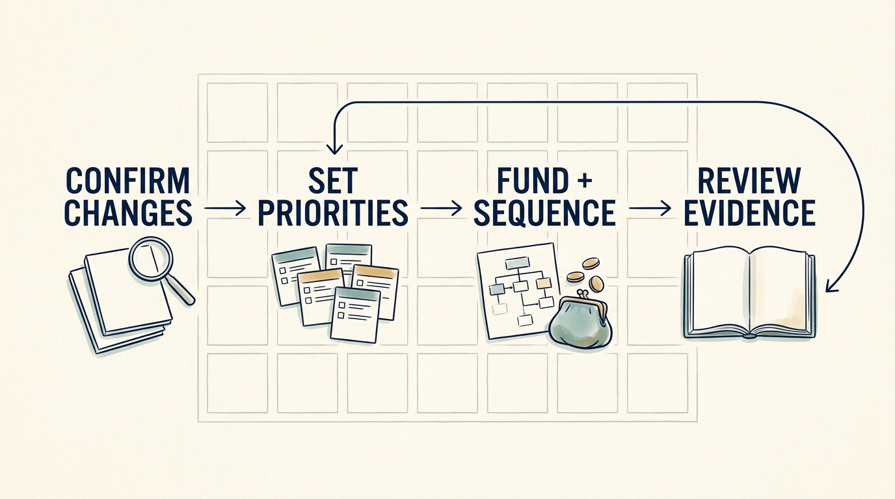

The early period after funding or an ownership change should establish a **funded operating plan**: what the business will do, who is accountable, what cash and capacity are approved, when each decision falls due and what has been deferred. A hundred days is a planning convention, not evidence that every business changes at the same speed. The transaction introduces new assumptions and review dates, and it can introduce a new review timetable and expectations formed during diligence. Confirm which of them change the company’s existing plan.

**Figure 1:** *Use the early period to establish a company-owned, adaptable plan.*

The chapter follows one fictional scenario: a growth investment in Larkspur whose thesis assumes onboarding volume can double without proportional implementation staff. The board authorized up to €300,000 of additional cash and 24 engineer-weeks for the period.

Start by confirming the inherited findings with the people who will do the work. Finding **D-3** arrives from diligence with its identifier: onboarding depends on one specialist’s manual configuration, about 80 hours per implementation in a five-of-twelve sample. Management confirms the dependency but rejects the sampled figure as a baseline and commits to measuring one from actual customer records by day 20. Alex’s explanation, that roughly 40% of the effort is poor customer data, stays recorded as the disagreement the pilot must resolve.

**The plan is worked through.** ONB-1, the onboarding pilot from D-3: Priya accountable, €180,000 committed, 12 engineer-weeks, cohort review at day 90. KNW-1, a second engineer able to release and recover the scheduling engine, from finding D-5: Alex, no additional cash, 4 protected weeks, demonstration at day 60. REC-1, a restore test against the agreed recovery objective, from D-6: Alex with the operations lead, €80,000, 4 weeks, test at day 45 and retest by day 90. Total: €260,000 and 20 engineer-weeks, leaving a reserve of €40,000 and 4 weeks. Deferred with a decision recorded: the customer portal, second-country expansion and two implementation hires. A short list is not permission to leave a material risk without a decision.

**Sequence dependencies and accept imperfect baselines.** The restore environment must exist before day 45; the baseline before the cohort; the scheduling specialist’s time is protected and cannot be spent twice. Measure internal effort and customer waiting time separately. Outside support for ONB-1 sits inside the plan’s capacity through the engagement charter in [[useful-engagement]].

**Review the plan, not its completion rate.** At day 100, REC-1 had failed at day 45 and passed at day 85 once a missing credential and database version were corrected. KNW-1 passed at day 60. ONB-1’s cohort of eight cut effort from 80 to 62 hours, not the 50 assumed; about 40% of the remaining hours traced to data quality; customer waiting time was unchanged. The board kept second-country expansion deferred another quarter, funded a €40,000, 4-week data-quality step from the reserve and kept hiring deferred. That revised commitment, not a completed task list, is the payoff. What happens when the plan’s money arrives late is the subject of [[the-financing-slipped]]; its continuing obligations are handed over in [[handover-of-obligations]].
