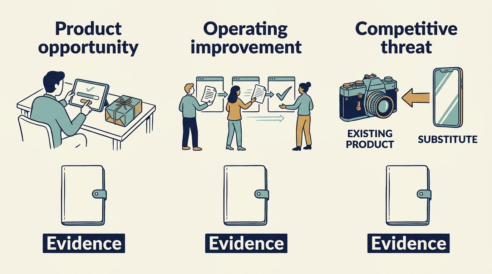

> **IN THIS SECTION, YOU WILL:** Learn to separate the three investment questions inside an AI strategy request and give each its evidence, cost, quality threshold and decision.

> **WHY INVESTORS CARE:** A growth investor, one that has bought a share of the company expecting it to grow, often assumes the answers to all three questions at once. The story told when raising the next round of money can then turn a demonstration into a promised launch. Separating the questions makes clear which one the money and the board’s approval are attached to.

> **WHY YOU SHOULD CARE:** An AI strategy request bundles a product bet, a productivity claim and a competitive threat into one word. Funding them as one decision commits money to the wrong question.

> **KEY POINTS:**
>
> * An AI strategy request hides **three investment questions**: a product opportunity, an internal-work improvement and a competitive substitution. Each needs its own evidence, cost and decision, and someone accountable for holding the three answers together.
> * Measure the **complete workflow**: preparation, production, review, correction and operation. A tool in use is not a useful result, and capacity freed is not cash saved until a dated spending decision converts it.
> * Keep **experimental results attached to their conditions**. Dated studies of coding assistants point in different directions; test the local effect before an estimate becomes a commitment.

 
Few requests arrive with more pressure and less definition than a request for an “**AI strategy**.” The phrase can mean a new feature customers will pay for, a cheaper way to run the company, or a defence against a competitor that could make the product unnecessary. Each is a different investment, with its own evidence, costs and accountable people, and funding them as one decision puts money behind the wrong question. This chapter separates the three questions and gives each its own test.

**Artificial intelligence (AI)** means software that classifies information, makes predictions or generates content from learned patterns, rather than following rules a person wrote out step by step. **Generative AI** is the part of AI that produces new text, images or code rather than sorting or scoring what already exists. An **AI model** is the component that learns patterns from data and produces the outputs; its output needs evaluating in the task where it will be used. An **AI agent** is software that carries out a sequence of steps on its own. That is a different thing from a company’s **support agents**, the people who answer customer problems; where this chapter counts agents, it means people unless it says otherwise.

AI earns a chapter of its own even though other chapters, on product value and engineering and, in Part VI, on cloud economics and recovery, supply most of the tools it needs. The reason is that the attention around AI brings **hype, shifting vocabulary and claims that are hard to check**. A way to sort the questions is worth more than another opinion about the technology.

## Setting Up the Example: One AI Request, Three Questions

Larkspur is the fictional company this book follows. It sells software that helps industrial customers schedule maintenance work: which machine gets inspected, by which technician, in which week. **Ines** is the chief executive, the leader accountable for the whole company. **Priya** leads product, deciding what the software should do next. **Alex** leads technology and the engineering team. **Sam** leads finance and controls what is spent. **Dara** is the operations lead, responsible for the day-to-day running of customer service, including the support team and its staffing. Above them sits the **board**, the small group of owners and outside members who oversee the company and approve its largest commitments.

One of Larkspur’s owners is a **growth investor**: an investor who has put money into the company expecting the business to expand and its stake to become more valuable. That investor asks for an “AI strategy.” Priya hears a new customer feature, Sam expects lower costs, and Ines worries about a competitor replacing the product. These are **three different investment questions**: a product opportunity, an operating improvement and a competitive threat. Rolling them into a single adoption target **obscures the economics**: how the money actually comes back. A company can use AI extensively without creating value, create value through one narrow use, or face substitution even when its own experiments work well.

The investor’s request is specific. It assumes three things at once: that a paid AI feature is in the product before Larkspur next raises money from investors, that the cost of setting up and supporting each customer falls as the company grows, and that Larkspur’s scheduling product is not displaced by a general-purpose assistant. Those three assumptions reach Priya and Alex as one request, and a headline commitment can be made on the company’s behalf before anyone has examined the work. When a company raises money, it tells a story about its prospects; naming an AI feature in that story turns a demonstration into a promise that the product team then has to keep.

The analysis is dated September 2026. The three Larkspur tests are authorized that month and start in the week of 5 October 2026, each with its own budget and dates. The experiments cited in this chapter describe particular earlier tools and groups of users. Other chapters stay useful throughout: the value chain from [[roadmap-to-revenue]], the treatment of uncertainty in [[prove-you-can-restore]], and the limits on an investor’s adviser in [[investors-adviser]]. The tests are funded separately, not drawn from the hundred-day budget in [[first-hundred-days]].

**Figure 1:** *Separate the investment questions before choosing an experiment or making a commitment.*

## Decide Who Coordinates the Three Questions

One common pattern is that the request lands with the technology leader and the answer comes back as a feature roadmap and a coding-assistant pilot, while the rest of the company adopts whatever tools it finds. Yet the internal-work question can be largest outside product and engineering: implementation, support, sales, legal and finance each run routine work, review, correction and a result somebody depends on, with risks a tool cannot see, such as a customer-facing error or a contractual limit on data use. An answer that covers only the product cannot satisfy an investor whose expectations rest on the whole company working differently, and cannot see a substitute arriving through the sales or service channel.

What this chapter proposes is proportionate coordination, not a new organization.

- **Who coordinates.** At Larkspur, Ines the chief executive makes Priya, the product leader, accountable for holding the three questions together and reporting on all three to the board, since two of them are product and market questions. Alex, who leads technology, is accountable for the shared technical foundation, the method used to judge output quality and the permissions attached to data; Sam, who leads finance, for the cost and spending tests.
- **Which departments participate.** At Larkspur the departments with the largest routine workflows are customer implementation (helping a new customer put the software into use), support (answering customer problems) and finance, so they join first. Sales and legal join when a question reaches them, for example a contract term on data use.
- **Which decisions are shared.** Data permissions and the terms of the supplier’s contract, the quality and review standard, the record of tools, versions and dates, and the rule that freed capacity becomes a claimed cash saving only through an explicit, dated spending decision. Everything else stays local to the department.

A participating department can name a **champion**: one person with protected time and the authority to run a local experiment and report what the evidence shows. That is an option where the workflow is large enough to justify it, not a requirement for every department. The test of the arrangement is whether each participating department can state its goal, its accountable person and its evidence. A more formal structure, such as the management-system standard in the further reading, can come later if the evidence justifies it.

## Question 1: Is There a Product Customers Will Pay For?

**The decision** is whether to fund a customer-facing AI capability, on what evidence and at what price.

**Evidence required.** Start with the customer’s work, not the model. Compare the complete workflow with the current alternative: how many cases need correction, which errors are hard to detect, whether the customer trusts the output enough to act on it, whether the new workflow is still faster once someone has reviewed the output and dealt by hand with the unusual cases the tool cannot settle, and whether the customer would pay. Estimate the **cost per successful outcome** rather than the cost per model request. **Inference**, running a trained model to produce an output, can be cheap while review is expensive, mistakes are common and the customer gains little.

A large collection of data does not by itself give the company an advantage competitors will struggle to copy. Ask whether the company has the rights to use it for the proposed purpose, whether it represents the relevant population, and whether its quality and update process support the task. Access is not ownership, and a right to display information to a user is not a right to reuse it in a different AI service; leave the contractual questions to specialist review. The United States National Institute of Standards and Technology (**NIST**), a public body that develops measurement methods and standards, identifies risks and suggested management actions across the AI lifecycle in its 2024 Generative AI Profile; it is a voluntary reference, not evidence that a product is compliant or effective. [S18: NIST generative AI profile](https://nvlpubs.nist.gov/nistpubs/ai/NIST.AI.600-1.pdf)

A **demonstration shown to investors is different from a product commitment**. Larkspur’s investor wants an AI demonstration before the next meeting. Priya and Alex can agree a bounded demonstration while recording what it does not yet establish: customer demand, reliable performance, permission to use real customer data rather than test data, and the full cost of serving customers. The conversation about raising money should not silently turn the demonstration into a promised launch.

**Larkspur example (fictional).** Customers spend hours sorting incoming inspection documents into categories before scheduling maintenance. Priya proposes an AI step that does the sorting.

**The pilot.** Three customers agree in advance to pay €300 a month each for a limited trial. Larkspur commits €45,000 of outside spending on evaluation and one-time model work, and six **engineer-weeks** — one engineer’s full working week of effort, so six of them can be three engineers for two weeks rather than six calendar weeks. Running the tool costs about €60 a month per customer at trial volumes, and that cost continues for as long as the feature runs. The starting point to beat is about four hours a week of manual sorting per customer, roughly 17 hours a month. The trial runs ten weeks from 5 October 2026 and has two checkpoints, for two different purposes.

- **Stop rule, week five (6 November 2026).** If review effort has not fallen below the four-hour starting point, the tool is adding work rather than removing it; the trial stops early and the demonstration stays a demonstration.
- **Release gate, week ten (11 December 2026).** Three conditions, each checked separately, and measured on **two separate samples that are never pooled**. The first is a representative sample of at least 200 ordinary documents per customer, drawn as they arrive, which is where the **95% sorted correctly** figure comes from. The second is a safety challenge set of at least 30 documents per customer that the customer has flagged as safety-relevant, collected deliberately because too few arrive by chance to test. Its condition is different in kind: **no safety-relevant document missed** — every one reached a person — counted on its own, because a 95% average can hide the few cases that matter most. Pooling the two would move the headline figure for the wrong reason: adding harder safety cases would drag it down, and adding easy ones would push it up, while the tool's performance on ordinary customer work was unchanged. An empty safety set is a failed check, not a passed one. Third, review effort below 1.5 hours a week.

The 1.5-hour figure is a **chosen margin, not the break-even point**. A planner’s **loaded hourly cost** — what the employer pays for an hour of that person’s time, including employment taxes, benefits and paid leave, not just the wage — is about €50 at Larkspur’s customers. On that basis a €300 monthly fee equals six saved hours a month, which arithmetic reaches when review settles at about 2.6 hours a week. That is break-even: the customer is paying exactly what the freed time is worth.

Larkspur sets the target stricter, at 1.5 hours, so the customer keeps a clear benefit. At 1.5 hours the customer saves about 10.8 hours a month, worth roughly €540. At three hours the saving is about 4.3 hours, roughly €220 — less than the fee.

That valuation says what the freed time is worth to the customer. It is not money the customer will actually stop spending, and it is not evidence that anyone will buy. Willingness to pay is checked separately, by asking the three paying customers whether they will continue at €300.

**What happens at each outcome.** The branches below are checked in order, and exactly one applies. Quality is tested first, so a fast but inaccurate tool cannot reach the later branches.

- **Any safety-relevant document missed, or ordinary-sample accuracy below 95%.** Redesign as a review aid that a person confirms, rather than automated sorting. Priya proposes the redesign and Ines approves it within the existing budget, or it stops. Review effort does not matter here at any value.
- **Quality passed, review effort below 1.5 hours a week, and at least two of the three customers confirm they will keep paying €300.** A successful trial. Exactly 1.5 hours fails this branch: the condition is *below* 1.5, so 1.4 passes and 1.5 does not.
- **Quality passed, review below 1.5 hours, but fewer than two customers will continue at €300.** Stop, and keep the demonstration as a demonstration. The tool works; the price does not.
- **Quality passed and review effort at 1.5 hours or above but below four hours.** One extension, to 15 January 2027 — four working weeks, with the trial paused over the end-of-year holiday, which is why five calendar weeks pass. It runs at the €60 a month per customer that Larkspur pays to keep the feature running, with no new engineering. Quality and at least two paying customers must hold throughout: if quality lapses during the extension the trial ends that day and the feature goes to redesign, and if the second paying customer withdraws it ends that day as a demonstration. Ines authorizes that single extension and no second one. On 15 January, review below 1.5 hours with quality and two customers intact is a successful trial; review still at or above 1.5 hours is a redesign as a review aid.
- **Review effort at four hours a week or above.** Already caught by the week-five stop rule; if it rises back to four hours between the checkpoints, the trial stops on that day.

**What a successful trial buys.** It authorizes Priya to ask for development funding, not to promise a launch date.

Building for **general release** — the feature sold to all customers — needs a further ten engineer-weeks. Those are not Larkspur's to spend until the board approves the 2027 operating plan, the approved plan for running the business and the money attached to it, in January 2027.

Continuing the **limited trial** for the customers already on it is the cheaper, separate decision. It costs €60 a month per customer against their €300 fee, so it pays for itself, and Ines can approve it from the discretionary budget without the board. If the board declines the development funding, that limited trial is what continues: the paying customers keep the feature at €300, Larkspur keeps collecting the fees and paying the running cost, and the feature is re-proposed with the next plan.

**What Priya promises the customers**, before the trial starts, is bounded by those conditions rather than open-ended. Any customer who elects to keep paying €300 at the end of a trial that passed its quality conditions keeps the feature, for as long as quality continues to hold and Ines renews the approval. A general release is separate and depends on a board decision Larkspur does not yet have. The promise stops where the branches above stop it: if quality fails, the feature is redesigned as a review aid before anyone keeps using it; if a customer declines to continue, there is nothing to continue for that customer; and if fewer than two continue, the trial ends and the feature returns to being a demonstration. Priya says all of that at the start, because a promise made before the evidence arrives is the mechanism this chapter is trying to interrupt.

Chosen: the paid three-customer trial. Rejected: naming the feature in the story told to investors, which would convert a demonstration into a promise, and building for general release now, with no evidence of willingness to pay. Funding: €45,000 from the **discretionary budget** Sam holds — money he is authorized to allocate without further approval, within an agreed limit. Scarce capacity: the six engineer-weeks displace part of the reporting work planned for October to December. Authorized by Ines inside the approved operating plan, with the board told the demonstration is a demonstration. Evidence that would change the decision: any release-gate condition failing on 11 December.

## Question 2: Will Internal Work Improve Enough to Change Spending?

**The decision** is whether an internal productivity investment changes spending, and by which route: avoided hiring, reduced external spending, or more useful output at the same cost.

**Evidence required.** Define the economic mechanism before buying licenses or promising savings. Choose a defined group of tasks and participants and a credible comparison. Record task type, experience, tool and model version, time period and quality criteria. Include the cost of reviewing output and correcting errors. Track whether the experiment changes which work people choose, because **task substitution** can make a simple before-and-after comparison misleading. Decide in advance what would justify continuing, expanding, redesigning or stopping: faster completion below the quality requirement is not enough, and more useful work at the same cost may be valuable without reducing headcount. A pilot should also reveal the operating burden: who updates evaluations when the model changes, who handles **regressions**, cases where an update makes previously acceptable behavior worse, and what happens when the provider is unavailable or changes its terms. A capability needs an accountable leader who outlasts the first demonstration.

Saved time is capacity, not cash. It becomes a saving only through a further operating change, such as avoiding a planned hire or cutting external spending, and revenue only if it enables work customers buy; the chapter [[roadmap-to-revenue]] works through that conversion. The AI-specific complications: review and correction can absorb much of the saved time, errors can be plausible and hard to detect, and announcing a staffing reduction before demonstrating the mechanism removes the people needed to evaluate the output.

> **Evidence box: what the coding studies show, with their dates and limits.** A **controlled experiment** compares outcomes under different conditions, such as doing a task with and without a tool.
>
> **The Copilot experiment.** Run in 2022 and published by Peng and colleagues in 2023, it asked developers to write one small piece of software — a program that answers requests over the web — in the JavaScript programming language. Among the participants who finished the task, those given GitHub Copilot, an AI tool that suggests code as a developer types, took 55.8% less time on average. That supports a claim about that bounded task, not an equivalent cut in an engineering budget. [S19: Peng et al., Copilot experiment](https://arxiv.org/abs/2302.06590)
>
> **The METR study.** **METR** (Model Evaluation & Threat Research), an organization that studies what AI systems can do, ran an early-2025 **randomized study** with experienced developers working on their own open-source projects, software whose code is published for anyone to use and improve. What chance decided there was not who used the tool but **which tasks allowed it**: each issue the developers picked up was randomly assigned to permit AI or forbid it, so the same person worked both ways and the comparison is between similar tasks rather than between different people. Tasks took 19% longer when AI was allowed — a different population, setting and tool period from the Copilot experiment. [S20: METR early-2025 experiment](https://metr.org/blog/2025-07-10-early-2025-ai-experienced-os-dev-study/)
>
> In February 2026 METR reported that its follow-up had serious selection and measurement problems: developers and tasks were increasingly excluded from the measured sample, and running several AI agents at once complicated time measurement. The researchers’ own inference was that the excluded participants and tasks were likely to benefit more from AI; that is their judgment, not a measured property of the excluded cases, and they called the new data a weak guide to the size of current effects. [S21: METR 2026 update](https://metr.org/blog/2026-02-24-uplift-update/) These studies are not competing universal laws. Their differences show why context, task selection, tool version and outcome definition belong in the decision, and a favorable coding result is only one step in delivery: product decisions, review, testing, release and customer adoption can become the limiting steps.

**Figure 2:** *Measure the complete local workflow and its output before converting a task result into a financial promise.*

**Larkspur example (fictional): the pilot.** The investor assumes the cost of supporting each customer falls. Larkspur’s six support agents — the people who answer customer problems — handle about 1,200 **tickets** a month, about 200 each. A ticket is one recorded customer request for help. Alongside tickets they pass the hardest problems to specialists who can solve them, keep the team's shared reference library of standard answers up to date, and train new colleagues; those duties take a fixed share of their week. Volume is forecast to reach about 1,320 tickets a month by April 2027, which is why a seventh agent, at an employment cost of €64,000 a year, is planned to start on 1 April 2027. That €64,000 is the **recurring annual cost** of the role — salary plus employer taxes and benefits — and it is money Larkspur would actually spend. Equipping the person costs about €1,500 more, but that is a **one-time purchase** made once when they join, so it is kept separate from the annual figure throughout.

The pilot runs eight weeks, 5 October to 27 November 2026: three agents use an assistant to draft responses while the other three continue unchanged as the comparison group. It costs about €6,000, all of it money Larkspur pays out: licenses — paid permission to use the software — at about €50 per agent a month, so €300 for the pilot, with the rest going to setup and to a senior agent’s sampled error check, plus one engineer-week to connect that shared reference library to the assistant. Data permission is settled first: the assistant receives ticket text, not customer contract documents, until legal confirms the terms allow it.

**The quality rule.** Two things are measured beside speed. The **reopen rate** is the share of tickets a customer comes back on after the ticket looked resolved. The **sampled error rate** is the share of answers a senior agent judges wrong when checking a sample, which matters because a customer need not reopen a ticket for a wrong answer to do damage. During the pilot, both must be no worse than the three agents working unchanged. **Quality is a condition for every continuation branch**: if either measure is worse, the tool is not rolled out and is not left running as it is, whatever the time saving. The decision on 27 November therefore reads:

- **Quality held and complete handling time at least 20% shorter:** roll the tool out to all six agents.
- **Quality held and time between 10% and 20% shorter:** restrict the tool to the ticket categories where it helped, and do not defer the hire.
- **Quality held and time less than 10% shorter:** stop paying for licenses.
- **Either quality measure worse, at any time saving:** do not roll out. If the errors sit in identifiable ticket categories, restrict the tool to the categories where quality held and re-check after four weeks; if they do not, stop paying for licenses. A 25% time saving with worse quality stops the tool exactly as a 5% one does.

The same rule applies **after** rollout, not only on 27 November: if either measure turns worse later, the tool comes off the affected ticket categories immediately, and off entirely if the errors cannot be traced to particular categories. Stopping an unsafe use is not the same as stopping the tool everywhere, and the demonstrably safe categories can keep running. But whatever capacity the withdrawal removes has to be replaced, which is the subject of the fallback below.

Rollout removes the comparison the pilot relied on, because all six agents now have the tool and there is no untreated group left to measure against. So the reference has to be fixed in advance: Larkspur records the comparison group's reopen rate and sampled error rate **by ticket category** during the pilot, and those recorded rates become the standard each later month is judged against. Each monthly check draws a **fresh sample** of answers written that month, not a re-reading of the pilot's. And it compares **like categories with like**, so a month heavy in complex billing questions is measured against the pilot's billing rates rather than against its overall average. Without that, a change in the mix of incoming work would look like a change in quality. In February, with the tool on every desk, Dara's check is therefore a concrete one: take that month's sample, split it by category, and compare each category's reopen and error rates with the rates the untreated three recorded for the same category in October and November.

**Larkspur example (fictional): what would let the hire move.** The pilot result alone does not defer the hire. On a **time-only model**, which estimates capacity from handling time and nothing else, three agents each taking 20% less time per ticket supply the ticket-handling capacity of 3.75 agents. Taking 20% less time per ticket means handling 25% more tickets in the same hours, not 20% more. With the other three agents unchanged, the six-person team supplies the previous ticket-handling capacity of 6.75 people, about 1,350 tickets a month — barely above the April forecast and with no room for growth. Extending the tool to all six, with the non-ticket duties held at their present hours, is a separate condition: it gives 6 ÷ 0.8 = 7.5 agent-equivalents, about 1,500 tickets a month.

Three further measurements then decide the hire: a four-week check ending 29 January 2027 that the 20% holds across the full range of ticket types after rollout, without agents choosing simpler tickets, and without the hours they spend on specialist referrals and the reference library being squeezed to produce the number; monthly ticket volume staying under about 1,400, reviewed each month; and both quality measures held after rollout, checked monthly.

The 1,400 figure is a **precautionary hiring threshold, not the point where service fails**. With the tool running, the team can handle about 1,500 tickets a month. Larkspur starts recruiting at 1,400 because recruitment takes three months and it would rather have someone in the pipeline early than discover the gap when it arrives. Crossing 1,400 therefore starts a search; it does not by itself mean tickets are going unanswered.

A **service-capacity deficit** is the different and more serious event: demand for the month exceeds what the team can actually handle that month. What the team can handle depends on the state of the tool, so the fallback is sized against that usable figure rather than against the plan:

| State of the tool | Usable capacity a month |
| --- | --- |
| Running across all ticket categories | about 1,500 |
| Restricted to the categories where quality held | between 1,200 and 1,500, counted from the categories still covered |
| Withdrawn entirely, or the 20% saving lost | about 1,200 |

All three measurements are **continuing conditions, not one-off tests**, and each can fail on its own. Demand rising does not remove the tool's benefit: at 1,430 tickets with the tool running, usable capacity is still about 1,500, so the month is covered and what 1,430 triggers is the search. But if quality deteriorates and the assistant is withdrawn, the six agents fall back to about 1,200 tickets a month — what they managed before the tool — however low volume is. At the April 2027 forecast of 1,320 that leaves about **120 tickets a month with nobody to handle them**, and volume never breached 1,400, so a volume-only trigger would say nothing at all. The fallback therefore triggers on **capacity, not on volume**.

**Larkspur example (fictional): hiring dates and what each outcome costs.** Recruiting a support agent at Larkspur takes about three months from opening the role to a first day.

The dates only work if recruitment starts before the check that might cancel it. **The role is therefore opened on 1 January 2027, four weeks before the January check**, on a contingent basis: Dara runs the search, but no offer is made until the check reports. That costs nothing but Dara's time and it is what makes the April date reachable at all. Opening the role on 29 January, after a failed check, would reach a first day on 29 April — almost a month of missing capacity that nobody had budgeted for.

- **The January check fails**, on 29 January 2027. Recruitment has been running since 1 January, so the contingent search converts to an offer and the seventh agent starts on 1 April 2027 as originally planned. The 2027 employment cost is nine months of €64,000, **€48,000**, and no saving is claimed.
- **The check passes and the hire is deferred to 1 October 2027.** The contingent search is stood down on 29 January and reopened on 1 July 2027 for the October start, rather than left until volume forces it. The 2027 employment cost is three months, **€16,000**.
- **Volume crosses 1,400 with the tool still running** — say the March 2027 review shows 1,430. Usable capacity is about 1,500, so the month is covered and no agency cover is bought. What the threshold does is restart the clock: Dara reopens the contingent search on 26 March 2027, and an offer follows if the next review confirms the trend. Three months from that confirmation gives a **1 July 2027** start, costing six months in 2027, **€32,000**. The months of salary already not paid are not erased; only the remaining months are lost.
- **The tool is restricted or withdrawn, opening a deficit.** Here demand exceeds what the team can actually handle, and the size of the gap is the difference. A withdrawal at the April forecast of 1,320 leaves about 120 tickets a month uncovered; a withdrawal in a month running at 1,430 leaves about **230**. Recruitment follows the same three-month clock, so a deficit confirmed at the March review gives a 1 July start. Notice what the seventh agent does and does not fix: seven unassisted agents handle about 1,400 tickets a month, which closes the 120-ticket gap but leaves a month at 1,430 about **30 tickets short**. A deficit the hire cannot close is not a staffing question at all — it is a decision for Ines and Sam about restoring the tool to the safe categories, agreeing a reduced service with customers, or funding a further hire.
- **Interim cover between a confirmed deficit and the new agent's first day** is funded, not assumed, and sized against the gap rather than against the plan. Sam holds €9,000. At roughly €690 a week for an experienced contractor, one day a week covers about 40 tickets a month and the €9,000 lasts about three months — enough for the small gap a demand overshoot leaves once the tool is restored. It does **not** cover an assistant switched off for quality: a 120-ticket gap needs three contractor days a week, which exhausts the €9,000 in about four and a half weeks, and a 230-ticket gap is beyond what agency cover reaches at all. Those cases are an escalation, not a budget line: Dara reports to Ines and Sam within the week, and the choices are extra funding for cover, a temporary service reduction agreed with customers, or both. Naming it is the point — an allowance that quietly runs out is worse than one known to be insufficient.
- **A warning short of either trigger** — the March review shows volume rising toward 1,400 but not past it, or quality drifting without breaching — reopens the contingent search so the three months are running, without committing to a start until the next monthly review.

**The financial result follows the dated start, not the plan.** The €64,000 is the annual recurring cost of the role: salary plus employer taxes and benefits. It is charged month by month, about €5,333 a month, so what a start date decides is how many months of it land in 2027. Equipping the person is a separate one-time purchase of roughly €1,500 in whichever year they start, not part of the monthly figure, and it is not avoided by deferral — only postponed.

| 2027 start date | Months paid in 2027 | 2027 employment cost | Avoided against the planned April start |
| --- | --- | --- | --- |
| 1 April (planned) | 9 | €48,000 | — |
| 1 July (trigger confirmed in March) | 6 | €32,000 | €16,000 |
| 1 October (full deferral) | 3 | €16,000 | €32,000 |

Then subtract what the deferral costs to get. **Take the full deferral first.** The 2027 costs are licenses for six agents of about €3,600 and evaluation upkeep and sampled review when the model version changes of about €4,400 — €8,000 of money actually paid out — plus rollout and training of about €2,000, which is one week of Dara's existing time rather than a new payment. So the arithmetic runs in two steps, and the order matters:

- **€32,000 avoided − €8,000 paid out = about €24,000 of cash** Larkspur does not spend in 2027. This is the figure to use in a cash forecast.
- **€24,000 − €2,000 of internal time = about €22,000**, a **cost-based estimate**. It is the smaller number because it also charges for Dara's week, which Larkspur pays for either way. It is not cash. The €24,000 belongs in a cash forecast and the €22,000 in a cost comparison; neither is a subtotal of the other.

**Now the case that disappoints.** A March trigger pushing the start to 1 July avoids €16,000 rather than €32,000. Subtract the same €8,000 of licenses and upkeep and the result is about €8,000 of cash. If a deficit also forced agency cover and the whole €9,000 was spent, the cash result falls to **about minus €1,000** — slightly worse than never having deferred, before counting anything else. Reserved money and spent money are different: the €9,000 subtracts only when the cover is used, which a demand overshoot with the tool still running does not require. Deferring a hire is worth roughly €24,000 in cash if the conditions hold for the full six months, about €8,000 if demand forces an early start, and less than nothing if quality fails and cover has to be bought. A failed January check avoids nothing at all.

Of the recurring costs, the €3,600 of licenses and €4,400 of evaluation upkeep repeat every year the tool runs; the €2,000 of rollout and training happens once, in 2027. From 2028 the running cost is therefore about €8,000 a year, and whether to hire an agent at all in October 2027 is a new decision on the same measures.

Chosen: the eight-week pilot with a comparison group. Rejected: buying licenses for the whole company with no local evidence, and telling the investor that support headcount will fall, which would remove the reviewers the pilot depends on. Funding: €6,000 from the operating budget Sam holds, plus the €9,000 interim-cover line he reserves against a later capacity deficit. Scarce capacity: one engineer-week. Authorized by Dara, the operations lead, with Priya coordinating and Sam testing the spending claim. Evidence that would change the decision: a rising reopen rate or sampled error rate, agents choosing simpler tickets while the tool is on, or ticket volume growing faster than the forecast.

## Question 3: Can a Substitute Replace the Product Customers Already Buy?

**The decision** is whether to defend, partner, reprice or stop a feature investment in the face of a substitute.

**Evidence required.** AI might make a feature easier for competitors to reproduce, reduce the customer’s need for a workflow or shift value toward a different interface. These are hypotheses. Testing them needs customer evidence and a view of **switching costs**, the money and effort needed to move to another product, along with access to customers, trust and the full task being performed. A product’s advantage may lie in doing the job dependably every time, in knowing a specialized field, in the connections that keep the records an authority requires the customer to hold, in customer relationships, or in being built so far into how the customer already works that pulling it out means changing the work — rather than in the difficulty of generating code. Conversely, an existing customer base does not guarantee that a new interface will preserve the company’s role.

**Larkspur example (fictional): the setup under test.** The customer task a substitute could perform is a narrow one: a customer's planner produces next week's maintenance schedule from a list of the machines needing attention and the technicians available.

The substitute is one specific setup, recorded with its version and the October 2026 test date — a general-purpose assistant used through an ordinary web page, with a spreadsheet uploaded by hand and no connection to the customer's systems. In that setup it produces a plausible weekly schedule. What it cannot do is push that schedule to technicians' devices, re-plan when a job overruns, or keep the inspection records the customer is required to hold and show to its **regulator**, the authority that enforces the safety rules it works under.

Those three gaps are the expected **switching constraint** — the thing that makes leaving impractical. Here it is the job-sending connection and the records, and it is a claim about the tested setup, not a durable claim about assistants in general. Note who it does not protect: small customers with simple machines and no required records have the least to lose by switching.

**The test.** Priya asks five customers, two small and three regulated, to produce one week's schedule with the assistant during October 2026 and record what they lost. Sales separately tracks renewal conversations — whether customers intend to continue their contracts — with small customers to 31 December 2026. Cost: €15,000 and two engineer-weeks to export the data the customers need; nothing recurring. The decision is taken on 15 January 2027.

If regulated customers lose their records or their ability to re-plan during the week, **defend**: fund the record-keeping and job-sending depth that the assistant cannot reach. If small customers run a week without losing anything they value, **reprice**: charge for sending jobs and keeping records, and stop selling schedule generation as a cheaper package on its own. If customers want to keep their assistant and use Larkspur’s records, **partner**: offer a connection the assistant can use rather than compete with it. If the planned “smart schedule suggestions” feature, €120,000 and eight engineer-weeks scheduled for January to June 2027, would only replicate what the assistant does, **stop** it.

Chosen: pause the smart-suggestions feature pending the test, and run the test. Rejected: accelerating the feature to keep up, which would spend eight engineer-weeks competing on the substitute’s ground, and ignoring the threat because renewals look stable. Funding: €15,000 from the budget set aside for product research. Scarce capacity: two engineer-weeks. Authorized by Ines, with the board informed, because the pause changes a roadmap item the investor has seen. Evidence that would change the decision: a lost renewal citing an assistant, or the regulated customers finding an acceptable workaround for their records.

## Three Funded Decisions and Their Review Triggers

Investor-organized seminars, peer conversations and ecosystem visits can help reveal which AI questions deserve attention. [[learn-through-investors-network]] explains how to examine those encounters with their context intact. An unfamiliar demonstration can begin an enquiry; the company still needs to decide which of the three investment questions it raises and what evidence to seek.

| Question | Decision taken | Funding and capacity | Accountable | Gate and date |
| --- | --- | --- | --- | --- |
| Product opportunity | Paid three-customer sorting trial | €45,000 cash, one-time; 6 engineer-weeks of existing staff time; about €60 a month per customer recurring against a €300 price | Priya | Stop rule 6 November 2026; release gate 11 December 2026: 95% accuracy on the representative sample, no missed document in the separate safety set, review below 1.5 hours a week, two of three customers confirming they will keep paying. Passing authorizes a January funding request, not a launch date |
| Internal work | Eight-week support pilot with comparison group | €6,000 cash, one-time; 1 engineer-week of existing staff time; €9,000 reserved for interim cover, spent only if used; if rolled out, about €8,000 a year recurring plus €2,000 of internal time once in 2027 | Dara, the operations lead | 27 November 2026: handling time, reopen rate and sampled error rate, with quality a condition for every continuation; recruitment opens contingently 1 January 2027; 29 January 2027: rollout check; hire deferred to 1 October 2027 while quality and the time saving hold and monthly volume stays under the 1,400 precautionary threshold; a deficit against the month's usable capacity, not the threshold alone, releases the €9,000 cover |
| Competitive substitution | Pause the suggestions feature; customer substitution test | €15,000 cash, one-time; 2 engineer-weeks of existing staff time; nothing recurring | Priya | 15 January 2027: what customers lost; renewal signals to 31 December 2026 |

Those three starting budgets total €66,000 of money Larkspur pays out between October and December 2026 — €45,000, €6,000 and €15,000 — and nine engineer-weeks from the same team that carries the roadmap and the recovery work; the chapter [[cannot-fund-everything]] shows how that trade is made explicit.

The €66,000 counts the initial budgets only. It excludes the €9,000 held in reserve for interim cover, which is spent only if a capacity deficit arrives; the costs that recur once a tool keeps running; and the staff time, which is already paid for and is scarce for a different reason. If all three continue, the recurring costs are about €8,000 a year for the support tool and about €60 a month per sorting customer against its €300 price. The second question is the one that changes an operating payment: about **€24,000 of cash in 2027**, conditional on the deferral holding for its full six months. Once the seventh agent starts in October 2027, the employment cost resumes while the €8,000 a year of licenses and upkeep keeps running, so from 2028 the tool is a cost until some further decision changes a payment again. A **recurring** benefit would need something this example has not established: another demonstrated hiring avoidance, a reduction in external spending, or additional output customers pay for. The third question can avoid **planned spending** instead: stopping the suggestions feature leaves €120,000 and eight engineer-weeks unspent. Reduced external spending is a third route. What all of them share is the rule this chapter keeps returning to: a saving is real only when some actual payment changes, on a date, by someone authorized to change it. Record the tools, versions and dates so later readers know which evidence still applies.

The sharpest version of that capacity collision arrives when a company buys another business, or splits one off and runs it separately, adding a whole business’s workflows, systems and customers on top of the existing roadmap. The chapter [[acquisition-adds-work-first]], in Part V, examines what such a deal asks of the same people before it adds any value.

## Questions to Consider

1. *When your investor asks for an “AI strategy”, which of the three questions are they asking, and who in your company is accountable for holding the three answers together?*
2. *For your most promising AI use case, what is the cost per successful outcome once review, correction, data preparation and monitoring are included, and what quality threshold was agreed before the pilot started?*
3. *If a productivity pilot saved 1,000 hours over three months, which spending decision would turn that capacity into cash, on what date, and who is authorized to make it?*
4. *Which customer task could a general-purpose substitute perform today, in which configuration, what constrains switching, and which evidence would make you defend, partner, reprice or stop?*

## To Probe Further

- **[Generative AI at Work](https://www.nber.org/papers/w31161)** — Erik Brynjolfsson, Danielle Li and Lindsey Raymond, National Bureau of Economic Research working paper, 2023. *A study of the staggered introduction of an AI assistant across data from 5,179 customer-support agents, measuring issues resolved per hour. It shows the internal-work question examined outside engineering, and judged on a work outcome rather than on how many people adopted the tool — which is the distinction this chapter asks for, even though the measure is narrower than the complete workflow defined here.*
- **[Navigating the Jagged Technological Frontier](https://www.hbs.edu/faculty/Pages/item.aspx?num=64700)** — Fabrizio Dell'Acqua and colleagues, Harvard Business School working paper, 2023 (later in Organization Science). *A field experiment with 758 consultants that supports the chapter's point that productivity results stay attached to the task, and shows what a bounded experiment looks like.*
- **[Large Firms With at Least 20 Employees Biggest AI Users](https://www.census.gov/library/stories/2026/05/ai-use-businesses.html)** — United States Census Bureau, May 2026. *A public baseline for AI adoption by company size and sector, useful when an investor's expectation seems out of step with what companies actually report.*
- **[Disruptive Technologies: Catching the Wave](https://hbr.org/1995/01/disruptive-technologies-catching-the-wave)** — Joseph Bower and Clayton Christensen, Harvard Business Review, 1995. *The article that introduced disruptive technology, which gives the chapter's substitution question a structure by asking which customers a substitute serves first.*
- **[ISO/IEC 42001:2023 — Artificial intelligence management system](https://www.iso.org/standard/81230.html)** — International Organization for Standardization and International Electrotechnical Commission, 2023. *A paid standard whose structure of policies, roles, risk assessment and supplier oversight is the more formal arrangement a company can compare against the proportionate coordination proposed in this chapter.*
