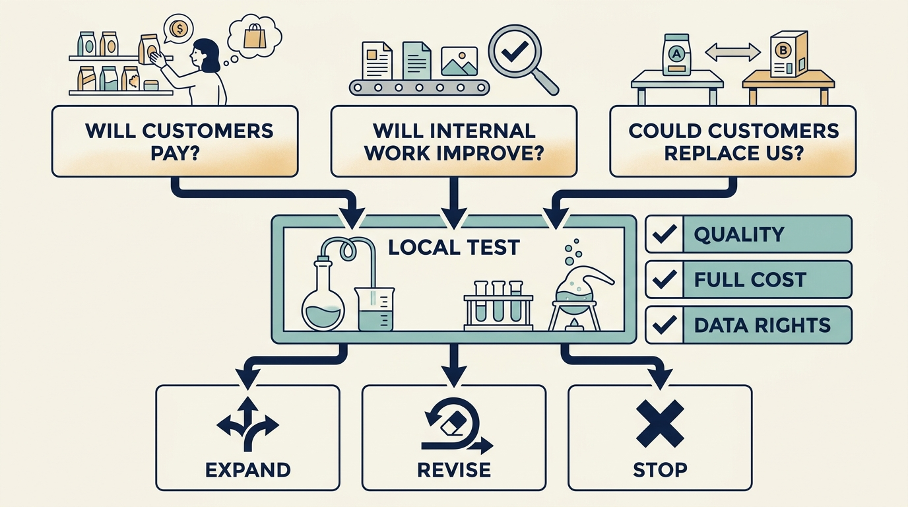

**Artificial intelligence (AI)** is software that classifies, predicts or generates content from learned patterns. When an investor — someone who put money in expecting a financial return — asks for an “AI strategy”, the request hides **three investment questions**: a product customers will pay for, internal work that changes spending, and a substitute for what customers already buy. Each needs its own evidence, cost and date.

Larkspur is a fictional company selling maintenance-scheduling software. One owner is a **growth investor** — expecting the business to expand and their ownership share to gain value — and assumes all three answers at once.

**Figure 1:** *Test the complete use case before committing to an AI benefit.*

Settle **who coordinates** first: Priya, the product leader, holds the three questions together, Alex checks the right to use the data, Sam the spending tests, Dara customer service. Only the two or three departments with the most routine work join at the start.

**Will customers pay?** Cost the whole job per successful outcome, not one model request. Larkspur's paid trial gives three customers, at €300 a month, an AI step that **sorts incoming inspection documents**, for €45,000 and six engineer-weeks of effort — one engineer's full week each, not six calendar weeks. It stops on 6 November 2026 if the tool is not saving time, and on 11 December needs 95% accuracy on a representative sample, no missed safety document, review under 1.5 hours weekly, and two customers still paying. Those who keep paying keep the feature while quality holds; general release is a separate board decision, so passing authorizes a funding request, not a launch date.

**Will internal work improve enough to change spending?** The coding evidence is mixed. A 2022 experiment found [55.8% shorter times](https://arxiv.org/html/2302.06590v1) on one small task, among those who finished it. [METR](https://metr.org/blog/2025-07-10-early-2025-ai-experienced-os-dev-study/) (Model Evaluation & Threat Research) found experienced developers on **their own projects** took 19% **longer** where AI was allowed than where it was not.

**Saved time is capacity, not cash.** Larkspur's support tool defers a seventh hire from April to October 2027 while quality and the time saving hold. Crossing 1,400 help requests a month restarts the three-month recruitment — a precaution, not a service failure, since the assisted team handles about 1,500. A real gap opens only if poor quality forces the tool off, dropping the six back to 1,200. Full deferral avoids €32,000 of employment cost; after €8,000 of licenses and upkeep that is **about €24,000 of cash in 2027** — that year's benefit from that deferral, not a repeating one.

**Could a substitute replace us?** In Larkspur's tested setup, an assistant fed a hand-uploaded spreadsheet drafts a weekly schedule but reaches neither technicians nor inspection records — a finding about that configuration, not assistants generally. After a €15,000 test with five customers, on 15 January 2027 Larkspur invests in what the assistant cannot reach, connects to it, charges differently, or cancels its €120,000 feature.

The three budgets total €66,000. A saving is real only when an actual payment changes, on a date, by someone authorized to change it.
