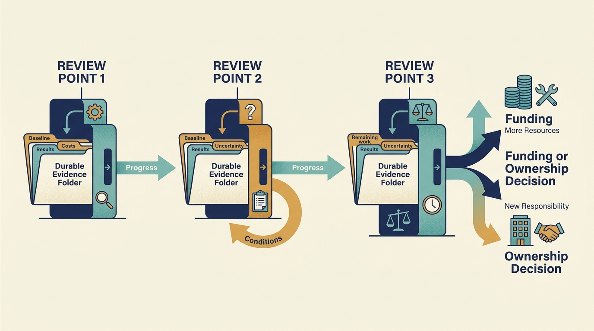

> **KEY POINTS:**
>
> * Review the plan when its **assumptions change**. Delayed funding, new financing terms or revised investor expectations may require different commitments even when delivery is on track.
> * **Keep evidence throughout ownership**. Record the starting situation, actual costs, observed results and remaining work.
> * Prepare for the **next funding or ownership decision**. Make improvements, continuing costs and unresolved obligations visible to the people who will fund or operate the business.

 
The early ownership plan is agreed. Over the following months and years, customers change, projects encounter delays and leaders leave or take on new responsibilities. Funding assumptions can change just as quickly, requiring the company to revise commitments before cash or capacity runs short.

Your responsibility as a company leader is to keep the operating plan credible as conditions change. An investor’s adviser may help through oversight, coaching or a specific delivery assignment. The role can change when investors change. Use the agreements from Part IV to establish the contribution needed and the company authority behind resulting decisions.

[[first-hundred-days]] established a funded plan. This chapter follows regular reviews, changes in funding and the evidence needed for a handover. One possible transition is an **exit**: a sale or other arrangement through which an investor receives value from some or all of its holding.

## A Regular Conversation With a Purpose

As the company’s product or technology leader, use regular investor conversations to explain what changed, the hardest decision, a blocked initiative and the help needed. Agree a frequency and format that fit the company’s situation. Bring a decision or a useful evidence update, rather than preparing a separate presentation simply because a meeting is scheduled.

A meeting is useful if it improves a decision, resolves a constraint, or provides information needed for legitimate oversight. If neither participant can explain what it changes, reconsider the cadence. Attendance is evidence of participation, not evidence of trust or value.

Separate the operational discussion from the board narrative while maintaining consistent facts. A company should not need to construct a second set of numbers for the Principal. Where the board needs a different level of detail, **derive it from the same definitions and evidence**.

## Escalate Through a Defined Path

**Escalation** means taking an issue to someone with the authority or resources to resolve it. It should identify a decision, rather than merely announce a problem.

An initiative can fail because its hypothesis is wrong, because execution is weak, or because its dependencies were not supplied. Those require different responses. Explain which cause the evidence supports before proposing additional oversight, resources or a leadership change. Ask the adviser for help testing that explanation when useful.

If the company lacks a specialist, make a specific request for one under an agreed scope. If management cannot resolve competing priorities, take the decision to the proper forum. If the economics no longer support the plan, revise it. If risk exceeds the agreed tolerance, escalate with evidence and options.

An escalation should state the decision required, the **latest useful decision date**, and the consequences of delay. “The program is red” is insufficient. The recipient needs to know what action would change the outcome and who will carry it out.

## Portfolio Collaboration Must Earn Its Time

A peer community can provide experience and access that a company would struggle to assemble alone. It can also become an event series organized around the manager's need to demonstrate activity.

Begin with decisions participants actually face. A session on customer migration can compare mechanisms, mistakes, and prerequisites. A session that asks every CTO to present an identical dashboard may offer less practical value. Let participants influence the agenda and evaluate whether the time was useful.

Information sharing needs a defined boundary. An anonymized case can still reveal a company in a small portfolio. Customer data, compensation information, confidential coaching, and transaction plans should not become freely reusable merely because the audience shares an owner. Obtain the appropriate permission and disclose only what the purpose requires.

Shared learning should retain context. A practice that worked in one product may fail in another because of customers, scale, architecture, or leadership. Capture those conditions alongside the practice rather than presenting it as a universal playbook.

## Replan When Funding or Ownership Expectations Change

In a fictional Larkspur scenario, management expects another funding round in September, but serious investor discussions now point to December. The product roadmap has not slipped; the financing assumption has. Sam should update the cash forecast, while Alex and Priya identify commitments that can be staged, stopped or completed safely. The board needs a decision before hiring, contracts or customer promises remove those options.

In another scenario, a loan is approaching repayment and refinancing terms would leave less cash for development. The trigger is the financing change, not proof that engineering has become less valuable. Bring revised cash requirements, protected customer obligations and feasible alternatives to the appropriate decision forum.

With a corporate owner, a new group strategy or budget can change the expected use of the product. Reconfirm which business unit sponsors the work, what remains funded and which promises to external customers must continue. Reorganization inside the parent is not an instruction to let local obligations become ownerless.

Keep a dated record of the assumption, trigger, decision-maker and response. **Continued ownership is a real scenario**: if a round, refinancing or sale does not happen, what useful business will remain and what can it afford? That question belongs in ordinary reviews, before transaction preparation becomes urgent.

**Figure 1:** *The next ownership event is uncertain, so the operating plan needs explicit alternatives.*

## Exit Readiness Is Evidence Readiness

Exit preparation becomes easier when the company has maintained its decision and outcome record throughout ownership. A buyer can then examine what was believed, what changed, what was invested, and what remains to be done.

The company should be able to explain its product position, architecture constraints, operating reliability, leadership capacity, material risks, intellectual property, and acquisition history. It should also reconcile the economic claims attached to technology work. A coherent story is useful only if its supporting evidence is available and its limitations remain visible.

For a cloud initiative, retain the baseline, implemented changes, demand adjustment, net costs, and service outcomes. For a platform transition, retain migration cohorts, customer losses, dual-running costs, and unfinished obligations. For AI, retain evaluation versions and actual workflow economics. These are stronger buyer materials than a retrospective list of projects.

**Figure 2:** *Keep the evidence during the work so the next decision can examine what actually changed.*

## Avoid Exit-Period Distortions

A company can improve a short-period earnings presentation by delaying investment or classifying recurring work as exceptional. It can make a roadmap look orderly by excluding difficult customer commitments. Such choices can increase the burden inherited by the next owner.

Company leaders should test whether the sale account describes a business the next owner can maintain. What spending is required to sustain current performance? What would a new owner discover after the reporting date? Which results depend on temporary incentives, unpaid work, or key people who may leave?

This does not mean all work must be complete before a sale. Buyers can accept and price unfinished transitions. The requirement is that material obligations and assumptions are represented accurately through the proper disclosure process.

## A Sale Is Not Always the End of Ownership Work

An **initial public offering (IPO)** makes shares available through a first public offering; an existing investor may still retain shares afterward. A **secondary sale** transfers an existing investment interest to another investor. A **continuation transaction** can move an investment into a new vehicle associated with the same manager. In each case, identify who receives cash and who continues to own an interest. A continuation transaction also requires attention to price and possible conflicts between participants. The Institutional Limited Partners Association (ILPA) discusses these manager-led transfers as a governance issue in its principles. [S02: ILPA principles](https://ilpa.org/wp-content/uploads/2019/06/ILPA-Principles-3.0_2019.pdf)

Do not infer realized fund performance from a transaction announcement. Follow the actual proceeds, retained interests, costs, and distribution dates. The return mechanics in [[return-mechanics]] still apply, even when a company is described as an exit success.

The cases show why this distinction matters. Hilton’s sponsor described its final stake sale in 2018, while Visma’s 2023 announcement described another transaction within a continuing ownership relationship. [S24: Blackstone 2018 investor call](https://ir.blackstone.com/files/doc_events/BLACKSTONE-Second-Quarter-2018-Earnings-Investor-Call.pdf) [S30: Visma 2023 transaction](https://www.visma.com/newsroom/visma-attracts-new-investors-for-further-international-expansion-in-a-transaction-valuing-the-company-at-eur-19-billion-59703d9f) These are different realization contexts. Reconstruct the relevant vehicle and cash flows before calling either a complete fund outcome; see [[hilton-and-skype]] and [[visma]].

## A Handover Does Not Always Mean a New Controlling Owner

A funding round can add an investor and new rights while management continues. A secondary sale can give one investor liquidity without adding cash to the company. A corporate acquisition can leave the brand and product in place while changing the authority behind them. An IPO introduces a different financing and reporting setting and requires preparation beyond this book’s scope.

For each transition, map the next holder of authority, the money available, the services the company depends on and the unfinished customer commitments. Carry forward the original baselines and actual results. Do not reset the history merely because a new owner prefers a different reporting format.

The company leader’s success is a working transition with understood obligations. A sale price, a round valuation or an internal integration milestone can matter to the owner without establishing that the company’s work is complete.

## Learn After the Handoff

A handover is an opportunity for both company leaders and the investor to learn. Where public evidence or authorized access permits, revisit whether the company sustained its capabilities and whether the buyer experienced the promised benefits and disclosed obligations.

Any involvement after a handover needs an agreed role and appropriate access. It is a discipline of checking the durability claims made during ownership. Later deterioration does not automatically prove that the prior owner failed; market conditions and subsequent decisions matter. Later success does not prove that every prior intervention was necessary.

A consistent record makes it possible to learn from the full ownership period: what was expected, what was tried, what happened and what still needs work. It supports the next decision even when the earlier plan proved wrong.

Part V has followed the company leader through investigation, early planning, ongoing ownership and handover. Part VI now uses real company histories to examine what those decisions can leave behind: [[part-6]] and [[hilton-and-skype]].
