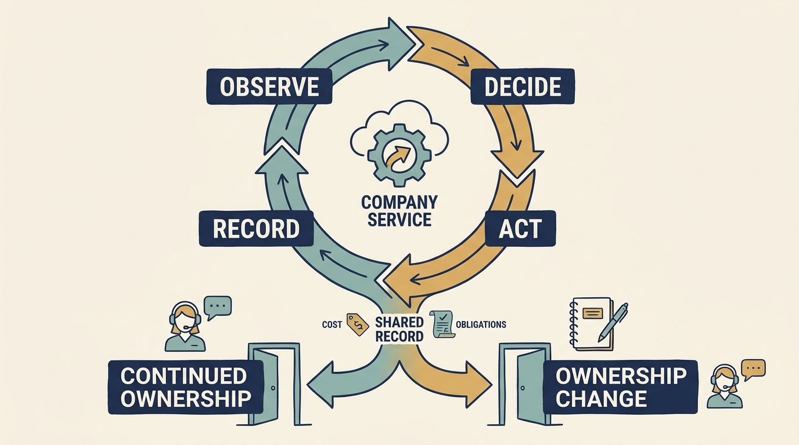

Company leaders need to revise the operating plan **as conditions change** through ownership. Investor support stays useful when it responds to those decisions and helps build capability. A fixed checklist or permanent layer of supervision can continue long after its original purpose has disappeared.

**Figure 1:** *Keep the operating plan and its evidence useful beyond the expected exit.*

Use an engagement rhythm that fits the work. Agree what information is needed, which decisions deserve escalation, and where hands-on support would change the result. Review both business outcomes and the cost of producing reports. A dashboard should help someone act, not merely reassure the organization that monitoring exists.

**Separate coaching, execution support, and governance.** A confidential conversation with a **chief technology officer (CTO)** has a different purpose from a board risk report. Explain information boundaries in advance, including material matters that cannot remain private. Influence becomes less useful when people cannot tell how their words will be used.

Portfolio collaboration can spread valuable experience, tools, and specialist access. It also creates confidentiality, contextual, and coordination problems. Sharing a pattern does not imply a right to share company data, contractual material, or employee information. Compare conditions before promoting a practice across companies.

An **exit** is a sale or another transaction through which investors receive value from their holding. Prepare the evidence for it throughout ownership. Maintain a record of the original assumption, intervention, cost, observable result, and remaining uncertainty. A buyer needs to understand the business's current capabilities and obligations, including knowledge dependencies, migrations, service commitments, and security exposure. Exit preparation should improve the evidence, not change the definition of success to fit a narrative.

A transaction announcement is not necessarily a completed or fully realized exit. An **initial public offering (IPO)** may leave some shares held by the existing investor. A **secondary sale** transfers an existing interest; a **continuation transaction** can transfer it to a new vehicle associated with the same manager. Follow which investors receive cash and examine possible conflicts. ILPA's principles offer an LP (limited partner, an investor in a fund) perspective on those issues. [S02: ILPA principles](https://ilpa.org/wp-content/uploads/2019/06/ILPA-Principles-3.0_2019.pdf)

Plan for **events other than a sale**. A delayed funding round requires a revised cash forecast and decisions before hiring or contracts remove options. Refinancing can change cash available for development. A corporate budget change can alter priorities while customer obligations continue. Another round or secondary sale may change investors without changing control. Preserve evidence and a viable operating plan for continued ownership, including the case where the expected transaction never occurs.

A useful handoff leaves company leaders able to **explain and sustain the work**, with an explicit plan for any continuing support. Agree which adviser involvement remains useful and which responsibilities move to the next arrangement. Durable support leaves better decisions, stronger operating capability, and a credible account of what changed, while allowing the next ownership arrangement to assess the remaining work on its own terms.
