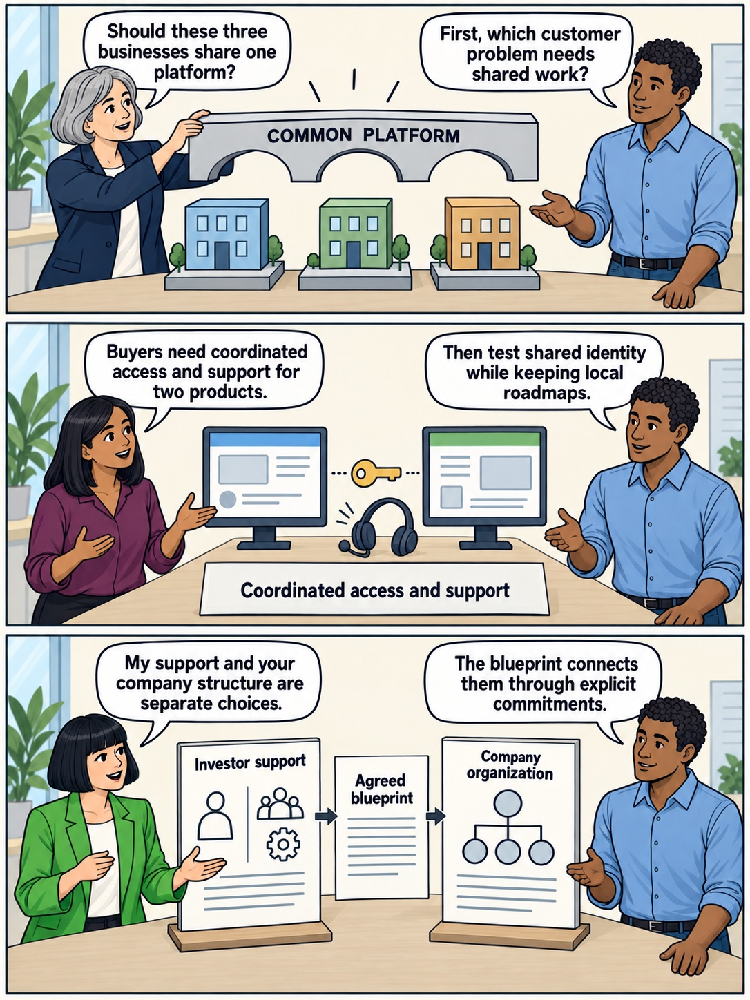
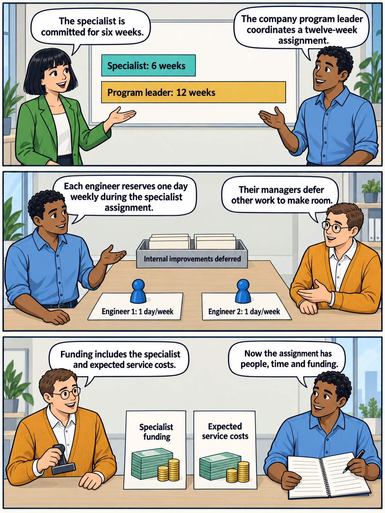

<!-- comic-style
{
  "cast": "MORGAN: a thoughtful investor technology adviser with short dark hair and a green jacket, used in the fund scenarios. ALEX: a practical CTO, a brown-skinned man with short, tight dark curls close to his head and blue rolled-up sleeves. SAM: a CFO, a man with short brown hair, round glasses and an amber cardigan. PRIYA: a product leader with straight dark hair and plum sleeves. INES: a CEO with short grey hair and a navy jacket. All are fictional; none represents a person in a real case.",
  "style": "Clean editorial explainer comic pages, each one image of three stacked full-width strips: navy ink outlines, restrained green, blue and amber accents on warm ivory, generous space, expressive people and simple physical props. Dialogue, short labels and the supplied amounts are lettered in the artwork, exactly as scripted. Money bags, coins and banknotes are plain and undecorated; the euro sign appears only inside supplied text, and arrows, documents and screens carry plain lines, never lettering. No photorealism, logos, titles or unsupplied text. Keep the same character appearances throughout the journal.",
  "reference": "_research/comic-cast-20260913.jpeg",
  "identity": {
    "Morgan": "MORGAN is a light-skinned WOMAN with a short, straight, JET-BLACK bob cut level with her jaw and a straight fringe across her forehead (never brown hair, never a side parting), and a bright green jacket over a white top, first person in the reference; her face must match the reference sheet exactly.",
    "Alex": "ALEX is a medium-brown-skinned MAN with a masculine face, broad shoulders and a straight masculine build, SHORT tight dark curls close to his head (not a large afro), a blue rolled-sleeve shirt and blue jeans, second person in the reference; fill his face, neck and hands with the same brown skin color in every strip.",
    "Sam": "SAM is a light-skinned MAN with a masculine face and SHORT brown hair cropped above his ears (never a bob, never chin-length hair, never a woman), round glasses and an amber cardigan over a white shirt, third person in the reference.",
    "Priya": "PRIYA is a brown-skinned WOMAN with straight shoulder-length dark hair and a plum blouse, fourth person in the reference.",
    "Ines": "INES is a light-skinned OLDER WOMAN with a short GREY bob (grey hair, never dark) and a navy jacket, fifth person in the reference."
  },
  "short": {
    "Morgan": "a light-skinned woman with a jet-black jaw-length bob and fringe, in a bright green jacket",
    "Alex": "a brown-skinned man with short tight dark curls, in a blue rolled-sleeve shirt",
    "Sam": "a light-skinned man with short brown hair and round glasses, in an amber cardigan over a collared white shirt",
    "Priya": "a brown-skinned woman with straight shoulder-length dark hair, in a plum blouse",
    "Ines": "an older light-skinned woman with a short grey bob, in a navy jacket"
  }
}
-->

**Comic.** The book’s fictional cast acts out this chapter’s independent example: three software businesses need coordinated access and support for two products. Ines represents the group chief executive, Alex technology leadership, Priya product leadership, Sam finance and Morgan investor support. Five pages follow the choice of help, the committed people and the reviews that change the plan.

<!-- comic-page
{
  "id": "01-two-designs",
  "title": "Start with the work",
  "asset": "assets/images/18-operating-model-blueprints/comic-page-01-two-designs.jpeg",
  "aspect_ratio": "3:4",
  "cast": [
    "Ines",
    "Alex",
    "Priya",
    "Morgan"
  ],
  "strips": [
    {
      "scene": "Ines stands on the left and Alex on the right beside a tabletop model of exactly three small software businesses. A large rigid bridge labelled COMMON PLATFORM is held above all three by Ines, poised as a proposal. Alex holds an open hand toward the model. The businesses have plain window shapes and no lettering.",
      "labels": [
        "COMMON PLATFORM"
      ],
      "label_notes": "Each label appears once on its described prop, upright and fully visible.",
      "bubbles": [
        {
          "who": "Ines",
          "text": "Should these three businesses share one platform?"
        },
        {
          "who": "Alex",
          "text": "First, which customer problem needs shared work?"
        }
      ]
    },
    {
      "scene": "Priya stands on the left and Alex on the right. Between them, two upright product screens stand apart with a small key-shaped connector between them. A support headset rests beside the connector. The two screens have simple interface rectangles; a single large card below the whole arrangement names the customer need.",
      "labels": [
        "Coordinated access and support"
      ],
      "label_notes": "Each label appears once on its described prop, upright and fully visible.",
      "bubbles": [
        {
          "who": "Priya",
          "text": "Buyers need coordinated access and support for two products."
        },
        {
          "who": "Alex",
          "text": "Then test shared identity while keeping local roadmaps."
        }
      ]
    },
    {
      "scene": "Morgan stands on the left and Alex on the right. Two separate upright boards stand side by side on a bare table, linked by a blank sheet in the middle. The left board has an outlined adviser and specialist symbol, the right board has three product-team circles. Each board has a heading, and the connecting sheet has one heading. All lettering faces the reader.",
      "labels": [
        "Investor support",
        "Company organization",
        "Agreed blueprint"
      ],
      "label_notes": "Investor support heads the left board; Company organization heads the right board; Agreed blueprint is the only text on the connecting sheet.",
      "bubbles": [
        {
          "who": "Morgan",
          "text": "My support and your company structure are separate choices."
        },
        {
          "who": "Alex",
          "text": "The blueprint connects them through explicit commitments."
        }
      ]
    }
  ],
  "alt": "Three-strip comic: a proposed common platform spans three businesses; a customer need becomes coordinated access and support for two products; separate investor-support and company-organization boards connect through an agreed blueprint.",
  "caption": "The familiar fictional cast acts out the article’s independent acquisition example. An operating model describes how people, responsibilities and decisions organize the work; the blueprint makes the chosen arrangement explicit.",
  "source_sections": [
    "Connect Two Designs",
    "A Fictional Group Chooses a Combination"
  ],
  "status": "generated",
  "generation": {
    "tool": "OpenAI imagegen (built-in)",
    "generation_calls": 1,
    "visually_verified": true,
    "sha256": "94c94336c0c65dc9973c4f5e48eec20320bd88ea804452db03d7620b3ef094b5",
    "provenance": "_research/modalities-artwork-20260922.json"
  }
}
-->

**Page 1: Start with the work.** The familiar fictional cast acts out the article’s independent acquisition example. An operating model describes how people, responsibilities and decisions organize the work; the blueprint makes the chosen arrangement explicit.

- *Strip 1.* **Ines:** “Should these three businesses share one platform?” **Alex:** “First, which customer problem needs shared work?”
- *Strip 2.* **Priya:** “Buyers need coordinated access and support for two products.” **Alex:** “Then test shared identity while keeping local roadmaps.”
- *Strip 3.* **Morgan:** “My support and your company structure are separate choices.” **Alex:** “The blueprint connects them through explicit commitments.”

<!-- comic-page
{
  "id": "02-choose-the-contribution",
  "title": "Choose the contribution",
  "asset": "assets/images/18-operating-model-blueprints/comic-page-02-choose-the-contribution.jpeg",
  "aspect_ratio": "3:4",
  "cast": [
    "Ines",
    "Alex",
    "Morgan"
  ],
  "strips": [
    {
      "scene": "Ines stands on the left and Alex on the right beneath a high wall display of exactly four equal cards in a two-by-two grid. The cards are numbered only within their supplied labels. Each card has one simple pictogram: a board table, an adviser, a specialist with a magnifying glass, and a company leader with a work plan. The display is clear of heads and speech bubbles.",
      "labels": [
        "1 Board oversight",
        "2 Operating adviser",
        "3 Shared specialists",
        "4 Dedicated execution"
      ],
      "label_notes": "Place 1 and 2 on the top row, 3 and 4 on the bottom. Four equal cards; no arrows or staircase.",
      "bubbles": [
        {
          "who": "Ines",
          "text": "Which contribution does the work need?"
        },
        {
          "who": "Alex",
          "text": "A decision route, judgment, expertise, or capacity to lead execution."
        }
      ]
    },
    {
      "scene": "Morgan stands on the left and Alex on the right beside two open, equally sized toolboxes on a bare table. One contains a simple key-shaped tool; the other contains a plain scheduling board. Each toolbox has a short front label facing the reader.",
      "labels": [
        "Identity expertise",
        "Coordination capacity"
      ],
      "label_notes": "Each label appears once on its described prop, upright and fully visible.",
      "bubbles": [
        {
          "who": "Morgan",
          "text": "This pilot needs identity expertise and coordination capacity."
        },
        {
          "who": "Alex",
          "text": "We can combine shared specialists with dedicated company execution."
        }
      ]
    },
    {
      "scene": "Morgan stands on the left and Ines on the right. Morgan places a plain recommendation sheet on a table. Ines has a separate company decision folder. The two objects remain distinct, with one label each. Neither person points or gestures across the other’s document.",
      "labels": [
        "Advice",
        "Company decision"
      ],
      "label_notes": "Each label appears once on its described prop, upright and fully visible.",
      "bubbles": [
        {
          "who": "Morgan",
          "text": "Advice carries no extra authority by itself."
        },
        {
          "who": "Ines",
          "text": "We agree responsibilities before anyone assigns work."
        }
      ]
    }
  ],
  "alt": "Three-strip comic: four equally sized cards name board oversight, an operating adviser, shared specialists and dedicated execution; two toolboxes identify identity expertise and coordination capacity; advice and the company decision remain separate documents.",
  "caption": "The four blueprints are combinations to adapt. In this example, shared specialists and dedicated company execution support a pilot under board oversight; the company’s actual delegations determine who decides.",
  "source_sections": [
    "Four Blueprints for Investor Involvement",
    "A Fictional Group Chooses a Combination"
  ],
  "status": "generated",
  "generation": {
    "tool": "OpenAI imagegen (built-in)",
    "generation_calls": 1,
    "visually_verified": true,
    "sha256": "ca2d31eb8a6bab7072bf4bd121d023a4029ac3a05cc42fb58ae6913a6c77d273",
    "provenance": "_research/modalities-artwork-20260922.json"
  }
}
-->

**Page 2: Choose the contribution.** The four blueprints are combinations to adapt. In this example, shared specialists and dedicated company execution support a pilot under board oversight; the company’s actual delegations determine who decides.

- *Strip 1.* **Ines:** “Which contribution does the work need?” **Alex:** “A decision route, judgment, expertise, or capacity to lead execution.”
- *Strip 2.* **Morgan:** “This pilot needs identity expertise and coordination capacity.” **Alex:** “We can combine shared specialists with dedicated company execution.”
- *Strip 3.* **Morgan:** “Advice carries no extra authority by itself.” **Ines:** “We agree responsibilities before anyone assigns work.”

<!-- comic-page
{
  "id": "03-commit-the-capacity",
  "title": "Commit the capacity",
  "asset": "assets/images/18-operating-model-blueprints/comic-page-03-commit-the-capacity.jpeg",
  "aspect_ratio": "3:4",
  "cast": [
    "Morgan",
    "Alex",
    "Sam"
  ],
  "strips": [
    {
      "scene": "Morgan stands on the left and Alex on the right beneath a high wall scheduling board. The board has exactly two horizontal bars aligned to the same left edge, using the same time scale. The upper teal bar is exactly half the length of the lower ochre bar. Put one complete supplied label inside each bar, large and readable. The board has no tick marks or other writing.",
      "labels": [
        "Specialist: 6 weeks",
        "Program leader: 12 weeks"
      ],
      "label_notes": "Specialist: 6 weeks is inside the upper half-length teal bar. Program leader: 12 weeks is inside the lower full-length ochre bar.",
      "bubbles": [
        {
          "who": "Morgan",
          "text": "The specialist is committed for six weeks."
        },
        {
          "who": "Alex",
          "text": "The company program leader coordinates a twelve-week assignment."
        }
      ]
    },
    {
      "scene": "Alex stands on the left and Sam on the right beside a bare table with exactly two blue engineer tokens, each on its own rectangular booking card. The cards sit side by side with clear gaps; labels face the reader. Behind them is a separate small tray containing plain work cards and carrying the supplied tray label. No other people are present.",
      "labels": [
        "Engineer 1: 1 day/week",
        "Engineer 2: 1 day/week",
        "Internal improvements deferred"
      ],
      "label_notes": "One booking label below each of the two tokens; Internal improvements deferred labels the separate tray.",
      "bubbles": [
        {
          "who": "Alex",
          "text": "Each engineer reserves one day weekly during the specialist assignment."
        },
        {
          "who": "Sam",
          "text": "Their managers defer other work to make room."
        }
      ]
    },
    {
      "scene": "Sam stands on the left and Alex on the right. Two upright cost cards sit side by side on a bare desk. Sam holds a plain approval stamp beside them, with its face turned away so it adds no text. Alex has a simple open work plan with blank ruled lines.",
      "labels": [
        "Specialist funding",
        "Expected service costs"
      ],
      "label_notes": "Each label appears once on its described prop, upright and fully visible.",
      "bubbles": [
        {
          "who": "Sam",
          "text": "Funding includes the specialist and expected service costs."
        },
        {
          "who": "Alex",
          "text": "Now the assignment has people, time and funding."
        }
      ]
    }
  ],
  "alt": "Three-strip comic: a six-week specialist bar is half a twelve-week program-leader bar; two engineers each have a one-day-per-week booking while internal improvements are deferred; finance confirms specialist funding and expected service costs.",
  "caption": "The fictional commitments are six weeks of specialist support and twelve weeks of program leadership. Two company engineers each reserve one day a week during the specialist assignment; their managers defer identified improvements, and the finance lead confirms funding before work starts.",
  "source_sections": [
    "A Fictional Group Chooses a Combination"
  ],
  "status": "generated",
  "generation": {
    "tool": "OpenAI imagegen (built-in)",
    "generation_calls": 1,
    "visually_verified": true,
    "sha256": "38d4f971368bc71522e9045d7f5c4cce204e3116d338c74ca378fc22ae41cf21",
    "provenance": "_research/modalities-artwork-20260922.json"
  }
}
-->

**Page 3: Commit the capacity.** The fictional commitments are six weeks of specialist support and twelve weeks of program leadership. Two company engineers each reserve one day a week during the specialist assignment; their managers defer identified improvements, and the finance lead confirms funding before work starts.

- *Strip 1.* **Morgan:** “The specialist is committed for six weeks.” **Alex:** “The company program leader coordinates a twelve-week assignment.”
- *Strip 2.* **Alex:** “Each engineer reserves one day weekly during the specialist assignment.” **Sam:** “Their managers defer other work to make room.”
- *Strip 3.* **Sam:** “Funding includes the specialist and expected service costs.” **Alex:** “Now the assignment has people, time and funding.”

<!-- comic-page
{
  "id": "04-make-authority-visible",
  "title": "Make authority visible",
  "asset": "assets/images/18-operating-model-blueprints/comic-page-04-make-authority-visible.jpeg",
  "aspect_ratio": "3:4",
  "cast": [
    "Ines",
    "Alex",
    "Priya",
    "Morgan"
  ],
  "strips": [
    {
      "scene": "Ines stands on the left and Alex on the right beside a simple delegation board. At its center a program-leader card connects to a pilot-sequence card below it. A separate escalation card points upward toward a group-CEO card. Use only the supplied labels on the four cards. All cards and arrows are above the characters’ hands.",
      "labels": [
        "Program leader",
        "Pilot sequence",
        "People or commitment conflicts",
        "Group CEO"
      ],
      "label_notes": "Each label appears once on its described prop, upright and fully visible.",
      "bubbles": [
        {
          "who": "Ines",
          "text": "The program leader can sequence the agreed pilot."
        },
        {
          "who": "Alex",
          "text": "Conflicts over people or customer commitments come to you."
        }
      ]
    },
    {
      "scene": "Priya stands on the left and Alex on the right. Exactly three separate plain product-roadmap boards stand along a table. A narrow shared rail runs behind all three with a single heading. The three boards collectively have one caption card in front of them. They remain visibly separate beneath the common rail.",
      "labels": [
        "Common security and reporting",
        "Local product roadmaps"
      ],
      "label_notes": "Common security and reporting appears once on the shared rail. Local product roadmaps appears once on the caption card before the three separate boards.",
      "bubbles": [
        {
          "who": "Priya",
          "text": "Product leaders keep their delegated roadmap decisions."
        },
        {
          "who": "Alex",
          "text": "Common standards can coexist with local delivery."
        }
      ]
    },
    {
      "scene": "Morgan stands on the left and Alex on the right beside a small key-shaped identity-service model. In front of the model stand two clear upright checkpoint cards. Alex gestures with an open hand from the side so neither card is covered.",
      "labels": [
        "Production acceptance",
        "Named service owner"
      ],
      "label_notes": "Each label appears once on its described prop, upright and fully visible.",
      "bubbles": [
        {
          "who": "Morgan",
          "text": "Who accepts the pilot into production?"
        },
        {
          "who": "Alex",
          "text": "Our security and service process; we name an operating owner before launch."
        }
      ]
    }
  ],
  "alt": "Three-strip comic: the program leader sequences the pilot and escalates people or customer-commitment conflicts to the group CEO; common security and reporting sit above three separate roadmaps; production acceptance and a named service owner precede launch.",
  "caption": "The group chief executive resolves conflicts beyond the program leader’s remit. Product leaders retain delegated roadmap decisions, and the shared service needs company acceptance and continuing ownership.",
  "source_sections": [
    "Decide What the Company Will Share",
    "A Fictional Group Chooses a Combination"
  ],
  "status": "generated",
  "generation": {
    "tool": "OpenAI imagegen (built-in)",
    "generation_calls": 1,
    "visually_verified": true,
    "sha256": "ef4bab8c708df061b141aaec034610cc0c92dd87bae54d0b0ba811062da6dbb5",
    "provenance": "_research/modalities-artwork-20260922.json"
  }
}
-->

**Page 4: Make authority visible.** The group chief executive resolves conflicts beyond the program leader’s remit. Product leaders retain delegated roadmap decisions, and the shared service needs company acceptance and continuing ownership.

- *Strip 1.* **Ines:** “The program leader can sequence the agreed pilot.” **Alex:** “Conflicts over people or customer commitments come to you.”
- *Strip 2.* **Priya:** “Product leaders keep their delegated roadmap decisions.” **Alex:** “Common standards can coexist with local delivery.”
- *Strip 3.* **Morgan:** “Who accepts the pilot into production?” **Alex:** “Our security and service process; we name an operating owner before launch.”

<!-- comic-page
{
  "id": "05-review-changes-the-plan",
  "title": "Review changes the plan",
  "asset": "assets/images/18-operating-model-blueprints/comic-page-05-review-changes-the-plan.jpeg",
  "aspect_ratio": "3:4",
  "cast": [
    "Alex",
    "Priya",
    "Ines",
    "Sam"
  ],
  "strips": [
    {
      "scene": "Alex stands on the left and Priya on the right beneath a wall card marking the review point. On a bare table, the small key-shaped pilot model sits apart on the far left. A narrow delivery lane leads from left to right toward a doorway at the far right. The CUSTOMER RELEASE parcel waits on the left end of the lane; the much larger WIDER MIGRATION box occupies the lane immediately in front of the right-hand doorway, physically blocking the parcel from reaching it. Read left to right: waiting parcel, blocking migration box, doorway. Use the supplied labels with their exact capitalization. The top wall card supplies the review label.",
      "labels": [
        "Week 6 review",
        "Wider migration",
        "Customer release"
      ],
      "label_notes": "Each label appears once on its described prop, upright and fully visible.",
      "bubbles": [
        {
          "who": "Alex",
          "text": "The pilot supports the access requirement."
        },
        {
          "who": "Priya",
          "text": "Wider rollout would take capacity from our committed customer release."
        }
      ]
    },
    {
      "scene": "Ines stands on the left and Sam on the right. The large migration box is parked in a separate tray at the edge of the table. A small next-step card now occupies the work area. Sam holds a revised forecast sheet upright for the reader, with only its supplied heading and blank ruled lines.",
      "labels": [
        "Smaller next step",
        "Migration deferred",
        "Revised forecast"
      ],
      "label_notes": "Smaller next step labels the work card; Migration deferred labels the separate tray; Revised forecast heads Sam’s sheet.",
      "bubbles": [
        {
          "who": "Ines",
          "text": "I approve a smaller next step within my delegated authority."
        },
        {
          "who": "Sam",
          "text": "The board receives the revised forecast and consequences."
        }
      ]
    },
    {
      "scene": "Ines stands on the left and Alex on the right beneath a high review board. It has one heading and exactly three equal cards across its lower half, with no card selected and no checkmarks. Ines and Alex examine the open alternatives; all four supplied labels remain visible.",
      "labels": [
        "Week 12 review",
        "End assignment",
        "Continue narrower scope",
        "Permanent capability"
      ],
      "label_notes": "Week 12 review is the board heading. The three options are equally sized, unselected cards in the listed left-to-right order.",
      "bubbles": [
        {
          "who": "Ines",
          "text": "What should the next review decide?"
        },
        {
          "who": "Alex",
          "text": "Whether this arrangement still fits the work and available capacity."
        }
      ]
    }
  ],
  "alt": "Three-strip comic: at week six, wider migration blocks a customer release even though the identity pilot works; the chief executive approves a smaller step and sends the board a revised forecast; week twelve leaves three options open: end, continue with narrower scope or establish permanent capability.",
  "caption": "The six-week review changes the funded next step. The twelve-week review leaves continuation open; technical progress alone establishes neither realized revenue nor investment returns.",
  "source_sections": [
    "A Fictional Group Chooses a Combination",
    "Write the Blueprint You Can Actually Use"
  ],
  "status": "generated",
  "generation": {
    "tool": "OpenAI imagegen (built-in)",
    "generation_calls": 2,
    "visually_verified": true,
    "sha256": "24e80402b42410df0dce81763bd5b07d5527d72b08f967e8252b8b8477294537",
    "provenance": "_research/modalities-artwork-20260922.json"
  }
}
-->

**Page 5: Review changes the plan.** The six-week review changes the funded next step. The twelve-week review leaves continuation open; technical progress alone establishes neither realized revenue nor investment returns.

- *Strip 1.* **Alex:** “The pilot supports the access requirement.” **Priya:** “Wider rollout would take capacity from our committed customer release.”
- *Strip 2.* **Ines:** “I approve a smaller next step within my delegated authority.” **Sam:** “The board receives the revised forecast and consequences.”
- *Strip 3.* **Ines:** “What should the next review decide?” **Alex:** “Whether this arrangement still fits the work and available capacity.”
