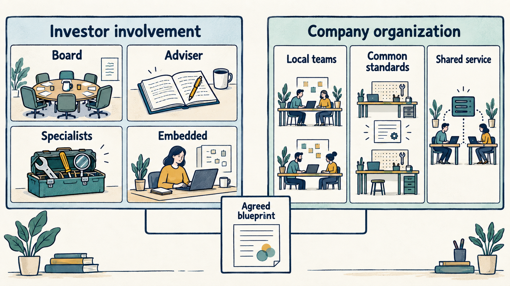
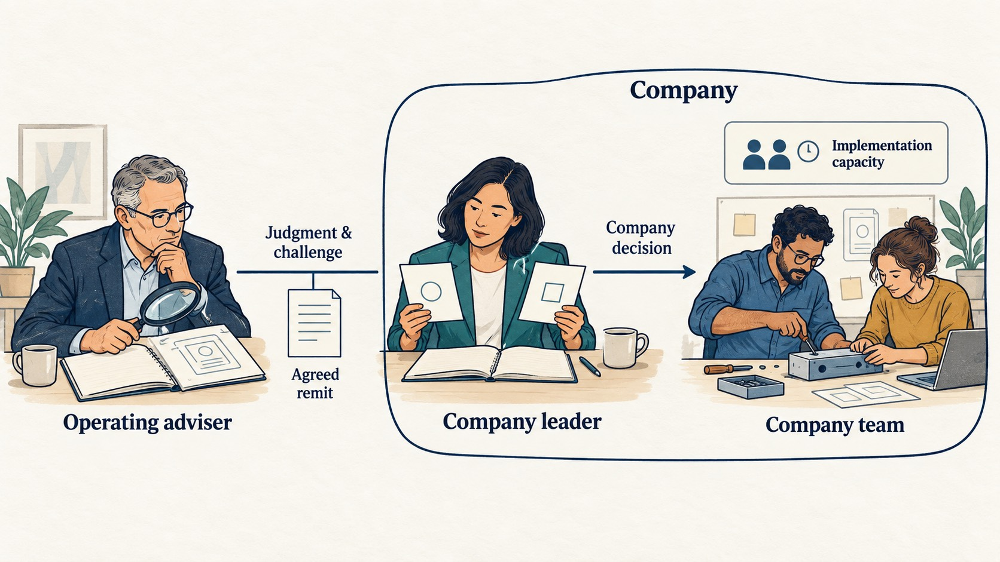
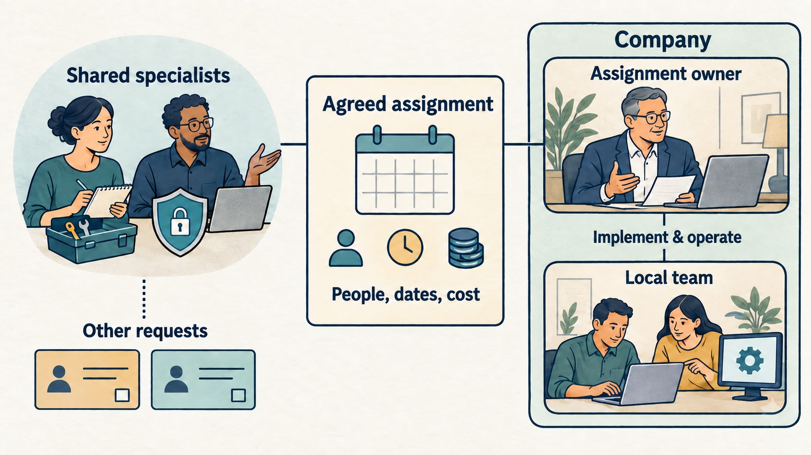
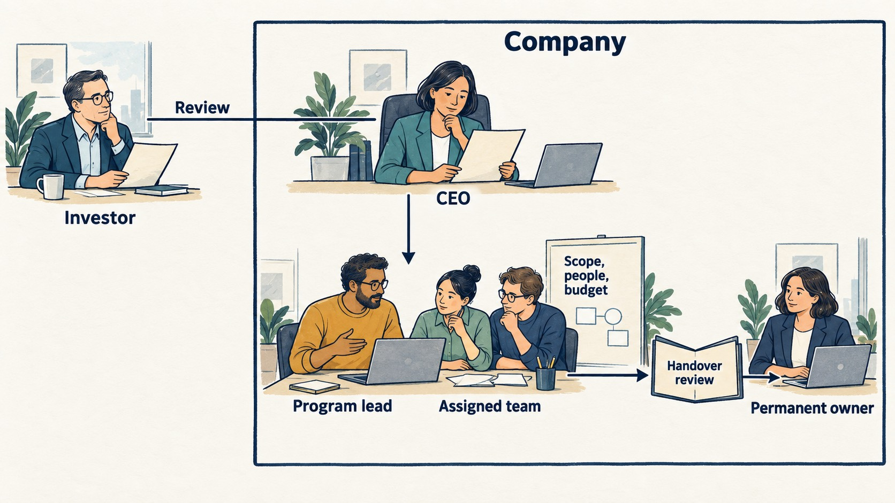
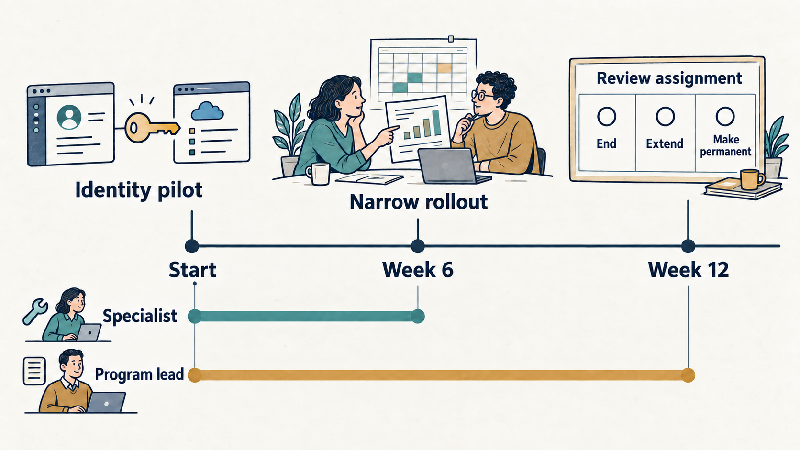

> **IN THIS SECTION, YOU WILL:** Match business priorities to four ways of working with an investor, connect them to the company’s internal organization, and write a blueprint that makes authority, capacity and review explicit.

> **KEY POINTS:**
>
> * **Choose the arrangement from the work and the missing capability.** Management may need a decision, experienced judgment, specialist expertise or someone with time to lead execution. Each calls for a different contribution.
> * **Design investor involvement and company organization separately, then connect them.** Shared investor expertise can support locally managed businesses. A company can centralize a service while its investor works mainly through the board.
> * **A usable blueprint includes commitments from both sides.** Name who decides, who supplies people and funding, what company work makes room, and when the arrangement will be reviewed or ended.

 
Suppose an investor offers its company “the full operating platform”: access to a technology partner, a pricing specialist, an acquisition team and a standard reporting package. The CEO welcomes the help. The CTO sees four new workstreams arriving for the same engineers. Before anyone adds them to a roadmap, the company needs to establish which work the offer will make possible and how the people involved will decide what happens.

An **operating model** is the arrangement of people, responsibilities, decisions, work and information through which a business carries out its strategy. A **blueprint** makes that arrangement specific enough to discuss and test. It describes the work people will do together, including the resources and authority on which it depends.

This chapter offers a selection guide and four proposed blueprints for a product or technology leader working with investors. Private equity supplies most of the evidence. The designs are the book’s synthesis, intended for adaptation; they are neither a standard industry classification nor a ranking of investors. The closing chapter of Part IV, [[tech-operating-partner]], explains one important function within them. Here the subject is the wider working arrangement.

## Connect Two Designs

The first design concerns **how the investor works with the company**. It covers oversight, advice, specialist support and any responsibility assigned to people who join execution. The second concerns **how the company organizes its own work**: which decisions remain with product or business-unit leaders, which standards are common, and which services or teams operate across units.

The investor also has an internal operating model for running its investment business, including fund administration, reporting and its own systems. McKinsey’s October 2018 study of operational complexity concerns those internal functions. That is a different assignment from improving a portfolio company’s delivery capability. [S92: McKinsey, operational complexity](https://www.mckinsey.com/industries/private-capital/our-insights/how-private-equity-is-tackling-operational-complexity)

Start with the **investment thesis**, the explanation of why the investment should succeed, and the **value creation plan**, the intended business changes behind it. Translate each material assumption into company work. Growing an existing product, changing service costs and integrating acquisitions create different demands on product judgment, engineering capacity and management attention.

Bain’s February 2026 analysis argues for examining commercial, operational and technology opportunities together during diligence. Its case for greater operating improvement supplies context for this design problem; it does not establish which blueprint will work for a particular company. The company still needs to test the assumptions and fund the work. [S94: Bain, Welcome to a New Era in Private Equity](https://www.bain.com/insights/welcome-to-a-new-era-global-private-equity-report-2026/)

For each proposed improvement, identify what is missing. A decision blocked at the board needs an approval route. A CTO facing an unfamiliar acquisition may need experienced advice. An AI evaluation may need a specialist. A company managing several integrations may need dedicated execution capacity. Describing the constraint makes the choice of support easier to defend.

**Figure 1:** *Choose investor support and company organization separately, then connect them through an explicit agreement about authority, people, funding and review.*

## Choose a Combination for the Business Priority

Use the business priority to identify the work, then choose support for the specific gap. This proposed guide connects both choices to the company’s internal design. The blueprint numbers refer to the arrangements explained below; each row offers a starting point to test.

| Business priority | Choose investor involvement for the gap | Connect it to company work |
| --- | --- | --- |
| Grow the existing business | **1: Board oversight** when the team can execute. **2: An operating adviser** when product, pricing or market assumptions need experienced challenge. | Give the CPO and CTO clear investment and roadmap decisions. Fund discovery and delivery; review adoption and retention alongside revenue. |
| Improve profitability | **3: Shared specialists** for scarce pricing, procurement or technology-cost expertise. **4: Dedicated execution** when implementation exceeds available management capacity. | Put each change with the executive who controls the work. Test full implementation and running costs, cash effects and service quality before expanding shared services. |
| Grow through acquisitions | **2: An operating adviser** to help choose integration depth. **4: Dedicated execution** when several integrations need sustained coordination. | Decide which benefits require common standards or shared services and which depend on local product teams. Fund migration and continuing delivery together. |
| Scale beyond founder dependence | **2: An operating adviser** to help establish delegation and leadership capability. **3: Shared specialists** for recruitment, security or other specific gaps. | Build permanent company ownership, clear product-team responsibilities and repeatable delivery practices. Review decision delays, leadership coverage and service reliability. |

The same growth mandate could need an adviser to test a product decision, a specialist to evaluate an AI feature, or an interim leader to cover a vacancy. Conversely, one specialist team could support both growth and cost work. Choose for the constraint, then confirm the people, authority, funding and review date before adding the work to the plan. If the required capacity cannot be committed, narrow or sequence the work.

## Four Blueprints for Investor Involvement

McKinsey’s November 2018 survey of 45 firms found varied operating-group compositions, including combinations of internal employees and external advisers. Its 2021 CEO guidance describes support through operating teams, functional experts, senior advisers and peer networks. These accounts support the existence of different arrangements. The four designs below turn that variety into practical choices for a company leader. [S91: McKinsey, operating groups](https://www.mckinsey.com/industries/private-capital/our-insights/private-equity-operating-groups-and-the-pursuit-of-portfolio-alpha) [S95: McKinsey, portfolio-company CEOs](https://www.mckinsey.com/industries/private-capital/our-insights/a-playbook-for-newly-minted-private-equity-portfolio-company-ceos)

A company can combine these arrangements across different work. A specialist assignment can end while the broader investor relationship continues. Review the combination as the business priority or capability gap changes.

### Blueprint 1: Management Delivery With Board Oversight

This fits a company whose leaders have the capability and capacity to execute an agreed plan. The investor contributes through the board, investment decisions and selected discussions. Product and technology leaders turn the plan into priorities, staffing and delivery through the company’s management structure.

**Figure 2:** *Board oversight works through an agreed plan and review. Company leaders retain delegated delivery decisions and need funded people to carry them out.*

**Authority and resources.** Record the decisions delegated to management and the matters requiring board or other approval. Include the route for spending outside the budget, significant changes of direction and senior appointments. The company needs a funded plan and people available to deliver it. A promise of access to the investor’s network becomes a resource only when someone accepts a specific assignment.

**Working practice.** Use an agreed set of performance information and a route for decisions between scheduled meetings. McKinsey’s May 2021 interviews describe PE boards that engage closely between meetings. That is compatible with management leading delivery, provided the decision route is understood. [S97: McKinsey, the private-equity learning curve](https://www.mckinsey.com/capabilities/strategy-and-corporate-finance/our-insights/climbing-the-private-equity-learning-curve)

For a product team, this might mean the board agrees the funded growth priorities and constraints, while the CPO and CTO decide which experiments and engineering changes can meet them. They bring evidence back when the assumptions fail or the required spending exceeds their authority.

**Review and change.** Look at customer and operating results, the quality of forecasts and whether required decisions arrive in time. Repeated late decisions call for a better approval route. A recurring technical gap may justify an adviser or specialist. Persistent lack of execution capacity requires a change to the work or resources. Diagnose the cause before adding another layer of oversight.

### Blueprint 2: Management Delivery With an Operating Adviser

This fits a bounded need for experience or challenge when the company can supply implementation capacity. An adviser might help a first-time CTO assess an acquisition, help a CPO examine a product investment, or coach a leadership team through a change it has not made before.

**Figure 3:** *The adviser contributes experience and challenge to a company decision. Management keeps the agreed authority and commits the people needed for implementation.*

**Authority and resources.** Name the company executive responsible for the decision and the work. Agree the adviser’s remit, availability, information access, costs and expected contribution. Make clear whether the person also assesses management for the investor. Advice, evaluation and formal approval have different consequences for the relationship. The detailed charter belongs in [[useful-engagement]].

**Working practice.** Put the adviser alongside a real decision and a company counterpart. For example, the CTO and an experienced adviser could compare acquisition-integration options using the same dependencies, customer commitments and available team capacity. The adviser supplies judgment and challenge; the company allocates people and decides within its authority. Their useful output is a supported decision and a team better able to carry it out.

A broad calendar invitation or a monthly presentation supplies little evidence of that contribution. Agree what the next review will examine: a resolved uncertainty, a better option, a capability learned or a decision ready for approval.

**Review and change.** Watch for recommendations accumulating faster than the company can implement them, or for teams treating the adviser’s suggestions as instructions. The response may be to narrow the assignment, fund specialist work or make a formal executive appointment. End the advisory work when the agreed need is met; establish any continuing coaching relationship separately. [[investors-adviser]] explains how to handle a change of role.

### Blueprint 3: Management Delivery With Shared Specialists

This fits recurring needs for expertise that each company cannot justify maintaining in full: security assessment, pricing analysis, executive recruitment, data engineering or AI evaluation. Specialists may belong to the investor, a provider or another explicitly agreed service arrangement.

**Figure 4:** *Shared expertise becomes usable through a specific assignment. Agree people, dates and cost, with a named company lead and local capacity to use the work.*

**Authority and resources.** Secure named people and dates, not merely access to a team. Establish who prioritizes competing requests, who pays, what the company must contribute and who accepts the work. A specialist needs a company counterpart with time to supply context and use the result. If a common policy is mandatory, identify its authority and the process for exceptions.

**Working practice.** Distinguish a reusable method from a shared operational service. An AI evaluation template can be adapted locally. An identity platform used by several businesses needs an owner, service expectations, incident support and a way to fund continuing operation. Moving from occasional expertise to a continuing service changes the operating model.

Vista’s value-creation page, consulted in September 2026, describes in-house AI engineers working alongside portfolio companies, operating methods and peer learning. It provides a direct example of an investor offering shared capabilities. Its description does not establish that a particular company should adopt every element. [S93: Vista, Value Creation](https://www.vistaequitypartners.com/about/value-creation/)

For a product AI pilot, shared specialists might design evaluations and examine integration options. The CPO still needs a customer or business purpose, and the CTO needs people able to build and operate the resulting service. Agree data access for that assignment; common ownership alone is insufficient to assume that company or customer information may be pooled.

**Review and change.** Examine availability, work accepted by the company, total cost and the capability left behind. Queues, compulsory tools with weak company cases, or continuing dependence on unavailable experts are reasons to revisit the design. Options include a clearer service commitment, local hiring, another provider or stopping work that no longer justifies its cost.

### Blueprint 4: Dedicated Execution Inside the Company

This fits work that needs sustained coordination or leadership beyond the existing team’s available capacity. Examples include a major integration, a difficult systems transition or a temporary gap in an executive role. A dedicated program leader, an embedded delivery team and an interim executive are different assignments; choose and describe the one required.

**Figure 5:** *In this illustrative program assignment, the company agrees the reporting line, authority, people and budget. A planned handover keeps continuing ownership visible.*

McKinsey’s June 2026 article discusses additional transformation leadership inside portfolio companies and the burden of combining major change with running the business. Its **chief transformation officer** is a different role from the chief technology officer also commonly abbreviated CTO. The case for dedicated capacity must be assessed for the assignment. [S99: McKinsey, five practices reshaping PE value creation](https://www.mckinsey.com/capabilities/transformation/our-insights/unlocking-full-potential-five-practices-reshaping-pe-value-creation)

**Authority and resources.** Specify the reporting line, budget, decisions delegated to the appointee and the work their people will do. A program leader may coordinate dependencies without controlling each function’s priorities. An interim CTO may hold executive authority through a formal appointment. Establish how the CEO resolves disputes and who remains responsible for existing customer services.

**Working practice.** Give the assignment one place in the company’s plan. Identify which employees are allocated, how continuing work is covered and which commitments move. Agree progress reviews around completed work, remaining dependencies and decisions needed. Investor reporting should use that evidence. [[can-the-team-deliver]] and [[fix-decisions-before-hiring]] help distinguish additional people from usable capacity.

**Review and change.** Set a review date and a condition for handover at the start. Look for delivery progress, service stability and whether the permanent organization can sustain the change. A program office that only collects updates leaves execution capacity unresolved. An interim leader who becomes indispensable without a succession plan leaves a continuing dependency. Extend, revise or end the assignment through the agreed authority route, with the cost and displaced work visible.

**Figure 6:** *Match the contribution to the missing decision route, judgment, expertise or execution capacity. Several arrangements can support different parts of the same plan.*

## Decide What the Company Will Share

The investor’s involvement does not determine how much the company should centralize. This choice becomes particularly visible when acquisitions create a group of businesses, but it also applies to product divisions within one company.

Keep the ownership boundary clear. **Several businesses in one investor’s portfolio are not necessarily subsidiaries of one operating group.** Peer learning or negotiated supplier access across a portfolio differs from moving a function into a corporate group’s shared service. Both require explicit arrangements for costs, responsibility and information access.

The following company designs can coexist across different activities:

| Company design | Where work and decisions sit | What must be made explicit |
| --- | --- | --- |
| Local operation | Business units retain the activity, people and most decisions. | Required reporting, minimum controls and the decisions reserved elsewhere. |
| Common standards with local delivery | Units choose implementation within shared rules; this is often called a federated arrangement. | Who sets the rules, funds compliance, resolves exceptions and maintains common interfaces. |
| Shared service or integrated function | A group team performs a defined activity for several units. | Service ownership, funding, priority-setting, service quality and the authority left with unit leaders. |

Start with the benefit that requires sharing. Comparable reporting may need common definitions and a data contract. A cross-product customer journey may need compatible identity and interfaces. A purchasing benefit may require a joint contract. Each makes a different demand on the organization and its systems.

Assign accountability accordingly. If a group function controls a unit’s infrastructure choices and spending, the unit leader’s measures should distinguish the outcomes they can influence from the service they receive. The group service needs its own accountable owner. The integration choices and transition costs are developed in [[acquisition-adds-work-first]].

## Keep One Plan, With a Review Rhythm That Fits

Spencer Stuart’s account of investor–CEO relationships recommends building the improvement plan together and agreeing measures and reporting requirements. That is useful support for making the working agreement explicit. The cadence below is the book’s suggested starting point for a reasonably stable company. [S96: Spencer Stuart, Partners in Value Creation](https://www.spencerstuart.com/research-and-insight/partners-in-value-creation-unlocking-the-vital-bond-between-investors-and-ceos)

A **weekly company review** can address delivery, service, customer and cash exceptions, along with decisions blocking priority work. A **monthly business review** can examine outcomes, the current forecast, implementation costs and decisions requiring board or investor input. A **periodic strategy review** can revisit the investment assumptions and the operating arrangement itself. Use existing forums where they already serve these purposes.

Distinguish the approved **budget**, the evidence-based **forecast** and a **stretch target** that still depends on additional actions or favorable conditions. Give material measures an owner and a definition. Show a financial result alongside the operating evidence that helps explain it: recurring revenue with retention and adoption, service cost with workload and reliability, spending with the commitments it creates.

Cash pressure or a serious incident may require more frequent decisions. McKinsey’s CFO guidance emphasizes understanding cash flow, the balance sheet and debt conditions where relevant. Those are inputs to the operating plan. Keep the timing of available cash visible alongside proposed improvements; [[obligations-before-budget]] explains that distinction. [S98: McKinsey, the PE company CFO](https://www.mckinsey.com/capabilities/strategy-and-corporate-finance/our-insights/the-pe-company-cfo-essentials-for-success)

Agree escalation triggers before the routine breaks down: a funding delay, material service failure, unavailable specialist or assumption that no longer holds. Name who must respond and by when. A useful escalation states the consequence and the decision needed, with the current uncertainty visible.

## A Fictional Group Chooses a Combination

Consider an **independent fictional example**. An investor backs a group of three software businesses. The plan assumes they can sell a combined offer to larger customers. Each business has its own product leadership, customer commitments and release schedule. A proposal to build one common platform arrives before anyone has tested which integration the combined offer needs.

The group CEO and company leaders first agree the customer problem: buyers want coordinated access and support for two products they already use. They retain local product roadmaps, establish common security and reporting requirements, and investigate a shared identity service. A single product architecture remains an option to evaluate later.

The selection guide starts them in the acquisition row. Their gaps are identity expertise and coordination capacity, so they combine shared specialists and dedicated execution under board oversight. A shared identity specialist is committed for six weeks. A company program leader receives a twelve-week integration assignment, reports to the group CEO and coordinates the pilot. Two named company engineers each reserve one day a week during the specialist’s assignment; their managers defer identified internal improvements to make room. The CFO confirms funding for the specialist and expected service costs before work starts.

The assignment records its limits. Product leaders keep their delegated roadmap decisions. The program leader can sequence the agreed pilot but must take conflicts over additional people or changed customer commitments to the group CEO. Production acceptance follows the company’s security and service process. The future shared identity service needs a named operating owner before launch.

At the six-week review, the pilot supports the access requirement, but a wider rollout would take capacity from a committed customer release. The group CEO, within the agreed delegation, approves a smaller next step and defers the additional migration. The board receives the revised forecast and the consequences for the combined offer. The pilot’s technical result, customer feedback and full running-cost estimate determine the next proposal.

The blueprint made that revision possible: available people, decision rights and the work displaced were visible. At the twelve-week review, management can decide whether the program assignment should end, continue with a narrower scope or be replaced by a permanent group capability. The example proposes a sequence of decisions; it makes no claim about realized revenue or investment returns.

**Figure 7:** *The fictional pilot commits people for defined periods. The six-week review changes scope; the twelve-week review decides whether the assignment ends, continues or becomes a permanent capability.*

## Write the Blueprint You Can Actually Use

Start with a short record that the company and investor can both challenge. The following fields are a proposed specification, to complete alongside the engagement and initiative records in [[toolkit]]:

1. **Purpose and boundary.** The business priority, assumption to test or outcome to improve; the chosen combination of investor involvement and company design; the companies, functions and decisions covered.
2. **Work and ownership.** The accountable company executive, people doing the work, dependencies and continuing service owner.
3. **Authority.** Decisions each person can make, matters requiring consultation or approval, and the route for resolving disagreement. Check the record against actual delegations and governing arrangements.
4. **Resources and cost.** Investor commitments, company capacity, funding source, charges, implementation cost and the work displaced. Record when each contribution becomes available.
5. **Evidence and review.** Starting position, outcome measures, reporting definitions, review dates and triggers for escalation or a change of plan.
6. **Continuation or exit.** Handover requirements, capabilities to retain, dependencies to remove and who can extend or end the arrangement.

The cost field matters even when support is described as part of the investor’s platform. The SEC’s investor guide identifies expense allocation and portfolio-company service payments as areas where conflicts can arise. Use that as a reason to inspect the specific charging arrangement and supplier interests. [S01: SEC, Private Equity Funds](https://www.investor.gov/introduction-investing/investing-basics/investment-products/private-investment-funds/private-equity)

For AI work, add the permitted data sources, evaluation responsibility, human review, running costs and who operates the service. A shared specialist team can supply methods and scarce expertise; the company still needs an agreed business purpose and responsibility for the result. [[ai-strategy-three-questions]] and [[tech-operating-partner]] develop those choices.

Check the proposed arrangement against experience. Spencer Stuart’s survey of 1,015 senior leaders reports the importance respondents attach to culture and the sponsor’s approach to partnership. It records stated preferences, rather than evidence that a blueprint improves performance. Ask people who have worked with the proposed team how decisions, availability and disagreements were handled in practice. [S100: Spencer Stuart, private equity and top leaders](https://www.spencerstuart.com/research-and-insight/private-equity-is-still-a-magnet-for-top-leaders)

## Adapt the Blueprint to the Ownership Arrangement

These choices also help frame venture and growth relationships, but the investor label cannot supply the authority map. A minority investor may offer an adviser or specialist without control over the company’s operating decisions. Several investors may have different rights and expectations. Establish whose approval is actually required and which commitments each party has made. [[decide-who-decides]] explains that work.

The work being financed also changes the review. When a venture-funded team is still testing demand, evidence of learning and available runway may determine the next commitment. When a growth plan depends on repeatable sales and delivery, customer adoption and capacity may matter most. A buyout plan involving debt also needs the relevant cash and financing constraints. These are illustrative conditions to establish, not fixed descriptions of every investor category.

Review the operating model when the assignment changes: a new acquisition, executive appointment, financing event, serious delivery constraint or handover to another owner. Carry forward the obligations and company capability that remain. The model has served its purpose when people can make the required decisions and perform the funded work, with evidence that supports what should happen next.

The blueprint establishes the working arrangement. The next chapter makes one choice within it: how to find useful help for a specific capability gap, including alternatives outside the investor’s network. Continue with [[help-that-changes-capability]].

## Questions to Consider

1. *Which business priority are you pursuing, and which missing decision, skill or capacity would this investor involvement supply?*
2. *Which company activities benefit from common standards or shared delivery, and why?*
3. *What have the investor and the company each committed to provide, by when and at whose cost?*
4. *Who can change priorities when the proposed work conflicts with an existing commitment?*
5. *What evidence would make you continue, revise or end this arrangement?*

## To Probe Further

- **[McKinsey: Private equity operating groups](https://www.mckinsey.com/industries/private-capital/our-insights/private-equity-operating-groups-and-the-pursuit-of-portfolio-alpha)** — the 2018 survey’s account of differing operating-group arrangements (S91).
- **[Spencer Stuart: Partners in Value Creation](https://www.spencerstuart.com/research-and-insight/partners-in-value-creation-unlocking-the-vital-bond-between-investors-and-ceos)** — expectations, support and reporting in the investor–CEO relationship (S96).
- **[McKinsey: Five practices reshaping PE value creation](https://www.mckinsey.com/capabilities/transformation/our-insights/unlocking-full-potential-five-practices-reshaping-pe-value-creation)** — a June 2026 discussion of adaptation and dedicated execution capacity (S99).

The [[bibliography]] records the sources consulted and their limits. The blueprints, review rhythm and fictional example are the book’s proposals.
