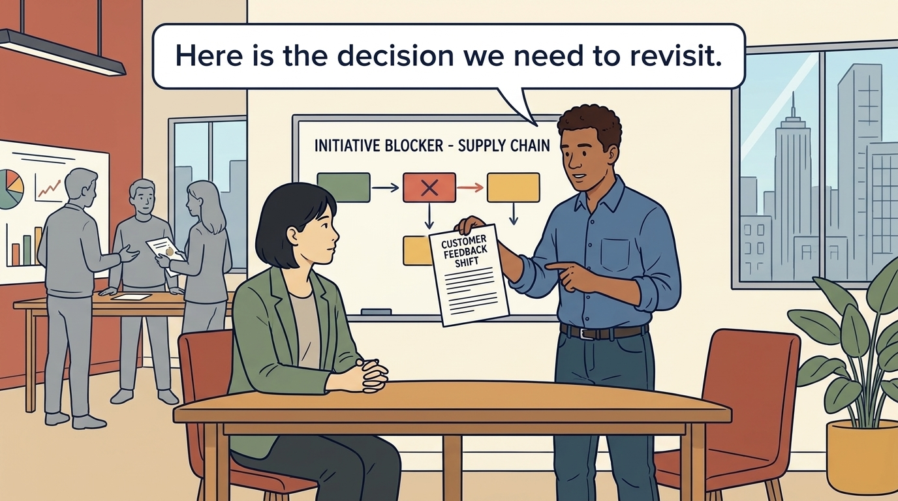
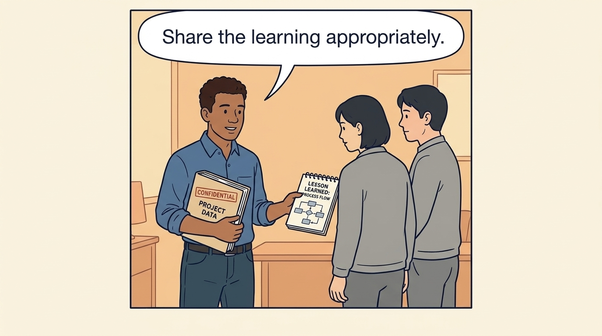
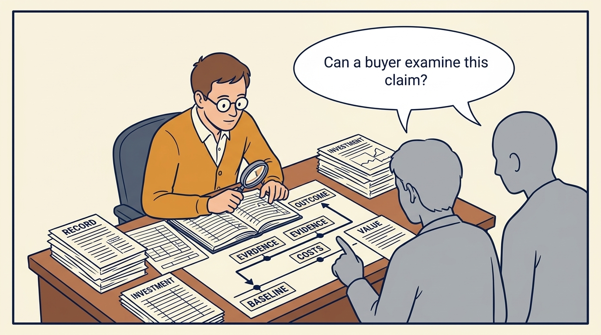
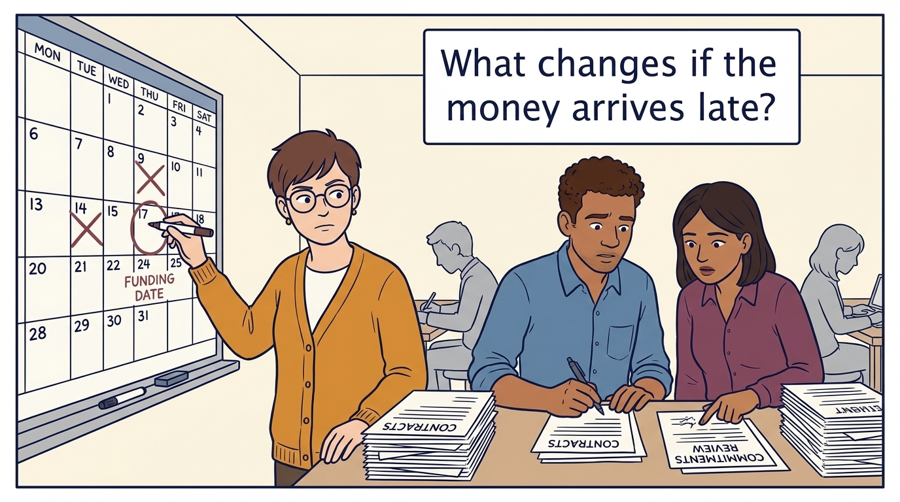
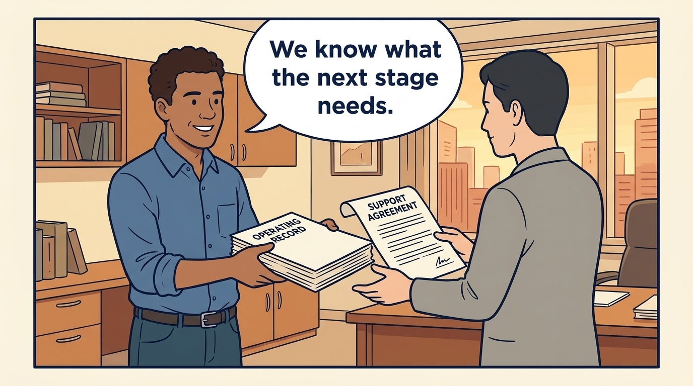

<!-- comic-style
{
  "cast": "MORGAN: a thoughtful investor technology adviser with short dark hair and a green jacket, used in the fund scenarios. ALEX: a practical CTO with curly hair and blue rolled-up sleeves. SAM: a CFO with round glasses and an amber cardigan. PRIYA: a product leader with straight dark hair and plum sleeves. INES: a CEO with short grey hair and a navy jacket. All are fictional; none represents a person in a real case.",
  "style": "Clean editorial explainer comic, dark ink outlines, restrained green, blue, and amber accents on warm white, generous space, readable short speech bubbles, expressive people and simple physical metaphors. No photorealism, logos, dense charts, or title text. Keep the same character appearances throughout the journal."
}
-->

**Comic.** Under investors, the plan is the basis on which money was committed, so each revision is reviewed against the investment case, the fund’s timeline and the prospect of a sale. The panels follow a company keeping its plan credible to owners who may change.

Morgan is an investor’s adviser in the fund scenarios; Alex leads technology, Priya leads product, and Sam leads finance. All are fictional. Comparative scenarios use separate assumptions. Historical cases are discussed through documents; the scenes do not reenact real events.

<!-- comic-panel
{
  "id": "01-scene",
  "status": "generated",
  "asset": "assets/images/18-the-financing-slipped/comic-01-scene.jpeg",
  "aspect_ratio": "16:9",
  "prompt": "Panel 1 of an explainer comic. Alex brings a changed customer need and a blocked initiative to the regular conversation with Morgan. Use one speech bubble with the exact words: \"Here is the decision we need to revisit.\" Convey: Company leaders need to revise the operating plan as circumstances change. Use investor conversations to explain decisions, constraints and help needed.",
  "alt": "Comic panel: Alex brings a changed customer need and a blocked initiative to the regular conversation with Morgan.",
  "caption": "Company leaders need to revise the operating plan as circumstances change. Use investor conversations to explain decisions, constraints and help needed.",
  "generation": {
    "model": "gemini-3-pro-image-preview",
    "reference_id": "owned-cast-20260913",
    "sha256": "0808d937a5bf4679a9c7611f01d62e6a28d6aa80e327be1a06b7c9d87eb8f086"
  }
}
-->

**Panel 1:** Company leaders need to revise the operating plan as circumstances change. Use investor conversations to explain decisions, constraints and help needed.

*Dialogue:* “Here is the decision we need to revisit.”

<!-- comic-panel
{
  "id": "02-scene",
  "status": "generated",
  "asset": "assets/images/18-the-financing-slipped/comic-02-scene.jpeg",
  "aspect_ratio": "16:9",
  "prompt": "Panel 2 of an explainer comic. The team separates coaching, project help, and board reporting. Use one speech bubble with the exact words: \"Clarify the conversation's purpose.\" Convey: Coaching, project delivery and board reporting serve different purposes. Agree what information each conversation may use and share.",
  "alt": "Comic panel: The team separates coaching, project help, and board reporting.",
  "caption": "Coaching, project delivery and board reporting serve different purposes. Agree what information each conversation may use and share.",
  "generation": {
    "model": "gemini-3-pro-image-preview",
    "reference_id": "owned-cast-20260913",
    "sha256": "d141b5d7a6523ef72cf3d4aee41f17e5ad22b9811cdb0851d782869aea06384e"
  }
}
-->

**Panel 2:** Coaching, project delivery and board reporting serve different purposes. Agree what information each conversation may use and share.

*Dialogue:* “Clarify the conversation's purpose.”

<!-- comic-panel
{
  "id": "03-scene",
  "status": "generated",
  "asset": "assets/images/18-the-financing-slipped/comic-03-scene.jpeg",
  "aspect_ratio": "16:9",
  "prompt": "Panel 3 of an explainer comic. Alex shares a practice while protecting a confidential company folder. Use one speech bubble with the exact words: \"Share the learning appropriately.\" Convey: Companies sharing an owner still have separate confidential information. Share lessons within agreed permissions.",
  "alt": "Comic panel: Alex shares a practice while protecting a confidential company folder.",
  "caption": "Companies sharing an owner still have separate confidential information. Share lessons within agreed permissions.",
  "generation": {
    "model": "gemini-3-pro-image-preview",
    "reference_id": "owned-cast-20260913",
    "sha256": "30f0b25035b664896d45b7a884bb0ac7952c1907394e0730243e71c0db9f3d2a"
  }
}
-->

**Panel 3:** Companies sharing an owner still have separate confidential information. Share lessons within agreed permissions.

*Dialogue:* “Share the learning appropriately.”

<!-- comic-panel
{
  "id": "04-scene",
  "status": "generated",
  "asset": "assets/images/18-the-financing-slipped/comic-04-scene.jpeg",
  "aspect_ratio": "16:9",
  "prompt": "Panel 4 of an explainer comic. Sam traces an outcome back to its baseline and costs. Use one speech bubble with the exact words: \"Can a buyer examine this claim?\" Convey: An exit is a sale or other transaction through which investors receive value. Prepare its evidence by recording costs and results throughout ownership.",
  "alt": "Comic panel: Sam traces an outcome back to its baseline and costs.",
  "caption": "An exit is a sale or other transaction through which investors receive value. Prepare its evidence by recording costs and results throughout ownership.",
  "generation": {
    "model": "gemini-3-pro-image-preview",
    "reference_id": "owned-cast-20260913",
    "sha256": "c72c015b5feb66fb7ce7256d4e09e25b0692c975801092527a269e85f1c1daa8"
  }
}
-->

**Panel 4:** An exit is a sale or other transaction through which investors receive value. Prepare its evidence by recording costs and results throughout ownership.

*Dialogue:* “Can a buyer examine this claim?”

<!-- comic-panel
{
  "id": "05-scene",
  "status": "generated",
  "asset": "assets/images/18-the-financing-slipped/comic-05-scene.jpeg",
  "aspect_ratio": "16:9",
  "prompt": "Panel 5 of an explainer comic. Sam moves a funding date while Alex and Priya review commitments before hiring and contracts remove options. Use one speech bubble with the exact words: \"What changes if the money arrives late?\" Convey: A delayed round, refinancing or corporate budget change requires a revised operating decision. Keep a viable plan for continued ownership if the expected transaction does not occur.",
  "alt": "Comic panel: Sam moves a funding date while Alex and Priya review commitments before hiring and contracts remove options.",
  "caption": "A delayed round, refinancing or corporate budget change requires a revised operating decision. Keep a viable plan for continued ownership if the expected transaction does not occur.",
  "generation": {
    "model": "gemini-3-pro-image-preview",
    "reference_id": "owned-cast-20260913",
    "sha256": "2804d76c4cbcd4a7c24bf6859e418e7aa5a07aba17532eba2f4b39a11ac87cf1"
  }
}
-->

**Panel 5:** A delayed round, refinancing or corporate budget change requires a revised operating decision. Keep a viable plan for continued ownership if the expected transaction does not occur.

*Dialogue:* “What changes if the money arrives late?”

<!-- comic-panel
{
  "id": "06-scene",
  "status": "generated",
  "asset": "assets/images/18-the-financing-slipped/comic-06-scene.jpeg",
  "aspect_ratio": "16:9",
  "prompt": "Panel 6 of an explainer comic. Alex hands a new company leader the operating record and a clearly named support agreement. Use one speech bubble with the exact words: \"We know what the next stage needs.\" Convey: A useful handover explains what improved, what remains and how the capability will be sustained, including any continuing support.",
  "alt": "Comic panel: Alex hands a new company leader the operating record and a clearly named support agreement.",
  "caption": "A useful handover explains what improved, what remains and how the capability will be sustained, including any continuing support.",
  "generation": {
    "model": "gemini-3-pro-image-preview",
    "reference_id": "owned-cast-20260913",
    "sha256": "63db38b914cff3ec25b21c71548dc4d8a7aef9159d572b84cad6ef5abe8e660a"
  }
}
-->

**Panel 6:** A useful handover explains what improved, what remains and how the capability will be sustained, including any continuing support.

*Dialogue:* “We know what the next stage needs.”
