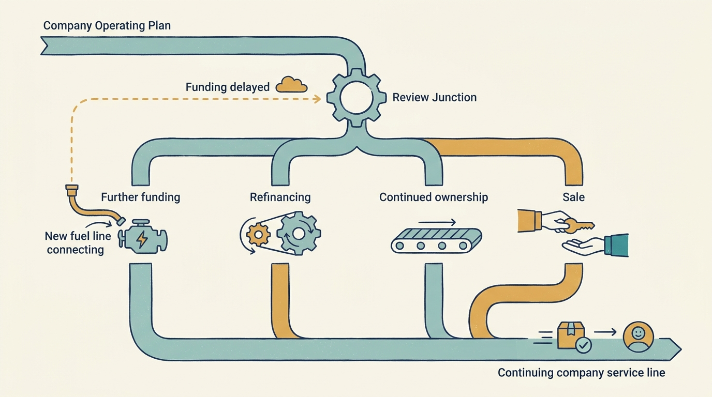

> **IN THIS SECTION, YOU WILL:** Learn to revise a dated cash plan when expected funding arrives late, find the latest useful decision date and authorize one fallback before the plan chooses itself.

> **WHY IS THIS IMPORTANT:** A plan that keeps spending money that has not arrived breaches the reserve on a predictable date; the decision has to be made before the offers and signatures make it for you.

> **KEY POINTS:**
>
> * **A funding assumption is not cash.** An expected round, refinancing or parent budget is an expression of interest until it becomes a signed commitment with understood conditions. The plan that spends it must change as soon as its date moves.
> * **Work the decision by date.** Put cash, monthly burn, the agreed reserve and every planned commitment on a calendar, find the latest useful decision date, and compare the alternatives by when each one reaches the reserve.
> * **Authorize one fallback and say which plan is running.** The board chooses the fallback and names who obtains the bridge and when it is reviewed. Customers get no promise that depends on money not yet received, and the team is told which plan it is executing.

 
The team is on schedule, but the expected September round now looks likely in December. The company must change a funding assumption before it becomes an impossible delivery promise.

This arrangement changes the conditions of the decision. The plan was the basis on which the existing investors committed money, and a bridge from them needs their approval. Establish the actual funding, its stage, the authority and the deadline before committing to anything that spends it. Here the specific condition is a date: the day on which two hiring offers and a contract signature make a plan built on September money irreversible.

[[first-hundred-days]] established a funded plan. This chapter follows what happens when the money behind that plan moves. It works one fictional Larkspur scenario through to a board decision, then names two variations. The scenario carries its own assumptions; they do not reconcile with the earlier Larkspur examples, and every figure is invented.

## The Funding Slipped, Not the Roadmap

In June, serious discussions with a lead investor for a €4m round pointed to a closing on 15 September. The second-half operating plan was built on that date: two hires starting in September and a customer portal contract to be signed in August. In early July the discussions still look serious, but the closing now looks likely in mid-December.

Nothing on the roadmap slipped. The onboarding pilot (ONB-1) and the recovery work from [[first-hundred-days]] are on schedule. What changed is an assumption about money, so the first task is to name what stage that money has reached: an expression of interest, approval pending on the investor’s side, a contractual commitment with conditions, or cash received. In July the round is at the first stage. “Likely in December” is a forecast of a conversation, not a date on which cash arrives.

Naming the stage also keeps the response free of blame. An initiative can fail because its hypothesis was wrong, because execution was weak, or because a dependency was not supplied. Those need different responses. A delayed round is the third kind: an unfunded dependency. Treating it as an execution failure produces the wrong fix, such as more oversight or a leadership change, and hides the decision that actually needs making.

## Cash and Commitments by Date

Sam, the CFO, starts with the position on 1 July and the agreed floor. Larkspur holds **€1.6m**, its net monthly burn is **€200,000**, and the board has agreed a **minimum operating reserve of €400,000**. Without new money the reserve is reached after six months: (€1.6m − €0.4m) ÷ €200,000 = 6, which is **31 December**. That is the baseline: the current plan with nothing added.

| Date | Cash without new money, baseline plan |
| --- | ---: |
| 1 July | €1.6m |
| 30 September | €1.0m |
| 30 November | €0.6m |
| 31 December | €0.4m (the reserve) |

The second step sorts commitments by whether they can still be changed, and on which date that stops being true.

| Group | Items | Status |
| --- | --- | --- |
| Protected obligations | Customer contracts; the agreed recovery requirement (dispatch resumes within four hours, see [[prove-you-can-restore]]) | Not options; every alternative must fund them |
| Committed and continuing | The onboarding pilot ONB-1 (€180,000 committed) and the recovery work | Already inside the €200,000 monthly burn |
| Planned, not yet committed | Two hires starting in September (+€30,000 a month); the portal contract, €120,000 committed at signature in August | Reversible until the offers go out and the contract is signed |

The distinction that matters is not committed versus uncommitted spending in general. It is which spending is still reversible in July, and on what date each item stops being reversible. Offers and a signature in August make **15 August the latest useful decision date**. After it, the plan chooses itself.

## Three Alternatives and the Latest Useful Decision Date

Alex, the CTO, and Priya, the product leader, identify what can be staged, stopped or completed safely. Sam prices three alternatives by the date each one reaches the reserve.

| Alternative | What it does | Reserve reached | Margin for a further slip |
| --- | --- | --- | --- |
| **A: proceed as planned** | Hires from September, portal signed in August | Late November | None; breached before a mid-December closing |
| **B: defer the hires and the portal** | Keep the onboarding pilot and the recovery work; start nothing new | 31 December | None for a slip past December |
| **C: B plus a conditional €600,000 bridge from the existing investors** | Approval pending on the investors’ side | 31 March | Covers a slip to March |

The arithmetic behind A: by 30 November the baseline €600,000 less the €120,000 portal payment and three months of the hires (€90,000) leaves about €390,000, below the reserve. With a mid-December closing, cash would arrive after the breach, and every week of closing conditions would be spent from the reserve. C adds three months to B, but C is not cash. The bridge is an expression of interest from the existing investors and needs approval by their investment committees, the right body because a bridge is an investment decision. Until there is a written commitment with conditions, the company can pursue C but must plan as if it is executing B.

## The Board’s Authorized Fallback

The decision needs one escalation step, not a program status. Ines, the CEO, and Sam take it to the Larkspur board, the forum authorized to approve the operating plan under the approval map in [[decide-who-decides]]. The escalation states three things: the **decision required** (choose A, B or C), the **latest useful date** (15 August) and the **consequence of delay** (A by default, with the reserve breached in late November). “The round has slipped” is not enough; the board needs to know which action changes the outcome and who carries it out.

The board decides on 10 August:

- **Chosen:** B now. The hires and the portal are deferred, not canceled. The onboarding pilot and the recovery work continue.
- **Rejected:** A, because it breaches the reserve before the earliest realistic closing. C on its own, because the bridge is not yet committed; it is pursued, not counted.
- **Funding:** existing cash at the €200,000 monthly burn, reaching the reserve on 31 December. Sam is accountable for obtaining a **written bridge commitment by 1 September**, which would move C to a contractual commitment with conditions.
- **Scarce capacity:** the implementation specialist’s time and the engineer-weeks stay on ONB-1 and the recovery work. The work the two hires would have started is not started.
- **Authorized:** the Larkspur board, on 10 August. Ines is accountable for the communication below; Alex and Priya for staging the deferred work so it can restart without rework.
- **Review:** 1 October. The question is what stage the bridge and the round have each reached, not whether the team is busy.
- **Evidence that would change the decision:** a written bridge commitment gives B its margin. A signed subscription agreement with understood conditions restores the hires and the portal. A further slip beyond December, or burn rising above €200,000, triggers the next reduction, which the board asks Alex and Priya to prepare as a named list now rather than decide under pressure later.

## Tell Customers and Teams Which Plan Is Running

The communication follows from the decision. No customer receives a promise that depends on the hires or the portal. Onboarding commitments stay at the volume the pilot evidence supports, not the volume the round would have funded. The portal is described as research, which is what it is.

The team is told it is executing B: what is deferred, what continues, what would restore the original plan and when the next review is. A team that hears “the round is nearly done” and then sees two offers withdrawn draws its own conclusions, often worse than the facts. The board narrative, the investor update and the team briefing may differ in detail, but they derive from the same dated cash table. A company should not need a second set of numbers for any of them.

## Restore the Original Plan on a Signed Commitment, Not a Term Sheet

A term sheet records agreed terms. In a common arrangement it does not bind the investor to invest, and it says nothing about the date cash arrives. The hires and the portal are restored only when a **signed subscription agreement with understood conditions** exists, and spending restarts against the cash date those conditions imply, not against the signature. If the agreement carries a closing condition that could take six weeks, the offers wait six weeks.

Until then, B is the plan, and the question for 1 October is the question for 10 August: what stage has the money reached, and what does the calendar say if it stays there?

## Two Variations on the Same Decision

**A refinancing that leaves less cash.** A loan is approaching repayment, and the refinancing on offer leaves less cash for development. The trigger is a financing change, not evidence that engineering has become less valuable. The method is unchanged: the dated cash position after the refinancing, the protected obligations, the commitments still reversible, the latest useful date (here, the refinancing signature) and the alternatives priced by when each reaches the reserve. [[obligations-before-budget]] shows how loan payments and taxes come before the discretionary budget in that calculation.

**A corporate parent withdrawing budget.** A new group strategy or budget reduces the allocation to the product. Reconfirm which business unit is the company sponsor, what remains funded and which promises to external customers continue regardless. A reorganization inside the parent is not an instruction to let local obligations become ownerless. The latest useful date is set by the parent’s budget cycle and the company’s own contract renewals, and the escalation goes to whoever in the parent is authorized to fund or release the obligation.

**Figure 1:** *A funding delay sends the operating plan back to a review junction. Further funding, refinancing, continued ownership and a sale are all possible paths, and the company’s service to customers continues through every one of them, so the plan needs a fallback that works on each.*

In every variation, continued ownership is a real scenario. If the round never closes, the refinancing fails or the parent does not restore the budget, what useful business remains and what can it afford? B answers that question for Larkspur until 31 December; the named reduction list answers it beyond.

The decision leaves a record: the assumption, the trigger, the alternatives, who decided, and the evidence that would change it. That record is what the next decision-maker inherits, whether the round closes, the existing investors continue, or the company changes hands. [[handover-of-obligations]] follows it through that change: what evidence to keep during the work, who receives cash and who keeps an interest in each transaction form, and how to hand over the unfinished obligations rather than only the company.

## Questions to Consider

1. *What stage has your next expected money reached: expression of interest, approval pending, contractual commitment with conditions, or cash received? Which plan is already spending it?*
2. *On which date does your next planned commitment stop being reversible, and is the decision it depends on scheduled before that date?*
3. *If the expected money never arrived, on what date would you reach the agreed reserve, and what would you stop first?*

## To Probe Further

- **[Do Private Equity Funds Manipulate Reported Returns?](https://www.nber.org/papers/w22493)** — Gregory W. Brown, Oleg R. Gredil and Steven N. Kaplan, NBER Working Paper 22493, 2016 (later published in the Journal of Financial Economics). *It finds that some underperforming managers inflate interim valuations while raising their next fund. The relevance here is the commitment sequence: an investor’s reported view of a company, like a term sheet, is not cash, and a company that plans against either can find its funding date moving.*
- **[Earnings Management in Private Equity Portfolio Firms During Fundraising](https://www.hbs.edu/ris/Publication%20Files/23-013_ced08e2c-ad57-4130-a2df-a5798bbfbb6f.pdf)** — Brian K. Baik, Harvard Business School Working Paper 23-013, revised 2026. *A working paper, not yet peer reviewed, that finds portfolio-company earnings managed more aggressively while the sponsor is fundraising. It is an analogous reporting incentive, not direct evidence about delayed rounds: the same pressure to present a favorable picture can keep a slipping round looking “nearly done” longer than the cash table should tolerate.*
