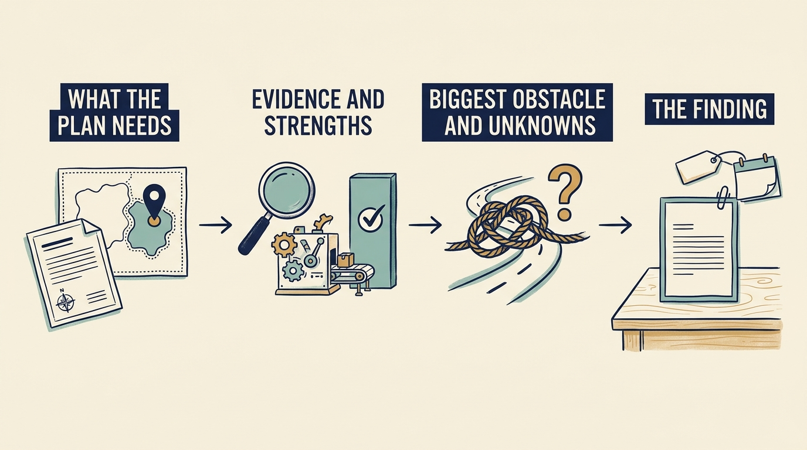

An engineering assessment **tests a plan against what the systems and the team can do today**, whether systems are built or bought. Old does not mean inadequate. The board of fictional Larkspur, a scheduling-software company, proposes first paying customers in a second country within twelve months, a date set before anyone checked what it relies on. Alex, the technology leader, must establish what they can support and what change would cost.

**Figure 1:** *This chapter’s assessment ends at a finding. Choosing and funding an option come in later chapters.*

Begin with the required capability: invoice, contract with, support and set up customers under a second country’s tax and pricing rules. A plan built on **EBITDA** (earnings before interest, taxes, depreciation and amortization) would stress running costs instead. EBITDA is a profit measure that leaves out borrowing costs, profit taxes and the accounting charges that spread an asset’s cost over years. It is not cash: a higher figure does not show that a replacement can be paid for.

Then find the constraint. “Parts depend on each other too closely” is too generic. The country rules live in the invoicing module, the software that prepares bills, and the contract tool, support tools and product settings read them there. Market entry needs coordinated change across all four. Record strengths too: a stable scheduling product, deep customer knowledge, weekly releases.

**Technical debt** is future effort or risk from earlier choices or postponed work, not a loan. Describe its consequences: the same two specialists review every pricing change, and a change takes about three weeks from request to production, the live system customers use.

No single activity measure captures developer productivity. [S13: Developer productivity research](https://www.microsoft.com/en-us/research/publication/the-space-of-developer-productivity-theres-more-to-it-than-you-think/) **DORA** (DevOps Research and Assessment), a software-delivery research program, uses five delivery metrics and warns against comparing unlike services. [S14: DORA metrics guide](https://dora.dev/guides/dora-metrics/) Two clocks are easily confused. DORA’s change lead time runs from recording a code change in the team’s version history to running it in production: under two days at Larkspur. End-to-end lead time runs from request to customer use: about three weeks. Most time falls outside the first clock. That does not show whether it was waiting or building; the next chapter traces one change.

A replacement needs a funded transition. Alex’s fictional estimate for replacing the central billing software is €1.3 million of additional spending over eighteen months, from the month funding and the extra people start. It is beyond existing payroll and before subtracting savings, and pays for those people, running both systems together and moving customer data. Nothing is approved. If funded, with country rules moved first and legal and support ready, first invoices could come from the new system around month twelve at the earliest. Excluding migration, about €720,000 would be paid by then, assuming even monthly payments and nothing paid in advance. The maintenance saving comes only after the old system retires.

The finding records capability, evidence, strengths, constraint, uncertainty and transition resources. The chapter [[fix-decisions-before-hiring]] decides whether to change roles or hire around the two specialists. The design choice follows: configure a bought service, separate the country rules within Larkspur’s software, or replace the core.
