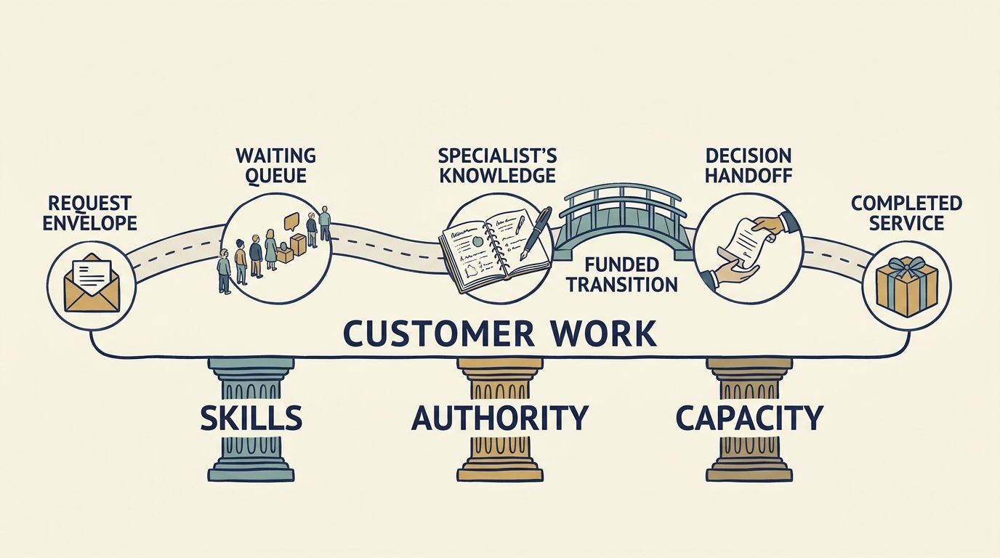

A plan can fund tools, a cheaper location or more people and still leave work waiting on one executive and two experts.

**Figure 1:** *Design teams around the work, knowledge and decisions customers depend on.*

**Follow one piece of work.** Larkspur, a fictional scheduling-software company, takes sixteen working days to move a pricing change into production, the live customer system. Thirteen are waiting: three for Priya, who leads product, to confirm the rule; seven in a two-person review queue; three for Ines, the chief executive, to sign off invoice changes. Two are building; one is **release**, putting the change into that system. That separates a decision constraint from a knowledge one: only two people can change the invoicing module, which prepares customer bills.

**Change the decisions first.** Priya lists the rule types the team may implement without asking her; Ines passes invoice sign-off to finance. Forecast, not result: six waiting days out if that finance check adds no queue of its own, taking sixteen days to ten — seven still the specialist queue. Trace the next three changes to test that forecast. Needing no new hire is not the same as free: finance and Ines supply the time. The real gap is a third person able to change the module, not the five-person team proposed by the **board of directors**, who oversee the company for its owners and approve senior hires.

**Let the diagnosis decide the hire.** Larkspur fills one approved position with a billing engineer, about €90,000 a year, and protects specialist time for teaching. The second team waits on three things: evidenced second-country demand, a committed funding round (raising money from investors) and the board’s approval. **Committed** means investors have signed an agreement, subject to its terms; the money has not arrived. If changes still take over two weeks sixty days after the delegation, trace again rather than hire. If the engineer cannot release independently six months after starting, the transfer has failed.

**Assess leaders in their system.** Before replacing a leader, state a **hypothesis**: what must new leadership enable, and what evidence shows it missing? If conditions change and the leader still approves every release, that supports adding leadership with release authority, or replacement.

**When the investor proposes an appointment**, separate three things. Influence is advice worth hearing, carrying no authority. A **funding condition** ties money to an event: the investment completes only once a named role is filled; refuse, and the money does not arrive. A **formal approval right** is authority written into the owners' contract: here the investor-appointed director must consent to hiring, dismissing or changing senior executives' pay. Later, with demand shown, the financing complete and the five roles funded, that director proposes a chief product officer to set product priorities across both teams, above Priya. The same test applies, and nothing yet shows Priya cannot do that. Larkspur instead fills one role with a senior product manager to handle the second country, freeing Priya to prioritize across both, with coaching and a six-month review. [S76: Avalyn Pharma investors’ rights agreement](https://www.sec.gov/Archives/edgar/data/1540171/000119312526147573/ck0001540171-ex4_2.htm)

**Offshoring** locates work abroad; **nearshoring** does so closer in geography or time zone; check cultural similarity separately. Fictional numbers: a €650,000 team plus €150,000 of coordination replaces €1 million of yearly supplier spending — €800,000 a year, saving €200,000. Even with a full year at that lower cost, the €250,000 transition makes first-year spending €1.05 million, €50,000 more than before.

Knowledge transfer ends when the receiving team performs the work, not when documents arrive. The chapter [[growth-into-design]] tackles country rules written into the billing code.
