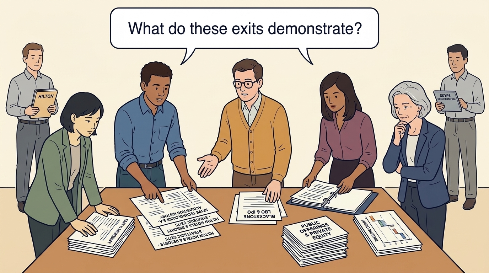
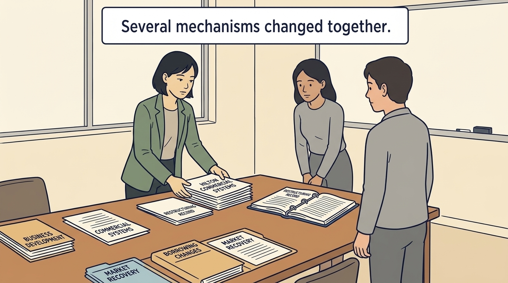
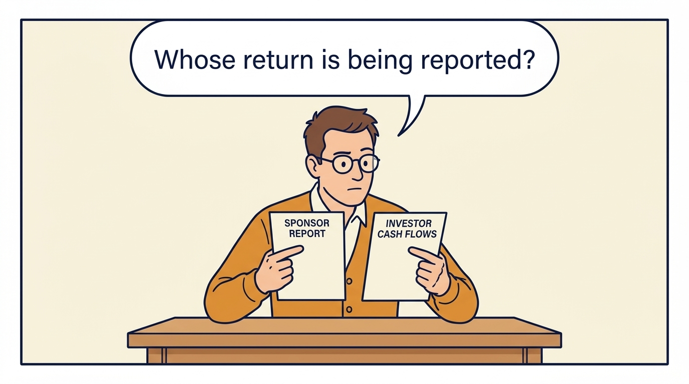
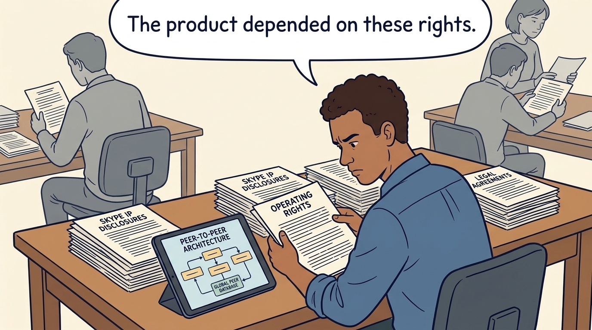
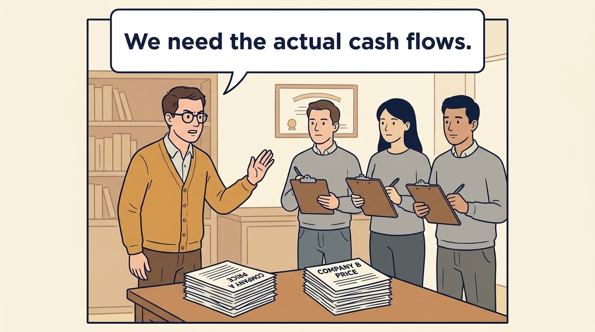
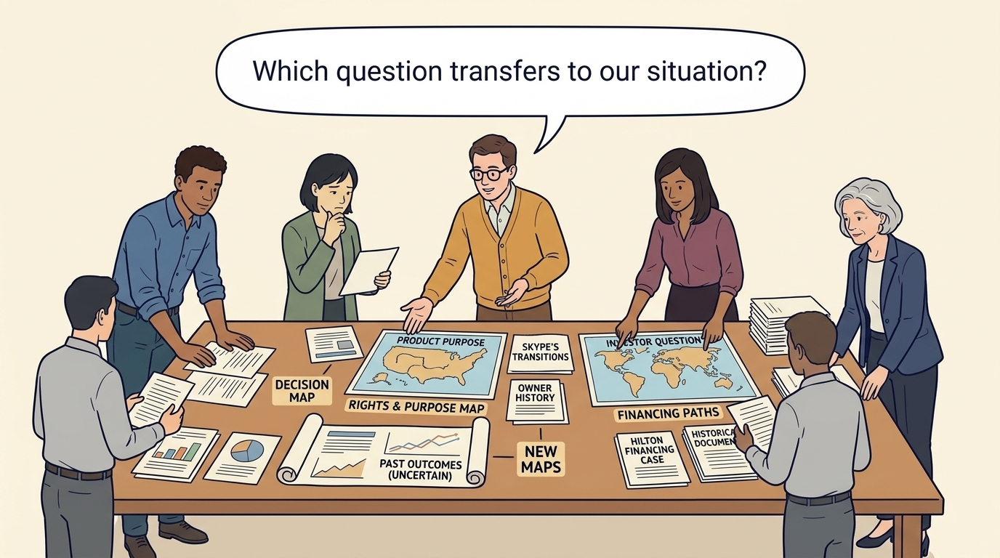

<!-- comic-style
{
  "cast": "MORGAN: a thoughtful investor technology adviser with short dark hair and a green jacket, used in the fund scenarios. ALEX: a practical CTO with curly hair and blue rolled-up sleeves. SAM: a CFO with round glasses and an amber cardigan. PRIYA: a product leader with straight dark hair and plum sleeves. INES: a CEO with short grey hair and a navy jacket. All are fictional; none represents a person in a real case.",
  "style": "Clean editorial explainer comic, dark ink outlines, restrained green, blue, and amber accents on warm white, generous space, readable short speech bubbles, expressive people and simple physical metaphors. No photorealism, logos, dense charts, or title text. Keep the same character appearances throughout the journal."
}
-->

**Comic.** Morgan is an investor’s adviser in the fund scenarios; Alex leads technology, Priya leads product, and Sam leads finance. All are fictional. Comparative scenarios use separate assumptions. Historical cases are discussed through documents; the scenes do not reenact real events.

<!-- comic-panel
{
  "id": "01-scene",
  "status": "generated",
  "asset": "assets/images/21-hilton-and-skype/comic-01-scene.jpeg",
  "aspect_ratio": "16:9",
  "prompt": "Panel 1 of an explainer comic. The fictional team opens public Hilton and Skype documents. Use one speech bubble with the exact words: \"What do these exits demonstrate?\" Convey: The fictional team examines historical documents about hotel group Hilton and calling service Skype. These scenes do not reenact either history.",
  "alt": "Comic panel: The fictional team opens public Hilton and Skype documents.",
  "caption": "The fictional team examines historical documents about hotel group Hilton and calling service Skype. These scenes do not reenact either history.",
  "generation": {
    "model": "gemini-3-pro-image-preview",
    "reference_id": "owned-cast-20260913",
    "sha256": "c3bb48556952e5a5312603d9bc473e957841425c182a57d4558e40c67b77b87f"
  }
}
-->

**Panel 1:** The fictional team examines historical documents about hotel group Hilton and calling service Skype. These scenes do not reenact either history.

*Dialogue:* “What do these exits demonstrate?”

<!-- comic-panel
{
  "id": "02-scene",
  "status": "generated",
  "asset": "assets/images/21-hilton-and-skype/comic-02-scene.jpeg",
  "aspect_ratio": "16:9",
  "prompt": "Panel 2 of an explainer comic. Morgan places Hilton's commercial systems beside a restructuring record. Use one speech bubble with the exact words: \"Several mechanisms changed together.\" Convey: Hilton’s technology systems, business development, borrowing changes and market recovery all belong in the explanation of its result.",
  "alt": "Comic panel: Morgan places Hilton's commercial systems beside a restructuring record.",
  "caption": "Hilton’s technology systems, business development, borrowing changes and market recovery all belong in the explanation of its result.",
  "generation": {
    "model": "gemini-3-pro-image-preview",
    "reference_id": "owned-cast-20260913",
    "sha256": "e87d6cbf5137e65d042ff0348ab8508fc1bafbed595dbda5d3df5b929ec8d292"
  }
}
-->

**Panel 2:** Hilton’s technology systems, business development, borrowing changes and market recovery all belong in the explanation of its result.

*Dialogue:* “Several mechanisms changed together.”

<!-- comic-panel
{
  "id": "03-scene",
  "status": "generated",
  "asset": "assets/images/21-hilton-and-skype/comic-03-scene.jpeg",
  "aspect_ratio": "16:9",
  "prompt": "Panel 3 of an explainer comic. Sam reads a sponsor-reported return and labels its basis. Use one speech bubble with the exact words: \"Whose return is being reported?\" Convey: An investment firm’s reported profit does not establish what each investor in its funds received after all fees and other deductions.",
  "alt": "Comic panel: Sam compares a sponsor report with a separate document of investor cash flows.",
  "caption": "An investment firm’s reported profit does not establish what each investor in its funds received after all fees and other deductions.",
  "generation": {
    "model": "gemini-3-pro-image-preview",
    "reference_id": "owned-cast-20260913",
    "sha256": "08a290acdf8ea21aa0c18cd5c78f170e3aa74f0e768ab6549d3415db50ea7dda"
  }
}
-->

**Panel 3:** An investment firm’s reported profit does not establish what each investor in its funds received after all fees and other deductions.

*Dialogue:* “Whose return is being reported?”

<!-- comic-panel
{
  "id": "04-scene",
  "status": "generated",
  "asset": "assets/images/21-hilton-and-skype/comic-04-scene.jpeg",
  "aspect_ratio": "16:9",
  "prompt": "Panel 4 of an explainer comic. Alex studies Skype's intellectual-property and operating disclosures. Use one speech bubble with the exact words: \"The product depended on these rights.\" Convey: Skype’s case shows why legal rights to essential software matter alongside its technical quality.",
  "alt": "Comic panel: Alex studies Skype's intellectual-property and operating disclosures.",
  "caption": "Skype’s case shows why legal rights to essential software matter alongside its technical quality.",
  "generation": {
    "model": "gemini-3-pro-image-preview",
    "reference_id": "owned-cast-20260913",
    "sha256": "a2174fd16ac6a89d39988e0a1792354037a4a190c17eedda190c7caa3bde2cb6"
  }
}
-->

**Panel 4:** Skype’s case shows why legal rights to essential software matter alongside its technical quality.

*Dialogue:* “The product depended on these rights.”

<!-- comic-panel
{
  "id": "05-scene",
  "status": "generated",
  "asset": "assets/images/21-hilton-and-skype/comic-05-scene.jpeg",
  "aspect_ratio": "16:9",
  "prompt": "Panel 5 of an explainer comic. Sam refuses to divide two headline transaction valuations. Use one speech bubble with the exact words: \"We need the actual cash flows.\" Convey: To calculate an investor return, follow the money invested and received, with ownership, borrowing, costs and dates. Two company price headlines are insufficient.",
  "alt": "Comic panel: Sam refuses to divide two headline transaction valuations.",
  "caption": "To calculate an investor return, follow the money invested and received, with ownership, borrowing, costs and dates. Two company price headlines are insufficient.",
  "generation": {
    "model": "gemini-3-pro-image-preview",
    "reference_id": "owned-cast-20260913",
    "sha256": "a2487bf0f4eba2646e650f04504cc03e9cbc0d54608d0393ba6096f4fbca279c"
  }
}
-->

**Panel 5:** To calculate an investor return, follow the money invested and received, with ownership, borrowing, costs and dates. Two company price headlines are insufficient.

*Dialogue:* “We need the actual cash flows.”

<!-- comic-panel
{
  "id": "06-scene",
  "status": "generated",
  "asset": "assets/images/21-hilton-and-skype/comic-06-scene.jpeg",
  "aspect_ratio": "16:9",
  "prompt": "Panel 6 of an explainer comic. The fictional team places decision maps beside the historical documents without reenacting the events. Use one speech bubble with the exact words: \"Which question transfers to our situation?\" Convey: Skype’s documented transitions prompt a new map of rights and product purpose at each owner. Hilton prompts a financing question. These histories do not establish outcomes for all investors.",
  "alt": "Comic panel: The fictional team places decision maps beside the historical documents without reenacting the events.",
  "caption": "Skype’s documented transitions prompt a new map of rights and product purpose at each owner. Hilton prompts a financing question. These histories do not establish outcomes for all investors.",
  "generation": {
    "model": "gemini-3-pro-image-preview",
    "reference_id": "owned-cast-20260913",
    "sha256": "7e05531ffca3f6c6754c8623b0f6064a911149af1d4349ea98ec20fa89a815c6"
  }
}
-->

**Panel 6:** Skype’s documented transitions prompt a new map of rights and product purpose at each owner. Hilton prompts a financing question. These histories do not establish outcomes for all investors.

*Dialogue:* “Which question transfers to our situation?”
