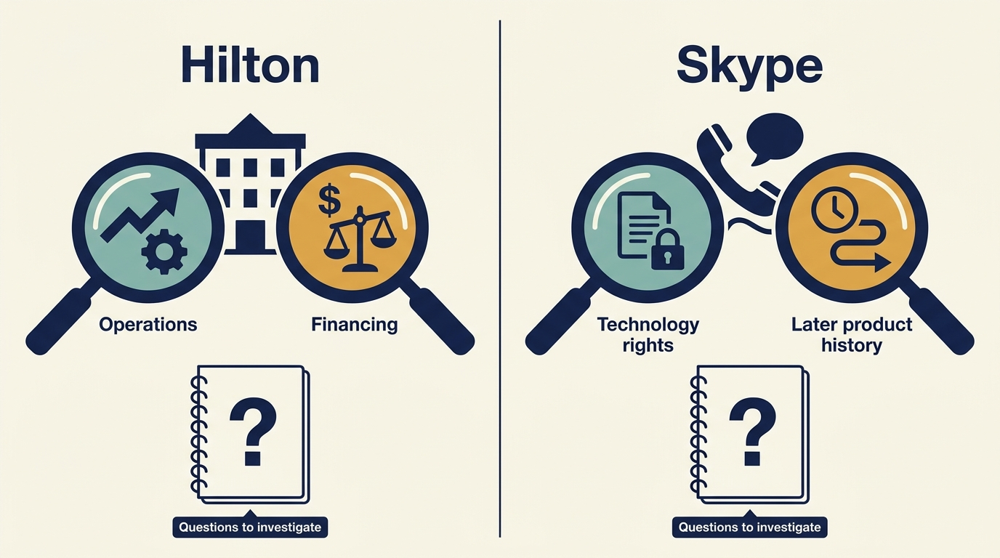
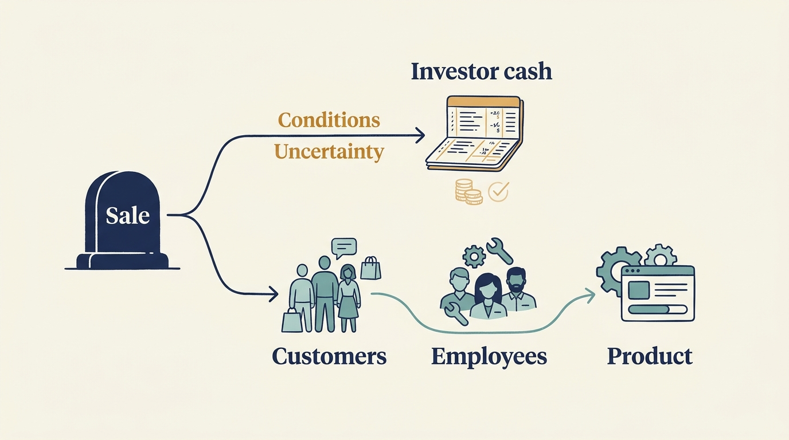

> **KEY POINTS:**
>
> * A **valuable sale needs an explanation**. Better operations, financing changes, market recovery and the buyer’s interests can all affect the result.
> * Keep the **company result separate from the investor’s cash**. Purchase and sale headlines do not include every investment, payment or fee.
> * Follow what happens to the **product and people**. A completed sale does not establish whether customers and employees benefited over the longer term.

 
Hilton operates a hotel business and brand network. Skype provided internet calling and communications software. Both experienced private equity-backed ownership followed by valuable sales, but the paths were very different.

Hilton’s ownership episode ran through a severe economic downturn and recovery. Skype’s much shorter episode included resolving rights to essential technology before a sale to Microsoft. Comparing them helps apply the book’s central distinction: an **exit**, a sale through which investors receive value, is an event to explain rather than proof that every earlier decision worked.

Exits matter to product and engineering leaders because much of what investors ask for during ownership is justified by the sale they expect to make. These two cases show what a completed sale can and cannot tell you about the technology work that preceded it, and how a sponsor’s account of its own success should be read.

We examine Hilton first, then Skype, using the same questions: what changed, how might technology have helped, what did investors receive, and what remains unknown? A **sponsor** is the investment firm behind a transaction. Its account is useful evidence about its stated actions and reported result, but may emphasize favorable interpretations.

The historical material does not include complete fund cash flows or an independent calculation of each technology initiative’s contribution. Keep that limit in view when assessing which operating lessons the cases support.

## Hilton: Follow the Ownership Period From 2007 to 2018

Blackstone’s 2007 acquisition of Hilton was a large **leveraged take-private**: buying a publicly traded company into private ownership using substantial borrowing. A retrospective account in Private Equity International, hosted by Blackstone, describes a $26 billion transaction, a downturn-related **writedown**, a reduction in the recorded investment value, additional capital, room expansion, and **debt restructuring**, changes to the borrowing terms or amounts owed, a 2013 initial public offering (IPO), a sale of shares onto a public market, and final exit in 2018. This is an industry award account and should be treated as a favorable retrospective, not an independent causal evaluation. [S25: PEI Hilton retrospective](https://www.blackstone.com/wp-content/uploads/sites/2/2019/03/pei_blackstone_hilton.pdf)

The company's 2013 registration statement provides a firmer basis for examining particular mechanisms. It reports a $4.0 billion reduction in indebtedness from the April 2010 restructuring. It also describes a commercial platform linking reservations, guest information, online distribution, revenue management, and the OnQ property-management system. [S23: Hilton registration filing](https://www.sec.gov/Archives/edgar/data/1585689/000119312513364703/d593452ds1.htm)

The 2013 public offering and the final stake sale in 2018 were different milestones. Going public did not complete Blackstone’s exit.

The operating observations matter because the business involved more than owning hotel buildings. Distribution and operating services could support a wider system of hotels. The plausible technology mechanism is coordination: consistent inventory and rates, usable guest information, and tools that help properties sell and manage rooms. That is an interpretation of the disclosed operating design, not a measured estimate of the value created by a specific system.

A product or engineering leader examining such a business would need to connect the platform to the hotel owner's economics as well as the guest's experience. Does the service help properties attract profitable demand? Does it lower the cost of distribution? Does it make the brand more valuable to an owner considering affiliation? Does it remain reliable as the network grows?

These questions differ from asking whether the company has a modern architecture. A central system can be valuable because it coordinates a commercial network, even when parts of the technology are mature. Conversely, a platform's scale can create a consequential concentration risk that should be governed.

### What $14 Billion Does and Does Not Establish

In its second-quarter 2018 investor call, Blackstone reported completing the Hilton exit, generating approximately 3.1 times investors' capital and $14 billion of profit. These are sponsor-reported realized investment figures, not independently reconstructed net returns for limited partners (LPs), the investors in a fund. [S24: Blackstone 2018 investor call](https://ir.blackstone.com/files/doc_events/BLACKSTONE-Second-Quarter-2018-Earnings-Investor-Call.pdf)

The reported outcome supports describing the engagement as a major investor success. It does not allocate the gain between operating improvement, leverage, debt restructuring, asset decisions, and market valuation. Nor does it establish what each LP ultimately received after all fund-level fees, carry, and other investments.

**Adjusted EBITDA** is earnings before interest, taxes, depreciation and amortization, with additional stated exclusions. It describes a particular earnings calculation rather than cash after all obligations.

The 2013 company filing also notes that its owned and leased portfolio's trailing adjusted EBITDA was still below 2008 levels at the point discussed. [S23: Hilton registration filing](https://www.sec.gov/Archives/edgar/data/1585689/000119312513364703/d593452ds1.htm) This is a useful counterweight to a smooth transformation narrative. Different parts of a business can recover at different rates, even when the overall investment eventually performs well.

### Was It the Technology, the Timing, or the Terms?

A hotel business is exposed to travel demand and economic conditions. The purchase period, downturn, subsequent recovery, financing decisions, and ability to remain invested all belong in the explanation. The consulted evidence does not establish a **counterfactual**, a supported estimate of what Hilton would have achieved under a different owner with different financing.

The technology interpretation is therefore conditional: a shared commercial capability may help a network expand and operate, but the magnitude of that contribution requires evidence on distribution costs, owner economics, guest behavior, and investment costs. A retrospective statement that technology was important cannot supply that decomposition.

Employee and customer consequences also require separate investigation. A larger hotel system does not automatically mean better working conditions. Operating improvements and labor changes can distribute benefits unevenly. The consulted transaction and registration materials do not provide a comprehensive comparison of employee welfare or guest outcomes across the ownership period.

The transferable lesson is the interaction of **operating capability and financial room**. Technology work needs time and funding to matter. Financing changes can preserve that time, while commercial systems can support a business model whose value is broader than the software itself. Neither lesson licenses the assumption that a highly leveraged company will always receive support through a downturn.

## Skype: Establish Rights to the Technology Before Expansion

In November 2009, eBay announced completion of a sale valuing Skype at $2.75 billion. A Silver Lake-led investor group controlled approximately 70%, while eBay retained approximately 30%. eBay reported receiving cash and a **buyer note**, a promise of later payment by the buyer. It also participated in part of the debt financing. The transaction therefore cannot be understood simply as one buyer paying cash for 100% of a debt-free company. [S26: eBay Skype sale announcement](https://investors.ebayinc.com/investor-news/press-release-details/2009/EBay-Inc-Completes-Sale-of-Skype/default.aspx)

**Intellectual property (IP)** means legal rights in assets such as software and inventions. The later Skype registration statement describes acquisition of core **peer-to-peer** technology rights, concerning software that connects users’ computers to one another, from Joltid in November 2009 as part of a settlement resolving outstanding litigation. It also describes investment in people and infrastructure, acquisition of Qik, new products, and partnerships. These are company disclosures prepared for a proposed offering; their positive interpretation remains management's. [S27: Skype registration filing](https://www.sec.gov/Archives/edgar/data/1498209/000119312511096544/ds1a.htm)

The core diligence lesson is unusually concrete. A product can function for customers while the rights to technology essential to its operation remain a material ownership issue. Code quality and scale testing would not, by themselves, resolve that investment risk.

### What Changed in the Product and Business

The filing reports 2010 net revenue of about $860 million, adjusted EBITDA of about $264 million, and a net loss of about $7 million. It describes ambitions to grow paid use, broaden enterprise adoption, and develop additional monetization. These measures and plans should not be confused: a strategy statement is not an achieved outcome, and adjusted EBITDA is not net income. [S27: Skype registration filing](https://www.sec.gov/Archives/edgar/data/1498209/000119312511096544/ds1a.htm)

For technology leaders, the interesting mechanism is the combination of a large communications product, commercial experimentation, and a more secure ownership basis for its core technology. The public record supports those components. It does not establish the incremental revenue caused by a particular engineering intervention or the fraction of the later purchase price attributable to the IP settlement.

An assessor should also resist attributing all post-separation improvement to independence. Market growth, accumulated product adoption, management changes, new partnerships, and acquisition effects can contribute. The relevant counterfactual would be what the product could have achieved under eBay or another owner, with alternative rights and financing arrangements. That comparison is not available here.

### A Realized Strategic Exit

Microsoft announced the $8.5 billion acquisition agreement in May 2011 and announced completion in October 2011. Its acquisition materials described strategic connections with its communications and device businesses. This is evidence of a completed transaction and the buyer's stated rationale, not evidence that all anticipated synergies were realized. [S28: Microsoft Skype completion](https://news.microsoft.com/source/2011/10/13/microsoft-officially-welcomes-skype/)

Dividing $8.5 billion by $2.75 billion does not calculate Silver Lake's fund return. The two transaction values sit above different ownership stakes, financing claims, costs, and cash flows. A proper calculation would need those items and their dates. The reported sale clearly indicates a major valuation increase and realized liquidity, while the exact net return remains outside this case's verified evidence.

### The Afterlife, and Its Limits

Microsoft retired Skype in May 2025 and directed users toward alternatives including Teams Free. [S29: Microsoft Skype retirement](https://support.microsoft.com/en-us/skype/22ccebb6-0cf9-4e1d-916f-aaf978e1b129) That event belongs in the product's history. It does not retroactively prove that the 2009–2011 ownership period destroyed value, nor does the successful 2011 sale prove that users were served well indefinitely afterward.

The long interval includes subsequent ownership choices and changing communications markets. A causal account of retirement would need to study that later period directly. Here, the event establishes why investor realization and durable product outcomes require different horizons.

For customers, migration is a real consequence even when a buyer considers product consolidation strategically sensible. For employees, a successful transaction does not establish the distribution of financial rewards or career outcomes. The consulted filings and announcements cannot settle those questions.

## Read an Ownership Transition From the Company’s Side

The documented Skype sequence includes movement from a corporate owner to an investor group and then to Microsoft. For a company leader, that is a reason to remap decision authority, rights to essential technology and the intended role of the product at each transaction. The next buyer’s strategic interest need not be the same as the selling investor’s reason for owning it.

Hilton supplies a different question: what happens to the operating plan when financing and the time needed for recovery change? The case supports examining those dependencies. It does not tell a venture-funded company what its next round should look like, or prove that a particular technology program caused the return.

Use these histories to formulate questions for the current owner: **which capability must continue through the transaction**, which assumption has changed, and **who funds the unfinished work**? The questions can travel; the historical outcomes remain specific to the cases.

**Figure 1:** *Use each history to identify a specific operating question before transferring its lesson.*

## What the Comparison Teaches

| Question | Hilton | Skype |
| --- | --- | --- |
| Ownership situation | Leveraged take-private through a severe downturn | Separation from a corporate owner with retained seller exposure |
| Visible technical mechanism | Commercial coordination across a hotel system | Core technology rights plus product and infrastructure development |
| Financing relevance | Debt restructuring and ability to remain invested | Mixed ownership and financing at entry |
| Realization evidence | Sponsor reports final exit and investment profit | Buyer confirms completed cash acquisition |
| Main causal gap | Allocation of return among operating, financing, and market effects | Allocation of valuation increase among IP, product, market, and buyer-specific value |
| Stakeholder gap | Independent employee and guest outcomes | Employee outcomes and long-run customer experience |

The lessons are mechanisms to investigate, not instructions to imitate. Hilton does not show that every company should build a central platform. Skype does not show that every carve-out will attract a strategic premium. Both show that technology becomes investment-relevant through its relationship to business capability, ownership rights, financing, and a buyer's needs.

Both cases include a completed exit. The next case examines continuity of an investment-firm relationship while the investors behind it change: [[visma]].

**Figure 2:** *An investor’s realized result and the company’s longer operating history need separate evidence.*

## Questions to Consider

1. *When a sponsor describes a successful exit, how much of the result can you explain by operating improvement, financing changes, market recovery and the buyer’s own interests?*
2. *Does your product depend on technology rights that a code review would not examine? How do you know?*
3. *What financial room would your company have to keep investing in technology through a severe downturn, and who would supply it?*
4. *Which capability in your company must continue through a change of owner, and who would fund the unfinished work?*
5. *What happened to customers and employees after the last ownership change you were part of, and how do you know?*
6. *If your product were retired years after a successful sale, what would that tell you about the earlier ownership period, and what would it not?*

## To Probe Further

- **[Hilton Closes Merger with Blackstone Investment Funds](https://www.sec.gov/Archives/edgar/data/0000047580/000110465907076613/a07-27433_1ex99d1.htm)** — Hilton Hotels Corporation, October 24, 2007; press release filed with the U.S. Securities and Exchange Commission. *Hilton's own closing announcement puts a share price and about $20.6 billion of debt behind what this chapter calls substantial borrowing, the starting point for the terms part of its question.*
- **[Niklas Zennstrom Steps Down as CEO of Skype](https://www.sec.gov/Archives/edgar/data/0001065088/000089161807000579/f34172exv99w1.htm)** — eBay Inc., October 1, 2007; press release filed with the SEC. *The previous owner's own filing shows that the $2.75 billion entry valuation the chapter starts from already sat on eBay's €630 million write-down of Skype.*
- **[eBay Inc. and Silver Lake Investor Group Settle Skype Litigation with Joltid Limited](https://www.sec.gov/Archives/edgar/data/1065088/000119312509227549/dex991.htm)** — eBay Inc., November 6, 2009; press release filed with the SEC. *The parties' own settlement announcement gives the 56%, 14% and 30% ownership split that puts a stake table under the chapter's rights-before-expansion section.*
- **[Private Equity Performance: What Do We Know?](https://www.nber.org/papers/w17874)** — Robert S. Harris, Tim Jenkinson and Steven N. Kaplan, NBER Working Paper 17874, 2012. *It shows what a net return series after fees looks like across about 1,400 funds, as distinct from the gross multiple a sponsor reports on an investor call.*
- **[An Inconvenient Fact: Private Equity Returns & The Billionaire Factory](https://papers.ssrn.com/sol3/papers.cfm?abstract_id=3623820)** — Ludovic Phalippou, Saïd Business School, University of Oxford, SSRN working paper, 2020. *A critic's case that net fund multiples merely match public indices, read with the previous entry to see how far the returns dispute is about benchmarks and fees.*
