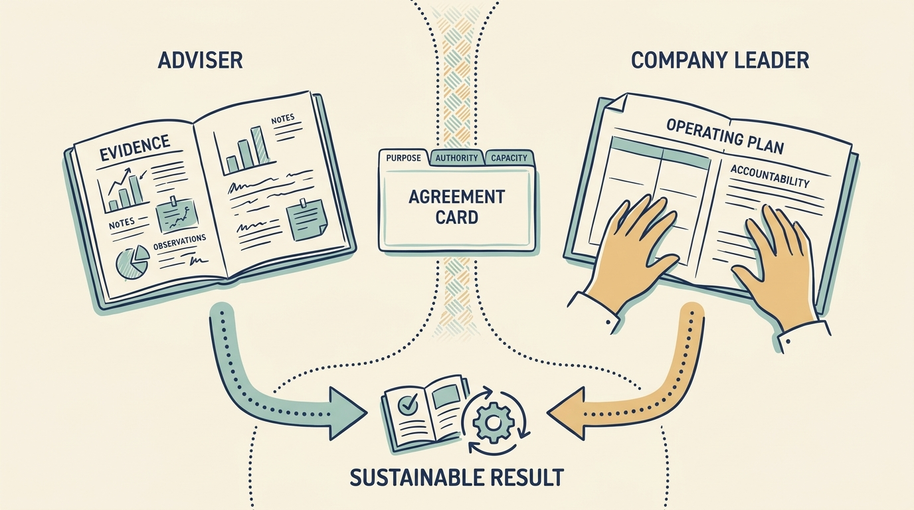

An **investor’s technology adviser** is a person the investment firm employs or engages to form its own view of a company’s technology and, often, to help improve it. The book’s example is the **Technology Principal**, Morgan in the fictional Larkspur scenarios. A **chief technology officer (CTO)** leads technology inside the company. The distinguishing feature is not access but the reporting relationship: the adviser reports to the investment firm, so the company needs to understand both the operating assignment and how findings may inform the investor’s decisions.

**Figure 1:** *Agree the adviser’s assignment without obscuring company responsibility.*

The description draws on a supplied private role brief: one arrangement, not a universal definition or a grant of authority over company staff. [P01: supplied role brief](bibliography.html) Ask who employs the person, what their assignment is, how much time they have and which decisions they may make. Read the investment agreements first: they may already grant rights to inspect records and discuss the business with officers.

Begin by establishing **which job the adviser is doing**. **Due diligence** investigates a business before an investment decision. **Coaching** develops a person’s judgment. **Operating support** improves company work. Deciding is not another kind of help; it is authority that may attach to an assignment. Employees should be able to say whether they are hearing an assessment finding, a recommendation or an authorized instruction; formal oversight produces findings, not instructions, unless a decision is delegated.

**Separate influence from authority.** Proximity to the investor gives a suggestion weight; authority comes from a role, board responsibility, agreed shareholder rights or an explicit assignment, and the adviser has only what those grant. Engineers taking priorities from the adviser, the CTO and the investment team at once have a parallel reporting line with no mandate. Apply the company’s decision map to the adviser by name, tell the team, and keep asking “Who is authorized to decide?”

The hardest case is a change of role. In a fictional scene, Morgan has been coaching Alex for three months when the investment firm asks Morgan for a written view of Larkspur’s technology leadership. Before sharing anything sensitive, Alex can ask what a conversation is for, who receives what he says, whether it feeds an assessment and what Morgan must report anyway. Morgan must explain the request, what will be shared and that confidentiality covers only what the coaching and engagement agreements allow. The firm may ask Morgan for an opinion within its existing rights. In Larkspur’s arrangement, an assessment using fresh access or coaching material needs Ines or the board to agree its scope; interim delivery leadership needs authority the board has granted. Employees are told in writing what the assignment is, for how long and which instructions still come from Alex.

Build a **shared account** of the situation: the same facts for investor and engineers, with each side stating the evidence that would change its view. The planning meeting then opens with two agreed sentences: Morgan’s contribution is a recommendation, and Alex is authorized to decide the technical plan within the approved budget.
