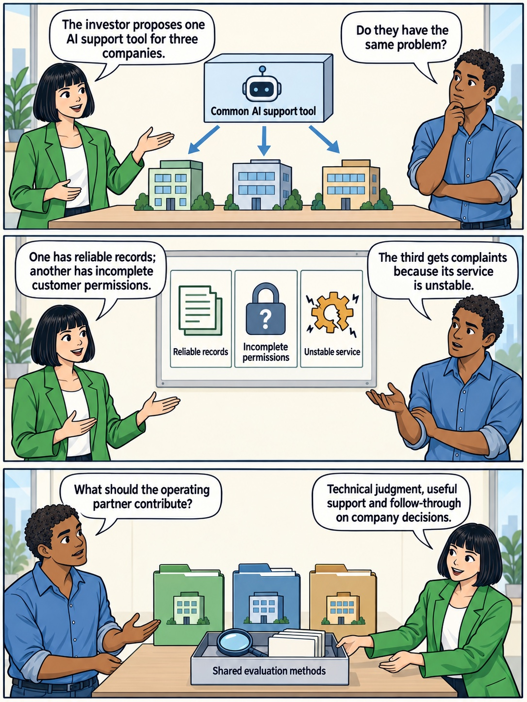
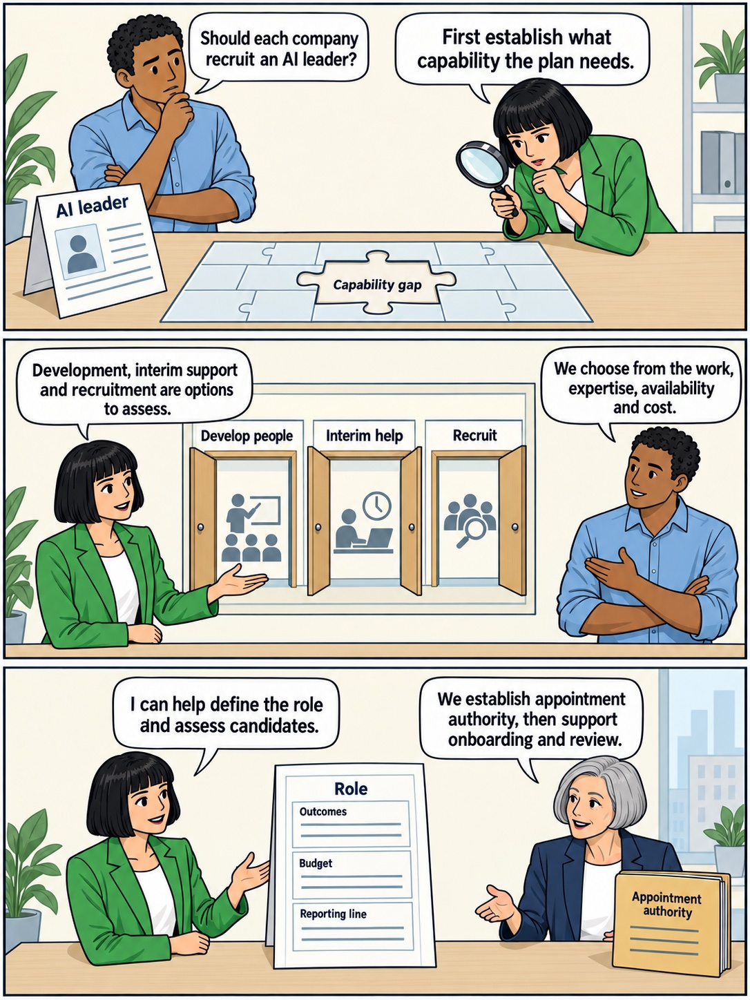
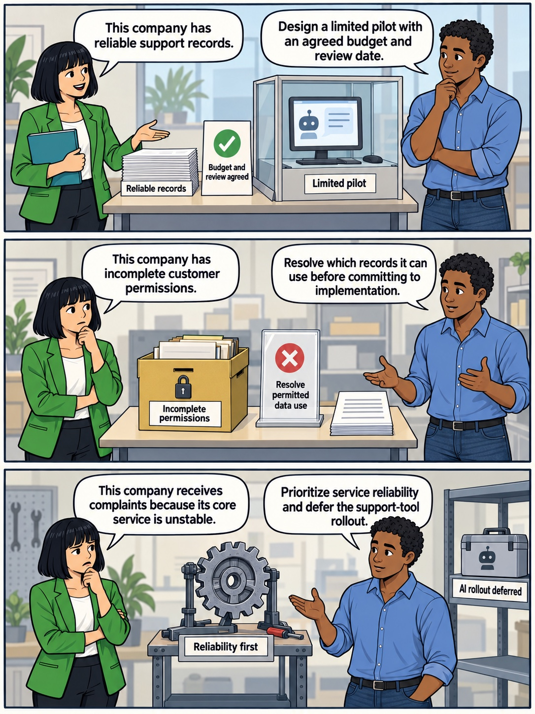
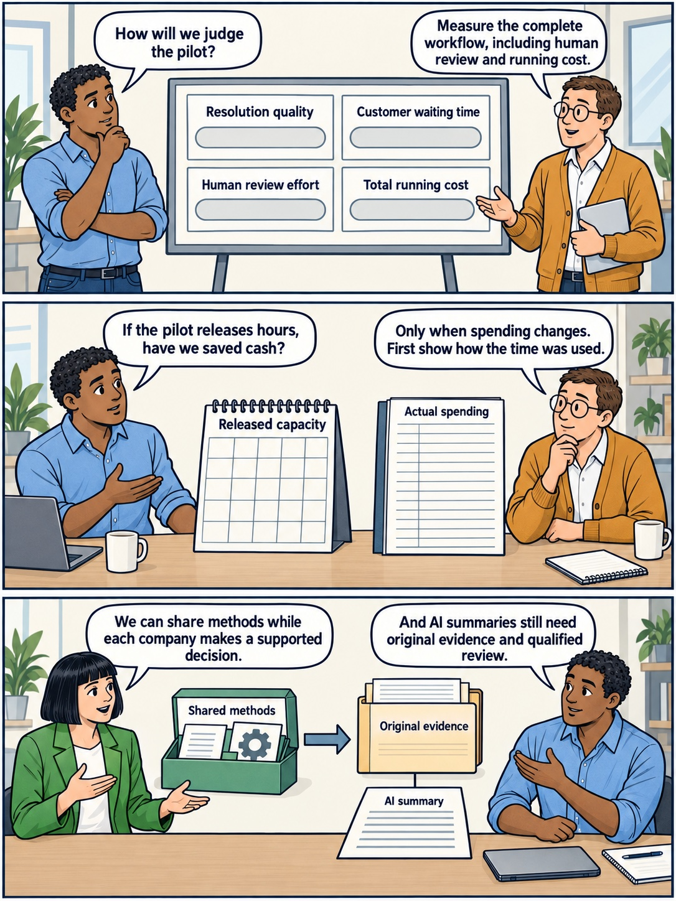

<!-- comic-style
{
  "cast": "MORGAN: a thoughtful investor technology adviser with short dark hair and a green jacket, used in the fund scenarios. ALEX: a practical CTO, a brown-skinned man with short, tight dark curls close to his head and blue rolled-up sleeves. SAM: a CFO, a man with short brown hair, round glasses and an amber cardigan. PRIYA: a product leader with straight dark hair and plum sleeves. INES: a CEO with short grey hair and a navy jacket. All are fictional; none represents a person in a real case.",
  "style": "Clean editorial explainer comic pages, each one image of three stacked full-width strips: navy ink outlines, restrained green, blue and amber accents on warm ivory, generous space, expressive people and simple physical props. Dialogue, short labels and the supplied amounts are lettered in the artwork, exactly as scripted. Money bags, coins and banknotes are plain and undecorated; the euro sign appears only inside supplied text, and arrows, documents and screens carry plain lines, never lettering. No photorealism, logos, titles or unsupplied text. Keep the same character appearances throughout the journal.",
  "reference": "_research/comic-cast-20260913.jpeg",
  "identity": {
    "Morgan": "MORGAN is a light-skinned WOMAN with a short, straight, JET-BLACK bob cut level with her jaw and a straight fringe across her forehead (never brown hair, never a side parting), and a bright green jacket over a white top, first person in the reference; her face must match the reference sheet exactly.",
    "Alex": "ALEX is a medium-brown-skinned MAN with a masculine face, broad shoulders and a straight masculine build, SHORT tight dark curls close to his head (not a large afro), a blue rolled-sleeve shirt and blue jeans, second person in the reference; fill his face, neck and hands with the same brown skin color in every strip.",
    "Sam": "SAM is a light-skinned MAN with a masculine face and SHORT brown hair cropped above his ears (never a bob, never chin-length hair, never a woman), round glasses and an amber cardigan over a white shirt, third person in the reference.",
    "Priya": "PRIYA is a brown-skinned WOMAN with straight shoulder-length dark hair and a plum blouse, fourth person in the reference.",
    "Ines": "INES is a light-skinned OLDER WOMAN with a short GREY bob (grey hair, never dark) and a navy jacket, fifth person in the reference."
  },
  "short": {
    "Morgan": "a light-skinned woman with a jet-black jaw-length bob and fringe, in a bright green jacket",
    "Alex": "a brown-skinned man with short tight dark curls, in a blue rolled-sleeve shirt",
    "Sam": "a light-skinned man with short brown hair and round glasses, in an amber cardigan over a collared white shirt",
    "Priya": "a brown-skinned woman with straight shoulder-length dark hair, in a plum blouse",
    "Ines": "an older light-skinned woman with a short grey bob, in a navy jacket"
  }
}
-->

**Comic.** The familiar fictional cast presents this chapter’s independent example: an investor proposes one AI support tool for three software companies facing different problems. Morgan represents the technology operating function, Alex company technology leadership, Ines company executive authority and Sam finance. Five pages connect the proposed rollout to the function’s remit, capability choices and evidence of useful work.

<!-- comic-page
{
  "id": "01-one-tool-three-problems",
  "title": "One tool, three problems",
  "asset": "assets/images/22-tech-operating-partner/comic-page-01-one-tool-three-problems.jpeg",
  "aspect_ratio": "3:4",
  "cast": [
    "Morgan",
    "Alex"
  ],
  "strips": [
    {
      "scene": "Morgan stands on the left and Alex on the right. A single boxed AI support tool sits above exactly three distinct small software-company models arranged in a row on a bare table. Three plain arrows from the box point toward the three models. Each model has plain windows and no lettering. The box carries the only prop label.",
      "labels": [
        "Common AI support tool"
      ],
      "label_notes": "Each label appears once on its described prop, upright and fully visible.",
      "bubbles": [
        {
          "who": "Morgan",
          "text": "The investor proposes one AI support tool for three companies."
        },
        {
          "who": "Alex",
          "text": "Do they have the same problem?"
        }
      ]
    },
    {
      "scene": "Morgan stands on the left and Alex on the right beneath a high wall board with exactly three equal cards in a row. Each card has one supplied label and one pictogram: orderly records, a padlock with a question symbol, and a damaged service gear. Keep the question symbol plain and add no other letters or numbers.",
      "labels": [
        "Reliable records",
        "Incomplete permissions",
        "Unstable service"
      ],
      "label_notes": "Each label appears once on its described prop, upright and fully visible.",
      "bubbles": [
        {
          "who": "Morgan",
          "text": "One has reliable records; another has incomplete customer permissions."
        },
        {
          "who": "Alex",
          "text": "The third gets complaints because its service is unstable."
        }
      ]
    },
    {
      "scene": "Alex stands on the left and Morgan on the right beside three separate company folders. Morgan sets a reusable evaluation kit on the table in front of the folders. The kit contains a magnifying glass and plain cards; its front carries one label.",
      "labels": [
        "Shared evaluation methods"
      ],
      "label_notes": "Each label appears once on its described prop, upright and fully visible.",
      "bubbles": [
        {
          "who": "Alex",
          "text": "What should the operating partner contribute?"
        },
        {
          "who": "Morgan",
          "text": "Technical judgment, useful support and follow-through on company decisions."
        }
      ]
    }
  ],
  "alt": "Three-strip comic: an investor proposes one AI support tool for three companies; their conditions differ between reliable records, incomplete permissions and an unstable service; a shared evaluation kit supports separate company decisions.",
  "caption": "The journal’s fictional cast presents the article’s independent three-company example. Morgan represents the technology operating function and Alex company technology leadership; the portfolio is the set of businesses the investor invests in.",
  "source_sections": [
    "What Useful Intervention Looks Like",
    "What the Function Does Across an Investment"
  ],
  "status": "generated",
  "generation": {
    "tool": "OpenAI imagegen (built-in)",
    "generation_calls": 1,
    "visually_verified": true,
    "sha256": "d56b0190c1eeb1238b29194712537acfcf57560234690738eadcd07866069d8d",
    "provenance": "_research/modalities-artwork-20260922.json"
  }
}
-->

**Page 1: One tool, three problems.** The journal’s fictional cast presents the article’s independent three-company example. Morgan represents the technology operating function and Alex company technology leadership; the portfolio is the set of businesses the investor invests in.

- *Strip 1.* **Morgan:** “The investor proposes one AI support tool for three companies.” **Alex:** “Do they have the same problem?”
- *Strip 2.* **Morgan:** “One has reliable records; another has incomplete customer permissions.” **Alex:** “The third gets complaints because its service is unstable.”
- *Strip 3.* **Alex:** “What should the operating partner contribute?” **Morgan:** “Technical judgment, useful support and follow-through on company decisions.”

<!-- comic-page
{
  "id": "02-connect-support-to-company-work",
  "title": "Connect support to company work",
  "asset": "assets/images/22-tech-operating-partner/comic-page-02-connect-support-to-company-work.jpeg",
  "aspect_ratio": "3:4",
  "cast": [
    "Morgan",
    "Alex",
    "Ines"
  ],
  "strips": [
    {
      "scene": "Morgan stands on the left and Alex on the right beneath a high horizontal rail carrying exactly four equally sized folders connected in order by plain arrows. Each folder has one supplied heading. Morgan holds a magnifying glass below the first folder; Alex holds a simple work plan below the middle of the rail. Nothing covers the labels.",
      "labels": [
        "Investment assessment",
        "Funded priorities",
        "Delivery and learning",
        "Sale preparation"
      ],
      "label_notes": "Each label appears once on its described prop, upright and fully visible.",
      "bubbles": [
        {
          "who": "Morgan",
          "text": "Technical assumptions need testing before investment and follow-through afterward."
        },
        {
          "who": "Alex",
          "text": "Keep findings connected to funded work and evidence."
        }
      ]
    },
    {
      "scene": "Morgan stands on the left and Ines on the right. Between them stands one upright assignment document with a large heading and four equally spaced short fields underneath. Ines holds an unlettered pen below the document; Morgan gestures from its other side. Every field is fully visible.",
      "labels": [
        "Assignment",
        "Authority",
        "Availability",
        "Costs",
        "Next review"
      ],
      "label_notes": "Each label appears once on its described prop, upright and fully visible.",
      "bubbles": [
        {
          "who": "Morgan",
          "text": "My title alone does not give me authority over your team."
        },
        {
          "who": "Ines",
          "text": "We agree the assignment and the decisions you may make."
        }
      ]
    },
    {
      "scene": "Alex stands on the left and Morgan on the right. A small model company with a leadership desk sits beside a separate support toolbox on a bare table. A two-way plain arrow joins them. The model desk carries a short label; the toolbox carries a different short label. Neither is above the other.",
      "labels": [
        "Company leadership",
        "Operating support"
      ],
      "label_notes": "Each label appears once on its described prop, upright and fully visible.",
      "bubbles": [
        {
          "who": "Alex",
          "text": "Our leaders keep their continuing product, technology and delivery responsibilities."
        },
        {
          "who": "Morgan",
          "text": "I bring challenge, coordination and specialist help within the agreed remit."
        }
      ]
    }
  ],
  "alt": "Three-strip comic: linked folders run from investment assessment through funded priorities and delivery to sale preparation; an assignment records authority, availability, costs and review; company leadership and operating support remain distinct and connected.",
  "caption": "Useful support follows the investment’s assumptions into company work. The actual assignment establishes authority; company leaders retain their continuing responsibilities, and executive direction requires an explicit appointment or delegation.",
  "source_sections": [
    "What the Function Does Across an Investment",
    "How the Role Compares With CIO, CTO, CPO and Chief Architect",
    "What Company Leaders Should Expect"
  ],
  "status": "generated",
  "generation": {
    "tool": "OpenAI imagegen (built-in)",
    "generation_calls": 1,
    "visually_verified": true,
    "sha256": "9c8ff73b0794edb554219239a4c477d1f5fec970067f989e59ede04e7e891368",
    "provenance": "_research/modalities-artwork-20260922.json"
  }
}
-->

**Page 2: Connect support to company work.** Useful support follows the investment’s assumptions into company work. The actual assignment establishes authority; company leaders retain their continuing responsibilities, and executive direction requires an explicit appointment or delegation.

- *Strip 1.* **Morgan:** “Technical assumptions need testing before investment and follow-through afterward.” **Alex:** “Keep findings connected to funded work and evidence.”
- *Strip 2.* **Morgan:** “My title alone does not give me authority over your team.” **Ines:** “We agree the assignment and the decisions you may make.”
- *Strip 3.* **Alex:** “Our leaders keep their continuing product, technology and delivery responsibilities.” **Morgan:** “I bring challenge, coordination and specialist help within the agreed remit.”

<!-- comic-page
{
  "id": "03-capability-before-hiring",
  "title": "Capability before hiring",
  "asset": "assets/images/22-tech-operating-partner/comic-page-03-capability-before-hiring.jpeg",
  "aspect_ratio": "3:4",
  "cast": [
    "Alex",
    "Morgan",
    "Ines"
  ],
  "strips": [
    {
      "scene": "Alex stands on the left and Morgan on the right beside a bare desk. A folded recruitment advert with one heading sits on the left. At the center an empty puzzle-shaped slot in a work plan is identified by one short label. Morgan examines the slot through a magnifying glass. Nothing is placed in the slot yet.",
      "labels": [
        "AI leader",
        "Capability gap"
      ],
      "label_notes": "Each label appears once on its described prop, upright and fully visible.",
      "bubbles": [
        {
          "who": "Alex",
          "text": "Should each company recruit an AI leader?"
        },
        {
          "who": "Morgan",
          "text": "First establish what capability the plan needs."
        }
      ]
    },
    {
      "scene": "Morgan stands on the left and Alex on the right beneath a high wall board with exactly three equal doors drawn side by side. Each door has one supplied label. All doors are open equally, none selected; behind them are simple unlettered symbols of coaching, temporary support and recruitment.",
      "labels": [
        "Develop people",
        "Interim help",
        "Recruit"
      ],
      "label_notes": "Each label appears once on its described prop, upright and fully visible.",
      "bubbles": [
        {
          "who": "Morgan",
          "text": "Development, interim support and recruitment are options to assess."
        },
        {
          "who": "Alex",
          "text": "We choose from the work, expertise, availability and cost."
        }
      ]
    },
    {
      "scene": "Morgan stands on the left and Ines on the right. An upright role specification stands between them with a heading and three short fields. Ines has a separate appointment folder on the right, with its own heading. All lettering faces the reader and remains above hands.",
      "labels": [
        "Role",
        "Outcomes",
        "Budget",
        "Reporting line",
        "Appointment authority"
      ],
      "label_notes": "Each label appears once on its described prop, upright and fully visible.",
      "bubbles": [
        {
          "who": "Morgan",
          "text": "I can help define the role and assess candidates."
        },
        {
          "who": "Ines",
          "text": "We establish appointment authority, then support onboarding and review."
        }
      ]
    }
  ],
  "alt": "Three-strip comic: a proposed AI-leader advert prompts inspection of the capability gap; three unranked routes offer development, interim help or recruitment; role outcomes, budget, reporting line and appointment authority are agreed before hiring.",
  "caption": "This page applies the article’s capability questions to the proposed AI rollout; it records no fictional hiring decision. The operating partner can support role design and assessment, while appointment authority and the company’s continuing management responsibilities must be explicit.",
  "source_sections": [
    "Hiring at Portfolio Companies",
    "When a Dedicated AI Operating Partner Helps"
  ],
  "status": "generated",
  "generation": {
    "tool": "OpenAI imagegen (built-in)",
    "generation_calls": 1,
    "visually_verified": true,
    "sha256": "fb9a1f388ad88c722286252a46a06bab1c33d2dc7ff0325c9e439832abe17ab3",
    "provenance": "_research/modalities-artwork-20260922.json"
  }
}
-->

**Page 3: Capability before hiring.** This page applies the article’s capability questions to the proposed AI rollout; it records no fictional hiring decision. The operating partner can support role design and assessment, while appointment authority and the company’s continuing management responsibilities must be explicit.

- *Strip 1.* **Alex:** “Should each company recruit an AI leader?” **Morgan:** “First establish what capability the plan needs.”
- *Strip 2.* **Morgan:** “Development, interim support and recruitment are options to assess.” **Alex:** “We choose from the work, expertise, availability and cost.”
- *Strip 3.* **Morgan:** “I can help define the role and assess candidates.” **Ines:** “We establish appointment authority, then support onboarding and review.”

<!-- comic-page
{
  "id": "04-shared-method-different-decisions",
  "title": "Shared method, different decisions",
  "asset": "assets/images/22-tech-operating-partner/comic-page-04-shared-method-different-decisions.jpeg",
  "aspect_ratio": "3:4",
  "cast": [
    "Morgan",
    "Alex"
  ],
  "strips": [
    {
      "scene": "Morgan stands on the left and Alex on the right beside a teal company folder, a neat stack of support records and a small enclosed test area containing a plain AI support screen. The test area has one label; the record stack has one label; an upright approval card beside it has one label. These are the only props.",
      "labels": [
        "Reliable records",
        "Limited pilot",
        "Budget and review agreed"
      ],
      "label_notes": "Each label appears once on its described prop, upright and fully visible.",
      "bubbles": [
        {
          "who": "Morgan",
          "text": "This company has reliable support records."
        },
        {
          "who": "Alex",
          "text": "Design a limited pilot with an agreed budget and review date."
        }
      ]
    },
    {
      "scene": "Morgan stands on the left and Alex on the right beside an ochre company folder and a locked records box. A clear permission checkpoint stands before the box. A plain implementation work card rests before the checkpoint, waiting. The box and checkpoint each carry one supplied label.",
      "labels": [
        "Incomplete permissions",
        "Resolve permitted data use"
      ],
      "label_notes": "Each label appears once on its described prop, upright and fully visible.",
      "bubbles": [
        {
          "who": "Morgan",
          "text": "This company has incomplete customer permissions."
        },
        {
          "who": "Alex",
          "text": "Resolve which records it can use before committing to implementation."
        }
      ]
    },
    {
      "scene": "Morgan stands on the left and Alex on the right beside a plum company folder and a service gear on a small repair stand. A plain AI tool box sits on a separate shelf to the side. Label the repair stand and the shelf, with one label on each.",
      "labels": [
        "Reliability first",
        "AI rollout deferred"
      ],
      "label_notes": "Each label appears once on its described prop, upright and fully visible.",
      "bubbles": [
        {
          "who": "Morgan",
          "text": "This company receives complaints because its core service is unstable."
        },
        {
          "who": "Alex",
          "text": "Prioritize service reliability and defer the support-tool rollout."
        }
      ]
    }
  ],
  "alt": "Three-strip comic: reliable records support a limited AI pilot with an agreed budget and review; incomplete permissions require resolving permitted data use first; an unstable service requires reliability work while the AI rollout is deferred.",
  "caption": "In the fictional comparison, shared expertise supports three different sequences. Each company uses its existing approval route for resources and records the work displaced; no common rollout or successful pilot outcome is assumed.",
  "source_sections": [
    "What Useful Intervention Looks Like"
  ],
  "status": "generated",
  "generation": {
    "tool": "OpenAI imagegen (built-in)",
    "generation_calls": 1,
    "visually_verified": true,
    "sha256": "c25595c68630589a5abd12c4433f142500dfe74cf4790591ef3ddce8f393cbf6",
    "provenance": "_research/modalities-artwork-20260922.json"
  }
}
-->

**Page 4: Shared method, different decisions.** In the fictional comparison, shared expertise supports three different sequences. Each company uses its existing approval route for resources and records the work displaced; no common rollout or successful pilot outcome is assumed.

- *Strip 1.* **Morgan:** “This company has reliable support records.” **Alex:** “Design a limited pilot with an agreed budget and review date.”
- *Strip 2.* **Morgan:** “This company has incomplete customer permissions.” **Alex:** “Resolve which records it can use before committing to implementation.”
- *Strip 3.* **Morgan:** “This company receives complaints because its core service is unstable.” **Alex:** “Prioritize service reliability and defer the support-tool rollout.”

<!-- comic-page
{
  "id": "05-review-what-changed",
  "title": "Review what changed",
  "asset": "assets/images/22-tech-operating-partner/comic-page-05-review-what-changed.jpeg",
  "aspect_ratio": "3:4",
  "cast": [
    "Alex",
    "Sam",
    "Morgan"
  ],
  "strips": [
    {
      "scene": "Alex stands on the left and Sam on the right beside a high review board with exactly four equal measurement cards in a two-by-two grid. Each card has one supplied label and a plain empty gauge, with no scores, numbers, ticks or success marks.",
      "labels": [
        "Resolution quality",
        "Customer waiting time",
        "Human review effort",
        "Total running cost"
      ],
      "label_notes": "Each label appears once on its described prop, upright and fully visible.",
      "bubbles": [
        {
          "who": "Alex",
          "text": "How will we judge the pilot?"
        },
        {
          "who": "Sam",
          "text": "Measure the complete workflow, including human review and running cost."
        }
      ]
    },
    {
      "scene": "Alex stands on the left and Sam on the right. A clear empty calendar slot is displayed beside a separate spending ledger on a bare desk. The slot and ledger are distinct objects with their own headings. There is no money flowing between them; the ledger contains only blank ruled lines.",
      "labels": [
        "Released capacity",
        "Actual spending"
      ],
      "label_notes": "Each label appears once on its described prop, upright and fully visible.",
      "bubbles": [
        {
          "who": "Alex",
          "text": "If the pilot releases hours, have we saved cash?"
        },
        {
          "who": "Sam",
          "text": "Only when spending changes. First show how the time was used."
        }
      ]
    },
    {
      "scene": "Morgan stands on the left and Alex on the right beside a reusable-method kit and a company evidence folder connected by a plain arrow. A generated document summary lies beneath the evidence folder and is joined to it by a short plain line. The kit, folder and summary each have one supplied label.",
      "labels": [
        "Shared methods",
        "Original evidence",
        "AI summary"
      ],
      "label_notes": "Each label appears once on its described prop, upright and fully visible.",
      "bubbles": [
        {
          "who": "Morgan",
          "text": "We can share methods while each company makes a supported decision."
        },
        {
          "who": "Alex",
          "text": "And AI summaries still need original evidence and qualified review."
        }
      ]
    }
  ],
  "alt": "Three-strip comic: the pilot review has unscored measures for quality, waiting time, human review and cost; released hours and actual spending remain separate; shared methods and AI summaries stay linked to original evidence and qualified review.",
  "caption": "Released hours are capacity until their use is demonstrated, and cash savings require a spending change. Even a successful pilot cannot isolate the operating partner’s contribution from the company team’s work; AI-generated summaries also require evidence and review.",
  "source_sections": [
    "What Useful Intervention Looks Like",
    "Using AI in the Operating Partner’s Own Work",
    "What Company Leaders Should Expect"
  ],
  "status": "generated",
  "generation": {
    "tool": "OpenAI imagegen (built-in)",
    "generation_calls": 1,
    "visually_verified": true,
    "sha256": "70105e068f7845f817d0da2a52582132763f432f6a1f2e404186a6f0176c6684",
    "provenance": "_research/modalities-artwork-20260922.json"
  }
}
-->

**Page 5: Review what changed.** Released hours are capacity until their use is demonstrated, and cash savings require a spending change. Even a successful pilot cannot isolate the operating partner’s contribution from the company team’s work; AI-generated summaries also require evidence and review.

- *Strip 1.* **Alex:** “How will we judge the pilot?” **Sam:** “Measure the complete workflow, including human review and running cost.”
- *Strip 2.* **Alex:** “If the pilot releases hours, have we saved cash?” **Sam:** “Only when spending changes. First show how the time was used.”
- *Strip 3.* **Morgan:** “We can share methods while each company makes a supported decision.” **Alex:** “And AI summaries still need original evidence and qualified review.”
