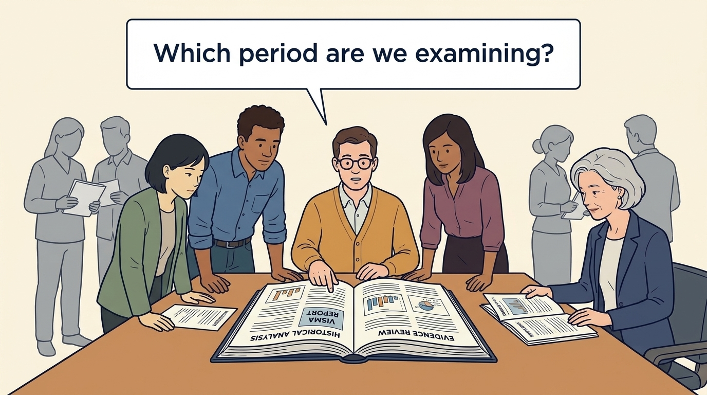
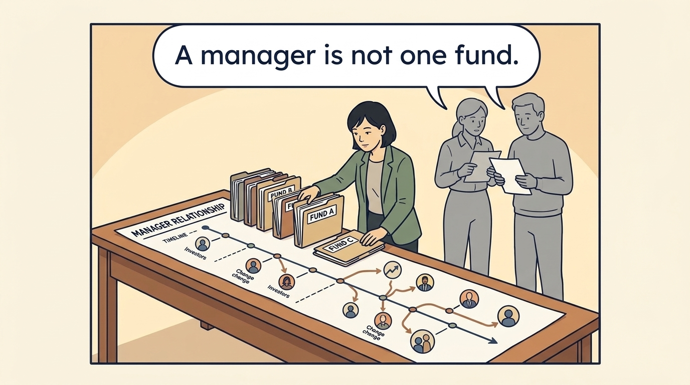
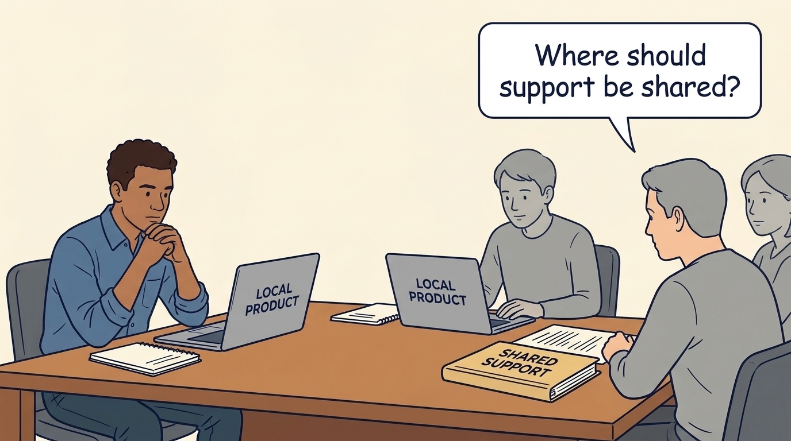
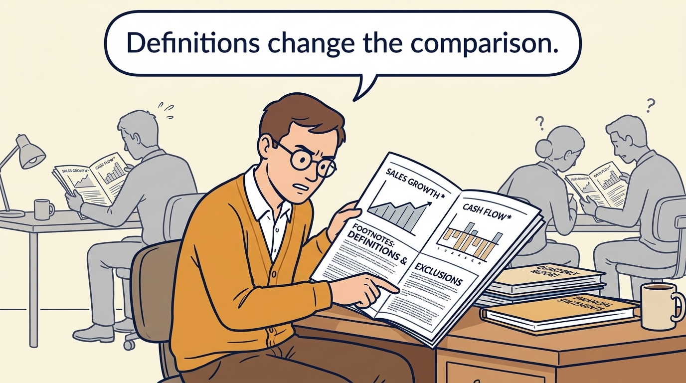
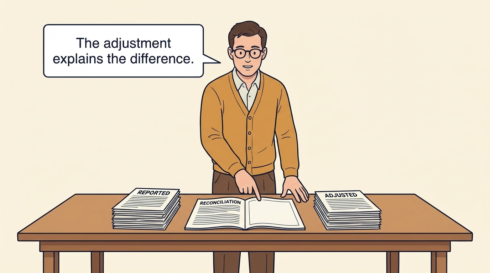
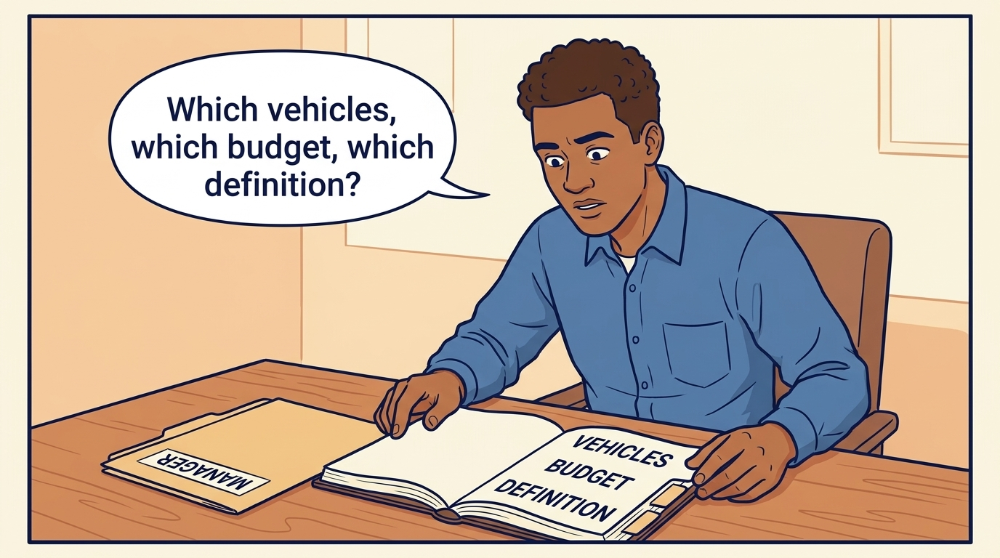

<!-- comic-style
{
  "cast": "MORGAN: a thoughtful investor technology adviser with short dark hair and a green jacket, used in the fund scenarios. ALEX: a practical CTO with curly hair and blue rolled-up sleeves. SAM: a CFO with round glasses and an amber cardigan. PRIYA: a product leader with straight dark hair and plum sleeves. INES: a CEO with short grey hair and a navy jacket. All are fictional; none represents a person in a real case.",
  "style": "Clean editorial explainer comic, dark ink outlines, restrained green, blue, and amber accents on warm white, generous space, readable short speech bubbles, expressive people and simple physical metaphors. No photorealism, logos, dense charts, or title text. Keep the same character appearances throughout the journal."
}
-->

**Comic.** A change of fund, even under the same manager, can change the money and timeline behind long-running product and platform work. The panels follow that pattern through Visma’s documents: the funds, and the shareholders entering and leaving, named in its transactions, the acquisition pace, and the two earnings definitions under which the same year is reported. They end on the specific budget and authority the fictional team would recheck.

Morgan is an investor’s adviser in the fund scenarios; Alex leads technology, Priya leads product, and Sam leads finance. All are fictional. Comparative scenarios use separate assumptions. Historical cases are discussed through documents; the scenes do not reenact real events.

<!-- comic-panel
{
  "id": "01-scene",
  "status": "generated",
  "asset": "assets/images/22-visma/comic-01-scene.jpeg",
  "aspect_ratio": "16:9",
  "prompt": "Panel 1 of an explainer comic. The fictional team reads a historical Visma report. Use one speech bubble with the exact words: \"Which period are we examining?\" Convey: Visma is a business-software group. This case mainly examines evidence through 2024, rather than its current value.",
  "alt": "Comic panel: The fictional team reads a historical Visma report.",
  "caption": "Visma is a business-software group. This case mainly examines evidence through 2024, rather than its current value.",
  "generation": {
    "model": "gemini-3-pro-image-preview",
    "reference_id": "owned-cast-20260913",
    "sha256": "7cc92199d9f9fcdd545f39b59eef93b71f5240739b04b609d0afccc56bf70318"
  }
}
-->

**Panel 1:** Visma is a business-software group. This case mainly examines evidence through 2024, rather than its current value.

*Dialogue:* “Which period are we examining?”

<!-- comic-panel
{
  "id": "02-scene",
  "status": "generated",
  "asset": "assets/images/22-visma/comic-02-scene.jpeg",
  "aspect_ratio": "16:9",
  "prompt": "Panel 2 of an explainer comic. Morgan places several fund folders beside one long manager relationship. Use one speech bubble with the exact words: \"A manager is not one fund.\" Convey: An investment manager can remain involved while the funds and investors behind it change. Hg’s own announcements name two different funds and one investor’s announced complete exit; a long relationship is not one unchanged investment.",
  "alt": "Comic panel: Morgan places several fund folders beside one long manager relationship.",
  "caption": "An investment manager can remain involved while the funds and investors behind it change. Hg’s own announcements name two different funds and one investor’s announced complete exit; a long relationship is not one unchanged investment.",
  "generation": {
    "model": "gemini-3-pro-image-preview",
    "reference_id": "owned-cast-20260913",
    "sha256": "d491ffb89ae6a33de6234b7ced9ae36e4a865a4d234b8d9705b78807e954eca4"
  }
}
-->

**Panel 2:** An investment manager can remain involved while the funds and investors behind it change. Hg’s own announcements name two different funds and one investor’s announced complete exit; a long relationship is not one unchanged investment.

*Dialogue:* “A manager is not one fund.”

<!-- comic-panel
{
  "id": "03-scene",
  "status": "generated",
  "asset": "assets/images/22-visma/comic-03-scene.jpeg",
  "aspect_ratio": "16:9",
  "prompt": "Panel 3 of an explainer comic. Alex views autonomous products with selected shared services. Use one speech bubble with the exact words: \"Where should support be shared?\" Convey: Visma describes local product decisions alongside shared support. The documents raise the question of who decides what and whether customers benefit after the costs; they do not prove the model.",
  "alt": "Comic panel: Alex reviews two business-software laptops and a shared-support folder beside local-product notebooks.",
  "caption": "Visma describes local product decisions alongside shared support. The documents raise the question of who decides what and whether customers benefit after the costs; they do not prove the model.",
  "generation": {
    "model": "gemini-3-pro-image-preview",
    "reference_id": "owned-cast-20260913",
    "sha256": "38832e746dc591a19976ddbada966fb4a43a3fee1935fc5fe43055478bae6944"
  }
}
-->

**Panel 3:** Visma describes local product decisions alongside shared support. The documents raise the question of who decides what and whether customers benefit after the costs; they do not prove the model.

*Dialogue:* “Where should support be shared?”

<!-- comic-panel
{
  "id": "04-scene",
  "status": "generated",
  "asset": "assets/images/22-visma/comic-04-scene.jpeg",
  "aspect_ratio": "16:9",
  "prompt": "Panel 4 of an explainer comic. Sam reads the footnote below a financial measure. Use one speech bubble with the exact words: \"Definitions change the comparison.\" Convey: Sales, growth and cash measures depend on which businesses, dates and costs are included. Read those definitions before comparing results.",
  "alt": "Comic panel: Sam reads the footnote below a financial measure.",
  "caption": "Sales, growth and cash measures depend on which businesses, dates and costs are included. Read those definitions before comparing results.",
  "generation": {
    "model": "gemini-3-pro-image-preview",
    "reference_id": "owned-cast-20260913",
    "sha256": "8263ff3ff6788795d48a8c436d74a10d5a4f411d5af19fb0dc831b4921122af4"
  }
}
-->

**Panel 4:** Sales, growth and cash measures depend on which businesses, dates and costs are included. Read those definitions before comparing results.

*Dialogue:* “Definitions change the comparison.”

<!-- comic-panel
{
  "id": "05-scene",
  "status": "generated",
  "asset": "assets/images/22-visma/comic-05-scene.jpeg",
  "aspect_ratio": "16:9",
  "prompt": "Panel 5 of an explainer comic. Sam joins two differently presented earnings figures with the annual-report reconciliation. Use one speech bubble with the exact words: \"The adjustment explains the difference.\" Convey: The reports explain two earnings figures for 2024 by adding back acquisition-related expenses. Changing the measure does not create new cash.",
  "alt": "Comic panel: Sam examines a reconciliation in an annual report between stacks labeled reported and adjusted.",
  "caption": "The reports explain two earnings figures for 2024 by adding back acquisition-related expenses. Changing the measure does not create new cash.",
  "generation": {
    "model": "gemini-3-pro-image-preview",
    "reference_id": "owned-cast-20260913",
    "sha256": "606c330febfb2fab3118cd01deab5544b3ca780bdfbbe2d361b945942e2ebdf1"
  }
}
-->

**Panel 5:** The reports explain two earnings figures for 2024 by adding back acquisition-related expenses. Changing the measure does not create new cash.

*Dialogue:* “The adjustment explains the difference.”

<!-- comic-panel
{
  "id": "06-scene",
  "status": "generated",
  "needs_regeneration": true,
  "asset": "assets/images/22-visma/comic-06-scene.jpeg",
  "aspect_ratio": "16:9",
  "prompt": "Panel 6 of an explainer comic. Alex checks three tabs beside an unchanged manager folder: which vehicles now hold the interests and how their rights are exercised, whether the shared-service and integration budget is still funded, and which earnings definition the plan uses. Use one speech bubble with the exact words: \"Which vehicles, which budget, which definition?\" Convey: After the transaction, the fictional team rechecks three specific things: the vehicles now holding the interests, their rights and horizons, without assuming one fund holds the majority; the funding and accountable leader for shared services and integration work; and the earnings definition the board, the lenders and the plan each use.",
  "alt": "Comic panel: Alex compares a manager folder with notebook tabs for the holding vehicles, the shared-service and integration budget, and the earnings definition in use.",
  "caption": "After the transaction, the fictional team rechecks three specific things: the vehicles now holding the interests, their rights and horizons, without assuming one fund holds the majority; the funding and accountable leader for shared services and integration work; and the earnings definition the board, the lenders and the plan each use.",
  "generation": {
    "model": "gemini-3-pro-image-preview",
    "reference_id": "owned-cast-20260913",
    "sha256": "421154addb8becdfa2999b3452ec553b9944897133d66164cd87c42fb5b580fd"
  }
}
-->

**Panel 6:** After the transaction, the fictional team rechecks three specific things: the vehicles now holding the interests, their rights and horizons, without assuming one fund holds the majority; the funding and accountable leader for shared services and integration work; and the earnings definition the board, the lenders and the plan each use.

*Dialogue:* “Which vehicles, which budget, which definition?”
