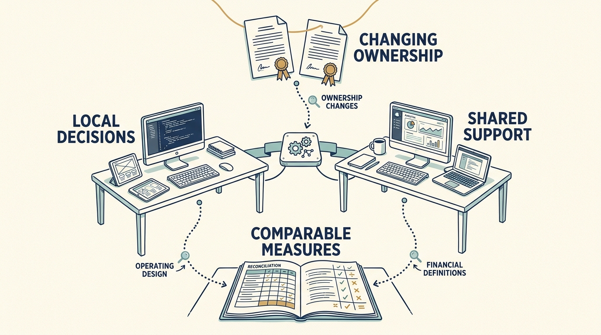

**Visma**, a group of business-software companies, offers a setting for examining changing investors, acquisitions, local decision-making and shared support. The case focuses on operating evidence through 2024, with a later annual report used to reconcile the presentation of that year’s earnings. It is not a current valuation update. The case matters because a change of fund, even under the same manager, can change the money and timeline behind long-running product and platform work.

**Figure 1:** *Examine what changed behind the name, operating model and reported measures.*

The December 2023 company announcement described a secondary transaction valuing the business at €19 billion. [S30: Visma 2023 transaction](https://www.visma.com/newsroom/visma-attracts-new-investors-for-further-international-expansion-in-a-transaction-valuing-the-company-at-eur-19-billion-59703d9f) A secondary sale transfers existing ownership; it does not automatically finance new product development. A long relationship with one manager also does not establish that a single fund held an unchanged investment throughout.

Visma describes local entrepreneurship alongside shared infrastructure, knowledge, product investment and acquisitions. [S32: Visma annual-report announcement](https://www.visma.com/newsroom/visma-releases-annual-and-sustainability-reports-for-2024-7f5c9f37) This makes the operating model worth investigating. It does not isolate the effect of any one component from acquisitions, pricing, demand, financing or selection.

**Read the financial definitions before comparing performance.** EBITDA means earnings before interest, taxes, depreciation and amortization. Adjusted EBITDA makes further specified exclusions. Visma’s historical free-cash-flow measure is before tax, and its annualized repeatable revenue includes certain transaction revenue. Treating the measures as universally standardized would misstate the evidence.

The apparent difference between the earlier rounded €893 million and later €904 million earnings figures for 2024 is now reconciled. The 2025 annual report adds acquisition-related expenses to the earlier EBITDA figure. The full article shows the exact bridge. [S43: Visma 2024 annual report](https://cdn.prod.website-files.com/69787181d8720ea08c1f22fe/69787181d8720ea08c1f460b_Visma-Annual-Report-2024.pdf) [S44: Visma 2025 annual report, p. 96](https://cdn.prod.website-files.com/69787181d8720ea08c1f22fe/69bb9fc407e856cb8d6f7726_Visma%20Annual%20Report%202025.pdf) This is a changed measure of the same year, not additional operating improvement or newly created cash.

An adjustment can help examine underlying operations, while a cash plan for continuing acquisitions must include **the cost of executing them**. Agree which businesses, period, exclusions and decision each measure concerns. Apply the same discipline to technology support: moving cost between a product and a shared service does not itself create a group saving.

A familiar investment manager does not remove the need to examine **changed funding, participants and expectations**. Company leaders should recheck local authority and shared-service commitments after a transaction. The same ownership-map question can help after a minority round or corporate reorganization, but Visma’s history does not establish outcomes for those other arrangements. Preserve useful relationships while verifying the resources and rights behind them.

The transferable question is where reuse creates value without losing **useful local knowledge and accountability**. The appendix’s proposed **Productscapes** model for reusable investment support resembles parts of this arrangement, but resemblance is not validation. Independent customer, employee and acquired-company evidence remains a material gap, as does the contribution of shared technology support to the overall results.
