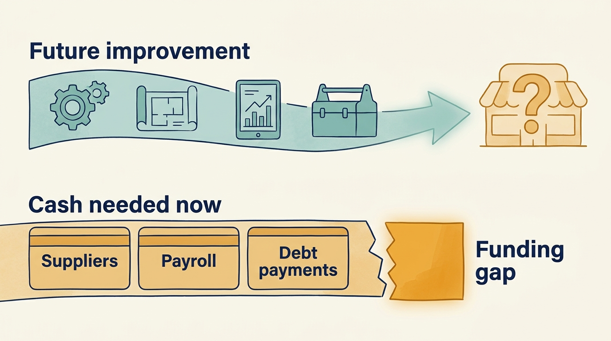
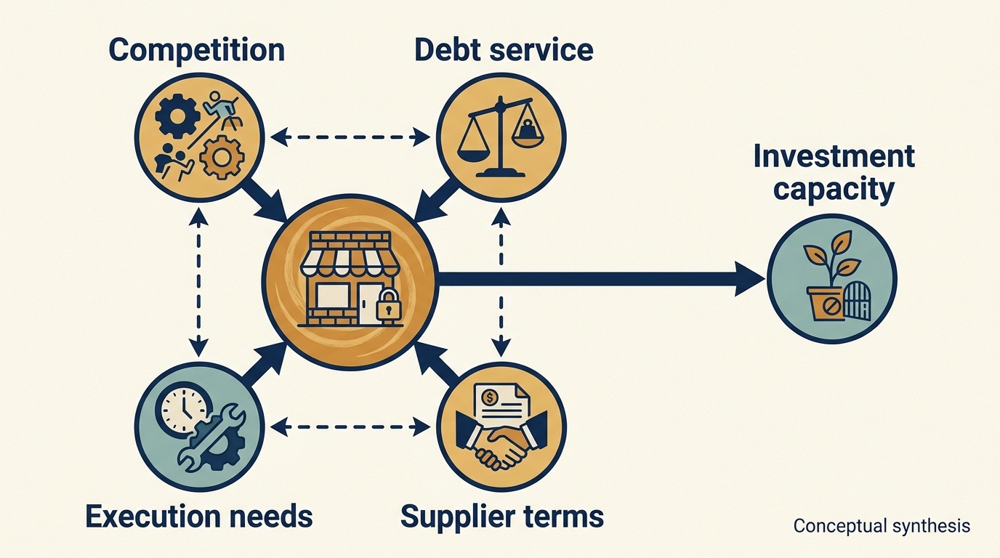

> **KEY POINTS:**
>
> * Reinvention needs **funding throughout the transition**. A useful future technology capability cannot by itself meet an immediate cash shortage.
> * Operating and financing **pressures can reinforce each other**. Supplier payment terms, debt obligations, competition and execution need to be examined together, with their evidence limits intact.
> * **Consequences extend beyond shareholders**. Employee exposure and supplier financial losses need their own account rather than being inferred from the investor outcome.

 
Toys “R” Us was a large toy and baby-products retailer. Its US business failed during the ownership episode examined here. That history is often reduced to a short explanation: debt killed the company, online competition killed it, or management failed to adapt. Each points toward a possible mechanism. None alone is a complete explanation.

The case is useful because the company's late-period financial disclosures show both operating effort and severe constraints. The technology plans were reasonable in isolation. What constrained them was the financing: debt service that consumed the cash those plans required, and a timetable set by obligations to lenders rather than by the market. A technology leader can learn from that combination without claiming to reconstruct every decision across the ownership period.

The previous cases examined successful exits and a continuing software group. This case examines a failure, beginning with the purchase, then the technology plans, financial pressures and consequences of the US shutdown. It applies the distinction between earnings and available cash from [[cash-and-constraints]].

Three terms matter throughout: **debt service** is cash needed to meet financing obligations; **liquidity** is the ability to meet payments when they fall due; and **EBITDA** is earnings before interest, taxes, depreciation and amortization. An earnings measure can be positive while liquidity is inadequate. [[valuation-and-architecture]] introduces the financial measures before connecting them to technology choices.

Read this case through the feasibility of the operating plan: what the owners expected, which funding and time constraints company leaders faced, and what happened to customers, employees and suppliers. The evidence can support lessons about those constraints without isolating one cause of the failure.

## The Transaction and Its Stated Ambition

In March 2005, Toys “R” Us announced an agreement with affiliates of KKR, Bain Capital, and Vornado. The announcement described a $6.6 billion share transaction plus **assumption of debt**, meaning taking on existing borrowing as part of the transaction. It emphasized improving the businesses and brands. The acquisition was announced as completed on July 21, 2005. These releases establish the transaction and stated ambitions; they do not reveal the sponsors' full underwriting model. [S40: Toys R Us acquisition agreement announcement](https://www.sec.gov/Archives/edgar/data/1005414/000119312505057773/dex991.htm) [S41: Toys R Us acquisition completion](https://www.sec.gov/Archives/edgar/data/899689/000110465905033479/a05-13329_1ex99d1.htm)

The initial situation was an established global toy and baby-products retailer undergoing a strategic review. [S40: Toys R Us acquisition agreement announcement](https://www.sec.gov/Archives/edgar/data/1005414/000119312505057773/dex991.htm) The task was therefore different from funding a young product company. Existing stores, suppliers, customer behavior, seasonal trading, and financial obligations constrained the available routes to improvement.

A complete case would reconstruct financing at entry, subsequent refinancings, distributions, fees, capital investment, and strategic choices across the entire period. That reconstruction is not attempted here, and no assumed sponsor return is used as evidence.

## The Company Had a Technology Plan

The fiscal 2016 disclosures discussed transition of US e-commerce operations and risks associated with implementing a new platform. [S34: Toys R Us annual filing excerpts](https://www.sec.gov/Archives/edgar/data/1005414/000100541417000011/tru201610k.htm) The company's April 2017 earnings release reported 11% growth in **consolidated e-commerce sales**, online sales across the businesses included in the group accounts, for fiscal 2016 alongside a 2.2% decline in consolidated net sales. [S35: Toys R Us fiscal 2016 results](https://www.sec.gov/Archives/edgar/data/1005414/000100541417000010/truq4-16earningsreleaseexh.htm)

This record contradicts an unqualified claim that the company simply ignored online selling. It does not show that the digital strategy was early enough, competitively strong enough, or profitable enough to secure the business.

For a product leader, that distinction matters. A channel can grow while the total customer proposition weakens. Additional online sales can carry fulfillment and service costs. A platform can launch while stores, inventory, pricing, and supplier relationships remain difficult to coordinate. The system of retail work must succeed, not merely the website.

The chief executive's declaration filed at the start of the September 2017 bankruptcy proceedings adds a specific account of a missing capability. David Brandon said the earlier technology platform had prevented subscription deliveries of baby products, with a service then being introduced. He also described a proposed $90.4 million of technology investment for 2018–2021. These are management's sworn explanations and plans, not findings that the projects were completed or that their expected benefits were achievable. [S50: Brandon declaration, paragraphs 60, 74 and 94](https://profhayesuwla.com/wp-content/uploads/2017/09/toys-r-us-first-day-dec-chairman.pdf)

The subscription example links architecture to customer behavior more precisely than “the website was outdated.” Repeated purchases require coordinated ordering, payment, stock and fulfillment. A recurring-delivery feature is only useful if the business can reliably carry out the recurring delivery. The record establishes a reported capability gap; it does not identify exactly which component was responsible or how much revenue a different design would have retained.

That is also why an announced future investment cannot be treated as an accomplished turnaround. The plan depended on time, funding and continuing operations. A review of technology strategy must **keep proposed work, delivered capability**, customer adoption and economic results separate.

## Positive Earnings Coexisted With Negative Operating Cash Flow

The following measures come from the April 2017 release for fiscal 2016, which ended January 28, 2017. They are historical company-reported figures in millions of US dollars. [S35: Toys R Us fiscal 2016 results](https://www.sec.gov/Archives/edgar/data/1005414/000100541417000010/truq4-16earningsreleaseexh.htm)

| Measure | Fiscal 2016 |
| --- | ---: |
| Operating earnings | 460 |
| Interest expense | 457 |
| EBITDA | 770 |
| Adjusted EBITDA | 792 |
| Net operating cash flow | −1 |
| Capital expenditures | 252 |

The table does not calculate the company's financing needs by subtracting interest from operating cash flow; that would risk counting interest twice under the presentation. It shows why positive operating earnings or adjusted EBITDA cannot be read as unrestricted cash for reinvention.

It also shows why a simple “profitable retailer” label can mislead. Earnings measures answer different questions. Working capital, cash interest, investment, and the timing of obligations matter to survival. The model in [[cash-and-constraints]] is useful precisely because it forces those questions into the technology plan.

The figures alone do not establish which proposed investments were refused or whether a different product intervention would have succeeded. They establish a constrained financial context that any credible reinvention plan had to address.

## Long-Term Debt Meets a Short-Term Cash Shock

Brandon's declaration listed about $5.265 billion of funded debt immediately before the filing, distributed among different entities and facilities. It described roughly $400 million of annual cash debt service. Annual debt service exceeded the cited $90.4 million of proposed technology investment across 2018–2021. This compares the scale of a recurring financing obligation with one specified investment plan; it does not measure all technology spending. For scale, dividing that funded debt by the earlier fiscal-2016 EBITDA of $770 million gives approximately 6.8×. This combines figures from different dates and uses funded debt rather than net debt. It is an illustration of scale, not a reported covenant ratio or a directly comparable measure to Visma’s 2.5×. Those figures show financing scale at that date; they do not reconstruct the original buyout or every refinancing and distribution over the preceding twelve years. [S50: Brandon declaration, paragraphs 10 and 23](https://profhayesuwla.com/wp-content/uploads/2017/09/toys-r-us-first-day-dec-chairman.pdf)

A maturity date tells management when principal must be repaid or refinanced. It is not the only deadline that matters. Interest and operating payments continue before maturity. Borrowing capacity may depend on **collateral**, assets pledged to secure a loan, as well as contractual conditions and which entity needs cash. A group can therefore have assets and a plausible long-term strategy while being unable to finance next month's trading.

The declaration describes that acceleration through supplier terms. Management said that after reports of a possible bankruptcy in early September, nearly 40% of vendors tightened terms, including demands for payment in advance or on delivery. It estimated that widespread cash-on-delivery terms could create more than $1 billion of additional liquidity need. This is the debtor's account of the pressure supporting its court application, not a court's causal determination. [S50: Brandon declaration, paragraph 11](https://profhayesuwla.com/wp-content/uploads/2017/09/toys-r-us-first-day-dec-chairman.pdf)

The mechanism is straightforward even without accepting every estimate. When suppliers allow later payment, the retailer can receive inventory before paying for it. If those suppliers require immediate payment instead, the retailer must fund the same stock sooner. The product on the shelf may be unchanged, but the cash required to put it there has increased.

This can become a feedback loop. Concern about payment makes suppliers reduce their exposure. The resulting demand for cash makes the retailer's position harder. Suppliers need not be irrational or malicious for that loop to develop; they have their own employees, obligations and losses to consider.

The engineering implication is sequencing. A product improvement expected to help over three years cannot supply inventory cash next week. A credible turnaround plan needs both a path to a competitive customer proposition and financing through the transition. Technology leaders should make the different clocks visible rather than accept one “transformation timeline” that treats them as interchangeable.

For an actual engagement, this calls for a joint operating and cash review: which customer-critical projects can still finish, **which commitments can be reduced safely**, which suppliers are indispensable, and what evidence would trigger a change in plan? These are proposed practices derived from the mechanism. The public record consulted here does not establish that such a review would have rescued Toys R Us.

**Figure 1:** *A valuable future capability cannot fund the payments required to reach it.*

## From Bankruptcy Proceedings to US Liquidation

**Chapter 11** is a US bankruptcy process that can allow a business to keep operating while reorganizing its obligations. **Liquidation** means selling assets and winding down the relevant business. The company’s 2017 filing notes describe Chapter 11 proceedings and distinguish entities participating in different restructuring processes. [S36: Toys R Us bankruptcy note](https://www.sec.gov/Archives/edgar/data/1005414/000100541417000047/R9.htm) Reuters reported in March 2018 that the company was seeking liquidation of its US stores after failing to find a buyer or agree a restructuring, with roughly 33,000 full- and part-time US employees affected by the planned shutdown. It also reported separate efforts concerning international operations. [S37: Reuters US liquidation report](https://www.business-standard.com/article/reuters/toys-r-us-to-close-doors-leaving-void-for-toy-lovers-118031500236_1.html)

This is evidence of a failure to sustain the US operating business in that ownership episode. It should not be broadened into a claim that every international business disappeared or that every later use of the brand represents the same company and obligations.

Employee consequences were substantial. Customers lost a retail option, and suppliers faced the loss of an important channel. The precise long-term outcomes for each group require evidence beyond an announcement of store closure. Total job-years lost, supplier recoveries and the distribution of employee assistance are not calculated here.

Hasbro's own 2018 annual report provides a separate supplier-side financial observation. It recorded $60.4 million of costs associated with the Toys R Us bankruptcy, including bad-debt expense, royalty costs, inventory obsolescence and other costs. Its financial-statement notes identify approximately $49 million of related bad-debt expense within that year's result. The latter is part of the broader burden, not an additional amount to add to it. [S51: Hasbro 2018 annual report, printed pp. 38 and 67](https://www.annualreports.com/HostedData/AnnualReportArchive/h/NYSE_HAS_2018.pdf)

That account broadens the case beyond the investor and retailer. An unpaid **receivable**, money a customer owes a supplier, can lose value if payment is no longer expected. Liquidated inventory can affect subsequent ordering and pricing. Those effects can continue after a store closes, and they can occur in businesses that did not choose the retailer's financing structure.

Hasbro remains an interested participant, and its report discusses other pressures on its business. Its charges should not be treated as the full economic loss to suppliers or as a precise estimate of the effect of private equity ownership. They are a documented consequence at one supplier, distinct from the retailer's own explanation and from a complete assessment of all stakeholders.

## How the Pressures Reinforced One Another

Debt service reduces room for other uses of cash, holding everything else constant. Competitive change can reduce revenue or margin. Execution failures can waste investment. These mechanisms can reinforce each other: a company with less room for experimentation may struggle to adapt, and weak adaptation may make its financing less sustainable.

The case evidence supports investigating that interaction. It does not prove that removing debt would have guaranteed success, that a better digital product would have overcome every constraint, or that the retailer was inevitably doomed regardless of ownership.

The original financing was itself a decision made under uncertainty. Evaluating it requires the expectations and alternatives at the time, not just knowledge of the eventual outcome. The same applies to later choices about refinancing, stores, technology, and cost reductions.

The difficult analytical task is to compare plausible paths. What investment was required to compete? Could the company fund it under realistic downside assumptions? Which choices preserved options and which consumed them? Which operating failures were reversible while there was still time?

**Figure 2:** *Examine interacting pressures while keeping the evidence and its limits visible.*

## Transfer the Funding Question Carefully

This is a history of a retailer under a particular buyout and financing structure. It is not evidence that an early software company awaiting another round faces the same causes of failure. Nor does it establish that a corporate parent will support or withdraw from a product in a similar way.

The decision question a leader can take elsewhere is narrower: can the company fund its existing obligations and the transition until the proposed improvement produces a useful result? For a venture scenario, test a delayed round against cash needs. For a corporate scenario, test whether the parent’s allocation covers the required local work. For a company with debt, test payment dates and how much of a shortfall the cash plan can absorb.

**Each comparison needs its own evidence**. The case makes funding dependency hard to ignore; it cannot supply the missing facts about your company.

## Lessons for Product and Engineering Leaders

First, request the cash and financing context before committing to a transformation timetable. A technically feasible plan may be financially infeasible during its transition period.

Second, define the full customer outcome. Digital sales growth is not equivalent to a competitive, profitable business whose stores and online services work together. Measure contribution and operating dependencies rather than treating a new channel as a sufficient answer.

Third, distinguish a necessary intervention from a sufficient rescue. A platform improvement may be worth doing while still unable to solve the company's wider economics. Leaders should communicate that boundary clearly.

Finally, keep the consequences of failure visible. A plan that protects investor optionality while leaving employees and suppliers exposed is not adequately described as aligned simply because management holds equity.

The next case examines a different challenge: how repeated acquisitions and ownership changes affect a software group’s development and financial reporting. Continue with [[teamsystem]].

## Questions to Consider

1. If your company’s earnings are positive, what is its operating cash flow after interest, investment and working capital? Could the two diverge as they did here?
2. Which of your technology plans would need continued funding through a cash shortage, and which could be paused safely?
3. How would a change in supplier or customer payment terms affect your company’s cash, and how quickly?
4. Which clocks in your transformation plan are treated as interchangeable: customer adoption, debt service, supplier payments and product delivery?
5. Are you presenting a growing channel or feature as if it proved that the whole business proposition works?
6. Who beyond shareholders would bear the consequences if your company’s plan failed, and is that visible in the decision record?
