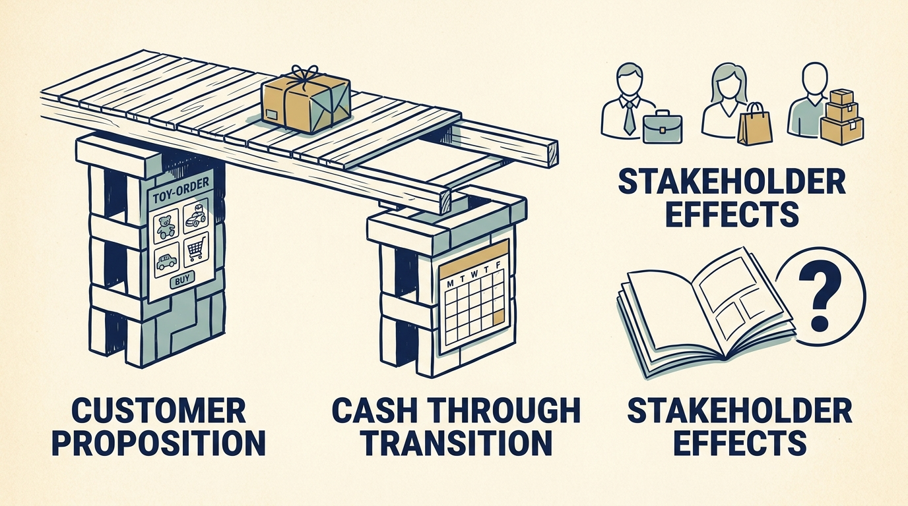

**Toys R Us**, the toy and baby-products retailer, illustrates the interaction of financing, competition, operating execution and the time needed for reinvention. The case does not establish a single cause of failure.

**Figure 1:** *A necessary product improvement still needs funding until its benefits arrive.*

The 2005 acquisition transferred ownership to the buyer group. The reviewed sources establish the agreement and completion, but they do not reconstruct every refinancing, distribution and fee across the ownership period. That limits claims about complete investor economics.

The fiscal 2016 release shows a narrow financial position: $460 million of operating earnings, $457 million of interest expense, negative $1 million of operating cash flow and $252 million of **capital expenditure**, spending on assets. [S35: Toys R Us fiscal 2016 results](https://www.sec.gov/Archives/edgar/data/1005414/000100541417000010/truq4-16earningsreleaseexh.htm) These measures are different. Interest already reflected in operating cash flow must not be subtracted again. Positive EBITDA, earnings before interest, taxes, depreciation and amortization, does not establish cash available after all obligations.

Technology work was underway. E-commerce sales grew while total sales declined. The chief executive’s September 2017 court declaration describes a missing subscription-delivery capability and proposed future technology investment. It also describes tighter supplier payment terms increasing the immediate need for cash. These are management’s explanations supporting the bankruptcy application, not court findings proving a complete causal account. [S50: Brandon declaration](https://profhayesuwla.com/wp-content/uploads/2017/09/toys-r-us-first-day-dec-chairman.pdf)

**Liquidity is the ability to meet payments when they fall due.** If suppliers require payment for inventory sooner, the retailer needs more cash before the same stock can be sold. A product improvement expected to pay off over several years cannot meet an immediate inventory-funding need. A credible plan requires both a competitive customer proposition and funding throughout the transition.

Reuters reported plans for US store **liquidation**, selling assets and winding down those operations, in March 2018, with roughly 33,000 jobs exposed. [S37: Reuters US liquidation report](https://www.business-standard.com/article/reuters/toys-r-us-to-close-doors-leaving-void-for-toy-lovers-118031500236_1.html) The case does not equate this with the disappearance of every international operation or later use of the brand. Hasbro’s 2018 report separately records supplier costs associated with the bankruptcy, broadening the evidence beyond the retailer’s account. [S51: Hasbro 2018 annual report](https://www.annualreports.com/HostedData/AnnualReportArchive/h/NYSE_HAS_2018.pdf)

**Transfer the funding question carefully**. A venture company awaiting another round or a product relying on a corporate allocation has different facts and mechanisms. Each leader still needs to establish whether existing obligations and the transition can be funded until benefits arrive. This retailer’s history makes that dependency visible; it supplies no causal finding about those other ownership arrangements.

Company leaders should connect the roadmap to **cash timing, supplier dependencies and downside scenarios**, using specialist help where needed. Distinguish a necessary product improvement from a sufficient rescue. The remaining investigation needs the full financing history, complete fiscal 2016 filing access and deeper employee, customer and supplier evidence before assigning precise causal responsibility.
