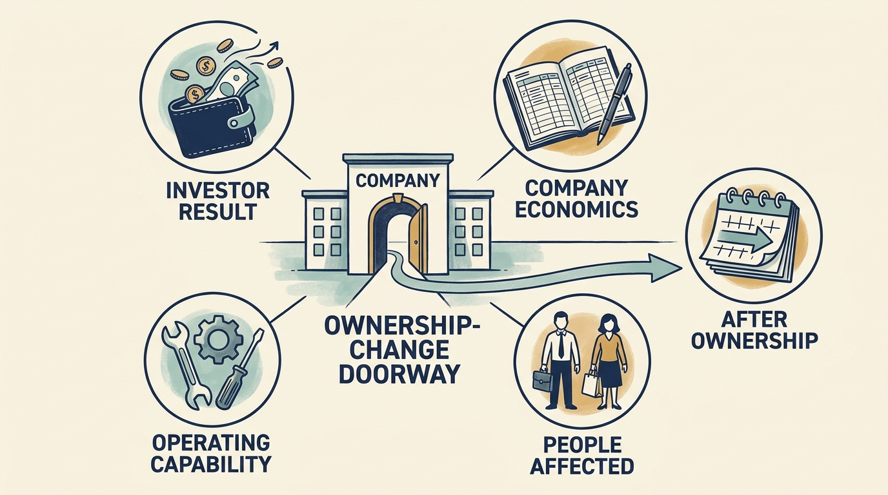

Durable success requires **more than a favorable funding valuation** or exit price. The manuscript proposes assessing the investment result, company economics, operating capability, consequences for people affected, and outcomes after ownership changes. This is an explicit evaluative standard, not a claim that all observers value those dimensions equally.

**Figure 1:** *Assess what lasts beyond the transaction.*

Research using observed data challenges a single verdict on private equity. The April 2024 revision of a major US buyout study reports different employment patterns across transaction types, including contractions following purchases taking public companies private and expansion following purchases of already private companies, relative to comparison groups over its study horizon. [S08: Davis et al., 2024 revision](https://www.nber.org/system/files/working_papers/w26371/w26371.pdf) The sample and historical period matter; these are not forecasts for every software acquisition.

Other research finds that private equity-backed UK firms maintained investment better during the financial crisis in the studied setting. [S10: Bernstein et al., crisis study](https://www.nber.org/system/files/working_papers/w23626/w23626.pdf) That result supports a possible financing and governance benefit under particular conditions. It does not show that leverage is harmless or that every sponsor supplies follow-on capital.

**Stakeholders are people affected by the company, including employees and customers. Their outcomes need their own evidence.** Research on nursing homes and hospitals identifies adverse outcomes in specific populations and designs. [S11: Gupta et al., nursing homes](https://www.nber.org/system/files/working_papers/w28474/w28474.pdf) [S12: Kannan et al., adverse events](https://jamanetwork.com/journals/jama/fullarticle/2813379) Another hospital study finds improvements in some reported quality measures. [S39: Bruch et al., hospital measures](https://jamanetwork.com/journals/jamainternalmedicine/fullarticle/2769549) Different measures and samples cannot be combined into a simple cancellation. They show why financial performance and selected quality indicators are incomplete accounts of welfare.

A small 2025 study of hospital sales extends attention beyond one owner's exit, finding differing financial trajectories after subsequent ownership changes. [S42: Kannan and Song, after sale](https://jamanetwork.com/journals/jama-health-forum/fullarticle/2837043) It studies ownership changes that occurred, rather than assigning owners randomly, and its limited sample cannot settle long-run causal effects. It nevertheless highlights a question that an exit-centered scorecard can omit: what operating obligations and capacity did the next owner inherit?

The book's **central argument is conditional**. An investment thesis, financing structure, governance arrangement, and company execution capacity must fit together. Reinvestment, resilience, customer trust, and employee knowledge are part of that fit. Their costs cannot always be aligned with every investor's preferred time horizon.

**Apply the standard beyond exits**. A round issuing new shares supplies company resources, not proof of a useful product or another future round. A corporate integration milestone can leave customer obligations unfinished. Preserve measures of customer outcomes, operating capability and unfunded work through each event and during continued ownership. These broader applications are proposed judgments; the cited buyout research retains its narrower populations and periods.

Product and technology leaders can expose and test these connections through evidence, feasible choices and clear requests for support. Advisers can help, while company responsibility and differing interests remain explicit. A credible ownership strategy explains how gains arise, who bears costs, which assumptions remain uncertain, and what evidence would justify changing course.
